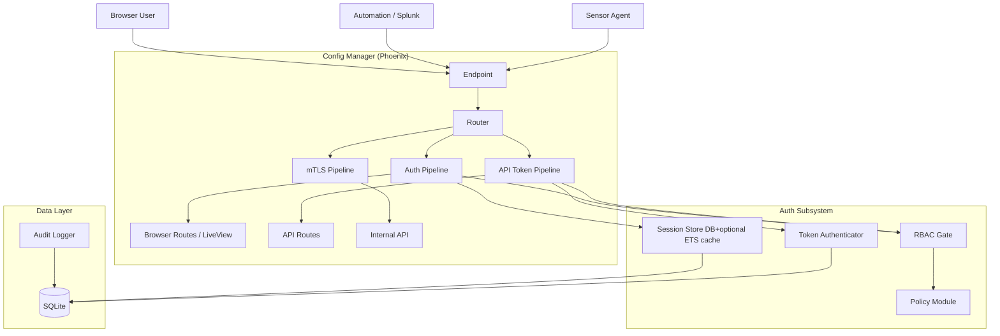
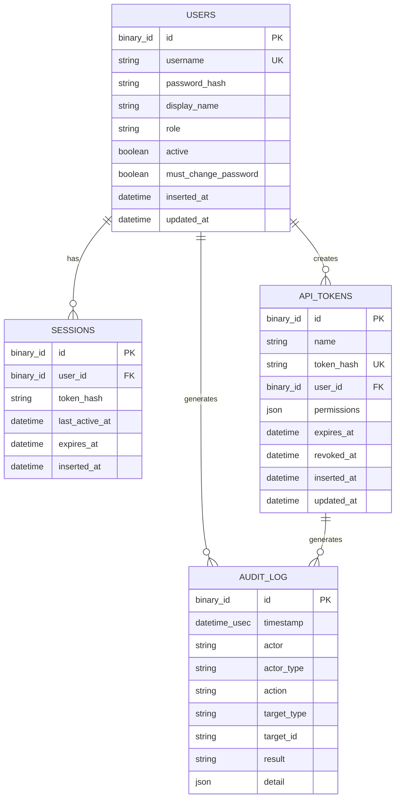

# Design Document: Authentication, RBAC, and Audit Log

## Overview

This design adds local authentication, role-based access control (RBAC), scoped API tokens, and a queryable audit log to the RavenWire Config Manager. The current Phoenix/LiveView application exposes all browser routes without any authentication pipeline. This feature introduces:

- **User accounts** with Argon2id-hashed passwords and role assignments
- **Session-based authentication** with server-side session storage, inactivity timeout, and absolute lifetime
- **Six predefined roles** with code-defined permission mappings
- **RBAC enforcement** on browser routes, LiveView events, and API endpoints
- **Scoped API tokens** for automation (SHA-256 hashed storage, optional expiry)
- **Append-only audit logging** for all security-relevant actions
- **Audit log viewing and export** with filtering, pagination, and CSV/JSON export
- **Password security policies** including rate limiting and IP-based throttling

The design integrates with the existing Phoenix router, Ecto/SQLite stack, and LiveView architecture. OIDC/SAML federation is explicitly deferred.

### Key Design Decisions

1. **Server-side sessions with SQLite as source of truth**: Sessions are stored durably in SQLite and referenced by an opaque cookie value. An ETS read-through cache may be used for fast lookup, but every session create, touch, destroy, and user-wide invalidation operation writes to SQLite synchronously. This avoids cookie-size limits, survives application restarts, and enables server-side invalidation.

2. **Code-defined role-permission mapping**: Roles and permissions are defined as string identifiers in a module attribute map in `ConfigManager.Auth.Policy`, not in the database. Strings are used because the same identifiers appear in API token scopes, JSON, fixtures, and route policy declarations. This prevents privilege escalation via database manipulation and makes permission checks compile-time verifiable.

3. **Argon2id via `argon2_elixir`**: New dependency for password hashing. Argon2id is the preferred modern password hashing algorithm for RavenWire because it is memory-hard and balances resistance to side-channel and GPU cracking attacks. The default configuration uses Argon2id (`argon2_type: 2`) with `t_cost: 2`, `m_cost: 15` (32 MiB), and `parallelism: 1`; test config uses cheaper parameters only for fast automated tests.

4. **`propcheck` for property-based testing**: Already present in `mix.exs`. Property tests will use PropCheck (Erlang PropEr wrapper) for testing auth logic, permission enforcement, and audit log integrity.

5. **Rate limiting via ETS counters**: Login rate limiting (per-username and per-IP) uses ETS counters with TTL-based expiry. No external dependency needed for the expected request volume of a management UI.

## Architecture

### System Context



### Request Flow

**Browser request (authenticated):**
1. Request hits `Endpoint` → `Plug.Session` loads the opaque session identifier from the signed cookie
2. `Auth_Pipeline` plug (`RequireAuth`) validates the session against SQLite, using ETS only as an optional cache
3. If valid and not expired → assigns `current_user` to conn/socket
4. `RBAC_Gate` plug checks `current_user.role` against route's required permission via `Policy` module
5. If permitted → route handler executes; if not → 403 page + audit entry

**API request (token-authenticated):**
1. Request hits `Endpoint` → `API_Pipeline` extracts `Authorization: Bearer <token>` header
2. `TokenAuth` plug SHA-256 hashes the token, queries `api_tokens` table
3. Validates: token exists, not expired, not revoked, creating user is active
4. Assigns `current_token` with scoped permissions to conn
5. `RBAC_Gate` checks token's scoped permissions against route's required permission

**LiveView WebSocket:**
1. Router `live_session` passes the session map into LiveView mount.
2. `on_mount` hook loads the user from the server-side session and assigns it to the socket.
3. Route-level LiveViews use permission-specific `on_mount` hooks where possible.
4. Each state-changing `handle_event` callback checks permission before executing via a shared `authorize/3` helper.

### Module Layout

```
lib/config_manager/
├── auth/
│   ├── user.ex                  # Ecto schema
│   ├── session.ex               # Ecto schema
│   ├── api_token.ex             # Ecto schema
│   ├── audit_entry.ex           # Ecto schema (existing table)
│   ├── policy.ex                # Role→Permission mapping
│   ├── password.ex              # Hashing, validation, policy
│   ├── rate_limiter.ex          # ETS-based login rate limiting
│   └── admin_seeder.ex          # Initial admin account seeding
├── auth.ex                      # Context module (public API)
├── audit.ex                     # Audit context (log, query, export)

lib/config_manager_web/
├── plugs/
│   ├── require_auth.ex          # Session authentication plug
│   ├── require_permission.ex    # RBAC gate plug
│   ├── api_token_auth.ex        # Bearer token authentication plug
│   └── require_password_change.ex # Force password change redirect
├── live/
│   ├── auth_live/
│   │   ├── login_live.ex
│   │   └── password_change_live.ex
│   ├── admin_live/
│   │   ├── users_live.ex
│   │   ├── roles_live.ex
│   │   └── api_tokens_live.ex
│   ├── audit_live/
│   │   ├── audit_log_live.ex
│   │   └── audit_export_live.ex
│   └── auth_helpers.ex          # Shared on_mount + authorize helpers
├── controllers/
│   ├── session_controller.ex    # Login/logout (non-LiveView POST)
│   └── api/                     # JSON API controllers
│       ├── enrollment_api_controller.ex
│       ├── pcap_api_controller.ex
│       ├── rules_api_controller.ex
│       ├── bundle_api_controller.ex
│       ├── audit_api_controller.ex
│       ├── users_api_controller.ex
│       └── tokens_api_controller.ex
```

## Components and Interfaces

### 1. `ConfigManager.Auth` — Authentication Context

The primary public API for authentication operations. All other modules call through this context.

```elixir
defmodule ConfigManager.Auth do
  @moduledoc "Authentication and user management context."

  # User CRUD
  def create_user(attrs, actor)          :: {:ok, User.t()} | {:error, Ecto.Changeset.t()}
  def update_user(user, attrs, actor)    :: {:ok, User.t()} | {:error, Ecto.Changeset.t()}
  def disable_user(user, actor)          :: {:ok, User.t()}
  def enable_user(user, actor)           :: {:ok, User.t()}
  def delete_user(user, actor)           :: :ok
  def get_user!(id)                      :: User.t()
  def get_user_by_username(username)     :: User.t() | nil
  def list_users()                       :: [User.t()]
  def change_password(user, current, new, actor) :: {:ok, User.t()} | {:error, atom()}
  def admin_reset_password(user, new_password, actor) :: {:ok, User.t()}

  # Session management
  def authenticate(username, password, ip) :: {:ok, Session.t()} | {:error, atom()}
  def validate_session(session_id)         :: {:ok, User.t()} | {:error, atom()}
  def destroy_session(session_id)          :: :ok
  def invalidate_user_sessions(user_id)    :: :ok
  def prune_expired_sessions()             :: {integer(), nil}

  # API token management
  def create_api_token(attrs, actor)     :: {:ok, ApiToken.t(), raw_token :: String.t()}
  def revoke_api_token(token, actor)     :: {:ok, ApiToken.t()}
  def authenticate_api_token(raw_token)  :: {:ok, ApiToken.t()} | {:error, atom()}
  def list_api_tokens()                  :: [ApiToken.t()]

  # Initial admin seeding
  def seed_initial_admin()               :: :ok | {:error, term()}
end
```

### 2. `ConfigManager.Auth.Policy` — Role-Permission Mapping

```elixir
defmodule ConfigManager.Auth.Policy do
  @moduledoc "Code-defined role-to-permission mapping. Source of truth for RBAC."

  @type role :: String.t()
  @type permission :: String.t()

  @roles_permissions %{
    "viewer" => [
      "dashboard:view",
      "sensors:view",
      "audit:view"
    ],
    "analyst" => [
      "dashboard:view",
      "sensors:view",
      "audit:view",
      "pcap:search",
      "pcap:download"
    ],
    "sensor-operator" => [
      "dashboard:view",
      "sensors:view",
      "audit:view",
      "pcap:search",
      "pcap:download",
      "sensor:operate",
      "enrollment:manage",
      "pcap:configure",
      "pools:manage",
      "deployments:manage",
      "forwarding:manage",
      "bpf:manage",
      "alerts:manage",
      "bundle:download"
    ],
    "rule-manager" => [
      "dashboard:view",
      "sensors:view",
      "audit:view",
      "pcap:search",
      "pcap:download",
      "sensor:operate",
      "enrollment:manage",
      "pcap:configure",
      "pools:manage",
      "deployments:manage",
      "forwarding:manage",
      "bpf:manage",
      "alerts:manage",
      "bundle:download",
      "rules:deploy",
      "rules:manage"
    ],
    "platform-admin" => :all,
    "auditor" => [
      "dashboard:view",
      "sensors:view",
      "audit:view",
      "audit:export"
    ]
  }

  @canonical_permissions [
    "dashboard:view",
    "sensors:view",
    "sensor:operate",
    "enrollment:manage",
    "pcap:configure",
    "pcap:search",
    "pcap:download",
    "pools:manage",
    "deployments:manage",
    "rules:deploy",
    "rules:manage",
    "forwarding:manage",
    "bpf:manage",
    "alerts:manage",
    "bundle:download",
    "audit:view",
    "audit:export",
    "users:manage",
    "roles:view",
    "tokens:manage",
    "system:manage"
  ]

  def has_permission?(role, permission)  :: boolean()
  def permissions_for(role)              :: [permission()] | :all
  def canonical_permissions()            :: [permission()]
  def roles()                            :: [role()]
  def role_display_name(role)            :: String.t()
  def permission_display_name(perm)      :: String.t()
end
```

`alerts:view` is a UI label alias for `sensors:view`; it is never stored as a separate permission or API token scope.

### 3. `ConfigManager.Auth.RateLimiter` — Login Throttling

```elixir
defmodule ConfigManager.Auth.RateLimiter do
  @moduledoc "ETS-based rate limiter for login attempts."

  use GenServer

  # Per-username: max 5 failures in 15 minutes
  def check_username(username)  :: :ok | {:error, :rate_limited}
  def record_failure(username)  :: :ok

  # Per-IP: configurable threshold
  def check_ip(ip)              :: :ok | {:error, :rate_limited}
  def record_ip_failure(ip)     :: :ok

  # Cleanup (called periodically)
  def prune_expired()           :: :ok
end
```

### 4. `ConfigManager.Audit` — Audit Logging Context

```elixir
defmodule ConfigManager.Audit do
  @moduledoc "Audit logging context. Append-only."

  def log(params)                :: {:ok, AuditEntry.t()}
  # params: %{actor: string, actor_type: atom, action: string,
  #           target_type: string, target_id: string,
  #           result: :success | :failure, detail: map()}

  def list_entries(filters, pagination) :: {[AuditEntry.t()], pagination_meta}
  def count_entries(filters)            :: integer()
  def export_entries(filters, format)   :: {:ok, binary()} | {:error, :too_many_records}

  # Security-sensitive operations call this inside the same Ecto.Multi as the
  # protected write. If the audit insert fails, the protected write rolls back.
  def append_multi(multi, audit_params)  :: Ecto.Multi.t()
end
```

### 5. `ConfigManager.Auth.AdminSeeder` — Initial Admin Bootstrap

The seeder runs during application startup after migrations are available.

```elixir
defmodule ConfigManager.Auth.AdminSeeder do
  @moduledoc "Creates the first platform-admin user when no users exist."

  def seed_initial_admin() :: :ok | {:error, term()}
end
```

Behavior:

- If any User exists, do nothing and never print a password.
- If zero Users exist and `RAVENWIRE_ADMIN_PASSWORD` is set, validate it and create the Initial_Admin with `must_change_password = false`.
- If zero Users exist and `RAVENWIRE_ADMIN_PASSWORD` is not set, generate a random 24-character password, create the Initial_Admin with `must_change_password = true`, and print exactly one bootstrap line to stdout:
  `RAVENWIRE_BOOTSTRAP_ADMIN_PASSWORD=<password>`.
- The generated password is never written to the audit log, database, or application logger metadata.

### 6. Plug Pipeline — `RequireAuth`

```elixir
defmodule ConfigManagerWeb.Plugs.RequireAuth do
  @moduledoc "Plug that enforces session authentication on browser routes."

  import Plug.Conn

  def init(opts), do: opts

  def call(conn, _opts) do
    # 1. Read session_id from conn session
    # 2. Validate via Auth.validate_session/1
    # 3. If valid: assign :current_user
    # 4. If invalid/expired: redirect to /login
    # 5. Touch session last_active_at for inactivity tracking
  end
end
```

### 7. Plug Pipeline — `RequirePermission`

```elixir
defmodule ConfigManagerWeb.Plugs.RequirePermission do
  @moduledoc "Plug that enforces RBAC permission checks."

  def init(permission), do: permission

  def call(conn, required_permission) do
    # 1. Use required_permission argument, or read conn.private.required_permission
    # 2. If no required permission is configured for the route, pass through
    # 3. Get current_user or current_token from conn.assigns
    # 4. Check Policy.has_permission?(role_or_scopes, required_permission)
    # 5. If permitted: pass through
    # 6. If denied: render 403, log audit entry with permission_denied
  end
end
```

### 8. Plug Pipeline — `ApiTokenAuth`

```elixir
defmodule ConfigManagerWeb.Plugs.ApiTokenAuth do
  @moduledoc "Plug that authenticates API requests via Bearer token."

  def init(opts), do: opts

  def call(conn, _opts) do
    # 1. Extract Authorization: Bearer <token> header
    # 2. SHA-256 hash the token
    # 3. Look up in api_tokens table
    # 4. Validate: not expired, not revoked, creating user active
    # 5. Assign :current_token with scoped permissions
    # 6. If invalid: 401 Unauthorized
  end
end
```

### 9. LiveView Auth Helpers

```elixir
defmodule ConfigManagerWeb.AuthHelpers do
  @moduledoc "Shared on_mount hook and authorization helpers for LiveView."

  def on_mount(:require_auth, _params, session, socket) do
    # Load user from session, assign to socket or redirect to /login
  end

  def on_mount({:require_permission, permission}, _params, _session, socket) do
    # Check socket.assigns.current_user has permission
    # If not: redirect to 403 page
  end

  def authorize(socket, permission) do
    # Runtime check for handle_event callbacks
    # Returns :ok or {:error, :forbidden}
  end
end
```

### 10. Router Changes

The existing router will be restructured into authenticated and unauthenticated scopes:

```elixir
pipeline :browser do
  plug :accepts, ["html"]
  plug :fetch_session
  plug :fetch_live_flash
  plug :put_root_layout, html: {ConfigManagerWeb.Layouts, :root}
  plug :protect_from_forgery
  plug :put_secure_browser_headers
end

pipeline :require_permission do
  plug ConfigManagerWeb.Plugs.RequirePermission
end

# Unauthenticated routes
scope "/", ConfigManagerWeb do
  pipe_through :browser
  live "/login", AuthLive.LoginLive, :index
end

# Authenticated browser routes. Read-only pages still perform per-action
# authorization inside LiveView events for any state-changing controls.
scope "/", ConfigManagerWeb do
  pipe_through [:browser, :require_auth, :require_password_change_check, :require_permission]

  live_session :authenticated,
    on_mount: [{ConfigManagerWeb.AuthHelpers, :require_auth}] do
    live "/", DashboardLive, :index
    live "/enrollment", EnrollmentLive, :index, private: %{required_permission: "enrollment:manage"}
    live "/pcap-config", PcapConfigLive, :index, private: %{required_permission: "sensors:view"}
    live "/rules", RuleDeploymentLive, :index, private: %{required_permission: "sensors:view"}
    live "/support-bundle", SupportBundleLive, :index, private: %{required_permission: "sensors:view"}
    live "/sensors/:id", SensorDetailLive, :show, private: %{required_permission: "sensors:view"}
    live "/sensors/:id/pipeline", PipelineLive.SensorPipelineLive, :show, private: %{required_permission: "sensors:view"}
    live "/sensors/:id/metrics", MetricsLive.SensorMetricsLive, :show, private: %{required_permission: "sensors:view"}
    live "/sensors/:id/baselines", BaselinesLive.SensorBaselinesLive, :show, private: %{required_permission: "sensors:view"}
    live "/pools", PoolLive.IndexLive, :index, private: %{required_permission: "sensors:view"}
    live "/pools/new", PoolLive.FormLive, :new, private: %{required_permission: "pools:manage"}
    live "/pools/:id", PoolLive.ShowLive, :show, private: %{required_permission: "sensors:view"}
    live "/pools/:id/edit", PoolLive.FormLive, :edit, private: %{required_permission: "pools:manage"}
    live "/pools/:id/sensors", PoolLive.SensorsLive, :index, private: %{required_permission: "sensors:view"}
    live "/pools/:id/config", PoolLive.ConfigLive, :index, private: %{required_permission: "sensors:view"}
    live "/pools/:id/deployments", PoolLive.DeploymentsLive, :index, private: %{required_permission: "sensors:view"}
    live "/pools/:id/drift", PoolLive.DriftLive, :index, private: %{required_permission: "sensors:view"}
    live "/pools/:id/pipeline", PipelineLive.PoolPipelineLive, :show, private: %{required_permission: "sensors:view"}
    live "/pools/:id/metrics", MetricsLive.PoolMetricsLive, :show, private: %{required_permission: "sensors:view"}
    live "/pools/:id/baselines", BaselinesLive.PoolBaselinesLive, :show, private: %{required_permission: "sensors:view"}
    live "/pools/:id/bpf", BpfLive.EditorLive, :show, private: %{required_permission: "sensors:view"}
    live "/pools/:id/forwarding", ForwardingLive.OverviewLive, :show, private: %{required_permission: "sensors:view"}
    live "/pools/:id/forwarding/sinks/new", ForwardingLive.SinkFormLive, :new, private: %{required_permission: "forwarding:manage"}
    live "/pools/:id/forwarding/sinks/:sink_id/edit", ForwardingLive.SinkFormLive, :edit, private: %{required_permission: "forwarding:manage"}
    live "/deployments", DeploymentLive.IndexLive, :index, private: %{required_permission: "sensors:view"}
    live "/deployments/:id", DeploymentLive.ShowLive, :show, private: %{required_permission: "sensors:view"}
    live "/pcap", PcapLive.SearchLive, :index, private: %{required_permission: "pcap:search"}
    live "/pcap/search", PcapLive.SearchLive, :search, private: %{required_permission: "pcap:search"}
    live "/pcap/requests", PcapLive.RequestsLive, :index, private: %{required_permission: "pcap:search"}
    live "/pcap/requests/:id", PcapLive.RequestDetailLive, :show, private: %{required_permission: "pcap:search"}
    live "/pcap/requests/:id/manifest", PcapLive.ManifestLive, :show, private: %{required_permission: "pcap:search"}
    live "/rules/store", RuleStoreLive.IndexLive, :index, private: %{required_permission: "sensors:view"}
    live "/rules/categories", RuleStoreLive.CategoriesLive, :index, private: %{required_permission: "sensors:view"}
    live "/rules/repositories", RuleStoreLive.RepositoriesLive, :index, private: %{required_permission: "sensors:view"}
    live "/rules/rulesets", RuleStoreLive.RulesetsLive, :index, private: %{required_permission: "sensors:view"}
    live "/rules/deployments", RuleStoreLive.DeploymentsLive, :index, private: %{required_permission: "sensors:view"}
    live "/rules/zeek-packages", DetectionContentLive.ZeekPackagesLive, :index, private: %{required_permission: "sensors:view"}
    live "/rules/yara", DetectionContentLive.YaraLive, :index, private: %{required_permission: "sensors:view"}
    live "/alerts", AlertLive.DashboardLive, :index, private: %{required_permission: "sensors:view"}
    live "/alerts/rules", AlertLive.RulesLive, :index, private: %{required_permission: "alerts:manage"}
    live "/alerts/notifications", AlertLive.NotificationsLive, :index, private: %{required_permission: "sensors:view"}
    live "/audit", AuditLive.AuditLogLive, :index

    # Password change (accessible to all authenticated users)
    live "/password/change", AuthLive.PasswordChangeLive, :index
  end

  get "/pcap/requests/:id/download",
      PcapDownloadController,
      :download,
      private: %{required_permission: "pcap:download"}

  get "/pcap/requests/:id/manifest/export",
      PcapDownloadController,
      :export_manifest,
      private: %{required_permission: "pcap:search"}

  get "/support-bundle/download/:pod_id",
      SupportBundleController,
      :download,
      private: %{required_permission: "bundle:download"}
end

# Admin routes (platform-admin only)
scope "/admin", ConfigManagerWeb do
  pipe_through [:browser, :require_auth, :require_password_change_check, :require_permission]

  live_session :admin,
    on_mount: [
      {ConfigManagerWeb.AuthHelpers, :require_auth}
    ] do
    live "/users", AdminLive.UsersLive, :index, private: %{required_permission: "users:manage"}
    live "/roles", AdminLive.RolesLive, :index, private: %{required_permission: "roles:view"}
    live "/api-tokens", AdminLive.ApiTokensLive, :index, private: %{required_permission: "tokens:manage"}
    live "/bundles", BundleLive.HistoryLive, :index, private: %{required_permission: "system:manage"}
    live "/bundles/import", BundleLive.ImportLive, :index, private: %{required_permission: "system:manage"}
    live "/bundles/export", BundleLive.ExportLive, :index, private: %{required_permission: "system:manage"}
    live "/ha", HALive.StatusLive, :index, private: %{required_permission: "system:manage"}
    live "/ha/status", HALive.StatusLive, :status, private: %{required_permission: "system:manage"}
  end
end

# Audit export (platform-admin and auditor)
scope "/audit", ConfigManagerWeb do
  pipe_through [:browser, :require_auth, :require_password_change_check, :require_permission]

  live_session :audit_export,
    on_mount: [
      {ConfigManagerWeb.AuthHelpers, :require_auth}
    ] do
    live "/export", AuditLive.AuditExportLive, :index, private: %{required_permission: "audit:export"}
  end
end

# Session management (POST-based, not LiveView)
scope "/", ConfigManagerWeb do
  pipe_through :browser
  post "/login", SessionController, :create
  delete "/logout", SessionController, :delete
end

# Authenticated Public API routes (bearer token)
scope "/api/v1", ConfigManagerWeb.Api do
  pipe_through [:api, :api_token_auth, :require_permission]

  post "/enrollments/:id/approve", EnrollmentApiController, :approve, private: %{required_permission: "enrollment:manage"}
  post "/enrollments/:id/deny", EnrollmentApiController, :deny, private: %{required_permission: "enrollment:manage"}
  post "/pcap-config", PcapApiController, :create, private: %{required_permission: "pcap:configure"}
  get "/pcap/requests", PcapApiController, :index, private: %{required_permission: "pcap:search"}
  post "/pcap/carve", PcapApiController, :carve, private: %{required_permission: "pcap:search"}
  get "/pcap/requests/:id", PcapApiController, :show, private: %{required_permission: "pcap:search"}
  get "/pcap/requests/:id/manifest", PcapApiController, :manifest, private: %{required_permission: "pcap:search"}
  get "/pcap/requests/:id/download", PcapApiController, :download, private: %{required_permission: "pcap:download"}
  post "/rules/deploy", RulesApiController, :deploy, private: %{required_permission: "rules:deploy"}
  get "/rules", RulesApiController, :index, private: %{required_permission: "sensors:view"}
  post "/rules", RulesApiController, :create, private: %{required_permission: "rules:manage"}
  get "/rulesets", RulesetsApiController, :index, private: %{required_permission: "sensors:view"}
  post "/rulesets", RulesetsApiController, :create, private: %{required_permission: "rules:manage"}
  get "/deployments", DeploymentsApiController, :index, private: %{required_permission: "sensors:view"}
  post "/deployments", DeploymentsApiController, :create, private: %{required_permission: "deployments:manage"}
  post "/deployments/:id/cancel", DeploymentsApiController, :cancel, private: %{required_permission: "deployments:manage"}
  post "/deployments/:id/rollback", DeploymentsApiController, :rollback, private: %{required_permission: "deployments:manage"}
  post "/support-bundles", BundleApiController, :create, private: %{required_permission: "bundle:download"}
  get "/audit", AuditApiController, :index, private: %{required_permission: "audit:view"}
  get "/audit/export", AuditApiController, :export, private: %{required_permission: "audit:export"}
  post "/admin/users", UsersApiController, :create, private: %{required_permission: "users:manage"}
  post "/admin/api-tokens", TokensApiController, :create, private: %{required_permission: "tokens:manage"}
end

# Existing mTLS routes (unchanged)
scope "/api/v1", ConfigManagerWeb do
  pipe_through :mtls_api
  # ... existing sensor agent routes
end
```

## Data Models

### Users Table

```sql
CREATE TABLE users (
  id          BLOB PRIMARY KEY,  -- binary_id (UUID)
  username    TEXT NOT NULL UNIQUE,
  password_hash TEXT NOT NULL,
  display_name TEXT NOT NULL,
  role        TEXT NOT NULL DEFAULT 'viewer',
  active      BOOLEAN NOT NULL DEFAULT TRUE,
  must_change_password BOOLEAN NOT NULL DEFAULT FALSE,
  inserted_at TEXT NOT NULL,     -- UTC datetime
  updated_at  TEXT NOT NULL      -- UTC datetime
);

CREATE UNIQUE INDEX users_username_index ON users (username);
CREATE INDEX users_role_index ON users (role);
```

**Ecto Schema:**

```elixir
defmodule ConfigManager.Auth.User do
  use Ecto.Schema
  import Ecto.Changeset

  @primary_key {:id, :binary_id, autogenerate: true}

  schema "users" do
    field :username, :string
    field :password_hash, :string
    field :password, :string, virtual: true, redact: true
    field :display_name, :string
    field :role, :string, default: "viewer"
    field :active, :boolean, default: true
    field :must_change_password, :boolean, default: false
    timestamps()
  end
end
```

### Sessions Table

```sql
CREATE TABLE sessions (
  id          BLOB PRIMARY KEY,  -- binary_id (UUID)
  user_id     BLOB NOT NULL REFERENCES users(id) ON DELETE CASCADE,
  token_hash  TEXT NOT NULL,     -- SHA-256 of session token
  last_active_at TEXT NOT NULL,  -- UTC datetime for inactivity timeout
  expires_at  TEXT NOT NULL,     -- Absolute lifetime expiry
  inserted_at TEXT NOT NULL
);

CREATE INDEX sessions_user_id_index ON sessions (user_id);
CREATE INDEX sessions_token_hash_index ON sessions (token_hash);
CREATE INDEX sessions_expires_at_index ON sessions (expires_at);
```

**Ecto Schema:**

```elixir
defmodule ConfigManager.Auth.Session do
  use Ecto.Schema

  @primary_key {:id, :binary_id, autogenerate: true}
  @foreign_key_type :binary_id

  schema "sessions" do
    belongs_to :user, ConfigManager.Auth.User
    field :token_hash, :string
    field :last_active_at, :utc_datetime
    field :expires_at, :utc_datetime
    timestamps(updated_at: false)
  end
end
```

### API Tokens Table

```sql
CREATE TABLE api_tokens (
  id          BLOB PRIMARY KEY,  -- binary_id (UUID)
  name        TEXT NOT NULL,
  token_hash  TEXT NOT NULL UNIQUE,  -- SHA-256 of raw token
  user_id     BLOB NOT NULL REFERENCES users(id) ON DELETE CASCADE,
  permissions TEXT NOT NULL,     -- JSON array of permission strings
  expires_at  TEXT,              -- Optional UTC datetime
  revoked_at  TEXT,              -- NULL if active
  inserted_at TEXT NOT NULL,
  updated_at  TEXT NOT NULL
);

CREATE UNIQUE INDEX api_tokens_token_hash_index ON api_tokens (token_hash);
CREATE INDEX api_tokens_user_id_index ON api_tokens (user_id);
```

**Ecto Schema:**

```elixir
defmodule ConfigManager.Auth.ApiToken do
  use Ecto.Schema

  @primary_key {:id, :binary_id, autogenerate: true}
  @foreign_key_type :binary_id

  schema "api_tokens" do
    field :name, :string
    field :token_hash, :string
    belongs_to :user, ConfigManager.Auth.User
    field :permissions, {:array, :string}
    field :expires_at, :utc_datetime
    field :revoked_at, :utc_datetime
    timestamps()
  end
end
```

### Audit Log Table (Existing — Verify Compatibility)

The `audit_log` table already exists from migration `20240101000004` and mostly matches the required shape. The migration stores `detail` as a JSON text blob, so the schema/context must encode/decode JSON explicitly unless a follow-up migration changes the column type. During implementation, add a compatibility migration if the deployed database does not contain all required fields or indexes.

```elixir
defmodule ConfigManager.Auth.AuditEntry do
  use Ecto.Schema

  @primary_key {:id, :binary_id, autogenerate: true}

  schema "audit_log" do
    field :timestamp, :utc_datetime_usec
    field :actor, :string
    field :actor_type, :string       # "user" | "api_token" | "system"
    field :action, :string
    field :target_type, :string
    field :target_id, :string
    field :result, :string           # "success" | "failure"
    field :detail, :string, default: "{}" # JSON text blob; decoded by ConfigManager.Audit
    # No timestamps — audit_log is append-only; :timestamp is the record time
  end
end
```

### Entity Relationship Diagram




## Correctness Properties

*A property is a characteristic or behavior that should hold true across all valid executions of a system — essentially, a formal statement about what the system should do. Properties serve as the bridge between human-readable specifications and machine-verifiable correctness guarantees.*

### Property 1: Password hashing preserves no plaintext

*For any* valid password string (≥12 characters, not matching username), when a user is created or a password is changed, the stored `password_hash` field SHALL be a valid Argon2id hash, and the plaintext password SHALL NOT appear anywhere in the persisted user record.

**Validates: Requirements 1.3**

### Property 2: User deactivation invalidates all credentials

*For any* user with N active sessions (N ≥ 0) and M active API tokens (M ≥ 0), when the user is disabled, all N sessions SHALL become invalid (session validation returns error) and all M API tokens SHALL be rejected (token authentication returns error). When the user is deleted, the same invalidation SHALL occur and additionally the token and session records SHALL be removed.

**Validates: Requirements 1.4, 1.5, 1.8, 6.8**

### Property 3: Authentication error messages are indistinguishable

*For any* login attempt that fails — whether due to a non-existent username, an incorrect password, a disabled account, or a rate-limited username/IP — the user-facing error message SHALL be identical ("Invalid username or password"). The specific failure reason SHALL only appear in the audit log detail field, never in the HTTP response body or flash message.

**Validates: Requirements 3.3, 3.8, 10.7**

### Property 4: Unauthenticated requests redirect to login

*For any* browser route in the authenticated scope (all routes except `/login`), a request without a valid session SHALL receive a redirect response to `/login`. The response SHALL NOT contain any page content from the protected route.

**Validates: Requirements 3.7**

### Property 5: Role-permission mapping is complete and correct

*For any* role in the set {`viewer`, `analyst`, `sensor-operator`, `rule-manager`, `platform-admin`, `auditor`}, the `Policy.permissions_for(role)` function SHALL return exactly the permission set specified in Requirement 4.1. The role identifiers SHALL be the exact strings specified. Each successive role in the hierarchy (viewer → analyst → sensor-operator → rule-manager) SHALL be a strict superset of the previous role's permissions. The `auditor` role SHALL NOT include any write permissions or admin page access.

**Validates: Requirements 4.1, 13.1**

### Property 6: RBAC enforcement is consistent across all access paths

*For any* (role, route) pair where the route has a required permission, access SHALL be granted if and only if `Policy.has_permission?(role, required_permission)` returns true. This property SHALL hold identically for: (a) browser route access via session authentication, (b) LiveView event handling via WebSocket, and (c) API route access via bearer token with scoped permissions. All authenticated users regardless of role SHALL have access to `/` and `/audit`.

**Validates: Requirements 5.1, 5.2, 5.4, 5.5, 6.7, 6.10**

### Property 7: Permission denial always produces an audit entry

*For any* RBAC check that denies access — whether on a browser route, LiveView event, or API endpoint — the system SHALL create an audit entry with `action = "permission_denied"`, `result = "failure"`, and a detail field containing the required permission and the requested route or event name. The audit entry SHALL be created regardless of the access path (browser, WebSocket, or API).

**Validates: Requirements 5.7, 6.11, 7.5**

### Property 8: API token storage never leaks secrets

*For any* API token, the database SHALL store only the SHA-256 hash of the raw token value. After the one-time creation response, no API endpoint, page render, or JSON response SHALL include the raw token value or the stored hash. The `token_hash` field SHALL never appear in list or show responses.

**Validates: Requirements 6.2, 6.9**

### Property 9: API token authentication round-trip

*For any* newly created API token, authenticating with the raw token value returned at creation time SHALL successfully match the correct token record. The SHA-256 hash of the raw token SHALL equal the stored `token_hash`. No other raw token value SHALL authenticate against the same token record.

**Validates: Requirements 6.4**

### Property 10: Expired and revoked tokens are rejected

*For any* API token with an `expires_at` timestamp in the past, authentication SHALL fail with a 401 response. *For any* API token with a non-null `revoked_at` timestamp, authentication SHALL fail with a 401 response. These checks SHALL be performed on every authentication attempt, not cached.

**Validates: Requirements 6.5, 6.6**

### Property 11: Audit entries are structurally complete

*For any* audit entry written by the system, the record SHALL contain all required fields: a non-nil UUID `id`, a microsecond-precision UTC `timestamp`, a non-empty `actor` string, an `actor_type` in {"user", "api_token", "system"}, a non-empty `action` string, a `result` in {"success", "failure"}, and a `detail` value that is valid JSON when persisted and decodes to a map. The `timestamp` SHALL be within a reasonable tolerance of the actual event time.

**Validates: Requirements 7.2**

### Property 12: Audit log queries return entries in reverse chronological order with correct pagination

*For any* set of N audit entries and a page size P, querying page K SHALL return entries sorted by timestamp descending, with at most P entries per page. The total number of pages SHALL equal ⌈N/P⌉. No entry SHALL appear on more than one page, and the union of all pages SHALL equal the full result set.

**Validates: Requirements 8.2, 8.4**

### Property 13: Audit log filters return only matching entries

*For any* combination of filter criteria (date range, actor, action type, target type, target identifier, result) applied to a set of audit entries, every returned entry SHALL match ALL specified filter criteria. No entry matching all criteria SHALL be excluded from the results. This property SHALL hold identically for the view query and the export query.

**Validates: Requirements 8.3, 9.2**

### Property 14: Password validation enforces security policy

*For any* string shorter than 12 characters, password validation SHALL reject it. *For any* (username, password) pair where the password equals the username (case-sensitive), password validation SHALL reject it. *For any* string that is ≥ 12 characters and does not match the username, password validation SHALL accept it (with respect to these two rules).

**Validates: Requirements 10.1, 10.2**

### Property 15: Rate limiting enforces attempt thresholds

*For any* username, after exactly 5 failed login attempts within a 15-minute window, the 6th attempt SHALL be rejected due to rate limiting regardless of whether the credentials are valid. *For any* IP address, after exceeding the configured IP threshold within the window, further attempts from that IP SHALL be throttled. Each rate-limit rejection SHALL produce an audit entry with the specific rate-limit reason in the detail field.

**Validates: Requirements 10.4, 10.5, 10.6**

### Property 16: Forced password change blocks all other routes

*For any* user with `must_change_password = true` and *for any* authenticated route other than `/password/change` and `/logout`, the system SHALL redirect the user to `/password/change`. After the user successfully changes their password, `must_change_password` SHALL be set to false and the user SHALL be able to access all routes permitted by their role.

**Validates: Requirements 10.3**

## Error Handling

### Authentication Errors

| Error Condition | User-Facing Response | Internal Action |
|---|---|---|
| Invalid username | Generic "Invalid username or password" | Audit entry: `login_failed`, detail: `{reason: "invalid_username"}` |
| Invalid password | Generic "Invalid username or password" | Audit entry: `login_failed`, detail: `{reason: "invalid_password"}` |
| Disabled account | Generic "Invalid username or password" | Audit entry: `login_failed`, detail: `{reason: "account_disabled"}` |
| Rate-limited (username) | Generic "Invalid username or password" | Audit entry: `login_rate_limited`, detail: `{reason: "username_rate_limit", username: "..."}` |
| Rate-limited (IP) | Generic "Invalid username or password" | Audit entry: `login_rate_limited`, detail: `{reason: "ip_rate_limit", ip: "..."}` |
| Expired session | Redirect to `/login` with "Session expired" flash | Session record deleted opportunistically |
| Missing session | Redirect to `/login` | No audit entry (normal flow) |

### Authorization Errors

| Error Condition | Browser Response | API Response | Audit Action |
|---|---|---|---|
| Missing permission (browser) | 403 page with "Insufficient permissions" | N/A | `permission_denied` with required permission |
| Missing permission (API) | N/A | `{"error": "forbidden"}` with 403 status | `permission_denied` with required permission |
| Missing permission (LiveView) | Flash error, no state change | N/A | `permission_denied` with event name |
| Invalid API token | N/A | `{"error": "unauthorized"}` with 401 status | `api_token_auth_failed` with `{reason: "invalid_token"}` |
| Expired API token | N/A | `{"error": "unauthorized"}` with 401 status | `api_token_auth_failed` with `{reason: "token_expired"}` |
| Revoked API token | N/A | `{"error": "unauthorized"}` with 401 status | `api_token_auth_failed` with `{reason: "token_revoked"}` |

### Password Errors

| Error Condition | Response | Detail |
|---|---|---|
| Password too short | Changeset error: "must be at least 12 characters" | Validation in changeset |
| Password matches username | Changeset error: "password cannot match username" | Validation in changeset |
| Wrong current password | Error: "Current password is incorrect" | Required for self-service change |
| Admin password env var too short | Startup crash with log: "RAVENWIRE_ADMIN_PASSWORD must be at least 12 characters" | Application refuses to start |

### Audit Export Errors

| Error Condition | Response |
|---|---|
| Export exceeds 100K records | 422 with message: "Export would produce more than 100,000 records. Please narrow your date range or filters." |
| Invalid filter parameters | 400 with validation errors |
| Invalid export format | 400 with message: "Supported formats: csv, json" |

### Database and System Errors

- All database operations use Ecto transactions where atomicity is required (user deletion with session/token cleanup).
- SQLite is the source of truth for sessions. Session ETS cache failures fall back to database lookup and should not invalidate otherwise valid sessions.
- Rate limiter ETS failures fail closed for login attempts: the login response uses the same generic failure message, the condition is logged with high severity, and a platform alert is emitted until the limiter recovers.
- Audit log writes for security-sensitive writes are fail-closed: user creation/modification/deletion/disable, role changes, password resets, API token creation/revocation, enrollment approval/denial, PCAP configuration changes, rule deployment, support bundle download, and audit export must be committed in the same transaction as their Audit_Entry. If the audit insert fails, the protected operation rolls back.
- Audit log writes for non-mutating events such as failed login attempts and denied permission checks should be retried and logged to the application logger if the database is unavailable, but they must never permit a denied action.

## Testing Strategy

### Testing Framework

- **Unit/Integration tests**: ExUnit (built-in)
- **Property-based tests**: PropCheck (`propcheck ~> 1.4`, already in `mix.exs`)
- **Browser/LiveView tests**: Phoenix.ConnTest and Phoenix.LiveViewTest

### Property-Based Tests

Each correctness property maps to a PropCheck test with a minimum of 100 iterations. Tests are tagged with the feature and property reference.

| Property | Test Module | Generator Strategy |
|---|---|---|
| P1: Password hashing | `Auth.PasswordPropertyTest` | Random strings ≥ 12 chars, random usernames |
| P2: User deactivation | `Auth.UserDeactivationPropertyTest` | Random user with 0–10 sessions and 0–5 tokens |
| P3: Indistinguishable errors | `Auth.LoginErrorPropertyTest` | Random (username, password, disabled?, rate_limited?) tuples |
| P4: Unauthenticated redirect | `AuthPipeline.RedirectPropertyTest` | All protected route paths |
| P5: Role-permission mapping | `Auth.PolicyPropertyTest` | All (role, permission) pairs from the specification |
| P6: RBAC enforcement | `Auth.RBACPropertyTest` | All (role, route) pairs × access paths |
| P7: Permission denial audit | `Auth.PermissionDenialAuditPropertyTest` | Random (role, route) pairs where role lacks permission |
| P8: Token storage security | `Auth.TokenStoragePropertyTest` | Random token creation, then inspect DB and API responses |
| P9: Token auth round-trip | `Auth.TokenRoundTripPropertyTest` | Random token names and permission sets |
| P10: Expired/revoked tokens | `Auth.TokenExpiryPropertyTest` | Random tokens with past/future expiry, revoked/active states |
| P11: Audit entry structure | `Audit.EntryStructurePropertyTest` | Random audit params covering all action types |
| P12: Audit query ordering | `Audit.QueryOrderPropertyTest` | Random sets of 10–200 entries, random page sizes |
| P13: Audit filter correctness | `Audit.FilterPropertyTest` | Random entries + random filter combinations |
| P14: Password validation | `Auth.PasswordValidationPropertyTest` | Random strings of various lengths, random usernames |
| P15: Rate limiting | `Auth.RateLimiterPropertyTest` | Random usernames/IPs, sequences of 1–10 attempts |
| P16: Forced password change | `Auth.ForcePasswordChangePropertyTest` | Random routes, user with must_change_password |

### Example-Based Unit Tests

| Area | Test Module | Key Scenarios |
|---|---|---|
| User CRUD | `Auth.UserTest` | Create, update, disable, delete, unique username constraint |
| Initial admin seeding | `Auth.AdminSeederTest` | Seed with/without env vars, short password rejection |
| Login/logout flow | `AuthLive.LoginTest` | Valid login, invalid login, disabled user, logout |
| Session lifecycle | `Auth.SessionTest` | Create, validate, expire (inactivity), expire (absolute), prune |
| Password change | `AuthLive.PasswordChangeTest` | Self-service change (requires current), admin reset, must_change_password flow |
| API token CRUD | `Auth.ApiTokenTest` | Create, revoke, list (no hash leakage) |
| Cookie attributes | `Session.CookieTest` | Secure, HttpOnly, SameSite=Strict verification |
| Session fixation | `Session.FixationTest` | Session ID regeneration on login |
| CSRF enforcement | `CSRF.EnforcementTest` | POST without CSRF token rejected |
| Audit log viewing | `AuditLive.AuditLogTest` | Pagination, filtering, detail expansion |
| Audit export | `AuditLive.AuditExportTest` | CSV/JSON export, 100K limit, audit entry for export |
| UI element hiding | `RBAC.UIElementTest` | Render pages per role, verify button/link visibility |
| Role change live | `Auth.RoleChangeLiveTest` | Change role, verify new permissions on next request |

### Integration Tests

| Area | Test Module | Coverage |
|---|---|---|
| Route protection | `RBAC.RouteProtectionTest` | Every protected route × every role (allow/deny matrix) |
| API route protection | `RBAC.ApiRouteProtectionTest` | Every API route × token permission sets |
| Audit coverage | `Audit.CoverageTest` | Each audited action type produces correct audit entry |
| Migration verification | `Schema.MigrationTest` | All tables, columns, and indexes exist after migration |

### Test Configuration

```elixir
# In test.exs
config :argon2_elixir,
  t_cost: 1,
  m_cost: 8,
  parallelism: 1,
  argon2_type: 2

# PropCheck configuration
# Each property test uses: numtests: 100
```

### Test Data Generators (PropCheck)

```elixir
defmodule ConfigManager.Auth.Generators do
  use PropCheck

  def valid_username do
    let len <- choose(3, 30) do
      let chars <- vector(len, oneof([range(?a, ?z), range(?0, ?9), elements([?_, ?-])])) do
        to_string(chars)
      end
    end
  end

  def valid_password(username) do
    such_that p <- let(len <- choose(12, 64), do: binary(len)),
              when: p != username and String.length(p) >= 12
  end

  def invalid_short_password do
    let len <- choose(0, 11) do
      binary(len)
    end
  end

  def role do
    oneof(["viewer", "analyst", "sensor-operator", "rule-manager", "platform-admin", "auditor"])
  end

  def permission do
    elements([
      "dashboard:view", "sensors:view", "audit:view", "audit:export",
      "pcap:search", "pcap:download", "pcap:configure",
      "sensor:operate", "enrollment:manage", "pools:manage", "bundle:download",
      "rules:deploy", "rules:manage",
      "users:manage", "roles:view", "tokens:manage"
    ])
  end

  def audit_action do
    elements([
      "user_login", "user_logout", "login_failed", "login_rate_limited",
      "api_token_auth_failed", "permission_denied", "user_created", "user_modified", "user_deleted",
      "user_disabled", "password_reset", "role_changed",
      "api_token_created", "api_token_revoked",
      "enrollment_approved", "enrollment_denied",
      "pcap_config_changed", "rule_deployed",
      "pool_created", "pool_updated", "pool_deleted", "pool_config_updated",
      "sensor_assigned_to_pool", "sensor_removed_from_pool",
      "sensor_validate_config", "sensor_reload_zeek", "sensor_reload_suricata",
      "sensor_restart_vector", "sensor_support_bundle_generate", "sensor_revoke",
      "support_bundle_downloaded", "audit_export"
    ])
  end

  def audit_entry_params do
    let {action, actor_type, result} <-
        {audit_action(), oneof(["user", "api_token", "system"]), oneof(["success", "failure"])} do
      %{
        actor: "test_actor",
        actor_type: actor_type,
        action: action,
        target_type: "user",
        target_id: "some-id",
        result: result,
        detail: %{}
      }
    end
  end
end
```

### Dependencies to Add

```elixir
# In mix.exs deps
{:argon2_elixir, "~> 4.1"},
```

This is the only new dependency. The project already has `propcheck` for property-based testing, `jason` for JSON, and all Phoenix/Ecto dependencies needed.
