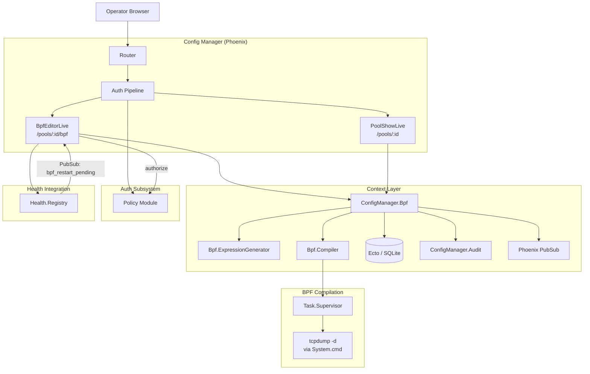

# Design Document: BPF Filter Editor

## Overview

This design adds a pool-level BPF Filter Editor to the RavenWire Config Manager. The feature provides structured filter rule management (elephant flow exclusions, CIDR pair exclusions, port exclusions), a raw BPF expression editor with append/replace composition modes, server-side BPF compilation and validation, BPF profile versioning with immutable snapshots, a compiled expression preview, and integration with the existing RBAC, audit logging, pool management, and health monitoring systems.

BPF filter profiles are pool-scoped: all sensors in a pool share the same BPF profile. Saving a BPF profile does NOT automatically push it to sensors; deployment remains an explicit operator action through the existing deployment workflow. The sensor detail page already displays a `bpf_restart_pending` indicator per capture consumer via the Health Registry; this feature connects the BPF editor to that existing health signal.

### Key Design Decisions

1. **Dedicated `ConfigManager.Bpf` context module**: All BPF profile CRUD, filter rule management, expression generation, compilation, and versioning logic lives in a single context module. LiveView modules call through this context. This follows the project pattern established by `ConfigManager.Enrollment`, `ConfigManager.Pools`, and `ConfigManager.Forwarding`.

2. **`Ecto.Multi` for transactional audit writes**: Every BPF mutation (create profile, save profile, reset, toggle rule) uses `Ecto.Multi` with `Audit.append_multi/2` so the audit entry and data change succeed or fail atomically, consistent with the sensor-pool-management and vector-forwarding-mgmt patterns.

3. **Expression generation as a pure function**: The `ConfigManager.Bpf.ExpressionGenerator` module is a pure function that takes a list of enabled filter rules, a raw expression, and a composition mode, and returns a compiled expression string. This separation makes the generation logic independently testable with property-based tests and keeps side effects (database, compilation) in the context module.

4. **Shell-free BPF compilation via `System.cmd/3`**: The BPF compiler invokes `tcpdump -d` using `System.cmd("tcpdump", ["-d", expression])` with an argument list — never through a shell. This prevents shell injection. Compilation runs asynchronously via `Task.async/1` under a dedicated `Task.Supervisor` with a configurable 5-second timeout.

5. **Three-table data model**: `bpf_profiles` (one per pool, unique `pool_id`), `bpf_filter_rules` (ordered, typed params as JSON), and `bpf_profile_versions` (immutable snapshots). The `bpf_profiles` table uses `on_delete: :delete_all` from the `sensor_pools` foreign key, cascading through to rules and version records.

6. **PropCheck for property-based testing**: The project already includes `propcheck ~> 1.4`. Property tests will validate expression generation round-trips, CIDR/port validation, rule toggle invariants, version monotonicity, and composition mode behavior.

7. **PubSub for real-time UI updates**: BPF mutations broadcast to `"pool:#{pool_id}:bpf"` for the editor page. The editor also subscribes to `"sensor_pods"` for `bpf_restart_pending` state changes from the Health Registry.

8. **Version snapshots are immutable**: Each save creates a `bpf_profile_versions` record containing the full rule snapshot (as JSON), compiled expression, raw expression, and composition mode. These records are never updated or deleted (except on pool cascade delete), providing a complete audit trail of every BPF configuration state.

## Architecture

### System Context



### Request Flow

**BPF editor page load:**
1. Browser navigates to `/pools/:id/bpf`
2. Auth pipeline validates session, checks `sensors:view` permission
3. `BpfEditorLive.mount/3` loads pool via `Pools.get_pool!/1`, loads BPF profile via `Bpf.get_profile_for_pool/1`
4. If no profile exists, renders empty state with "Create Profile" button
5. If profile exists, loads filter rules via `Bpf.list_rules/1`, generates compiled expression preview
6. Queries Health Registry for `bpf_restart_pending` status of pool sensors
7. Subscribes to `"pool:#{pool_id}:bpf"` and `"sensor_pods"` PubSub topics
8. Renders rule list, raw expression editor, compiled preview, version metadata, restart pending summary

**Adding a structured filter rule:**
1. User clicks "Add Rule" and selects rule type (requires `bpf:manage`)
2. Fills type-specific form fields (CIDR, port, protocol, label)
3. `handle_event("add_rule", params, socket)` validates params client-side in the LiveView
4. Rule is added to the in-memory rule list (not yet persisted)
5. `ExpressionGenerator.generate/3` regenerates the compiled expression preview in real time
6. User sees updated preview before saving

**Saving the BPF profile:**
1. User clicks "Save" (requires `bpf:manage`)
2. `handle_event("save", _params, socket)` calls `Bpf.save_profile/3`
3. Context generates the compiled expression from current rules + raw expression + composition mode
4. Context compiles the expression via `Bpf.Compiler.compile/2` (async with 5s timeout)
5. If compilation fails, returns error with compiler message — save is rejected
6. If compilation succeeds, `Ecto.Multi` transaction: update profile (version, expression, composition mode, timestamps), upsert all rules (delete removed, insert new, update changed), create version snapshot, write audit entry
7. Broadcasts `{:bpf_profile_updated, pool_id}` to `"pool:#{pool_id}:bpf"`
8. UI shows success flash with "saved but not deployed" notice

**BPF validation (without save):**
1. User clicks "Validate" (requires `bpf:manage`)
2. `handle_event("validate", _params, socket)` generates expression and calls `Bpf.Compiler.compile/2`
3. Displays result: success with bytecode instruction count, or failure with error message
4. No database changes, no version increment, audit entry with `bpf_expression_validated`

**Rule toggle (enable/disable):**
1. User toggles a rule's enabled state (requires `bpf:manage`)
2. Rule state updates in-memory, compiled expression preview regenerates
3. Change is not persisted until user clicks "Save"

### Module Layout

```
lib/config_manager/
├── bpf.ex                                 # BPF context (public API)
├── bpf/
│   ├── bpf_profile.ex                     # Ecto schema
│   ├── bpf_filter_rule.ex                 # Ecto schema
│   ├── bpf_profile_version.ex             # Ecto schema
│   ├── expression_generator.ex            # Pure function: rules → BPF expression
│   ├── compiler.ex                        # Async tcpdump -d compilation
│   └── rule_params.ex                     # Type-specific param validation

lib/config_manager_web/
├── live/
│   ├── bpf_live/
│   │   └── editor_live.ex                 # /pools/:id/bpf — full editor page
│   ├── pool_live/
│   │   └── show_live.ex                   # Updated: BPF summary + nav tab
├── router.ex                              # Extended with /pools/:id/bpf route

priv/repo/migrations/
├── YYYYMMDDHHMMSS_create_bpf_profiles.exs
├── YYYYMMDDHHMMSS_create_bpf_filter_rules.exs
├── YYYYMMDDHHMMSS_create_bpf_profile_versions.exs
```

## Components and Interfaces

### 1. `ConfigManager.Bpf` — BPF Context Module

The primary public API for all BPF profile operations. All LiveView modules call through this context.

```elixir
defmodule ConfigManager.Bpf do
  @moduledoc "BPF filter profile management context — CRUD, rules, compilation, versioning."

  alias ConfigManager.{Repo, SensorPool, Audit}
  alias ConfigManager.Bpf.{BpfProfile, BpfFilterRule, BpfProfileVersion, ExpressionGenerator, Compiler}
  alias Ecto.Multi
  import Ecto.Query

  # ── Profile CRUD ───────────────────────────────────────────────────────────

  @doc "Gets the BPF profile for a pool, or nil if none exists."
  def get_profile_for_pool(pool_id) :: BpfProfile.t() | nil

  @doc "Gets a BPF profile by ID. Returns nil if not found."
  def get_profile(profile_id) :: BpfProfile.t() | nil

  @doc """
  Creates a new empty BPF profile for a pool.
  Initializes with version 1, no rules, no raw expression, composition mode "append".
  Writes audit entry with action `bpf_profile_created`.
  Returns {:error, :profile_exists} if the pool already has a profile.
  """
  def create_profile(pool_id, actor)
      :: {:ok, BpfProfile.t()} | {:error, :profile_exists | Ecto.Changeset.t()}

  @doc """
  Saves the full BPF profile state: rules, raw expression, composition mode.
  Generates the compiled expression, validates via compiler, increments version
  only when configuration differs from stored state, creates version snapshot,
  writes audit entry. All in one Ecto.Multi transaction.

  `params` contains:
    - rules: list of rule maps (each with type, params, label, enabled, position)
    - raw_expression: string or nil
    - composition_mode: "append" | "replace"
  """
  def save_profile(profile, params, actor)
      :: {:ok, BpfProfile.t()} | {:error, :compilation_failed | :compilation_timeout | Ecto.Changeset.t()}

  @doc """
  Resets a BPF profile to empty state: clears all rules and raw expression,
  sets composition mode to "append", stores empty compiled expression,
  increments version, creates version snapshot, writes audit entry.
  """
  def reset_profile(profile, actor)
      :: {:ok, BpfProfile.t()} | {:error, Ecto.Changeset.t()}

  # ── Filter Rules ───────────────────────────────────────────────────────────

  @doc "Lists all filter rules for a profile, ordered by position."
  def list_rules(profile_id) :: [BpfFilterRule.t()]

  # ── Expression Generation ──────────────────────────────────────────────────

  @doc """
  Generates the compiled expression from rules, raw expression, and composition mode.
  Pure function delegation to ExpressionGenerator.
  """
  def generate_expression(rules, raw_expression, composition_mode) :: String.t()

  # ── Compilation ────────────────────────────────────────────────────────────

  @doc """
  Validates a BPF expression by compiling it with tcpdump.
  Returns {:ok, %{instruction_count: integer}} on success,
  or {:error, %{message: string}} on failure.
  Empty expressions are treated as valid (no-filter state).
  """
  def validate_expression(expression)
      :: {:ok, %{instruction_count: non_neg_integer()}} | {:error, %{message: String.t()}}

  # ── Version History ────────────────────────────────────────────────────────

  @doc "Lists version records for a profile, newest first."
  def list_versions(profile_id, opts \\ []) :: [BpfProfileVersion.t()]

  @doc "Gets a specific version record."
  def get_version(profile_id, version_number) :: BpfProfileVersion.t() | nil

  # ── Queries ────────────────────────────────────────────────────────────────

  @doc "Returns a BPF summary for a pool: profile exists?, version, rule count, has raw expression."
  def bpf_summary(pool_id) :: %{
    has_profile: boolean(),
    version: integer() | nil,
    last_deployed_version: integer() | nil,
    enabled_rule_count: integer(),
    total_rule_count: integer(),
    has_raw_expression: boolean(),
    composition_mode: String.t() | nil,
    pending_deployment: boolean(),
    updated_at: DateTime.t() | nil,
    updated_by: String.t() | nil
  }

  @doc """
  Returns the count of sensors in the pool with bpf_restart_pending set,
  along with the list of affected sensor names and IDs.
  Queries the Health Registry.
  """
  def bpf_restart_pending_sensors(pool_id) :: %{
    count: non_neg_integer(),
    sensors: [%{id: String.t(), name: String.t()}]
  }
end
```

### 2. `ConfigManager.Bpf.BpfProfile` — Ecto Schema

```elixir
defmodule ConfigManager.Bpf.BpfProfile do
  use Ecto.Schema
  import Ecto.Changeset

  @primary_key {:id, :binary_id, autogenerate: true}
  @foreign_key_type :binary_id

  @valid_composition_modes ~w(append replace)

  schema "bpf_profiles" do
    field :pool_id, :binary_id
    field :version, :integer, default: 1
    field :last_deployed_version, :integer
    field :raw_expression, :string
    field :composition_mode, :string, default: "append"
    field :compiled_expression, :string
    field :updated_by, :string

    has_many :rules, ConfigManager.Bpf.BpfFilterRule, foreign_key: :bpf_profile_id
    has_many :versions, ConfigManager.Bpf.BpfProfileVersion, foreign_key: :bpf_profile_id

    timestamps(type: :utc_datetime_usec)
  end

  def create_changeset(profile, attrs) do
    profile
    |> cast(attrs, [:pool_id, :composition_mode, :updated_by])
    |> validate_required([:pool_id])
    |> validate_inclusion(:composition_mode, @valid_composition_modes)
    |> put_change(:version, 1)
    |> put_change(:compiled_expression, nil)
    |> put_change(:raw_expression, nil)
    |> unique_constraint(:pool_id, name: :bpf_profiles_pool_id_index,
         message: "a BPF profile already exists for this pool")
  end

  def save_changeset(profile, attrs, actor) do
    profile
    |> cast(attrs, [:raw_expression, :composition_mode, :compiled_expression])
    |> validate_inclusion(:composition_mode, @valid_composition_modes)
    |> put_change(:updated_by, actor)
  end

  def increment_version_changeset(profile) do
    current = profile.version || 1
    change(profile, version: current + 1)
  end

  def reset_changeset(profile, actor) do
    change(profile,
      raw_expression: nil,
      composition_mode: "append",
      compiled_expression: nil,
      updated_by: actor
    )
  end

  def deploy_changeset(profile, version_number) do
    change(profile, last_deployed_version: version_number)
  end
end
```

### 3. `ConfigManager.Bpf.BpfFilterRule` — Ecto Schema

```elixir
defmodule ConfigManager.Bpf.BpfFilterRule do
  use Ecto.Schema
  import Ecto.Changeset

  @primary_key {:id, :binary_id, autogenerate: true}
  @foreign_key_type :binary_id

  @valid_rule_types ~w(elephant_flow cidr_pair port_exclusion)

  schema "bpf_filter_rules" do
    field :bpf_profile_id, :binary_id
    field :rule_type, :string
    field :params, :map
    field :label, :string
    field :enabled, :boolean, default: true
    field :position, :integer

    timestamps(type: :utc_datetime_usec)
  end

  def changeset(rule, attrs) do
    rule
    |> cast(attrs, [:bpf_profile_id, :rule_type, :params, :label, :enabled, :position])
    |> validate_required([:bpf_profile_id, :rule_type, :params, :position])
    |> validate_inclusion(:rule_type, @valid_rule_types)
    |> validate_length(:label, max: 255)
    |> validate_params()
  end

  defp validate_params(changeset) do
    rule_type = get_field(changeset, :rule_type)
    params = get_field(changeset, :params)

    case ConfigManager.Bpf.RuleParams.validate(rule_type, params) do
      :ok -> changeset
      {:error, message} -> add_error(changeset, :params, message)
    end
  end
end
```

### 4. `ConfigManager.Bpf.BpfProfileVersion` — Ecto Schema

```elixir
defmodule ConfigManager.Bpf.BpfProfileVersion do
  use Ecto.Schema
  import Ecto.Changeset

  @primary_key {:id, :binary_id, autogenerate: true}
  @foreign_key_type :binary_id

  schema "bpf_profile_versions" do
    field :bpf_profile_id, :binary_id
    field :version, :integer
    field :raw_expression, :string
    field :composition_mode, :string
    field :compiled_expression, :string
    field :rules_snapshot, :map
    field :created_by, :string

    timestamps(type: :utc_datetime_usec, updated_at: false)
  end

  def changeset(version_record, attrs) do
    version_record
    |> cast(attrs, [
      :bpf_profile_id, :version, :raw_expression, :composition_mode,
      :compiled_expression, :rules_snapshot, :created_by
    ])
    |> validate_required([:bpf_profile_id, :version, :composition_mode, :rules_snapshot])
    |> unique_constraint([:bpf_profile_id, :version],
         name: :bpf_profile_versions_profile_id_version_index,
         message: "version already exists for this profile")
  end
end
```

### 5. `ConfigManager.Bpf.RuleParams` — Type-Specific Parameter Validation

```elixir
defmodule ConfigManager.Bpf.RuleParams do
  @moduledoc """
  Validates type-specific parameters for BPF filter rules.
  Each rule type has a defined parameter schema with required/optional fields.
  """

  @doc """
  Validates params map against the expected schema for the given rule_type.
  Returns :ok or {:error, message}.
  """
  def validate(rule_type, params)

  # elephant_flow: at least one of src_cidr, dst_cidr, port must be non-nil
  # params: %{"src_cidr" => string|nil, "dst_cidr" => string|nil,
  #           "port" => integer|nil, "port_end" => integer|nil,
  #           "protocol" => "tcp"|"udp"|"any"}
  def validate("elephant_flow", params)

  # cidr_pair: both src_cidr and dst_cidr required
  # params: %{"src_cidr" => string, "dst_cidr" => string}
  def validate("cidr_pair", params)

  # port_exclusion: port required
  # params: %{"port" => integer, "port_end" => integer|nil,
  #           "protocol" => "tcp"|"udp"|"any"}
  def validate("port_exclusion", params)

  @doc "Validates a CIDR string as valid IPv4 or IPv6 CIDR notation."
  def validate_cidr(cidr_string) :: :ok | {:error, String.t()}

  @doc "Validates a port number (1-65535)."
  def validate_port(port) :: :ok | {:error, String.t()}

  @doc "Validates a port range (start <= end, both 1-65535)."
  def validate_port_range(port_start, port_end) :: :ok | {:error, String.t()}
end
```

### 6. `ConfigManager.Bpf.ExpressionGenerator` — Pure Expression Generation

```elixir
defmodule ConfigManager.Bpf.ExpressionGenerator do
  @moduledoc """
  Pure function that generates a BPF expression string from structured rules,
  a raw expression, and a composition mode.

  This module contains no side effects — it takes data in and returns a string.
  This makes it independently testable with property-based tests.
  """

  @doc """
  Generates a compiled BPF expression from the given inputs.

  - `rules`: list of enabled BpfFilterRule structs, ordered by position
  - `raw_expression`: raw BPF string or nil
  - `composition_mode`: "append" or "replace"

  Returns the compiled expression string, or "" if no filter is configured.

  In "append" mode: structured rules are joined with " and ", then the raw
  expression (if non-empty) is appended with " and (<raw>)".

  In "replace" mode: if raw_expression is non-empty, it replaces all structured
  rules entirely. If raw_expression is empty, the compiled expression is "".
  """
  def generate(rules, raw_expression, composition_mode) :: String.t()

  @doc """
  Generates a BPF clause for a single filter rule.
  Each rule produces a `not (...)` exclusion clause.

  - elephant_flow: `not (` + predicates joined with ` and ` + `)`
    predicates: `src net <cidr>`, `dst net <cidr>`, `port <p>` or `portrange <s>-<e>`, `tcp`/`udp`
  - cidr_pair: `not (src net <src> and dst net <dst>)`
  - port_exclusion: `not (` + predicates joined with ` and ` + `)`
    predicates: `port <p>` or `portrange <s>-<e>`, `tcp`/`udp`
  """
  def rule_to_clause(rule) :: String.t()
end
```

### 7. `ConfigManager.Bpf.Compiler` — Async BPF Compilation

```elixir
defmodule ConfigManager.Bpf.Compiler do
  @moduledoc """
  Server-side BPF expression compilation using tcpdump.
  Invokes `tcpdump -d <expression>` via System.cmd/3 (no shell).
  Runs asynchronously under a Task.Supervisor with configurable timeout.
  """

  @default_timeout_ms 5_000

  @doc """
  Compiles a BPF expression. Returns instruction count on success,
  or error message on failure.

  Empty expressions are treated as valid (no-filter state) and return
  {:ok, %{instruction_count: 0}} without invoking tcpdump.
  """
  def compile(expression, opts \\ [])
      :: {:ok, %{instruction_count: non_neg_integer()}}
       | {:error, %{message: String.t()}}

  @doc """
  Synchronous compilation (used internally).
  Invokes `System.cmd("tcpdump", ["-d", expression])` with stderr capture.
  Parses output to count bytecode instructions.
  """
  def compile_sync(expression)
      :: {:ok, %{instruction_count: non_neg_integer(), output: String.t()}}
       | {:error, %{message: String.t()}}
end
```

**Implementation notes:**
- `System.cmd("tcpdump", ["-d", expression], stderr_to_stdout: true)` — argument list, no shell
- Success: `tcpdump -d` outputs one line per BPF instruction; count lines for instruction count
- Failure: non-zero exit code; stderr contains the error message
- Timeout: `Task.async` under `ConfigManager.Bpf.TaskSupervisor`, `Task.yield(task, timeout) || Task.shutdown(task)`
- Empty expression: skip compilation, return `{:ok, %{instruction_count: 0}}`

### 8. LiveView Module

#### `BpfLive.EditorLive` — BPF Editor Page (`/pools/:id/bpf`)

```elixir
defmodule ConfigManagerWeb.BpfLive.EditorLive do
  use ConfigManagerWeb, :live_view

  # Mount: load pool, load BPF profile (or nil for empty state),
  #        load rules, generate compiled preview, query Health Registry
  #        for bpf_restart_pending sensors, subscribe to PubSub
  # Assigns:
  #   pool, profile (nil if no profile), rules (list of rule maps),
  #   raw_expression, composition_mode, compiled_expression,
  #   validation_result (nil | {:ok, info} | {:error, info}),
  #   validating (boolean — compilation in progress),
  #   restart_pending_sensors (list), restart_pending_count,
  #   pending_deployment (boolean), current_user,
  #   dirty (boolean — unsaved changes exist),
  #   rule_form (nil | map for add/edit rule modal),
  #   show_reset_confirm (boolean)
  #
  # Events (require bpf:manage):
  #   "create_profile" — create empty profile for pool
  #   "add_rule" — open add rule form
  #   "edit_rule" — open edit rule form for existing rule
  #   "save_rule" — save rule from form to in-memory list
  #   "delete_rule" — remove rule from in-memory list
  #   "toggle_rule" — toggle rule enabled/disabled in-memory
  #   "reorder_rules" — update rule positions (drag-and-drop)
  #   "update_raw_expression" — update raw expression text
  #   "update_composition_mode" — switch append/replace mode
  #   "validate" — compile expression without saving
  #   "save" — compile + persist all changes
  #   "reset" — show reset confirmation
  #   "confirm_reset" — execute reset to empty
  #   "cancel_reset" — dismiss reset confirmation
  #
  # Events (read-only, no permission required):
  #   (none — all interactions require bpf:manage or are passive PubSub)
  #
  # PubSub handlers:
  #   {:bpf_profile_updated, pool_id} — reload profile and rules
  #   {:bpf_profile_created, pool_id} — reload profile
  #   {:bpf_profile_reset, pool_id} — reload profile and rules
  #   {:pod_degraded, pod_id, :bpf_restart_pending, _} — update restart count
  #   {:pod_recovered, pod_id, :bpf_restart_pending} — update restart count
  #
  # RBAC: sensors:view for page access; bpf:manage for all write events
  # UI hides write controls when user lacks bpf:manage
end
```

### 9. Router Changes

New BPF route added to the authenticated scope:

```elixir
# Inside the authenticated live_session block, after existing pool routes:
live "/pools/:id/bpf", BpfLive.EditorLive, :index,
  private: %{required_permission: "sensors:view"}
```

Permission mapping:

| Route | Permission |
|-------|-----------|
| `/pools/:id/bpf` | `sensors:view` (write events check `bpf:manage` in `handle_event`) |

### 10. RBAC Policy Extension

The canonical `bpf:manage` permission is defined in the auth-rbac-audit Policy module and is expected to appear in the role-permission mapping:

```elixir
# Added to ConfigManager.Auth.Policy @roles_permissions:
"sensor-operator" => [...existing..., "bpf:manage"],
"rule-manager"    => [...existing..., "bpf:manage"],
"platform-admin"  => :all,  # already includes all permissions
```

Roles without `bpf:manage` (`viewer`, `analyst`, `auditor`) can view the BPF editor page via `sensors:view` but cannot perform write actions.

### 11. PubSub Topics and Messages

| Topic | Message | Triggered By |
|-------|---------|-------------|
| `"pool:#{pool_id}:bpf"` | `{:bpf_profile_created, pool_id}` | `Bpf.create_profile/2` |
| `"pool:#{pool_id}:bpf"` | `{:bpf_profile_updated, pool_id}` | `Bpf.save_profile/3` |
| `"pool:#{pool_id}:bpf"` | `{:bpf_profile_reset, pool_id}` | `Bpf.reset_profile/2` |
| `"sensor_pods"` | `{:pod_degraded, pod_id, :bpf_restart_pending, nil}` | Health.Registry (existing) |
| `"sensor_pods"` | `{:pod_recovered, pod_id, :bpf_restart_pending}` | Health.Registry (existing) |

### 12. Audit Entry Patterns

| Action | target_type | target_id | Detail Fields |
|--------|------------|-----------|---------------|
| `bpf_profile_created` | `bpf_profile` | profile.id | `%{pool_id, pool_name, version: 1, compiled_expression: nil}` |
| `bpf_profile_updated` | `bpf_profile` | profile.id | `%{old_version, new_version, rules_added, rules_removed, rules_modified, raw_expression_changed, composition_mode_changed, compiled_expression}` |
| `bpf_profile_reset` | `bpf_profile` | profile.id | `%{old_version, new_version, rules_cleared_count, compiled_expression: nil}` |
| `bpf_expression_validated` | `bpf_profile` | profile.id | `%{expression, result: "success"|"failure", instruction_count, error_message}` |
| `bpf_rule_toggled` | `bpf_profile` | profile.id | `%{rule_id, rule_type, label, new_enabled_state}` |
| `permission_denied` | varies | varies | `%{required_permission: "bpf:manage", event_or_route}` |

### 13. Navigation Integration Updates

**Pool detail page** (`PoolShowLive`): Add "BPF Filters" tab to the pool navigation bar, alongside Config, Sensors, Forwarding, and Deployments. Display BPF summary (profile exists, version, enabled rule count, has raw expression). When `version > last_deployed_version`, show a "pending deployment" badge on the tab.

**Pool show page**: Display BPF summary section with:
- Whether a BPF profile exists
- Current version number
- Number of enabled filter rules
- Whether a raw expression is configured
- Pending deployment indicator

### 14. Health Registry Integration

The BPF editor queries the Health Registry to display `bpf_restart_pending` status:

```elixir
# In Bpf context:
def bpf_restart_pending_sensors(pool_id) do
  # 1. Get all sensor pods in the pool from the database
  pool_sensors = Repo.all(
    from p in SensorPod,
    where: p.pool_id == ^pool_id and p.status == "enrolled",
    select: %{id: p.id, name: p.name}
  )

  # 2. For each sensor, check Health Registry for bpf_restart_pending
  degraded = Health.Registry.get_degraded_pods()

  affected = Enum.filter(pool_sensors, fn sensor ->
    case Map.get(degraded, sensor.id) do
      nil -> false
      reasons -> MapSet.member?(reasons, :bpf_restart_pending)
    end
  end)

  %{count: length(affected), sensors: affected}
end
```

The LiveView subscribes to `"sensor_pods"` and handles `{:pod_degraded, pod_id, :bpf_restart_pending, _}` and `{:pod_recovered, pod_id, :bpf_restart_pending}` messages to update the restart pending count in real time.

## Data Models

### `bpf_profiles` Table

```sql
CREATE TABLE bpf_profiles (
  id                    BLOB PRIMARY KEY,       -- binary_id (UUID)
  pool_id               BLOB NOT NULL REFERENCES sensor_pools(id) ON DELETE CASCADE,
  version               INTEGER NOT NULL DEFAULT 1,
  last_deployed_version INTEGER,                -- nullable; set only on explicit deployment
  raw_expression        TEXT,                   -- nullable; free-form BPF string
  composition_mode      TEXT NOT NULL DEFAULT 'append',  -- 'append' | 'replace'
  compiled_expression   TEXT,                   -- nullable; generated from rules + raw
  updated_by            TEXT,                   -- actor who last modified
  inserted_at           TEXT NOT NULL,          -- utc_datetime_usec
  updated_at            TEXT NOT NULL           -- utc_datetime_usec
);

CREATE UNIQUE INDEX bpf_profiles_pool_id_index ON bpf_profiles (pool_id);
```

**Ecto Migration:**

```elixir
defmodule ConfigManager.Repo.Migrations.CreateBpfProfiles do
  use Ecto.Migration

  def change do
    create table(:bpf_profiles, primary_key: false) do
      add :id, :binary_id, primary_key: true
      add :pool_id, references(:sensor_pools, type: :binary_id, on_delete: :delete_all),
          null: false
      add :version, :integer, null: false, default: 1
      add :last_deployed_version, :integer
      add :raw_expression, :text
      add :composition_mode, :text, null: false, default: "append"
      add :compiled_expression, :text
      add :updated_by, :text

      timestamps(type: :utc_datetime_usec)
    end

    create unique_index(:bpf_profiles, [:pool_id])
  end
end
```

### `bpf_filter_rules` Table

```sql
CREATE TABLE bpf_filter_rules (
  id              BLOB PRIMARY KEY,       -- binary_id (UUID)
  bpf_profile_id  BLOB NOT NULL REFERENCES bpf_profiles(id) ON DELETE CASCADE,
  rule_type       TEXT NOT NULL,           -- 'elephant_flow' | 'cidr_pair' | 'port_exclusion'
  params          TEXT NOT NULL,           -- JSON-encoded type-specific parameters
  label           TEXT,                    -- optional human-readable label (max 255)
  enabled         BOOLEAN NOT NULL DEFAULT TRUE,
  position        INTEGER NOT NULL,        -- ordering within the profile
  inserted_at     TEXT NOT NULL,           -- utc_datetime_usec
  updated_at      TEXT NOT NULL            -- utc_datetime_usec
);

CREATE INDEX bpf_filter_rules_profile_position_index
  ON bpf_filter_rules (bpf_profile_id, position);
```

**Ecto Migration:**

```elixir
defmodule ConfigManager.Repo.Migrations.CreateBpfFilterRules do
  use Ecto.Migration

  def change do
    create table(:bpf_filter_rules, primary_key: false) do
      add :id, :binary_id, primary_key: true
      add :bpf_profile_id, references(:bpf_profiles, type: :binary_id, on_delete: :delete_all),
          null: false
      add :rule_type, :text, null: false
      add :params, :text, null: false
      add :label, :text
      add :enabled, :boolean, null: false, default: true
      add :position, :integer, null: false

      timestamps(type: :utc_datetime_usec)
    end

    create index(:bpf_filter_rules, [:bpf_profile_id, :position])
  end
end
```

### `bpf_profile_versions` Table

```sql
CREATE TABLE bpf_profile_versions (
  id                BLOB PRIMARY KEY,       -- binary_id (UUID)
  bpf_profile_id    BLOB NOT NULL REFERENCES bpf_profiles(id) ON DELETE CASCADE,
  version           INTEGER NOT NULL,
  raw_expression    TEXT,                   -- snapshot of raw expression at this version
  composition_mode  TEXT NOT NULL,
  compiled_expression TEXT,                 -- snapshot of compiled expression at this version
  rules_snapshot    TEXT NOT NULL,           -- JSON-encoded list of rule maps
  created_by        TEXT,                   -- actor who created this version
  inserted_at       TEXT NOT NULL            -- utc_datetime_usec
);

CREATE UNIQUE INDEX bpf_profile_versions_profile_id_version_index
  ON bpf_profile_versions (bpf_profile_id, version);
```

**Ecto Migration:**

```elixir
defmodule ConfigManager.Repo.Migrations.CreateBpfProfileVersions do
  use Ecto.Migration

  def change do
    create table(:bpf_profile_versions, primary_key: false) do
      add :id, :binary_id, primary_key: true
      add :bpf_profile_id, references(:bpf_profiles, type: :binary_id, on_delete: :delete_all),
          null: false
      add :version, :integer, null: false
      add :raw_expression, :text
      add :composition_mode, :text, null: false
      add :compiled_expression, :text
      add :rules_snapshot, :text, null: false
      add :created_by, :text

      timestamps(type: :utc_datetime_usec, updated_at: false)
    end

    create unique_index(:bpf_profile_versions, [:bpf_profile_id, :version])
  end
end
```

### Entity Relationship Diagram

```mermaid
erDiagram
    SENSOR_POOLS ||--o| BPF_PROFILES : "has one"
    BPF_PROFILES ||--o{ BPF_FILTER_RULES : "contains"
    BPF_PROFILES ||--o{ BPF_PROFILE_VERSIONS : "has versions"
    BPF_PROFILES ||--o{ AUDIT_LOG : "generates"

    SENSOR_POOLS {
        binary_id id PK
        string name UK
        string capture_mode
        integer config_version
        datetime config_updated_at
        string config_updated_by
        datetime inserted_at
        datetime updated_at
    }

    BPF_PROFILES {
        binary_id id PK
        binary_id pool_id FK UK
        integer version
        integer last_deployed_version
        text raw_expression
        text composition_mode
        text compiled_expression
        text updated_by
        datetime_usec inserted_at
        datetime_usec updated_at
    }

    BPF_FILTER_RULES {
        binary_id id PK
        binary_id bpf_profile_id FK
        text rule_type
        text params "JSON"
        text label
        boolean enabled
        integer position
        datetime_usec inserted_at
        datetime_usec updated_at
    }

    BPF_PROFILE_VERSIONS {
        binary_id id PK
        binary_id bpf_profile_id FK
        integer version
        text raw_expression
        text composition_mode
        text compiled_expression
        text rules_snapshot "JSON"
        text created_by
        datetime_usec inserted_at
    }

    AUDIT_LOG {
        binary_id id PK
        datetime_usec timestamp
        string actor
        string actor_type
        string action
        string target_type
        string target_id
        string result
        text detail "JSON"
    }
```

### Existing Tables (No Changes)

- **`sensor_pools`**: The existing table structure is unchanged. BPF profiles reference pools via `pool_id` foreign key with `on_delete: :delete_all`.
- **`sensor_pods`**: Unchanged. Pool membership is used to determine which sensors are affected by a BPF profile.
- **`audit_log`**: The existing table structure supports all BPF audit entries. The `detail` column stores JSON text blobs.

## Correctness Properties

*A property is a characteristic or behavior that should hold true across all valid executions of a system — essentially, a formal statement about what the system should do. Properties serve as the bridge between human-readable specifications and machine-verifiable correctness guarantees.*

### Property 1: Rule parameter validation enforces type-specific constraints

*For any* rule type and parameter map, the `RuleParams.validate/2` function SHALL accept the parameters if and only if:
- For `elephant_flow`: at least one of `src_cidr`, `dst_cidr`, or `port` is non-nil, all present CIDRs are valid, all present ports are valid (1–65535), and protocol is in `{"tcp", "udp", "any"}`.
- For `cidr_pair`: both `src_cidr` and `dst_cidr` are present and valid CIDRs.
- For `port_exclusion`: `port` is present and valid (1–65535), optional `port_end` is valid and ≥ `port`, and protocol is in `{"tcp", "udp", "any"}`.
- For any other rule type string: validation SHALL reject.

**Validates: Requirements 2.1, 2.2, 2.3, 2.4**

### Property 2: CIDR and port validation

*For any* string, `validate_cidr/1` SHALL accept it if and only if it is valid IPv4 CIDR notation (e.g., `10.0.0.0/8`) or valid IPv6 CIDR notation (e.g., `2001:db8::/32`) with a valid prefix length. *For any* integer, `validate_port/1` SHALL accept it if and only if it is in the range 1–65535 inclusive. *For any* pair of integers `(start, end)`, `validate_port_range/2` SHALL accept if and only if both are valid ports and `start <= end`.

**Validates: Requirements 2.5, 2.6**

### Property 3: Expression generation respects enabled state and rule order

*For any* list of filter rules with mixed enabled/disabled states, the `ExpressionGenerator.generate/3` function in "append" mode with no raw expression SHALL produce a compiled expression that:
- Contains a `not (...)` clause for each enabled rule and no clause for any disabled rule.
- Joins all enabled rule clauses with ` and ` in the same order as the rules' `position` values.
- Produces an empty string when no rules are enabled.

**Validates: Requirements 2.7, 2.8, 5.1**

### Property 4: Composition mode determines expression structure

*For any* list of enabled filter rules and any raw BPF expression string:
- In "append" mode with a non-empty raw expression: the compiled expression SHALL be the structured rule clauses joined with ` and `, followed by ` and (<raw_expression>)`.
- In "append" mode with an empty raw expression: the compiled expression SHALL contain only the structured rule clauses.
- In "replace" mode with a non-empty raw expression: the compiled expression SHALL be exactly the raw expression, ignoring all structured rules.
- In "replace" mode with an empty raw expression: the compiled expression SHALL be empty.

**Validates: Requirements 3.2, 3.4, 3.6, 3.7**

### Property 5: Expression generation round-trip — generated expressions compile successfully

*For any* valid combination of enabled filter rules (with valid parameters), generating the BPF expression via `ExpressionGenerator.generate/3` and then compiling it with the BPF compiler SHALL succeed. This round-trip property ensures the expression generator never produces syntactically invalid BPF. Empty expressions (no enabled rules, no raw expression) are excluded from compilation and treated as the intentional no-filter state.

**Validates: Requirements 5.5**

### Property 6: Clause generation produces correct BPF syntax per rule type

*For any* valid elephant_flow parameters, the generated clause SHALL match the pattern `not (` + predicates joined with ` and ` + `)` where predicates include `src net <cidr>` when src_cidr is present, `dst net <cidr>` when dst_cidr is present, `port <p>` or `portrange <s>-<e>` when port is present, and `tcp`/`udp` when protocol is not "any". *For any* valid cidr_pair parameters, the clause SHALL be `not (src net <src> and dst net <dst>)`. *For any* valid port_exclusion parameters, the clause SHALL match the pattern `not (` + port predicate + optional protocol + `)`.

**Validates: Requirements 5.2**

### Property 7: Profile creation initializes correct defaults

*For any* valid pool that does not already have a BPF profile, creating a profile SHALL produce a record where `version` equals 1, `raw_expression` is nil, `composition_mode` is `"append"`, `compiled_expression` is nil, `last_deployed_version` is nil, and the associated rule count is 0.

**Validates: Requirements 6.1, 7.2**

### Property 8: Version increments only on configuration changes

*For any* BPF profile at version N, saving with configuration that differs from the stored state SHALL result in version N + 1. Saving with configuration identical to the stored state SHALL leave version at N. Performing a validation-only operation SHALL never change the version regardless of the expression content.

**Validates: Requirements 6.2, 6.4**

### Property 9: Every version increment creates an immutable snapshot

*For any* save operation that increments the BPF profile version from N to N + 1, a `bpf_profile_versions` record SHALL exist with `version = N + 1`, `compiled_expression` matching the profile's compiled expression, `rules_snapshot` containing a JSON representation of all current rules, `composition_mode` matching the profile's composition mode, and `created_by` matching the actor. The snapshot SHALL be immutable — subsequent saves SHALL not modify existing version records.

**Validates: Requirements 6.5, 11.9, 11.10**

### Property 10: Reset clears all state and increments version

*For any* BPF profile at version V with N rules (N ≥ 0) and any raw expression, resetting the profile SHALL result in: 0 filter rules, `raw_expression` = nil, `composition_mode` = `"append"`, `compiled_expression` = nil, and `version` = V + 1. A version snapshot SHALL be created for the new version.

**Validates: Requirements 7.4**

### Property 11: Pool deletion cascades to BPF profile and rules

*For any* pool with a BPF profile containing N filter rules and M version records, deleting the pool SHALL result in 0 `bpf_profiles` records, 0 `bpf_filter_rules` records, and 0 `bpf_profile_versions` records referencing that pool's profile.

**Validates: Requirements 7.5, 11.7**

### Property 12: RBAC enforcement is consistent for BPF write operations

*For any* role and any BPF write event (create profile, save profile, reset profile, add/edit/delete/reorder/toggle rules, edit raw expression, validate expression), the event SHALL succeed if and only if `Policy.has_permission?(role, "bpf:manage")` returns true. The `bpf:manage` permission SHALL be granted to exactly `sensor-operator`, `rule-manager`, and `platform-admin`. All authenticated roles SHALL have `sensors:view` for read access to the BPF editor page.

**Validates: Requirements 8.1, 8.2, 8.3, 8.4, 8.6**

### Property 13: Every BPF mutation produces a structurally complete audit entry

*For any* successful BPF mutation (create, save, reset, validate, toggle), the system SHALL produce an audit entry containing: a non-nil UUID `id`, a non-nil `timestamp`, a non-empty `actor` string, `actor_type` of `"user"` or `"api_token"`, a non-empty `action` string matching the expected action name for the mutation type, `target_type` of `"bpf_profile"`, a non-empty `target_id` matching the profile's ID, `result` of `"success"`, and a `detail` field that decodes to a valid JSON map.

**Validates: Requirements 9.1, 9.2**

### Property 14: Audit writes are transactional with BPF mutations

*For any* BPF mutation (create, save, reset), the audit entry and the data change SHALL be written in the same database transaction. If the audit write fails, the BPF data change SHALL be rolled back — the profile, rules, and version records SHALL remain in their pre-mutation state.

**Validates: Requirements 7.3, 9.4**

### Property 15: Pending deployment detection

*For any* BPF profile with version V and last_deployed_version D, the pending deployment indicator SHALL be true when D is nil and V ≥ 1 (profile has been saved at least once), or when D is not nil and V > D. The indicator SHALL be false when D equals V (latest version is deployed) or when no profile exists.

**Validates: Requirements 10.3, 13.3**

## Error Handling

### Page-Level Errors

| Scenario | Behavior |
|----------|----------|
| Non-existent pool ID in route | Render 404 page with "Pool not found" message |
| Pool deleted while user is on BPF editor | PubSub `{:pool_deleted, pool_id}` triggers redirect to `/pools` with flash message |
| Database query failure | Render 500 error page; log error |
| Unauthorized BPF write attempt | Flash error "You don't have permission to perform this action"; audit `permission_denied` entry |
| Profile already exists for pool | Flash error "A BPF profile already exists for this pool" on duplicate create attempt |

### BPF Compilation Errors

| Scenario | Behavior |
|----------|----------|
| Invalid BPF syntax | Display compiler error message inline; reject save; highlight error location when identifiable |
| Compilation timeout (>5s) | Display "BPF compilation timed out. The expression may be too complex." error; reject save |
| `tcpdump` not available on server | Display "BPF compiler is not available. Contact your administrator." error; reject save and validate |
| Empty expression (no filter) | Skip compilation; treat as valid; display "No capture filter will be applied — all traffic will be captured" warning |

### Rule Validation Errors

| Scenario | Behavior |
|----------|----------|
| Invalid CIDR notation | Changeset error: "must be valid IPv4 or IPv6 CIDR notation (e.g., 10.0.0.0/8)" |
| Port out of range | Changeset error: "must be between 1 and 65535" |
| Port range start > end | Changeset error: "start port must be less than or equal to end port" |
| Elephant flow with no params | Changeset error: "at least one of source CIDR, destination CIDR, or port must be specified" |
| CIDR pair missing required field | Changeset error: "source CIDR and destination CIDR are both required" |
| Label exceeds 255 characters | Changeset error: "should be at most 255 character(s)" |
| Invalid rule type | Changeset error: "is invalid" |
| Invalid composition mode | Changeset error: "must be 'append' or 'replace'" |

### Save Operation Errors

| Scenario | Behavior |
|----------|----------|
| Compilation fails during save | Reject save; display compiler error; profile remains at previous version |
| Transaction failure | Roll back entire operation (profile, rules, version snapshot, audit); flash error; profile unchanged |
| Concurrent save by another user | Last writer wins (optimistic); PubSub notifies other open editors to reload |
| Save with no changes | No version increment; flash info "No changes to save" |

### Reset Operation Errors

| Scenario | Behavior |
|----------|----------|
| Reset without confirmation | Show confirmation dialog: "This will remove all filter rules and the raw expression. This action cannot be undone." |
| Reset transaction failure | Roll back; flash error; profile unchanged |

### Replace Mode Warnings

| Scenario | Behavior |
|----------|----------|
| Switch to replace mode with existing rules | Display warning: "Structured rules will be ignored while in replace mode. Rules are preserved and will be used again if you switch back to append mode." |
| Replace mode with empty raw expression | Display warning: "No capture filter will be applied — all traffic will be captured. Are you sure?" Require confirmation before save. |

## Testing Strategy

### Property-Based Testing (PropCheck)

The project uses `propcheck ~> 1.4` (PropEr wrapper for Elixir). Each correctness property maps to one or more property-based tests with a minimum of 100 iterations.

**Property test modules:**

| Module | Properties Covered | Focus |
|--------|-------------------|-------|
| `BpfRuleParamsPropertyTest` | 1, 2 | Rule parameter validation, CIDR validation, port validation |
| `BpfExpressionPropertyTest` | 3, 4, 5, 6 | Expression generation, composition modes, round-trip compilation, clause syntax |
| `BpfProfilePropertyTest` | 7, 8, 9, 10 | Profile creation defaults, version monotonicity, snapshots, reset behavior |
| `BpfCascadePropertyTest` | 11 | Pool deletion cascade to profiles, rules, versions |
| `BpfRBACPropertyTest` | 12 | Permission enforcement across all BPF write events |
| `BpfAuditPropertyTest` | 13, 14 | Audit entry structure, transactional integrity |
| `BpfDeploymentPropertyTest` | 15 | Pending deployment detection logic |

**Test configuration:**
- Minimum 100 iterations per property (`numtests: 100`)
- Each test tagged with: `Feature: bpf-filter-editor, Property {N}: {title}`
- Generators produce random rule parameters (valid CIDRs, ports, protocols), rule sets with mixed enabled states, raw expressions, composition modes, and role assignments

### Test Data Generators (PropCheck)

```elixir
# IPv4 CIDR generator
def ipv4_cidr_gen do
  let {a, b, c, d, prefix} <- {choose(0, 255), choose(0, 255),
                                 choose(0, 255), choose(0, 255),
                                 choose(0, 32)} do
    "#{a}.#{b}.#{c}.#{d}/#{prefix}"
  end
end

# Valid port generator
def port_gen, do: choose(1, 65535)

# Port range generator (start <= end)
def port_range_gen do
  let {a, b} <- {choose(1, 65535), choose(1, 65535)} do
    {min(a, b), max(a, b)}
  end
end

# Protocol generator
def protocol_gen, do: oneof(["tcp", "udp", "any"])

# Rule type generator
def rule_type_gen, do: oneof(["elephant_flow", "cidr_pair", "port_exclusion"])

# Elephant flow params generator (at least one of src_cidr, dst_cidr, port)
def elephant_flow_params_gen do
  let {has_src, has_dst, has_port} <- {boolean(), boolean(), boolean()} do
    # Ensure at least one is true
    {has_src, has_dst, has_port} =
      if not has_src and not has_dst and not has_port,
        do: {true, false, false},
        else: {has_src, has_dst, has_port}

    let {src, dst, port, port_end, proto} <-
          {if(has_src, do: ipv4_cidr_gen(), else: exactly(nil)),
           if(has_dst, do: ipv4_cidr_gen(), else: exactly(nil)),
           if(has_port, do: port_gen(), else: exactly(nil)),
           oneof([exactly(nil), port_gen()]),
           protocol_gen()} do
      %{"src_cidr" => src, "dst_cidr" => dst, "port" => port,
        "port_end" => port_end, "protocol" => proto}
    end
  end
end

# CIDR pair params generator
def cidr_pair_params_gen do
  let {src, dst} <- {ipv4_cidr_gen(), ipv4_cidr_gen()} do
    %{"src_cidr" => src, "dst_cidr" => dst}
  end
end

# Port exclusion params generator
def port_exclusion_params_gen do
  let {port, port_end, proto} <- {port_gen(), oneof([exactly(nil), port_gen()]),
                                   protocol_gen()} do
    port_end = if port_end && port_end < port, do: nil, else: port_end
    %{"port" => port, "port_end" => port_end, "protocol" => proto}
  end
end

# Filter rule generator (with random type and valid params)
def filter_rule_gen(position) do
  let rule_type <- rule_type_gen() do
    params_gen = case rule_type do
      "elephant_flow" -> elephant_flow_params_gen()
      "cidr_pair" -> cidr_pair_params_gen()
      "port_exclusion" -> port_exclusion_params_gen()
    end

    let {params, enabled, label} <- {params_gen, boolean(),
                                      oneof([exactly(nil), utf8()])} do
      %{
        rule_type: rule_type,
        params: params,
        enabled: enabled,
        label: label,
        position: position
      }
    end
  end
end

# Rule set generator (1-10 rules with sequential positions)
def rule_set_gen do
  let n <- choose(1, 10) do
    Enum.map(1..n, &filter_rule_gen/1)
  end
end

# Composition mode generator
def composition_mode_gen, do: oneof(["append", "replace"])

# Raw BPF expression generator (simple valid expressions)
def raw_expression_gen do
  oneof([
    exactly(nil),
    exactly(""),
    exactly("tcp"),
    exactly("udp"),
    exactly("port 80"),
    exactly("host 10.0.0.1"),
    exactly("net 192.168.0.0/16"),
    exactly("tcp and port 443"),
    exactly("not port 22")
  ])
end

# Role generator
def role_gen, do: oneof(["viewer", "analyst", "sensor-operator",
                          "rule-manager", "platform-admin", "auditor"])
```

### Unit Tests (ExUnit)

Unit tests cover specific examples, edge cases, and integration points not suited for property-based testing:

| Test Module | Coverage |
|-------------|----------|
| `BpfLive.EditorLiveTest` | Editor page rendering, empty state, profile display, rule list, raw expression area, compiled preview, version metadata, restart pending summary, no-deploy notice |
| `BpfLive.EditorLiveRBACTest` | Write control visibility per role, event denial for unauthorized users |
| `BpfLive.EditorLivePubSubTest` | PubSub subscription, profile reload on external changes, restart pending updates |
| `Bpf.CompilerTest` | Successful compilation, syntax error handling, timeout behavior, empty expression handling, tcpdump unavailable |
| `Bpf.ExpressionGeneratorTest` | Specific clause examples for each rule type, edge cases (empty rules, all disabled, single rule) |
| `Bpf.RuleParamsTest` | Specific validation examples, IPv6 CIDR, port range edge cases (1-1, 65535-65535) |
| `BpfMigrationTest` | Table existence, column types, index presence, cascade delete behavior |
| `BpfNavigationTest` | BPF Filters tab on pool detail, pending deployment badge, BPF summary display |

### Integration Tests

| Test | Coverage |
|------|----------|
| Full save workflow | Add rules → generate expression → compile → save → verify profile, rules, version snapshot, audit entry |
| Reset workflow | Create profile with rules → reset → verify empty state, version increment, audit entry |
| Compilation failure rejection | Create rules that generate invalid BPF → attempt save → verify rejection, profile unchanged |
| PubSub broadcast verification | Save profile → verify broadcast to `"pool:#{pool_id}:bpf"` |
| Health Registry integration | Set bpf_restart_pending on sensors → verify editor shows correct count and sensor list |
| Cascade delete | Create pool with BPF profile and rules → delete pool → verify all BPF data removed |
| Concurrent editing | Two users modify same profile → verify last writer wins, PubSub notifies other |
| Transactional rollback | Simulate audit write failure → verify profile data unchanged |
