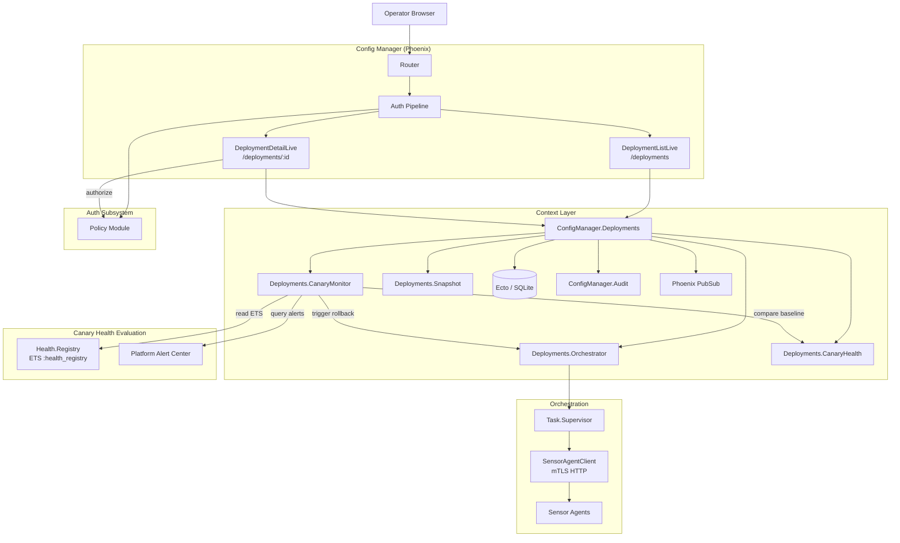
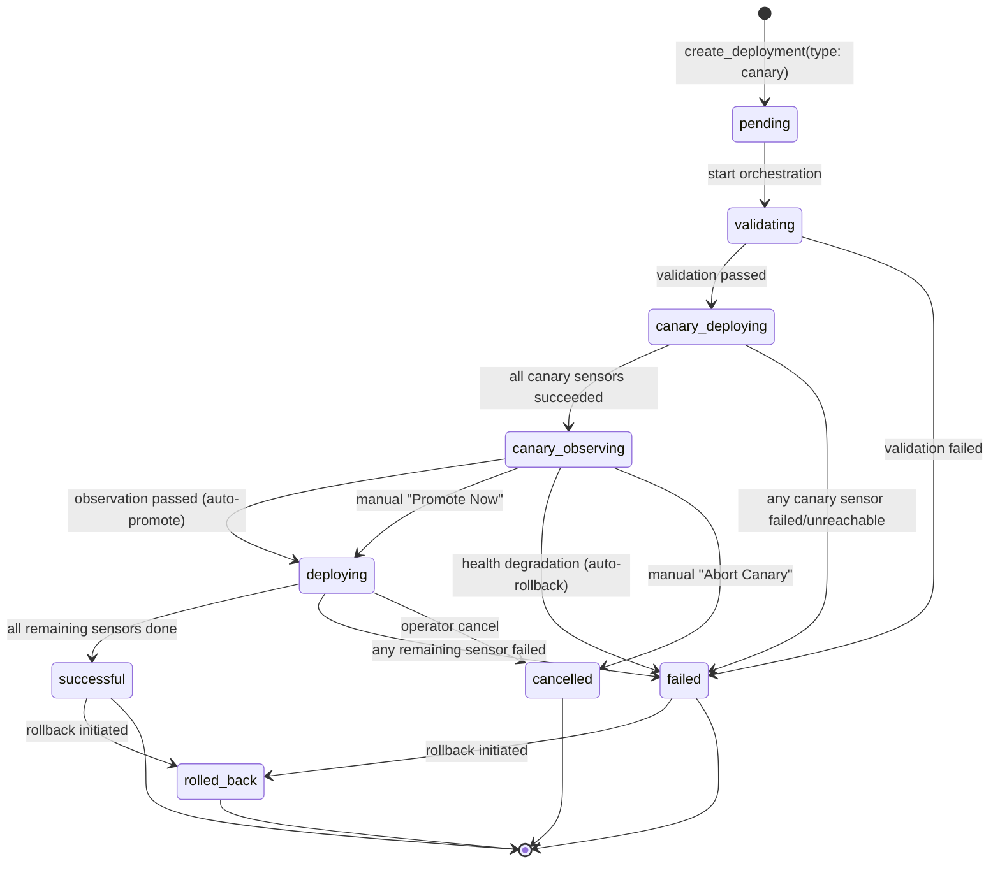
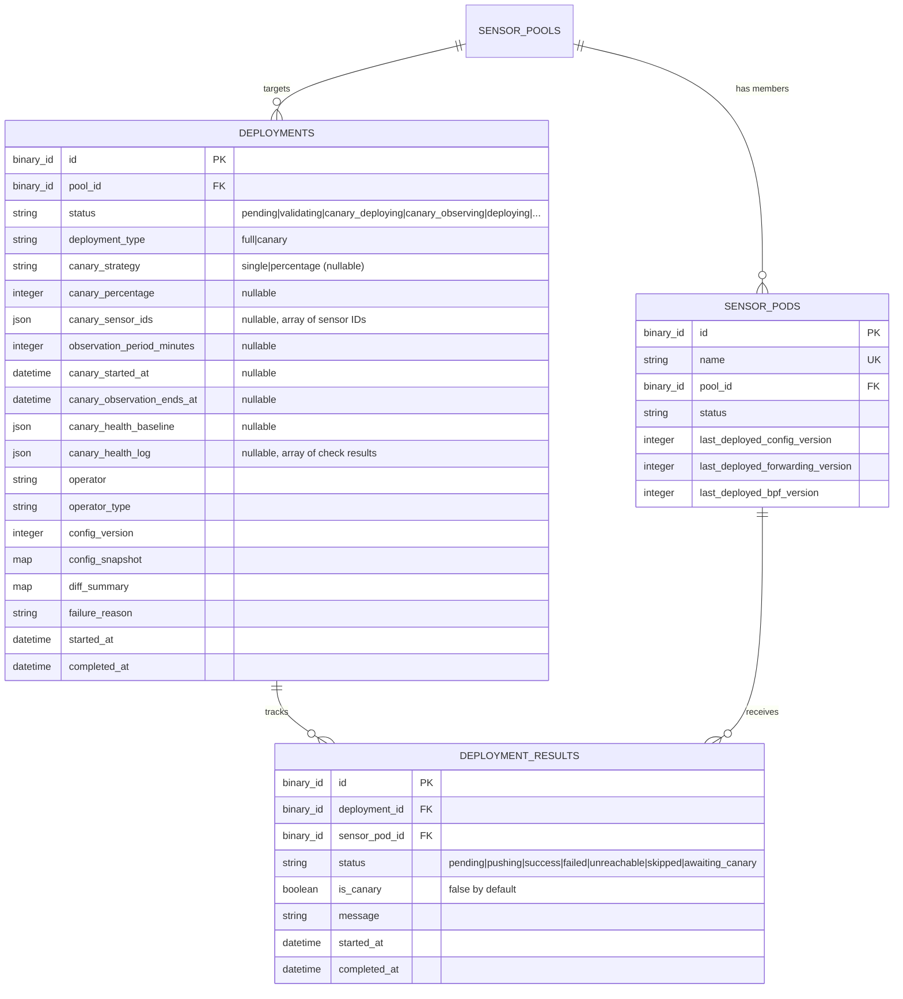

# Design Document: Canary Deployment Workflow

## Overview

This design adds a canary deployment workflow to the RavenWire Config Manager's existing deployment orchestration system. A canary deployment pushes a configuration bundle to a small subset of pool members first (the canary group), monitors their health for a configurable observation period, and then either auto-promotes the deployment to the remaining pool members (if the canary is healthy) or auto-rolls back the canary sensors to their previous configuration (if degradation is detected).

The canary workflow extends the existing `ConfigManager.Deployments` context and `Deployments.Orchestrator` from the deployment-tracking spec. A canary deployment is a standard `Deployment` record with additional canary-specific metadata fields (`deployment_type`, `canary_strategy`, `canary_sensor_ids`, `observation_period_minutes`, etc.). The deployment lifecycle is extended with two new states: `canary_deploying` (pushing config to canary sensors only) and `canary_observing` (monitoring canary health during the observation period). The `DeploymentResult` schema gains an `awaiting_canary` status for non-canary sensors that are held until the canary phase completes.

Health evaluation during the observation period is performed by a new `Deployments.CanaryMonitor` GenServer that runs periodic health checks (default every 30 seconds) against the canary sensors. It reads from the existing `Health.Registry` ETS table for real-time sensor metrics, queries the Platform Alert Center for new alerts, and compares current values against a pre-deployment baseline captured before the canary push. If any health criteria fail, the monitor triggers immediate auto-rollback without waiting for the full observation period.

Manual override is supported via "Promote Now" and "Abort Canary" buttons on the deployment detail page during the `canary_observing` phase, gated by the existing `deployments:manage` RBAC permission.

### Key Design Decisions

1. **Extend existing Deployment schema rather than a separate table**: Canary metadata is stored as nullable fields on the existing `deployments` table. This keeps the deployment list, filtering, and audit trail unified. The `deployment_type` field (`full` or `canary`) distinguishes canary deployments. This avoids join complexity and keeps the existing `Deployments` context API surface minimal.

2. **Dedicated `CanaryMonitor` GenServer per active canary observation**: Each canary deployment in the `canary_observing` phase spawns a `CanaryMonitor` process under `ConfigManager.Deployments.TaskSupervisor`. The monitor runs a `:timer.send_interval` loop for periodic health checks. This isolates canary monitoring from the orchestrator process and allows clean cancellation on manual override or auto-rollback. Only one canary monitor runs per deployment.

3. **Pre-deployment health baseline captured as a snapshot**: Before the canary push begins, the orchestrator captures a health baseline for each canary sensor from the `Health.Registry` ETS table. The baseline includes packet drop rate, container states, forwarding sink states, and active platform alert count. This baseline is stored on the deployment record (in a `canary_health_baseline` JSON field) so it survives process restarts and is available for audit display.

4. **Health evaluation reads from existing Health.Registry ETS**: The `CanaryMonitor` reads sensor health data directly from the `:health_registry` ETS table (public, read-concurrent) without going through GenServer calls. This is fast and non-blocking. Platform alert counts are queried from the Alert Center context.

5. **Auto-rollback restores the previous successful deployment's snapshot**: Consistent with the deployment-tracking spec's rollback mechanism, auto-rollback pushes the `config_snapshot` from the most recent successful deployment for the same pool to the canary sensors only. Non-canary sensors never received the new config, so they are marked `skipped`.

6. **`awaiting_canary` result status for non-canary sensors**: Non-canary sensors get `DeploymentResult` records with status `awaiting_canary` at deployment creation. This makes the canary/non-canary distinction visible in the UI from the start. On promotion, these transition to `pending` → normal dispatch. On rollback/abort, they transition to `skipped`.

7. **Canary health evaluation results stored in `canary_health_log` JSON field**: Each periodic health check result is appended to a JSON array on the deployment record. This provides a complete audit trail of health evaluations without requiring a separate table. The field is capped at a reasonable size (observation period / check interval ≈ max 120 entries for a 60-minute observation at 30-second intervals).

8. **Reuse existing PubSub topics with canary-specific messages**: Canary lifecycle events broadcast to the same `"deployment:#{id}"` and `"pool:#{pool_id}:deployments"` topics used by the deployment-tracking spec. New message types (`{:canary_health_update, ...}`, `{:canary_promoted, ...}`, `{:canary_rollback, ...}`) are added. This keeps LiveView subscriptions simple.

9. **Minimum 2 deployable sensors for canary**: A canary deployment requires at least 2 deployable sensors (one canary + one remaining). This is validated at creation time. Pools with fewer than 2 deployable sensors can only use full deployments.

10. **PropCheck for property-based testing**: Consistent with the deployment-tracking and sensor-pool-management specs, property tests use `propcheck ~> 1.4` with minimum 100 iterations per property.

## Architecture

### System Context



### Canary Deployment Lifecycle Flow



### Request Flow

**Canary deployment creation:**
1. User clicks "Deploy" on pool detail page, selects "Canary Deployment" (requires `deployments:manage`)
2. User configures canary options: strategy (`single`/`percentage`), sensor selection or percentage, observation period
3. `handle_event("create_deployment", params, socket)` calls `Deployments.create_deployment/3` with `deployment_type: "canary"` and canary options
4. Context validates: pool has ≥ 2 deployable sensors, no active deployment exists, canary params are valid
5. Context auto-selects canary sensors (if percentage strategy) or validates operator-selected sensor
6. `Ecto.Multi` transaction: insert deployment with canary metadata, create `DeploymentResult` records (canary sensors → `pending`, remaining → `awaiting_canary`), write `canary_deployment_created` audit entry
7. Broadcasts creation, kicks off orchestration via `Orchestrator.start/1`

**Canary orchestration (async):**
1. Orchestrator transitions to `validating`, runs pre-flight checks
2. On validation success, transitions to `canary_deploying`
3. Captures pre-deployment health baseline for canary sensors via `CanaryHealth.capture_baseline/1`
4. Dispatches config to canary sensors only via `Task.async_stream` (same concurrency/timeout as full deploy)
5. Collects canary results. If all succeed → transitions to `canary_observing`, starts `CanaryMonitor`
6. If any canary sensor fails → marks remaining `awaiting_canary` as `skipped`, transitions to `failed`

**Canary observation (CanaryMonitor GenServer):**
1. Monitor starts with deployment ID, canary sensor IDs, baseline, observation end time
2. Every 30 seconds: reads health from ETS, queries alert center, compares against baseline
3. Broadcasts `{:canary_health_update, health_result}` to `"deployment:#{id}"`
4. Appends health check result to `canary_health_log` on deployment record
5. If all checks pass and observation period expires → calls `Orchestrator.promote_canary/1`
6. If any check fails → calls `Orchestrator.rollback_canary/2` with failure details

**Auto-promote:**
1. Orchestrator transitions deployment from `canary_observing` to `deploying`
2. Updates remaining `awaiting_canary` results to `pending`
3. Dispatches config to remaining sensors (standard concurrent dispatch)
4. Writes `canary_promoted` audit entry
5. Finalizes deployment per standard lifecycle

**Auto-rollback:**
1. Orchestrator finds previous successful deployment's snapshot
2. Pushes restored config to canary sensors only
3. Marks remaining `awaiting_canary` results as `skipped`
4. Transitions deployment to `failed` with health degradation reason
5. Updates canary sensors' `last_deployed_*_version` fields to restored config versions
6. Writes `canary_rollback_initiated` audit entry

### Module Layout

```
lib/config_manager/
├── deployments.ex                         # Extended: canary creation, promote, abort
├── deployments/
│   ├── deployment.ex                      # Extended: canary fields, new statuses
│   ├── deployment_result.ex               # Extended: awaiting_canary status
│   ├── orchestrator.ex                    # Extended: canary_deploying, canary_observing phases
│   ├── canary_monitor.ex                  # NEW: periodic health evaluation GenServer
│   ├── canary_health.ex                   # NEW: health baseline capture & comparison
│   ├── snapshot.ex                        # Existing (unchanged)
│   ├── diff.ex                            # Existing (unchanged)
│   └── drift_detector.ex                  # Existing (unchanged)

lib/config_manager_web/
├── live/
│   ├── deployment_live/
│   │   ├── list_live.ex                   # Extended: canary badge, canary status filters
│   │   └── detail_live.ex                 # Extended: canary health dashboard, override buttons
│   └── components/
│       └── canary_health_component.ex     # NEW: canary health dashboard component

priv/repo/migrations/
├── YYYYMMDDHHMMSS_add_canary_fields_to_deployments.exs
```


## Components and Interfaces

### 1. `ConfigManager.Deployments` — Extended Context Module

The existing Deployments context is extended with canary-specific functions.

```elixir
defmodule ConfigManager.Deployments do
  # ... existing functions from deployment-tracking spec ...

  # ── Canary Deployment Creation ─────────────────────────────────────────────

  @doc """
  Creates a canary deployment targeting a pool.

  Options:
    - deployment_type: "canary" (required for canary)
    - canary_strategy: "single" | "percentage"
    - canary_sensor_ids: [binary_id] (for single strategy, operator-selected)
    - canary_percentage: integer (for percentage strategy, default 10)
    - observation_period_minutes: integer (default 10, min 1, max 60)

  Validates:
    - Pool has >= 2 deployable sensors
    - No active deployment exists
    - Canary params are well-formed

  Creates DeploymentResult records:
    - Canary sensors: status "pending"
    - Remaining sensors: status "awaiting_canary"
  """
  def create_deployment(pool_id, actor, opts \\ [])
      :: {:ok, Deployment.t()} | {:error, atom() | Ecto.Changeset.t()}

  # ── Canary Manual Override ─────────────────────────────────────────────────

  @doc """
  Manually promotes a canary deployment, skipping the remaining observation period.
  Only valid during canary_observing phase.
  Requires deployments:manage permission (checked by caller).
  """
  def promote_canary(deployment_id, actor)
      :: {:ok, Deployment.t()} | {:error, :not_observing | :not_found}

  @doc """
  Manually aborts a canary deployment during the observation phase.
  Rolls back canary sensors and transitions to cancelled.
  Requires deployments:manage permission (checked by caller).
  """
  def abort_canary(deployment_id, actor)
      :: {:ok, Deployment.t()} | {:error, :not_observing | :not_found}

  # ── Canary Queries ─────────────────────────────────────────────────────────

  @doc "Returns canary health evaluation log for a deployment."
  def canary_health_log(deployment_id) :: [map()]

  @doc "Returns the canary health baseline for a deployment."
  def canary_health_baseline(deployment_id) :: map() | nil

  @doc "Returns canary sensor IDs for a deployment."
  def canary_sensor_ids(deployment_id) :: [binary()]

  @doc "Returns true if the deployment is a canary deployment."
  def canary_deployment?(deployment) :: boolean()

  @doc """
  Auto-selects canary sensors for a percentage strategy.
  Selects the configured percentage of deployable sensors (rounded up, min 1),
  preferring sensors with the longest uptime (last_seen_at furthest in the past
  from enrollment, indicating stable long-running sensors).
  """
  def select_canary_sensors(pool_id, percentage) :: {:ok, [binary_id]} | {:error, atom()}
end
```

### 2. `ConfigManager.Deployments.Deployment` — Extended Schema

```elixir
defmodule ConfigManager.Deployments.Deployment do
  use Ecto.Schema
  import Ecto.Changeset

  @primary_key {:id, :binary_id, autogenerate: true}
  @foreign_key_type :binary_id

  # Extended status set with canary states
  @valid_statuses ~w(pending validating canary_deploying canary_observing deploying successful failed cancelled rolled_back)

  @valid_deployment_types ~w(full canary)
  @valid_canary_strategies ~w(single percentage)

  schema "deployments" do
    # ... existing fields from deployment-tracking spec ...
    field :pool_id, :binary_id
    field :status, :string, default: "pending"
    field :operator, :string
    field :operator_type, :string
    field :config_version, :integer
    field :forwarding_config_version, :integer
    field :bpf_version, :integer
    field :config_snapshot, :map
    field :diff_summary, :map
    field :rollback_of_deployment_id, :binary_id
    field :source_deployment_id, :binary_id
    field :started_at, :utc_datetime_usec
    field :completed_at, :utc_datetime_usec
    field :failure_reason, :string

    # ── Canary-specific fields (new) ──
    field :deployment_type, :string, default: "full"
    field :canary_strategy, :string
    field :canary_percentage, :integer
    field :canary_sensor_ids, {:array, :string}
    field :observation_period_minutes, :integer
    field :canary_started_at, :utc_datetime_usec
    field :canary_observation_ends_at, :utc_datetime_usec
    field :canary_health_baseline, :map
    field :canary_health_log, {:array, :map}, default: []

    belongs_to :pool, ConfigManager.SensorPool, define_field: false
    has_many :results, ConfigManager.Deployments.DeploymentResult

    timestamps(type: :utc_datetime_usec)
  end

  @doc "Changeset for creating a canary deployment."
  def canary_create_changeset(deployment, attrs) do
    deployment
    |> cast(attrs, [
      :pool_id, :operator, :operator_type, :config_version,
      :forwarding_config_version, :bpf_version, :config_snapshot,
      :diff_summary, :deployment_type, :canary_strategy,
      :canary_percentage, :canary_sensor_ids, :observation_period_minutes
    ])
    |> validate_required([:pool_id, :operator, :operator_type, :config_version,
                          :config_snapshot, :deployment_type])
    |> validate_inclusion(:deployment_type, @valid_deployment_types)
    |> validate_canary_fields()
    |> put_change(:status, "pending")
  end

  defp validate_canary_fields(changeset) do
    if get_field(changeset, :deployment_type) == "canary" do
      changeset
      |> validate_required([:canary_strategy, :observation_period_minutes])
      |> validate_inclusion(:canary_strategy, @valid_canary_strategies)
      |> validate_number(:observation_period_minutes, greater_than_or_equal_to: 1, less_than_or_equal_to: 60)
      |> validate_canary_strategy_fields()
    else
      changeset
    end
  end

  defp validate_canary_strategy_fields(changeset) do
    case get_field(changeset, :canary_strategy) do
      "single" ->
        changeset
        |> validate_required([:canary_sensor_ids])
        |> validate_length(:canary_sensor_ids, min: 1, max: 1)

      "percentage" ->
        changeset
        |> validate_required([:canary_percentage])
        |> validate_number(:canary_percentage, greater_than: 0, less_than_or_equal_to: 50)

      _ ->
        changeset
    end
  end

  # Extended valid transitions with canary states
  @valid_transitions %{
    "pending" => ~w(validating cancelled),
    "validating" => ~w(canary_deploying deploying failed cancelled),
    "canary_deploying" => ~w(canary_observing failed cancelled),
    "canary_observing" => ~w(deploying failed cancelled),
    "deploying" => ~w(successful failed cancelled),
    "successful" => ~w(rolled_back),
    "failed" => ~w(rolled_back),
    "cancelled" => [],
    "rolled_back" => []
  }

  def status_changeset(deployment, new_status, attrs \\ %{}) do
    deployment
    |> cast(attrs, [:started_at, :completed_at, :failure_reason,
                    :canary_started_at, :canary_observation_ends_at,
                    :canary_health_baseline, :canary_health_log])
    |> put_change(:status, new_status)
    |> validate_inclusion(:status, @valid_statuses)
    |> validate_status_transition(deployment.status, new_status)
  end

  defp validate_status_transition(changeset, from, to) do
    allowed = Map.get(@valid_transitions, from, [])
    if to in allowed do
      changeset
    else
      add_error(changeset, :status, "cannot transition from #{from} to #{to}")
    end
  end
end
```

### 3. `ConfigManager.Deployments.DeploymentResult` — Extended Schema

```elixir
defmodule ConfigManager.Deployments.DeploymentResult do
  use Ecto.Schema
  import Ecto.Changeset

  @primary_key {:id, :binary_id, autogenerate: true}
  @foreign_key_type :binary_id

  # Extended with awaiting_canary
  @valid_statuses ~w(pending pushing success failed unreachable skipped awaiting_canary)

  schema "deployment_results" do
    field :deployment_id, :binary_id
    field :sensor_pod_id, :binary_id
    field :status, :string, default: "pending"
    field :message, :string
    field :started_at, :utc_datetime_usec
    field :completed_at, :utc_datetime_usec
    field :is_canary, :boolean, default: false  # NEW: marks canary group members

    belongs_to :deployment, ConfigManager.Deployments.Deployment, define_field: false
    belongs_to :sensor_pod, ConfigManager.SensorPod, define_field: false

    timestamps(type: :utc_datetime_usec)
  end

  def create_changeset(result, attrs) do
    result
    |> cast(attrs, [:deployment_id, :sensor_pod_id, :status, :message, :is_canary])
    |> validate_required([:deployment_id, :sensor_pod_id, :status])
    |> validate_inclusion(:status, @valid_statuses)
    |> foreign_key_constraint(:deployment_id)
    |> foreign_key_constraint(:sensor_pod_id)
  end
end
```

### 4. `ConfigManager.Deployments.CanaryMonitor` — Health Evaluation GenServer

```elixir
defmodule ConfigManager.Deployments.CanaryMonitor do
  @moduledoc """
  Periodic health evaluation GenServer for canary deployments.

  Spawned under TaskSupervisor when a deployment enters canary_observing.
  Runs health checks at a configurable interval (default 30s) and either
  triggers auto-promote (observation period complete, all healthy) or
  auto-rollback (health degradation detected).
  """

  use GenServer
  require Logger

  @default_check_interval_ms 30_000

  # ── Public API ─────────────────────────────────────────────────────────────

  @doc """
  Starts a canary monitor for the given deployment.
  Called by the Orchestrator when transitioning to canary_observing.

  Options:
    - deployment_id: binary_id (required)
    - canary_sensor_ids: [binary_id] (required)
    - baseline: map (required, pre-deployment health baseline)
    - observation_ends_at: DateTime (required)
    - check_interval_ms: integer (optional, default 30_000)
  """
  def start_link(opts) :: {:ok, pid()} | {:error, term()}

  @doc """
  Stops the canary monitor. Called on manual promote or abort.
  """
  def stop(deployment_id) :: :ok

  # ── GenServer State ────────────────────────────────────────────────────────

  # State:
  # %{
  #   deployment_id: binary_id,
  #   canary_sensor_ids: [binary_id],
  #   baseline: %{sensor_id => %{drop_rate: float, containers: map, sinks: map, alert_count: int}},
  #   observation_ends_at: DateTime,
  #   check_interval_ms: integer,
  #   timer_ref: reference,
  #   check_count: integer
  # }

  # ── Health Check Logic ─────────────────────────────────────────────────────

  # handle_info(:check_health, state)
  #   1. Read current health from Health.Registry ETS for each canary sensor
  #   2. Query Platform Alert Center for new alerts since deployment started
  #   3. Compare against baseline using CanaryHealth.evaluate/3
  #   4. Broadcast result to PubSub
  #   5. Append result to deployment's canary_health_log
  #   6. If any criteria failed → stop timer, call Orchestrator.rollback_canary/2
  #   7. If observation_ends_at reached and all healthy → stop timer, call Orchestrator.promote_canary/1
  #   8. Otherwise → schedule next check
end
```

### 5. `ConfigManager.Deployments.CanaryHealth` — Health Baseline & Comparison

```elixir
defmodule ConfigManager.Deployments.CanaryHealth do
  @moduledoc """
  Captures pre-deployment health baselines and evaluates canary health
  against those baselines during the observation period.
  """

  alias ConfigManager.Health.Registry, as: HealthRegistry

  @default_drop_rate_threshold 2.0  # percentage points

  @doc """
  Captures a health baseline for the given sensor IDs.
  Reads current state from Health.Registry ETS and Platform Alert Center.

  Returns a map of sensor_id => baseline data:
  %{
    sensor_id => %{
      drop_rate: float,           # current packet drop rate percentage
      containers: %{name => status},  # container name => running/stopped
      sinks: %{name => status},       # sink name => operational/down
      alert_count: integer,           # active platform alerts for this sensor
      captured_at: DateTime
    }
  }
  """
  def capture_baseline(sensor_ids) :: {:ok, map()} | {:error, term()}

  @doc """
  Evaluates canary health for a single sensor against its baseline.

  Returns:
    {:ok, %{status: :healthy, metrics: map()}}
    {:error, %{status: :degraded, failed_criteria: [map()], metrics: map()}}

  Health criteria:
    1. No new platform alerts since deployment started
    2. Packet drop rate not increased by more than threshold (default 2pp)
    3. All expected containers still running
    4. All forwarding sinks still operational
  """
  def evaluate(sensor_id, baseline, opts \\ [])
      :: {:ok, map()} | {:error, map()}

  @doc """
  Evaluates all canary sensors and returns an aggregate result.
  Returns {:ok, results} if all healthy, {:error, results} if any degraded.
  """
  def evaluate_all(canary_sensor_ids, baselines, opts \\ [])
      :: {:ok, [map()]} | {:error, [map()]}

  @doc """
  Formats a health evaluation result for audit logging.
  Includes baseline values, current values, and pass/fail per criterion.
  """
  def format_for_audit(evaluation_result) :: map()
end
```

### 6. `ConfigManager.Deployments.Orchestrator` — Extended for Canary

The existing Orchestrator is extended with canary-specific lifecycle steps.

```elixir
defmodule ConfigManager.Deployments.Orchestrator do
  # ... existing functions ...

  # ── Canary-Specific Lifecycle ──────────────────────────────────────────────

  @doc false
  # For canary deployments: after validation, transitions to canary_deploying
  # and dispatches config only to canary sensors.
  defp canary_deploy(deployment)

  @doc false
  # After all canary sensors succeed: captures baseline, transitions to
  # canary_observing, starts CanaryMonitor.
  defp start_canary_observation(deployment)

  @doc """
  Called by CanaryMonitor when observation period completes with healthy canary.
  Transitions to deploying, updates awaiting_canary results to pending,
  dispatches config to remaining sensors.
  """
  def promote_canary(deployment_id)
      :: {:ok, Deployment.t()} | {:error, term()}

  @doc """
  Called by CanaryMonitor when health degradation is detected, or by
  abort_canary for manual abort.
  Pushes previous config to canary sensors, marks remaining as skipped,
  transitions to failed (auto) or cancelled (manual).
  """
  def rollback_canary(deployment_id, reason)
      :: {:ok, Deployment.t()} | {:error, term()}
end
```

### 7. LiveView Extensions

#### `DeploymentLive.DetailLive` — Extended for Canary

```elixir
defmodule ConfigManagerWeb.DeploymentLive.DetailLive do
  use ConfigManagerWeb, :live_view

  # Extended assigns for canary deployments:
  #   canary_metadata: %{strategy, sensor_ids, observation_period, elapsed_time}
  #   canary_health: [%{sensor_id, status, metrics, timestamp}]  (latest health results)
  #   canary_baseline: %{sensor_id => baseline_data}
  #   observation_progress: %{elapsed_seconds, total_seconds, percentage}
  #   can_promote: boolean (canary_observing + deployments:manage)
  #   can_abort: boolean (canary_observing + deployments:manage)

  # New events:
  #   "promote_canary" — manual promote (deployments:manage)
  #   "abort_canary" — manual abort (deployments:manage)

  # New PubSub handlers:
  #   {:canary_health_update, health_result} — update health dashboard
  #   {:canary_promoted, deployment} — update status, show promotion message
  #   {:canary_rollback, deployment, reason} — update status, show failure details

  # Timer: sends :tick every second during canary_observing to update elapsed time display
end
```

#### `DeploymentLive.ListLive` — Extended for Canary

```elixir
defmodule ConfigManagerWeb.DeploymentLive.ListLive do
  use ConfigManagerWeb, :live_view

  # Extended:
  #   - "Canary" badge on canary deployments in list rows
  #   - canary_deploying and canary_observing added to status filter options
  #   - Observation progress display ("Observing: 4m / 10m") for canary_observing rows
  #   - deployment_type column or badge distinguishing full vs canary
end
```

#### `CanaryHealthComponent` — Canary Health Dashboard

```elixir
defmodule ConfigManagerWeb.Components.CanaryHealthComponent do
  @moduledoc """
  LiveComponent that renders the canary health dashboard during observation.
  Shows per-sensor health status, baseline vs current metrics, and criteria pass/fail.
  """

  use ConfigManagerWeb, :live_component

  # Props:
  #   canary_health: [%{sensor_id, status, metrics}]
  #   canary_baseline: %{sensor_id => baseline}
  #   observation_progress: %{elapsed_seconds, total_seconds, percentage}
  #   deployment_status: string

  # Renders:
  #   - Progress bar (elapsed / total observation time)
  #   - Per-sensor health cards:
  #     - Sensor name, healthy/degraded badge
  #     - Drop rate: baseline → current (pass/fail indicator)
  #     - Containers: running count (pass/fail)
  #     - Sinks: operational count (pass/fail)
  #     - Alerts: new alert count since deployment (pass/fail)
end
```

### 8. PubSub Topics and Messages (Canary Extensions)

| Topic | Message | Triggered By |
|-------|---------|-------------|
| `"deployment:#{id}"` | `{:canary_health_update, %{sensor_results: [...], timestamp: DateTime}}` | `CanaryMonitor` periodic check |
| `"deployment:#{id}"` | `{:canary_promoted, deployment}` | `Orchestrator.promote_canary/1` |
| `"deployment:#{id}"` | `{:canary_rollback, deployment, %{reason: string, failed_criteria: [...]}}` | `Orchestrator.rollback_canary/2` |
| `"deployment:#{id}"` | `{:canary_observation_started, deployment}` | Orchestrator canary_observing transition |
| `"pool:#{pool_id}:deployments"` | `{:deployment_created, deployment}` | Existing (canary deployments included) |
| `"pool:#{pool_id}:deployments"` | `{:deployment_completed, deployment}` | Existing (canary deployments included) |
| `"deployments"` | `{:deployment_created, deployment}` | Existing (canary deployments included) |
| `"deployments"` | `{:deployment_completed, deployment}` | Existing (canary deployments included) |

### 9. Audit Entry Patterns (Canary-Specific)

| Action | target_type | target_id | Detail Fields |
|--------|------------|-----------|---------------|
| `canary_deployment_created` | `deployment` | deployment.id | `%{pool_id, pool_name, deployment_type, canary_strategy, canary_percentage, canary_sensor_ids, observation_period_minutes, sensor_count}` |
| `canary_deploy_started` | `deployment` | deployment.id | `%{pool_name, canary_sensor_ids, canary_sensor_count}` |
| `canary_observation_started` | `deployment` | deployment.id | `%{pool_name, canary_sensor_ids, observation_period_minutes, observation_ends_at, baseline_summary}` |
| `canary_observation_completed` | `deployment` | deployment.id | `%{pool_name, observation_duration_seconds, health_check_count, all_healthy: boolean}` |
| `canary_promoted` | `deployment` | deployment.id | `%{pool_name, canary_sensor_ids, observation_duration_seconds, remaining_sensor_count, health_summary}` |
| `canary_manual_promote` | `deployment` | deployment.id | `%{pool_name, operator, observation_elapsed_seconds, remaining_observation_seconds}` |
| `canary_rollback_initiated` | `deployment` | deployment.id | `%{pool_name, canary_sensor_ids, failed_criteria, baseline_values, observed_values, source_deployment_id}` |
| `canary_manual_abort` | `deployment` | deployment.id | `%{pool_name, operator, observation_elapsed_seconds}` |
| `canary_health_degradation_detected` | `deployment` | deployment.id | `%{pool_name, sensor_id, failed_criteria, baseline_values, observed_values, check_number}` |

### 10. RBAC

Canary deployment operations reuse the existing `deployments:manage` permission from the deployment-tracking spec. No new permissions are needed.

| Action | Permission |
|--------|-----------|
| Create canary deployment | `deployments:manage` |
| Promote Now | `deployments:manage` |
| Abort Canary | `deployments:manage` |
| View canary deployment detail | `sensors:view` |
| View canary health dashboard | `sensors:view` |

## Data Models

### Extended `deployments` Table

The migration adds canary-specific nullable fields to the existing `deployments` table:

```sql
ALTER TABLE deployments ADD COLUMN deployment_type TEXT NOT NULL DEFAULT 'full';
ALTER TABLE deployments ADD COLUMN canary_strategy TEXT;
ALTER TABLE deployments ADD COLUMN canary_percentage INTEGER;
ALTER TABLE deployments ADD COLUMN canary_sensor_ids TEXT;       -- JSON array of sensor pod IDs
ALTER TABLE deployments ADD COLUMN observation_period_minutes INTEGER;
ALTER TABLE deployments ADD COLUMN canary_started_at TEXT;       -- utc_datetime_usec
ALTER TABLE deployments ADD COLUMN canary_observation_ends_at TEXT; -- utc_datetime_usec
ALTER TABLE deployments ADD COLUMN canary_health_baseline TEXT;  -- JSON map
ALTER TABLE deployments ADD COLUMN canary_health_log TEXT;       -- JSON array of health check results
```

**Ecto Migration:**

```elixir
defmodule ConfigManager.Repo.Migrations.AddCanaryFieldsToDeployments do
  use Ecto.Migration

  def change do
    alter table(:deployments) do
      add :deployment_type, :text, null: false, default: "full"
      add :canary_strategy, :text
      add :canary_percentage, :integer
      add :canary_sensor_ids, :map          # stored as JSON array
      add :observation_period_minutes, :integer
      add :canary_started_at, :utc_datetime_usec
      add :canary_observation_ends_at, :utc_datetime_usec
      add :canary_health_baseline, :map     # stored as JSON map
      add :canary_health_log, :map          # stored as JSON array
    end

    alter table(:deployment_results) do
      add :is_canary, :boolean, default: false
    end

    create index(:deployments, [:deployment_type])
  end
end
```

### Extended `deployment_results` Table

A boolean `is_canary` column is added to distinguish canary group members in the results table. The `status` column now accepts `awaiting_canary` as a valid value.

### Entity Relationship Diagram



### Canary Health Baseline Structure

```json
{
  "sensor-pod-uuid-1": {
    "drop_rate": 0.5,
    "containers": {
      "suricata": "running",
      "zeek": "running",
      "vector": "running"
    },
    "sinks": {
      "splunk-prod": "operational",
      "s3-archive": "operational"
    },
    "alert_count": 2,
    "captured_at": "2024-01-15T10:29:55.000000Z"
  }
}
```

### Canary Health Log Entry Structure

```json
{
  "check_number": 1,
  "timestamp": "2024-01-15T10:30:25.000000Z",
  "overall_status": "healthy",
  "sensors": {
    "sensor-pod-uuid-1": {
      "status": "healthy",
      "drop_rate": {"baseline": 0.5, "current": 0.6, "threshold": 2.0, "pass": true},
      "containers": {"expected": 3, "running": 3, "pass": true},
      "sinks": {"expected": 2, "operational": 2, "pass": true},
      "alerts": {"baseline_count": 2, "current_count": 2, "new_alerts": 0, "pass": true}
    }
  }
}
```


## Correctness Properties

*A property is a characteristic or behavior that should hold true across all valid executions of a system — essentially, a formal statement about what the system should do. Properties serve as the bridge between human-readable specifications and machine-verifiable correctness guarantees.*

### Property 1: Canary metadata persistence round-trip

*For any* valid canary deployment configuration (deployment_type `"canary"`, canary_strategy in `{"single", "percentage"}`, canary_percentage in 1..50, canary_sensor_ids as a non-empty list of UUIDs, observation_period_minutes in 1..60), creating a deployment with these parameters and then retrieving it SHALL produce a record where all canary metadata fields match the input values. Additionally, *for any* canary health log entry (a map with check_number, timestamp, overall_status, and per-sensor metrics), appending it to the deployment's `canary_health_log` and re-reading SHALL preserve the entry structure exactly (accounting for JSON atom-to-string key conversion).

**Validates: Requirements 1.3, 10.4**

### Property 2: Canary sensor auto-selection count and ordering

*For any* pool with N deployable sensors (N ≥ 2) and any percentage P (1..50), the auto-selection function SHALL return exactly `max(1, ceil(N * P / 100))` sensor IDs, all of which are deployable enrolled members of the pool. The selected sensors SHALL be ordered by longest uptime (earliest `enrolled_at` with most recent `last_seen_at`). The selected count SHALL always be strictly less than N (at least one sensor remains for the non-canary group).

**Validates: Requirements 1.4**

### Property 3: Minimum deployable sensors guard for canary

*For any* pool with fewer than 2 deployable sensors (0 or 1), attempting to create a canary deployment SHALL return `{:error, :insufficient_sensors_for_canary}` and the total number of deployments SHALL remain unchanged. *For any* pool with 2 or more deployable sensors, canary deployment creation SHALL NOT be rejected on sensor count grounds (other validation may still apply).

**Validates: Requirements 1.6**

### Property 4: Extended deployment and result status validation

*For any* string value, the deployment status changeset SHALL accept only values in the set `{pending, validating, canary_deploying, canary_observing, deploying, successful, failed, cancelled, rolled_back}` and reject all others. The deployment_type field SHALL accept only `{full, canary}`. When deployment_type is `canary`, the canary_strategy field SHALL accept only `{single, percentage}`. The deployment result status changeset SHALL accept only values in `{pending, pushing, success, failed, unreachable, skipped, awaiting_canary}` and reject all others.

**Validates: Requirements 2.1, 2.8, 2.9, 10.2, 10.3**

### Property 5: Canary deployment state transitions follow valid paths

*For any* canary deployment in status S, a transition to status T SHALL succeed only if T is in the valid transition set for S. The valid transitions for canary deployments are: `pending → {validating, cancelled}`, `validating → {canary_deploying, deploying, failed, cancelled}`, `canary_deploying → {canary_observing, failed, cancelled}`, `canary_observing → {deploying, failed, cancelled}`, `deploying → {successful, failed, cancelled}`, `successful → {rolled_back}`, `failed → {rolled_back}`, `cancelled → {}`, `rolled_back → {}`. All other transitions SHALL be rejected by the changeset.

**Validates: Requirements 2.2**

### Property 6: Canary result record partitioning invariants

*For any* canary deployment targeting a pool with N deployable sensors and C canary sensors (where 1 ≤ C < N), at creation time the deployment SHALL have exactly C result records with `is_canary: true, status: "pending"` and exactly (N - C) result records with `is_canary: false, status: "awaiting_canary"`. On promotion, all `awaiting_canary` results SHALL transition to `"pending"`. On rollback or abort, all `awaiting_canary` results SHALL transition to `"skipped"`. At no point SHALL a result with `is_canary: false` have status `"pending"` before promotion occurs.

**Validates: Requirements 2.3, 4.2, 5.4**

### Property 7: Canary phase final status determination

*For any* canary deployment where all canary sensor results have reached a terminal state, the canary phase outcome SHALL be: if every canary result has status `"success"`, the deployment transitions to `canary_observing`; if any canary result has status `"failed"` or `"unreachable"`, the deployment transitions to `"failed"` and all `awaiting_canary` results are marked `"skipped"`. No partial success (some success, some failed) SHALL result in `canary_observing`.

**Validates: Requirements 2.4**

### Property 8: Health evaluation criteria correctness

*For any* canary sensor with a captured baseline and current health state, the health evaluation SHALL report:
- Alert criterion fails if and only if the current platform alert count exceeds the baseline alert count (new alerts fired)
- Drop rate criterion fails if and only if the current drop rate exceeds the baseline drop rate by more than the configured threshold (default 2 percentage points)
- Container criterion fails if and only if any container that was running in the baseline is no longer running
- Sink criterion fails if and only if any sink that was operational in the baseline is no longer operational

The overall evaluation SHALL report `degraded` if any single criterion fails, and `healthy` only if all criteria pass.

**Validates: Requirements 3.2**

### Property 9: Health baseline capture completeness

*For any* set of canary sensor IDs where each sensor has health data in the Health.Registry, the captured baseline SHALL contain an entry for every sensor ID with all required fields: `drop_rate` (number), `containers` (map of name → status), `sinks` (map of name → status), `alert_count` (non-negative integer), and `captured_at` (timestamp). No sensor in the canary set SHALL be missing from the baseline.

**Validates: Requirements 3.3**

### Property 10: Canary rollback uses correct source deployment

*For any* canary deployment D for pool P, when auto-rollback is triggered, the configuration pushed to canary sensors SHALL be the `config_snapshot` from the most recent successful deployment S for pool P where S.inserted_at < D.inserted_at. If no such deployment S exists, the rollback SHALL fail with an appropriate error and the deployment SHALL transition to `"failed"` with a message indicating no restore point exists.

**Validates: Requirements 5.2, 5.7**

### Property 11: Version field updates scoped to canary sensors on rollback

*For any* canary deployment that undergoes auto-rollback, the `last_deployed_config_version`, `last_deployed_forwarding_version`, and `last_deployed_bpf_version` fields SHALL be updated only for sensors in the canary group (those with `is_canary: true` results). Non-canary sensors (those with `awaiting_canary` or `skipped` results) SHALL have their version fields unchanged from before the canary deployment was created.

**Validates: Requirements 5.6**

### Property 12: Canary audit entry completeness and structure

*For any* canary deployment that progresses through its lifecycle, the system SHALL produce audit entries for each lifecycle transition with the correct action name. Each canary audit entry SHALL contain: a non-nil `actor`, `actor_type` of `"user"` or `"api_token"`, `target_type` of `"deployment"`, `target_id` matching the deployment ID, and a `detail` field that decodes to a JSON map containing at minimum `pool_name` and `canary_sensor_ids`. The `canary_health_degradation_detected` audit entry SHALL additionally contain `failed_criteria`, `baseline_values`, and `observed_values` in its detail field.

**Validates: Requirements 1.5, 2.7, 9.1, 9.2, 9.3**

## Error Handling

### Canary Deployment Creation Errors

| Error | Cause | User-Facing Message | Recovery |
|-------|-------|-------------------|----------|
| `:insufficient_sensors_for_canary` | Pool has fewer than 2 deployable sensors | "Canary deployment requires at least 2 deployable sensors. This pool has only N. Use a full deployment instead." | Use full deployment or add sensors to pool |
| `:active_deployment_exists` | Pool already has an active deployment | "A deployment is already in progress for this pool." | Wait or cancel existing deployment |
| `:invalid_canary_sensor` | Operator-selected canary sensor is not in the pool or not deployable | "Selected canary sensor is not a deployable member of this pool." | Select a valid sensor |
| `:canary_percentage_too_high` | Percentage would select all sensors (no remaining group) | "Canary percentage would select all sensors. Reduce the percentage or use a full deployment." | Lower percentage |
| Changeset error | Invalid canary parameters (observation period out of range, etc.) | Field-specific validation errors | Fix input and retry |

### Canary Observation Errors

| Error | Cause | Handling |
|-------|-------|---------|
| Health Registry unavailable | ETS table not accessible | Log error, treat as health check failure, trigger rollback |
| Alert Center query failure | Database error querying alerts | Log error, skip alert criterion for this check, continue monitoring |
| Canary sensor removed from pool | Sensor unassigned during observation | Treat as health failure, trigger rollback |
| CanaryMonitor process crash | Unexpected error in monitor | TaskSupervisor does NOT auto-restart; deployment remains in `canary_observing`; stale deployment detection marks it failed after timeout |
| Observation period expires during health check | Timer fires while check is running | Complete current check, then evaluate; if healthy, promote; if degraded, rollback |

### Canary Rollback Errors

| Error | Cause | User-Facing Message |
|-------|-------|-------------------|
| `:no_previous_successful` | No successful deployment exists for the pool | "Automatic rollback could not be performed — no previous successful deployment exists as a restore point. Canary sensors may need manual intervention." |
| Rollback push failure | Canary sensor unreachable during rollback push | Log error, mark canary sensor result as `failed`, deployment transitions to `failed` with rollback failure noted |

### Manual Override Errors

| Error | Cause | User-Facing Message |
|-------|-------|-------------------|
| `:not_observing` | Deployment is not in `canary_observing` status | "This deployment is not currently in the canary observation phase." |
| `:not_found` | Deployment ID doesn't exist | "Deployment not found." |
| `:unauthorized` | User lacks `deployments:manage` permission | "You don't have permission to perform this action." |

## Testing Strategy

### Property-Based Testing (PropCheck)

The project uses **PropCheck** (`propcheck ~> 1.4`) for property-based testing. Each property test runs a minimum of **100 iterations** with generated inputs.

**Property test configuration:**
- Library: PropCheck (Erlang PropEr wrapper for Elixir)
- Minimum iterations: 100 per property
- Each test tagged with: `# Feature: canary-deploys, Property N: <property_text>`

**Properties to implement as PBT:**

| Property | Module Under Test | Generator Strategy |
|----------|------------------|-------------------|
| 1: Canary metadata round-trip | `Deployments`, `Deployment` | Generate random canary configs (strategy, percentage, sensor IDs, observation period), create and retrieve |
| 2: Sensor auto-selection | `Deployments` | Generate pools with 2–20 sensors with random uptimes, percentages 1–50 |
| 3: Minimum sensors guard | `Deployments` | Generate pools with 0, 1, 2, and N sensors, attempt canary creation |
| 4: Status/type validation | `Deployment`, `DeploymentResult` | Generate random strings, verify changeset acceptance/rejection for all status and type fields |
| 5: State transitions | `Deployment` | Generate all (status, target_status) pairs, verify transition validity |
| 6: Result partitioning | `Deployments` | Generate pools with varying sensor counts and canary selections, verify result statuses |
| 7: Canary phase determination | `Orchestrator` | Generate random combinations of canary sensor result statuses |
| 8: Health evaluation | `CanaryHealth` | Generate random baselines and current health states with varying metrics |
| 9: Baseline completeness | `CanaryHealth` | Generate random sensor health data, capture baseline, verify structure |
| 10: Rollback source selection | `Deployments` | Generate deployment histories with varying success/failure patterns |
| 11: Version field scoping | `Orchestrator` | Generate canary deployments with varying sensor splits, trigger rollback |
| 12: Audit completeness | `Deployments` | Generate canary deployments through lifecycle, verify audit entries |

### Test Data Generators (PropCheck)

```elixir
# Canary strategy generator
def canary_strategy_gen, do: oneof(["single", "percentage"])

# Canary percentage generator (valid range)
def canary_percentage_gen, do: choose(1, 50)

# Observation period generator (valid range, minutes)
def observation_period_gen, do: choose(1, 60)

# Canary deployment config generator
def canary_config_gen do
  let strategy <- canary_strategy_gen() do
    case strategy do
      "single" ->
        let sensor_id <- binary_id_gen() do
          %{
            deployment_type: "canary",
            canary_strategy: "single",
            canary_sensor_ids: [sensor_id],
            observation_period_minutes: :proper_gen.pick(observation_period_gen())
          }
        end
      "percentage" ->
        let {pct, period} <- {canary_percentage_gen(), observation_period_gen()} do
          %{
            deployment_type: "canary",
            canary_strategy: "percentage",
            canary_percentage: pct,
            observation_period_minutes: period
          }
        end
    end
  end
end

# Health baseline generator
def health_baseline_gen do
  let {drop_rate, container_count, sink_count, alert_count} <-
      {float(0.0, 10.0), choose(1, 5), choose(0, 3), non_neg_integer()} do
    containers = for i <- 1..container_count, into: %{}, do: {"container_#{i}", "running"}
    sinks = for i <- 1..sink_count, into: %{}, do: {"sink_#{i}", "operational"}
    %{
      drop_rate: drop_rate,
      containers: containers,
      sinks: sinks,
      alert_count: alert_count,
      captured_at: DateTime.utc_now()
    }
  end
end

# Current health state generator (may deviate from baseline)
def current_health_gen(baseline) do
  let {drop_delta, container_failures, sink_failures, new_alerts} <-
      {float(-1.0, 5.0), choose(0, map_size(baseline.containers)),
       choose(0, map_size(baseline.sinks)), choose(0, 3)} do
    # ... generate current state with possible deviations from baseline
  end
end

# Deployment status generator
def deployment_status_gen do
  oneof(~w(pending validating canary_deploying canary_observing deploying
           successful failed cancelled rolled_back))
end

# Result status generator (including awaiting_canary)
def result_status_gen do
  oneof(~w(pending pushing success failed unreachable skipped awaiting_canary))
end

# Binary UUID generator
def binary_id_gen do
  let bytes <- binary(16) do
    Ecto.UUID.cast!(bytes)
  end
end
```

### Unit Tests (Example-Based)

Unit tests cover specific examples, edge cases, and UI rendering:

| Test Module | Coverage |
|-------------|----------|
| `CanaryDeploymentCreationTest` | Happy path canary creation with single/percentage strategy, validation errors |
| `CanaryDeploymentDetailLiveTest` | Canary metadata display, health dashboard rendering, override button visibility |
| `CanaryDeploymentListLiveTest` | Canary badge display, canary status filters, observation progress in list row |
| `CanaryHealthComponentTest` | Health dashboard rendering with healthy/degraded states, baseline vs current display |
| `CanaryManualOverrideTest` | Promote Now and Abort Canary button behavior, RBAC enforcement |
| `CanaryStatusBadgeTest` | canary_deploying (blue) and canary_observing (amber) badge colors |
| `CanaryMigrationTest` | Column existence, defaults, index presence |
| `CanaryNoRestorePointTest` | Rollback when no previous successful deployment exists |

### Integration Tests

| Test | Coverage |
|------|----------|
| Full canary lifecycle (happy path) | Create → validate → canary_deploy → observe → promote → deploy remaining → successful |
| Canary rollback lifecycle | Create → canary_deploy → observe → health failure → auto-rollback → failed |
| Manual promote during observation | Create → observe → Promote Now → deploy remaining → successful |
| Manual abort during observation | Create → observe → Abort Canary → rollback canary → cancelled |
| Canary with percentage strategy | Auto-selection of correct sensor count, correct rounding |
| PubSub canary messages | Verify all canary-specific PubSub messages delivered to correct topics |
| Canary audit trail completeness | Full lifecycle produces all expected audit entries with correct action names |
| Concurrent deployment prevention | Canary deployment blocks new deployments on same pool |
| CanaryMonitor process lifecycle | Monitor starts on canary_observing, stops on promote/abort/rollback |
| Stale canary detection | Canary stuck in canary_observing past timeout is marked failed |
