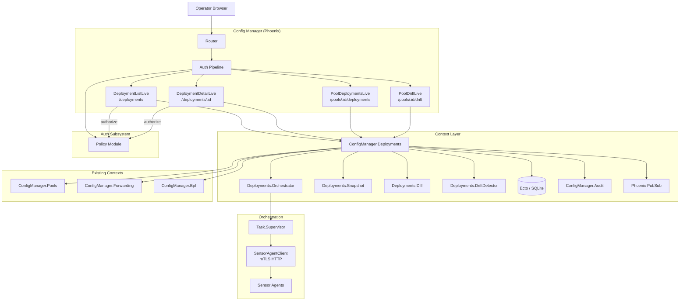
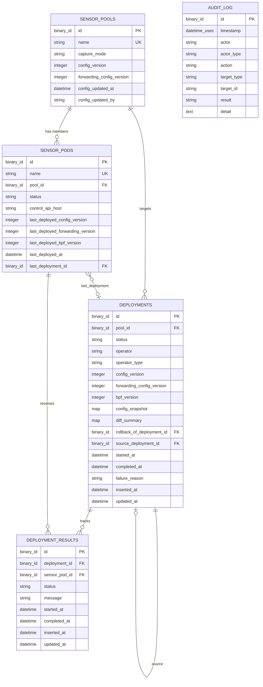

# Design Document: Deployment Tracking and Drift Detection

## Overview

This design adds a deployment orchestration, tracking, and drift detection system to the RavenWire Config Manager. The feature provides a unified deployment lifecycle that pushes configuration bundles (capture config, BPF filters, forwarding sinks, Suricata rules) from pools to their enrolled sensors, tracks per-sensor results, supports rollback to previous successful configurations, and detects configuration drift between each sensor's last-deployed state and the pool's current desired state.

The deployment orchestrator runs as a supervised async process (`Task.Supervisor`) that dispatches configuration to sensors via the existing `ConfigManager.SensorAgentClient` over mTLS, with configurable concurrency limits (default 5 concurrent pushes) and per-sensor timeouts (default 30 seconds). Deployments progress through a defined lifecycle: `pending` → `validating` → `deploying` → `successful`/`failed`/`cancelled`/`rolled_back`. Per-sensor results are tracked individually and broadcast via PubSub for real-time UI updates.

Configuration snapshots are captured at deployment creation time and stored as immutable JSON on the deployment record. Snapshots exclude secret plaintext/ciphertext values. The diff engine compares snapshots between consecutive deployments for the same pool. Rollback creates a new deployment using the snapshot from the most recent prior successful deployment.

Drift detection compares per-sensor `last_deployed_*_version` fields against the pool's current desired versions (`config_version`, `forwarding_config_version`, BPF profile `version`). Drift status is displayed on pool detail pages, sensor detail pages, and the pool list page.

### Key Design Decisions

1. **Dedicated `ConfigManager.Deployments` context module**: All deployment CRUD, orchestration, snapshot creation, diff computation, rollback, and drift detection logic lives in a single context module. LiveView modules call through this context. This follows the project pattern established by `ConfigManager.Enrollment` and the designs for `ConfigManager.Pools`, `ConfigManager.Forwarding`, and `ConfigManager.Bpf`.

2. **`Ecto.Multi` for transactional audit writes**: Every deployment state change uses `Ecto.Multi` with `Audit.append_multi/2` so the audit entry and data change succeed or fail atomically, consistent with the sensor-pool-management and vector-forwarding-mgmt patterns.

3. **Supervised async orchestration via `Task.Supervisor`**: The deployment orchestrator runs under `ConfigManager.Deployments.TaskSupervisor`. The initiating LiveView receives progress updates via PubSub, keeping the UI responsive. The orchestrator process is linked to the supervisor, not the LiveView, so browser disconnects do not cancel in-flight deployments.

4. **Concurrent sensor dispatch with `Task.async_stream`**: Sensor pushes use `Task.async_stream` with `max_concurrency: 5` (configurable) and `timeout: 30_000` (configurable). Each sensor push calls the appropriate `SensorAgentClient` function based on the configuration domain. Results are collected and broadcast individually as they arrive.

5. **Immutable configuration snapshots**: The `config_snapshot` field on the `deployments` table stores a JSON map captured at creation time. It is never modified after insertion. Secrets are represented as `"configured": true/false` booleans. This enables exact diff display and rollback without re-reading current state.

6. **Diff computed at deployment creation**: The `diff_summary` is computed by comparing the new snapshot against the most recent previous successful deployment's snapshot for the same pool. This avoids recomputing diffs on every page load and ensures the diff reflects the state at deployment time.

7. **Per-sensor version tracking for drift**: Rather than scanning all historical deployment results, drift is computed from denormalized `last_deployed_config_version`, `last_deployed_forwarding_version`, and `last_deployed_bpf_version` fields on `sensor_pods`. These are updated atomically when a sensor's deployment result transitions to `success`.

8. **PropCheck for property-based testing**: The project already includes `propcheck ~> 1.4`. Property tests will validate configuration snapshot round-trips, deployment status transition validity, drift computation correctness, concurrent deployment prevention, and diff symmetry.

9. **PubSub for real-time updates**: Deployment mutations broadcast to `"deployment:#{id}"` (detail page), `"pool:#{pool_id}:deployments"` (pool-scoped), `"pool:#{pool_id}:drift"` (drift views), and `"deployments"` (fleet-wide list). This follows the topic naming pattern from the forwarding and BPF specs.

10. **Active deployment guard via composite index**: A composite index on `(pool_id, status)` enables efficient checking for active deployments (`pending`, `validating`, `deploying`) before allowing new deployment creation. This prevents concurrent deployments to the same pool.

## Architecture

### System Context



### Request Flow

**Deployment creation:**
1. User clicks "Deploy Now" on pool detail or "New Deployment" on deployment list (requires `deployments:manage`)
2. `handle_event("create_deployment", %{"pool_id" => id}, socket)` calls `Deployments.create_deployment/3`
3. Context checks for active deployments on the pool (rejects if one exists)
4. Context snapshots current pool configuration via `Snapshot.capture/1`
5. Context computes diff against previous successful deployment via `Diff.compute/2`
6. `Ecto.Multi` transaction: insert deployment record, create deployment_result records for each enrolled sensor, write audit entry
7. Broadcasts `{:deployment_created, deployment}` to `"pool:#{pool_id}:deployments"` and `"deployments"`
8. Kicks off orchestration: `Orchestrator.start/1` under `TaskSupervisor`
9. Returns `{:ok, deployment}` to LiveView, which navigates to `/deployments/:id`

**Deployment orchestration (async):**
1. Orchestrator transitions deployment to `validating`, runs pre-flight checks
2. On validation success, transitions to `deploying`, records `started_at`, writes audit entry
3. Dispatches configuration to sensors via `Task.async_stream` with concurrency limit
4. For each sensor: calls `SensorAgentClient` functions, updates `deployment_result`, broadcasts result via PubSub
5. When all results are terminal: transitions deployment to `successful` or `failed`, records `completed_at`
6. On success: updates per-sensor `last_deployed_*_version` fields, updates BPF `last_deployed_version`
7. Broadcasts completion to all relevant PubSub topics

**Rollback:**
1. User clicks "Rollback" on deployment detail page (requires `deployments:manage`)
2. Context finds the most recent successful deployment before the target deployment
3. Creates a new deployment using the source deployment's snapshot
4. New deployment follows normal lifecycle
5. On success: marks the rolled-back deployment as `rolled_back`

**Drift detection:**
1. Pool drift view loads: `Deployments.compute_drift/1` compares each sensor's `last_deployed_*_version` against pool's current versions
2. Returns per-sensor drift status: `in_sync`, `drift_detected` (with domains), or `never_deployed`
3. Subscribes to `"pool:#{pool_id}:drift"` for real-time updates after deployments complete

### Module Layout

```
lib/config_manager/
├── deployments.ex                         # Deployments context (public API)
├── deployments/
│   ├── deployment.ex                      # Ecto schema
│   ├── deployment_result.ex               # Ecto schema
│   ├── orchestrator.ex                    # Async deployment lifecycle
│   ├── snapshot.ex                        # Configuration snapshot capture
│   ├── diff.ex                            # Snapshot diff computation
│   └── drift_detector.ex                  # Drift computation logic

lib/config_manager_web/
├── live/
│   ├── deployment_live/
│   │   ├── list_live.ex                   # /deployments — fleet-wide list
│   │   └── detail_live.ex                 # /deployments/:id — detail + results
│   ├── pool_live/
│   │   ├── deployments_live.ex            # Updated: /pools/:id/deployments
│   │   └── drift_live.ex                  # /pools/:id/drift
│   ├── pool_live/show_live.ex             # Updated: drift badge, Deploy Now
│   ├── pool_live/index_live.ex            # Updated: drift indicator
│   └── sensor_detail_live.ex              # Updated: drift status section
├── router.ex                              # Extended with deployment routes

priv/repo/migrations/
├── YYYYMMDDHHMMSS_create_deployments.exs
├── YYYYMMDDHHMMSS_create_deployment_results.exs
├── YYYYMMDDHHMMSS_add_drift_fields_to_sensor_pods.exs
```


## Components and Interfaces

### 1. `ConfigManager.Deployments` — Deployments Context Module

The primary public API for all deployment operations. All LiveView modules call through this context.

```elixir
defmodule ConfigManager.Deployments do
  @moduledoc "Deployment tracking, orchestration, rollback, and drift detection context."

  alias ConfigManager.{Repo, SensorPool, SensorPod, Audit}
  alias ConfigManager.Deployments.{Deployment, DeploymentResult, Orchestrator, Snapshot, Diff, DriftDetector}
  alias Ecto.Multi
  import Ecto.Query

  # ── Deployment CRUD ────────────────────────────────────────────────────────

  @doc "Lists deployments with pagination, filtering, and ordering."
  def list_deployments(opts \\ [])
      :: %{entries: [Deployment.t()], page: integer(), total_pages: integer(), total_count: integer()}

  @doc "Lists deployments for a specific pool with pagination."
  def list_pool_deployments(pool_id, opts \\ [])
      :: %{entries: [Deployment.t()], page: integer(), total_pages: integer(), total_count: integer()}

  @doc "Gets a single deployment by ID with preloaded results and pool."
  def get_deployment(id) :: Deployment.t() | nil

  @doc "Gets a single deployment by ID. Raises if not found."
  def get_deployment!(id) :: Deployment.t()

  @doc """
  Creates a new deployment targeting a pool.
  - Checks for active deployments on the pool (rejects if one exists)
  - Snapshots current pool configuration
  - Computes diff against previous successful deployment
  - Creates deployment_result records for each enrolled sensor
  - Writes audit entry with action `deployment_created`
  - Broadcasts creation to PubSub topics
  - Kicks off async orchestration

  `actor` is %{name: string, type: "user" | "api_token"}.
  """
  def create_deployment(pool_id, actor, opts \\ [])
      :: {:ok, Deployment.t()} | {:error, :active_deployment_exists | :no_deployable_sensors | :pool_not_found | Ecto.Changeset.t()}

  @doc """
  Cancels a deployment in pending, validating, or deploying status.
  Stops new sensor pushes, marks remaining pending results as skipped,
  waits for in-flight pushes, transitions to cancelled.
  """
  def cancel_deployment(deployment_id, actor)
      :: {:ok, Deployment.t()} | {:error, :not_cancellable | :not_found}

  # ── Rollback ───────────────────────────────────────────────────────────────

  @doc """
  Creates a rollback deployment that restores the snapshot from the most recent
  successful deployment before the target deployment.
  Returns {:error, :no_previous_successful} if no source deployment exists.
  Returns {:error, :already_rolled_back} if the target is already rolled_back.
  Returns {:error, :rollback_in_progress} if an active rollback exists.
  """
  def rollback_deployment(deployment_id, actor)
      :: {:ok, Deployment.t()} | {:error, atom()}

  @doc "Returns the most recent successful deployment before the given deployment for the same pool."
  def previous_successful_deployment(deployment)
      :: Deployment.t() | nil

  # ── Deployment Results ─────────────────────────────────────────────────────

  @doc "Lists deployment results for a deployment, grouped by status with failed/unreachable first."
  def list_deployment_results(deployment_id)
      :: [DeploymentResult.t()]

  @doc "Returns result counts for a deployment: %{success: n, failed: n, unreachable: n, skipped: n, pending: n, pushing: n}."
  def result_summary(deployment_id)
      :: map()

  # ── Drift Detection ────────────────────────────────────────────────────────

  @doc """
  Computes drift for all sensors in a pool.
  Returns a list of %{sensor: SensorPod.t(), status: :in_sync | :drift_detected | :never_deployed, domains: [atom()]}.
  """
  def compute_drift(pool_id)
      :: [%{sensor: SensorPod.t(), status: atom(), domains: [atom()]}]

  @doc """
  Returns a drift summary for a pool: counts of in_sync, drift_detected, never_deployed sensors.
  """
  def drift_summary(pool_id)
      :: %{in_sync: integer(), drift_detected: integer(), never_deployed: integer(), total: integer()}

  @doc "Returns true if any sensor in the pool has drift."
  def pool_has_drift?(pool_id) :: boolean()

  # ── Queries ────────────────────────────────────────────────────────────────

  @doc "Returns true if the pool has an active deployment (pending, validating, or deploying)."
  def has_active_deployment?(pool_id) :: boolean()

  @doc "Returns the most recent successful deployment for a pool."
  def last_successful_deployment(pool_id) :: Deployment.t() | nil

  @doc "Returns the most recent deployment (any status) for a pool."
  def last_deployment(pool_id) :: Deployment.t() | nil
end
```

### 2. `ConfigManager.Deployments.Deployment` — Ecto Schema

```elixir
defmodule ConfigManager.Deployments.Deployment do
  use Ecto.Schema
  import Ecto.Changeset

  @primary_key {:id, :binary_id, autogenerate: true}
  @foreign_key_type :binary_id

  @valid_statuses ~w(pending validating deploying successful failed cancelled rolled_back)

  schema "deployments" do
    field :pool_id, :binary_id
    field :status, :string, default: "pending"
    field :operator, :string
    field :operator_type, :string
    field :config_version, :integer
    field :forwarding_config_version, :integer
    field :bpf_version, :integer
    field :config_snapshot, :map
    field :diff_summary, :map
    field :rollback_of_deployment_id, :binary_id
    field :source_deployment_id, :binary_id
    field :started_at, :utc_datetime_usec
    field :completed_at, :utc_datetime_usec
    field :failure_reason, :string

    belongs_to :pool, ConfigManager.SensorPool, define_field: false
    has_many :results, ConfigManager.Deployments.DeploymentResult
    belongs_to :rollback_of_deployment, __MODULE__, define_field: false
    belongs_to :source_deployment, __MODULE__, define_field: false

    timestamps(type: :utc_datetime_usec)
  end

  def create_changeset(deployment, attrs) do
    deployment
    |> cast(attrs, [
      :pool_id, :operator, :operator_type, :config_version,
      :forwarding_config_version, :bpf_version, :config_snapshot,
      :diff_summary, :rollback_of_deployment_id, :source_deployment_id
    ])
    |> validate_required([:pool_id, :operator, :operator_type, :config_version, :config_snapshot])
    |> validate_inclusion(:operator_type, ~w(user api_token))
    |> put_change(:status, "pending")
    |> foreign_key_constraint(:pool_id)
  end

  def status_changeset(deployment, new_status, attrs \\ %{}) do
    deployment
    |> cast(attrs, [:started_at, :completed_at, :failure_reason])
    |> put_change(:status, new_status)
    |> validate_inclusion(:status, @valid_statuses)
    |> validate_status_transition(deployment.status, new_status)
  end

  @valid_transitions %{
    "pending" => ~w(validating cancelled),
    "validating" => ~w(deploying failed cancelled),
    "deploying" => ~w(successful failed cancelled),
    "successful" => ~w(rolled_back),
    "failed" => ~w(rolled_back),
    "cancelled" => [],
    "rolled_back" => []
  }

  defp validate_status_transition(changeset, from, to) do
    allowed = Map.get(@valid_transitions, from, [])
    if to in allowed do
      changeset
    else
      add_error(changeset, :status, "cannot transition from #{from} to #{to}")
    end
  end
end
```

### 3. `ConfigManager.Deployments.DeploymentResult` — Ecto Schema

```elixir
defmodule ConfigManager.Deployments.DeploymentResult do
  use Ecto.Schema
  import Ecto.Changeset

  @primary_key {:id, :binary_id, autogenerate: true}
  @foreign_key_type :binary_id

  @valid_statuses ~w(pending pushing success failed unreachable skipped)

  schema "deployment_results" do
    field :deployment_id, :binary_id
    field :sensor_pod_id, :binary_id
    field :status, :string, default: "pending"
    field :message, :string
    field :started_at, :utc_datetime_usec
    field :completed_at, :utc_datetime_usec

    belongs_to :deployment, ConfigManager.Deployments.Deployment, define_field: false
    belongs_to :sensor_pod, ConfigManager.SensorPod, define_field: false

    timestamps(type: :utc_datetime_usec)
  end

  @max_message_length 2048

  def create_changeset(result, attrs) do
    result
    |> cast(attrs, [:deployment_id, :sensor_pod_id, :status, :message])
    |> validate_required([:deployment_id, :sensor_pod_id, :status])
    |> validate_inclusion(:status, @valid_statuses)
    |> truncate_message()
    |> foreign_key_constraint(:deployment_id)
    |> foreign_key_constraint(:sensor_pod_id)
  end

  def update_changeset(result, attrs) do
    result
    |> cast(attrs, [:status, :message, :started_at, :completed_at])
    |> validate_inclusion(:status, @valid_statuses)
    |> truncate_message()
  end

  defp truncate_message(changeset) do
    case get_change(changeset, :message) do
      nil -> changeset
      msg when byte_size(msg) > @max_message_length ->
        put_change(changeset, :message, String.slice(msg, 0, @max_message_length))
      _msg -> changeset
    end
  end
end
```

### 4. `ConfigManager.Deployments.Orchestrator` — Async Deployment Lifecycle

```elixir
defmodule ConfigManager.Deployments.Orchestrator do
  @moduledoc """
  Manages the deployment lifecycle asynchronously under a Task.Supervisor.
  Dispatches configuration to sensors via SensorAgentClient, collects results,
  and transitions the deployment through its status states.
  """

  require Logger

  @default_concurrency 5
  @default_timeout_ms 30_000

  @doc """
  Starts the deployment orchestration process under the TaskSupervisor.
  Returns {:ok, pid} or {:error, reason}.
  The process runs independently of the calling process.
  """
  def start(deployment_id, opts \\ [])
      :: {:ok, pid()} | {:error, term()}

  @doc """
  Signals the orchestrator to cancel the deployment.
  Stops dispatching new pushes, waits for in-flight pushes to complete or timeout,
  marks remaining pending results as skipped, transitions to cancelled.
  """
  def cancel(deployment_id)
      :: :ok | {:error, :not_running}

  # ── Internal Lifecycle Steps ───────────────────────────────────────────────

  @doc false
  # Runs pre-flight validation: pool exists, deployable sensors exist, snapshot is well-formed.
  defp validate(deployment)

  @doc false
  # Dispatches configuration to sensors concurrently.
  # Uses Task.async_stream with max_concurrency and timeout.
  # For each sensor, calls the appropriate SensorAgentClient function.
  # Updates deployment_result and broadcasts via PubSub as each sensor responds.
  defp deploy_to_sensors(deployment, results, opts)

  @doc false
  # Dispatches configuration bundle to a single sensor.
  # Calls SensorAgentClient.switch_capture_mode/2 for capture config,
  # SensorAgentClient.push_rule_bundle/3 for Suricata rules,
  # and future endpoints for BPF and forwarding config.
  defp push_to_sensor(sensor_pod, config_snapshot, deployment)

  @doc false
  # Finalizes the deployment: computes final status, records completion timestamp,
  # updates per-sensor last_deployed versions on success, writes audit entry.
  defp finalize(deployment, results)
end
```

### 5. `ConfigManager.Deployments.Snapshot` — Configuration Snapshot Capture

```elixir
defmodule ConfigManager.Deployments.Snapshot do
  @moduledoc """
  Captures an immutable configuration snapshot at deployment creation time.
  The snapshot includes all configuration domains for the target pool.
  Secret values are excluded — represented as boolean presence indicators.
  """

  @doc """
  Captures the current configuration state for a pool.
  Returns a map suitable for JSON storage on the deployment record.

  The snapshot includes:
  - capture_config: %{capture_mode, pcap_ring_size_mb, pre_alert_window_sec,
                      post_alert_window_sec, alert_severity_threshold}
  - bpf_config: %{compiled_expression, composition_mode, version, rules: [...]}
  - forwarding_config: %{schema_mode, forwarding_config_version,
                         sinks: [%{name, sink_type, config, enabled, has_secret: bool}]}
  - suricata_rules: %{version, files: %{filename => content}}
  """
  def capture(pool_id) :: {:ok, map()} | {:error, :pool_not_found}

  @doc """
  Sanitizes a sink configuration map for snapshot storage.
  Removes secret values, replaces with has_secret boolean indicators.
  """
  def sanitize_sink(sink) :: map()

  @doc """
  Validates that a snapshot is complete and well-formed.
  Used during pre-flight validation.
  """
  def validate(snapshot) :: :ok | {:error, String.t()}
end
```

### 6. `ConfigManager.Deployments.Diff` — Snapshot Diff Computation

```elixir
defmodule ConfigManager.Deployments.Diff do
  @moduledoc """
  Computes human-readable diffs between configuration snapshots.
  Covers capture config, BPF filters, forwarding sinks, and Suricata rules.
  """

  @doc """
  Computes a diff between two configuration snapshots.
  Returns a structured diff map with per-domain changes.

  Returns nil if `previous_snapshot` is nil (initial deployment).
  """
  def compute(current_snapshot, previous_snapshot)
      :: map() | nil

  @doc """
  Computes capture config diff: changed fields with old/new values.
  """
  def diff_capture(current, previous) :: %{changed: [%{field: atom(), old: term(), new: term()}]}

  @doc """
  Computes BPF config diff: expression changes, rule additions/removals.
  """
  def diff_bpf(current, previous) :: %{expression_changed: boolean(), rules_added: integer(), rules_removed: integer(), rules_modified: integer()}

  @doc """
  Computes forwarding config diff: sinks added/removed/modified, schema mode change.
  """
  def diff_forwarding(current, previous) :: %{schema_mode_changed: boolean(), sinks_added: [map()], sinks_removed: [map()], sinks_modified: [map()]}

  @doc """
  Computes Suricata rule diff: files added/removed/modified.
  """
  def diff_rules(current, previous) :: %{files_added: [String.t()], files_removed: [String.t()], files_modified: [String.t()]}
end
```

### 7. `ConfigManager.Deployments.DriftDetector` — Drift Computation

```elixir
defmodule ConfigManager.Deployments.DriftDetector do
  @moduledoc """
  Computes configuration drift by comparing per-sensor last-deployed versions
  against the pool's current desired versions.
  """

  @doc """
  Computes drift for all sensors in a pool.
  Returns a list of per-sensor drift results.

  A sensor is:
  - :in_sync when all last_deployed versions match the pool's current versions
  - :drift_detected when any version mismatches (with list of drifted domains)
  - :never_deployed when all last_deployed versions are nil
  """
  def compute(pool_id)
      :: [%{sensor: SensorPod.t(), status: :in_sync | :drift_detected | :never_deployed, domains: [atom()]}]

  @doc """
  Returns a summary of drift for a pool.
  """
  def summary(pool_id)
      :: %{in_sync: integer(), drift_detected: integer(), never_deployed: integer(), total: integer()}

  @doc """
  Computes drift for a single sensor against its pool.
  Used on the sensor detail page.
  """
  def sensor_drift(sensor_pod)
      :: %{status: :in_sync | :drift_detected | :never_deployed | :no_pool, domains: [atom()]}
end
```

### 8. Extended `ConfigManager.SensorPod` Schema

The existing `SensorPod` schema is extended with drift tracking fields:

```elixir
# Added fields to ConfigManager.SensorPod schema:
field :last_deployed_config_version, :integer
field :last_deployed_forwarding_version, :integer
field :last_deployed_bpf_version, :integer
field :last_deployed_at, :utc_datetime_usec
field :last_deployment_id, :binary_id
```

New changeset:

```elixir
@doc "Changeset for updating last-deployed version fields after successful deployment."
def deployment_success_changeset(pod, attrs) do
  pod
  |> cast(attrs, [
    :last_deployed_config_version,
    :last_deployed_forwarding_version,
    :last_deployed_bpf_version,
    :last_deployed_at,
    :last_deployment_id
  ])
end
```

### 9. LiveView Modules

#### `DeploymentLive.ListLive` — Deployment List Page (`/deployments`)

```elixir
defmodule ConfigManagerWeb.DeploymentLive.ListLive do
  use ConfigManagerWeb, :live_view

  # Mount: load paginated deployments, subscribe to "deployments" topic
  # Assigns: deployments, page, total_pages, filters (pool, status, operator, date_range),
  #          current_user
  # Events:
  #   "filter" — apply filter changes
  #   "page" — pagination
  #   "create_deployment" — open pool selector modal (deployments:manage)
  #   "confirm_create" — create deployment for selected pool (deployments:manage)
  # PubSub handlers:
  #   {:deployment_created, deployment} — prepend to list
  #   {:deployment_updated, deployment} — update row in list
  #   {:deployment_completed, deployment} — update row status
  # RBAC: sensors:view for page; deployments:manage for create button
end
```

#### `DeploymentLive.DetailLive` — Deployment Detail Page (`/deployments/:id`)

```elixir
defmodule ConfigManagerWeb.DeploymentLive.DetailLive do
  use ConfigManagerWeb, :live_view

  # Mount: load deployment with results and pool, subscribe to "deployment:#{id}" topic
  # Assigns: deployment, results, result_summary, diff, previous_deployment,
  #          can_rollback, can_cancel, current_user
  # Events:
  #   "rollback" — initiate rollback (deployments:manage)
  #   "cancel" — cancel deployment (deployments:manage)
  # PubSub handlers:
  #   {:result_updated, result} — update per-sensor result row
  #   {:deployment_status_changed, deployment} — update header status
  # RBAC: sensors:view for page; deployments:manage for rollback/cancel buttons
  # Displays: metadata, per-sensor results table, diff section, snapshot viewer
end
```

#### `PoolLive.DriftLive` — Pool Drift View (`/pools/:id/drift`)

```elixir
defmodule ConfigManagerWeb.PoolLive.DriftLive do
  use ConfigManagerWeb, :live_view

  # Mount: load pool, compute drift, subscribe to "pool:#{pool_id}:drift"
  # Assigns: pool, drift_results, drift_summary, current_user
  # PubSub handlers:
  #   {:drift_updated, pool_id} — recompute drift
  # RBAC: sensors:view for page
  # Displays: drift summary cards, per-sensor drift table with domain indicators
end
```

### 10. Router Changes

New deployment routes added to the authenticated scope:

```elixir
# Inside the authenticated scope, after existing routes:
live "/deployments", DeploymentLive.ListLive, :index
live "/deployments/:id", DeploymentLive.DetailLive, :show

# Inside pool routes:
live "/pools/:id/deployments", PoolLive.DeploymentsLive, :index
live "/pools/:id/drift", PoolLive.DriftLive, :index
```

Permission mapping:

| Route | Permission |
|-------|-----------|
| `/deployments` | `sensors:view` (create checks `deployments:manage` in `handle_event`) |
| `/deployments/:id` | `sensors:view` (rollback/cancel check `deployments:manage` in `handle_event`) |
| `/pools/:id/deployments` | `sensors:view` |
| `/pools/:id/drift` | `sensors:view` |

### 11. RBAC Policy Extension

The canonical `deployments:manage` permission is defined in the auth-rbac-audit Policy module and is expected to appear in the role-permission mapping:

```elixir
# Added to ConfigManager.Auth.Policy @roles_permissions:
"sensor-operator" => [...existing..., "deployments:manage"],
"rule-manager"    => [...existing..., "deployments:manage"],
"platform-admin"  => :all,  # already includes all permissions
```

Roles without `deployments:manage` (`viewer`, `analyst`, `auditor`) can view deployment pages via `sensors:view` but cannot create, cancel, or rollback deployments.

### 12. PubSub Topics and Messages

| Topic | Message | Triggered By |
|-------|---------|-------------|
| `"deployment:#{id}"` | `{:deployment_status_changed, deployment}` | Orchestrator status transitions |
| `"deployment:#{id}"` | `{:result_updated, result}` | Orchestrator per-sensor result |
| `"pool:#{pool_id}:deployments"` | `{:deployment_created, deployment}` | `Deployments.create_deployment/3` |
| `"pool:#{pool_id}:deployments"` | `{:deployment_completed, deployment}` | Orchestrator finalization |
| `"pool:#{pool_id}:deployments"` | `{:deployment_cancelled, deployment}` | `Deployments.cancel_deployment/2` |
| `"pool:#{pool_id}:deployments"` | `{:deployment_rolled_back, deployment}` | Rollback completion |
| `"pool:#{pool_id}:drift"` | `{:drift_updated, pool_id}` | Orchestrator finalization (on success) |
| `"deployments"` | `{:deployment_created, deployment}` | `Deployments.create_deployment/3` |
| `"deployments"` | `{:deployment_completed, deployment}` | Orchestrator finalization |

### 13. Audit Entry Patterns

| Action | target_type | target_id | Detail Fields |
|--------|------------|-----------|---------------|
| `deployment_created` | `deployment` | deployment.id | `%{pool_id, pool_name, config_version, forwarding_config_version, bpf_version, sensor_count, skipped_count}` |
| `deployment_started` | `deployment` | deployment.id | `%{pool_name, deployable_sensor_count}` |
| `deployment_validation_failed` | `deployment` | deployment.id | `%{pool_name, failure_reason}` |
| `deployment_completed` | `deployment` | deployment.id | `%{pool_name, status, duration_ms, results: %{success: n, failed: n, unreachable: n, skipped: n}}` |
| `deployment_rollback_initiated` | `deployment` | rollback_deployment.id | `%{original_deployment_id, source_deployment_id, pool_name, config_version}` |
| `deployment_cancelled` | `deployment` | deployment.id | `%{pool_name, results_at_cancel: %{success: n, failed: n, pending: n, pushing: n, skipped: n}}` |

**Sanitization rules:**
- Configuration snapshots in audit details: exclude secret values, include only version numbers and domain summaries
- Error messages from sensors: truncate to 2048 characters, strip any embedded credentials
- Sink configurations: represent secrets as `"configured"` / `"not configured"`

### 14. Navigation Integration Updates

**Main nav bar**: Add "Deployments" link visible to all authenticated users, linking to `/deployments`.

**Pool detail page** (`PoolShowLive`):
- Add "Deployments" tab linking to `/pools/:id/deployments`
- Add "Drift" tab linking to `/pools/:id/drift`
- Display "Deploy Now" button when pool config versions are ahead of last successful deployment, visible only to users with `deployments:manage`
- Display drift indicator badge when `Deployments.pool_has_drift?/1` returns true

**Pool list page** (`PoolIndexLive`): Display drift indicator badge on pool rows where drift is detected.

**Sensor detail page** (`SensorDetailLive`): Display last-deployed configuration versions and drift status in the identity/configuration section. Show "in sync", "drift detected" (with domains), or "never deployed" status.


## Data Models

### `deployments` Table

```sql
CREATE TABLE deployments (
  id                        BLOB PRIMARY KEY,       -- binary_id (UUID)
  pool_id                   BLOB NOT NULL REFERENCES sensor_pools(id) ON DELETE CASCADE,
  status                    TEXT NOT NULL DEFAULT 'pending',
  operator                  TEXT NOT NULL,
  operator_type             TEXT NOT NULL,           -- 'user' | 'api_token'
  config_version            INTEGER NOT NULL,
  forwarding_config_version INTEGER,
  bpf_version               INTEGER,
  config_snapshot           TEXT NOT NULL,           -- JSON-encoded Configuration_Snapshot
  diff_summary              TEXT,                    -- JSON-encoded Deployment_Diff (nullable)
  rollback_of_deployment_id BLOB REFERENCES deployments(id),
  source_deployment_id      BLOB REFERENCES deployments(id),
  started_at                TEXT,                    -- utc_datetime_usec (nullable)
  completed_at              TEXT,                    -- utc_datetime_usec (nullable)
  failure_reason            TEXT,                    -- nullable
  inserted_at               TEXT NOT NULL,           -- utc_datetime_usec
  updated_at                TEXT NOT NULL            -- utc_datetime_usec
);

CREATE INDEX deployments_pool_id_index ON deployments (pool_id);
CREATE INDEX deployments_status_index ON deployments (status);
CREATE INDEX deployments_inserted_at_index ON deployments (inserted_at);
CREATE INDEX deployments_pool_id_status_index ON deployments (pool_id, status);
```

**Ecto Migration:**

```elixir
defmodule ConfigManager.Repo.Migrations.CreateDeployments do
  use Ecto.Migration

  def change do
    create table(:deployments, primary_key: false) do
      add :id, :binary_id, primary_key: true
      add :pool_id, references(:sensor_pools, type: :binary_id, on_delete: :delete_all),
          null: false
      add :status, :text, null: false, default: "pending"
      add :operator, :text, null: false
      add :operator_type, :text, null: false
      add :config_version, :integer, null: false
      add :forwarding_config_version, :integer
      add :bpf_version, :integer
      add :config_snapshot, :map, null: false
      add :diff_summary, :map
      add :rollback_of_deployment_id, references(:deployments, type: :binary_id, on_delete: :nothing)
      add :source_deployment_id, references(:deployments, type: :binary_id, on_delete: :nothing)
      add :started_at, :utc_datetime_usec
      add :completed_at, :utc_datetime_usec
      add :failure_reason, :text

      timestamps(type: :utc_datetime_usec)
    end

    create index(:deployments, [:pool_id])
    create index(:deployments, [:status])
    create index(:deployments, [:inserted_at])
    create index(:deployments, [:pool_id, :status])
  end
end
```

### `deployment_results` Table

```sql
CREATE TABLE deployment_results (
  id              BLOB PRIMARY KEY,       -- binary_id (UUID)
  deployment_id   BLOB NOT NULL REFERENCES deployments(id) ON DELETE CASCADE,
  sensor_pod_id   BLOB NOT NULL REFERENCES sensor_pods(id) ON DELETE CASCADE,
  status          TEXT NOT NULL DEFAULT 'pending',
  message         TEXT,                    -- nullable, max 2048 chars
  started_at      TEXT,                    -- utc_datetime_usec (nullable)
  completed_at    TEXT,                    -- utc_datetime_usec (nullable)
  inserted_at     TEXT NOT NULL,           -- utc_datetime_usec
  updated_at      TEXT NOT NULL            -- utc_datetime_usec
);

CREATE INDEX deployment_results_deployment_id_index ON deployment_results (deployment_id);
CREATE INDEX deployment_results_sensor_pod_id_index ON deployment_results (sensor_pod_id);
CREATE INDEX deployment_results_status_index ON deployment_results (status);
```

**Ecto Migration:**

```elixir
defmodule ConfigManager.Repo.Migrations.CreateDeploymentResults do
  use Ecto.Migration

  def change do
    create table(:deployment_results, primary_key: false) do
      add :id, :binary_id, primary_key: true
      add :deployment_id, references(:deployments, type: :binary_id, on_delete: :delete_all),
          null: false
      add :sensor_pod_id, references(:sensor_pods, type: :binary_id, on_delete: :delete_all),
          null: false
      add :status, :text, null: false, default: "pending"
      add :message, :text
      add :started_at, :utc_datetime_usec
      add :completed_at, :utc_datetime_usec

      timestamps(type: :utc_datetime_usec)
    end

    create index(:deployment_results, [:deployment_id])
    create index(:deployment_results, [:sensor_pod_id])
    create index(:deployment_results, [:status])
  end
end
```

### Drift Tracking Fields on `sensor_pods`

**Ecto Migration:**

```elixir
defmodule ConfigManager.Repo.Migrations.AddDriftFieldsToSensorPods do
  use Ecto.Migration

  def change do
    alter table(:sensor_pods) do
      add :last_deployed_config_version, :integer
      add :last_deployed_forwarding_version, :integer
      add :last_deployed_bpf_version, :integer
      add :last_deployed_at, :utc_datetime_usec
      add :last_deployment_id, references(:deployments, type: :binary_id, on_delete: :nilify_all)
    end
  end
end
```

### Entity Relationship Diagram



### Configuration Snapshot Structure

The `config_snapshot` field stores a JSON map with the following structure:

```json
{
  "captured_at": "2024-01-15T10:30:00.000000Z",
  "capture_config": {
    "capture_mode": "alert_driven",
    "pcap_ring_size_mb": 4096,
    "pre_alert_window_sec": 60,
    "post_alert_window_sec": 30,
    "alert_severity_threshold": 2
  },
  "bpf_config": {
    "version": 3,
    "compiled_expression": "not (src net 10.0.0.0/8 and dst net 192.168.0.0/16)",
    "composition_mode": "append",
    "rules": [
      {
        "rule_type": "cidr_pair",
        "params": {"src_cidr": "10.0.0.0/8", "dst_cidr": "192.168.0.0/16"},
        "label": "Internal traffic exclusion",
        "enabled": true,
        "position": 0
      }
    ]
  },
  "forwarding_config": {
    "forwarding_config_version": 5,
    "schema_mode": "ecs",
    "sinks": [
      {
        "name": "splunk-prod",
        "sink_type": "splunk_hec",
        "config": {"endpoint": "https://splunk.example.com:8088", "index": "main"},
        "enabled": true,
        "secrets": {"hec_token": true}
      }
    ]
  },
  "suricata_rules": {
    "version": 12,
    "files": {
      "local.rules": "alert tcp any any -> any any (msg:\"Test rule\"; sid:1000001; rev:1;)"
    }
  }
}
```

**Secret handling**: The `secrets` field in each sink entry is a map of `secret_name => boolean` indicating whether the secret is configured, never the actual value.


## Correctness Properties

*A property is a characteristic or behavior that should hold true across all valid executions of a system — essentially, a formal statement about what the system should do. Properties serve as the bridge between human-readable specifications and machine-verifiable correctness guarantees.*

### Property 1: Configuration snapshot JSON round-trip

*For any* valid configuration snapshot map (containing capture_config, bpf_config, forwarding_config, and suricata_rules domains with arbitrary valid values), encoding the snapshot to JSON via `Jason.encode!/1` and then decoding via `Jason.decode!/1` SHALL produce a data structure equivalent to the original snapshot (accounting for atom-to-string key conversion).

**Validates: Requirements 15.4, 15.5**

### Property 2: Configuration snapshot completeness

*For any* pool with a valid configuration state (capture config fields, optional BPF profile with rules, optional forwarding sinks with schema mode, optional Suricata rules), calling `Snapshot.capture/1` SHALL produce a snapshot map containing all four configuration domains (`capture_config`, `bpf_config`, `forwarding_config`, `suricata_rules`) with values matching the pool's current state, and a `captured_at` timestamp.

**Validates: Requirements 3.2, 15.1**

### Property 3: Secret exclusion from snapshots and diffs

*For any* pool configuration that includes forwarding sinks with configured secrets, the configuration snapshot produced by `Snapshot.capture/1` SHALL NOT contain any secret plaintext or ciphertext values. Secret fields SHALL be represented only as boolean presence indicators (`true`/`false`). Additionally, *for any* diff computed between two such snapshots, the diff output SHALL NOT contain secret values.

**Validates: Requirements 6.5, 12.4, 15.3**

### Property 4: Deployment creation records correct versions and initial state

*For any* valid pool and authorized operator, creating a deployment SHALL produce a deployment record where: `status` equals `"pending"`, `operator` matches the creating actor's name, `operator_type` matches the actor's type, `config_version` matches the pool's current `config_version`, `forwarding_config_version` matches the pool's current `forwarding_config_version`, and `bpf_version` matches the pool's BPF profile `version`.

**Validates: Requirements 3.3, 3.4**

### Property 5: Concurrent deployment prevention

*For any* pool that has a deployment in `pending`, `validating`, or `deploying` status, attempting to create a new deployment for the same pool SHALL return `{:error, :active_deployment_exists}` and the total number of deployments for that pool SHALL remain unchanged. Conversely, *for any* pool whose most recent deployment is in a terminal state (`successful`, `failed`, `cancelled`, `rolled_back`) or has no deployments, creating a new deployment SHALL succeed.

**Validates: Requirements 3.6**

### Property 6: Deployment result records match enrolled sensors

*For any* pool with N enrolled sensors (where M have a non-null `control_api_host` and K = N - M lack one), creating a deployment SHALL produce exactly N deployment result records: M with status `"pending"` and K with status `"skipped"`. Non-enrolled sensors (those not assigned to the pool) SHALL NOT receive deployment result records. If M equals 0 (no deployable sensors), the deployment creation SHALL be rejected with `{:error, :no_deployable_sensors}`.

**Validates: Requirements 3.7, 3.8, 3.9, 5.1, 5.3**

### Property 7: Final deployment status determination

*For any* deployment where all non-skipped deployment results have reached a terminal state, the final deployment status SHALL be `"successful"` if and only if every non-skipped result has status `"success"`. If any non-skipped result has status `"failed"` or `"unreachable"`, the final deployment status SHALL be `"failed"`.

**Validates: Requirements 4.9**

### Property 8: Version fields updated only on successful deployment results

*For any* deployment result that transitions to `"success"`, the corresponding sensor's `last_deployed_config_version`, `last_deployed_forwarding_version`, `last_deployed_bpf_version`, `last_deployed_at`, and `last_deployment_id` SHALL be updated to match the deployment's configuration versions and ID. *For any* deployment result that transitions to `"failed"`, `"unreachable"`, or `"skipped"`, the sensor's last-deployed version fields SHALL remain unchanged. *For any* deployment that ends in `"cancelled"` status, no sensor version fields SHALL be updated regardless of individual result statuses.

**Validates: Requirements 8.1, 10.2, 10.3, 10.4, 4.14**

### Property 9: Drift computation correctness

*For any* sensor assigned to a pool, the drift status SHALL be:
- `"never_deployed"` when all of the sensor's `last_deployed_*_version` fields are nil, regardless of the pool's current version values
- `"in_sync"` when all non-nil `last_deployed_*_version` fields match the pool's corresponding current version fields
- `"drift_detected"` (with a list of drifted domains) when any `last_deployed_*_version` field is non-nil and does not match the pool's corresponding current version

**Validates: Requirements 8.2, 8.7, 10.5**

### Property 10: Diff computation identifies all changes between snapshots

*For any* two configuration snapshots for the same pool, the diff computed by `Diff.compute/2` SHALL identify: all capture config fields that differ (with old and new values), BPF expression and rule changes, forwarding sinks added/removed/modified and schema mode changes, and Suricata rule files added/removed/modified. When the previous snapshot is nil (initial deployment), the diff SHALL be nil.

**Validates: Requirements 6.1, 6.2**

### Property 11: Rollback deployment uses source snapshot and records references

*For any* rollback of deployment D, the new rollback deployment SHALL: use the `config_snapshot` from the most recent successful deployment S whose `inserted_at` is earlier than D's `inserted_at` for the same pool, set `rollback_of_deployment_id` to D's ID, set `source_deployment_id` to S's ID. When the rollback deployment completes successfully, D's status SHALL transition to `"rolled_back"` and S's status SHALL remain unchanged.

**Validates: Requirements 7.1, 7.3, 7.4**

### Property 12: Rollback guard conditions

*For any* deployment that is already in `"rolled_back"` status, attempting to rollback SHALL return an error. *For any* deployment that has an active rollback deployment in progress (`pending`, `validating`, or `deploying`), attempting another rollback SHALL return an error. *For any* pool with no previous successful deployment, rollback SHALL return `{:error, :no_previous_successful}`.

**Validates: Requirements 7.7**

### Property 13: Deployment and result status validation

*For any* string value, the deployment status changeset SHALL accept only values in the set `{pending, validating, deploying, successful, failed, cancelled, rolled_back}` and reject all others. Similarly, the deployment result status changeset SHALL accept only values in `{pending, pushing, success, failed, unreachable, skipped}` and reject all others.

**Validates: Requirements 9.5, 9.6**

### Property 14: Deployment status transitions follow valid paths

*For any* deployment in status S, a transition to status T SHALL succeed only if T is in the valid transition set for S. The valid transitions are: `pending → {validating, cancelled}`, `validating → {deploying, failed, cancelled}`, `deploying → {successful, failed, cancelled}`, `successful → {rolled_back}`, `failed → {rolled_back}`, `cancelled → {}`, `rolled_back → {}`. All other transitions SHALL be rejected.

**Validates: Requirements 4.1, 4.2, 4.3, 4.9, 4.13**

### Property 15: Error message truncation

*For any* error message string, when stored on a deployment result record, the message SHALL be truncated to at most 2048 characters. Messages at or below 2048 characters SHALL be stored unchanged.

**Validates: Requirements 5.4**

### Property 16: RBAC enforcement for deployment write actions

*For any* user whose role does not include the `deployments:manage` permission, attempting any deployment write action (create, cancel, rollback) SHALL be denied. *For any* user whose role includes `deployments:manage` (sensor-operator, rule-manager, platform-admin), the action SHALL not be denied on permission grounds.

**Validates: Requirements 3.1, 11.4, 11.6**

### Property 17: Deployment list filtering returns correct results

*For any* set of deployments and any combination of filter criteria (pool, status, operator, date range), the filtered result set SHALL contain exactly those deployments that match all specified filter criteria, and no deployments that fail any criterion. The results SHALL be ordered by `inserted_at` descending.

**Validates: Requirements 1.3**


## Error Handling

### Deployment Creation Errors

| Error | Cause | User-Facing Message | Recovery |
|-------|-------|-------------------|----------|
| `:active_deployment_exists` | Pool already has a deployment in pending/validating/deploying | "A deployment is already in progress for this pool. Wait for it to complete or cancel it." | Cancel active deployment or wait |
| `:no_deployable_sensors` | All enrolled sensors lack `control_api_host` | "No deployable sensors in this pool. Ensure at least one sensor has a control API host configured." | Configure sensor control API hosts |
| `:pool_not_found` | Pool ID doesn't exist or was deleted | "Pool not found." | Navigate to valid pool |
| `:unauthorized` | User lacks `deployments:manage` permission | "You don't have permission to create deployments." | Contact admin for role upgrade |
| Changeset error | Invalid deployment attributes | Field-specific validation errors | Fix input and retry |

### Orchestration Errors

| Error | Cause | Handling |
|-------|-------|---------|
| Sensor timeout | Sensor doesn't respond within 30s | Mark result as `unreachable`, continue with remaining sensors |
| Sensor HTTP error | Sensor returns non-2xx response | Mark result as `failed` with error message, continue |
| Sensor connection refused | Sensor agent not running | Mark result as `unreachable`, continue |
| Snapshot validation failure | Snapshot is incomplete or malformed | Transition deployment to `failed` with validation error, write audit entry |
| Pool deleted during deployment | Pool cascade-deleted mid-deployment | Orchestrator detects missing pool, transitions to `failed` |
| Database error during result update | SQLite write failure | Log error, retry once, mark result as `failed` if retry fails |
| Orchestrator process crash | Unexpected error in orchestrator | TaskSupervisor restarts are NOT automatic — deployment remains in `deploying` status; a background job or manual intervention marks it as `failed` after a configurable stale timeout |

### Rollback Errors

| Error | Cause | User-Facing Message |
|-------|-------|-------------------|
| `:no_previous_successful` | No successful deployment exists before the target | "No previous successful deployment available to restore." |
| `:already_rolled_back` | Target deployment already has `rolled_back` status | "This deployment has already been rolled back." |
| `:rollback_in_progress` | An active rollback deployment exists for this target | "A rollback is already in progress for this deployment." |
| `:active_deployment_exists` | Pool has another active deployment | "Another deployment is in progress for this pool." |

### Drift Detection Errors

| Error | Cause | Handling |
|-------|-------|---------|
| Pool has no BPF profile | BPF version comparison not applicable | Treat BPF drift as not applicable (skip domain) |
| Sensor not assigned to pool | Sensor removed from pool after page load | Exclude from drift results, show stale data notice |
| Pool deleted | Pool no longer exists | Redirect to pool list with flash message |

## Testing Strategy

### Property-Based Testing

The project uses **PropCheck** (`propcheck ~> 1.4`) for property-based testing. Each property test runs a minimum of **100 iterations** with generated inputs.

**Property test configuration:**
- Library: PropCheck (Erlang PropEr wrapper for Elixir)
- Minimum iterations: 100 per property
- Each test tagged with: `# Feature: deployment-tracking, Property N: <property_text>`

**Properties to implement as PBT:**

| Property | Module Under Test | Generator Strategy |
|----------|------------------|-------------------|
| 1: Snapshot JSON round-trip | `Deployments.Snapshot` | Generate random snapshot maps with nested structures, varying field types |
| 2: Snapshot completeness | `Deployments.Snapshot` | Generate random pool states with varying config domains present/absent |
| 3: Secret exclusion | `Deployments.Snapshot`, `Deployments.Diff` | Generate sinks with random secret configurations, verify absence in output |
| 4: Creation invariants | `Deployments` | Generate random pools with varying versions, verify deployment fields |
| 5: Concurrent prevention | `Deployments` | Generate pools with deployments in various statuses, verify guard |
| 6: Result record matching | `Deployments` | Generate pools with varying sensor counts and control_api_host presence |
| 7: Final status determination | `Deployments.Orchestrator` | Generate random combinations of per-sensor result statuses |
| 8: Version update on success only | `Deployments.Orchestrator` | Generate random result status transitions, verify version field behavior |
| 9: Drift computation | `Deployments.DriftDetector` | Generate random sensor/pool version tuples including nil values |
| 10: Diff computation | `Deployments.Diff` | Generate random snapshot pairs with changes in various domains |
| 11: Rollback integrity | `Deployments` | Generate deployment histories with successful/failed deployments |
| 12: Rollback guards | `Deployments` | Generate deployments in various states, verify guard conditions |
| 13: Status validation | `Deployment`, `DeploymentResult` | Generate random strings, verify changeset acceptance/rejection |
| 14: Status transitions | `Deployment` | Generate all status pairs, verify transition validity |
| 15: Message truncation | `DeploymentResult` | Generate random strings of varying lengths |
| 16: RBAC enforcement | `Deployments` | Generate random users with varying roles |
| 17: List filtering | `Deployments` | Generate random deployments and filter criteria |

### Unit Tests (Example-Based)

Unit tests cover specific examples, edge cases, and integration points:

- **Deployment creation**: Happy path with valid pool, operator, and sensors
- **Deployment detail rendering**: Verify all metadata fields displayed
- **Status badge mapping**: Each status maps to correct color class
- **Diff display**: Render diff for each configuration domain
- **Initial deployment**: No previous deployment, diff is nil, shows "initial deployment"
- **Rollback button visibility**: Visible for successful/failed with previous, hidden otherwise
- **Cancel button visibility**: Visible for pending/validating/deploying, hidden for terminal states
- **Audit entry content**: Verify each action type produces correct audit fields
- **Sensor result ordering**: Failed and unreachable displayed before success and skipped

### Integration Tests

Integration tests verify cross-component behavior:

- **Full deployment lifecycle**: Create → validate → deploy → per-sensor results → complete
- **Rollback lifecycle**: Deploy → fail → rollback → verify restored config
- **Cancel mid-deployment**: Start deployment, cancel during deploying, verify skipped results
- **PubSub message delivery**: Verify all topics receive correct messages during deployment
- **Cascade delete**: Delete pool, verify deployments and results are removed
- **Transactional audit**: Verify audit entries are written atomically with state changes
- **SensorAgentClient integration**: Mock client responses, verify result handling
- **Concurrent sensor dispatch**: Verify concurrency limit is respected
- **Stale deployment detection**: Verify deployments stuck in deploying are eventually marked failed
