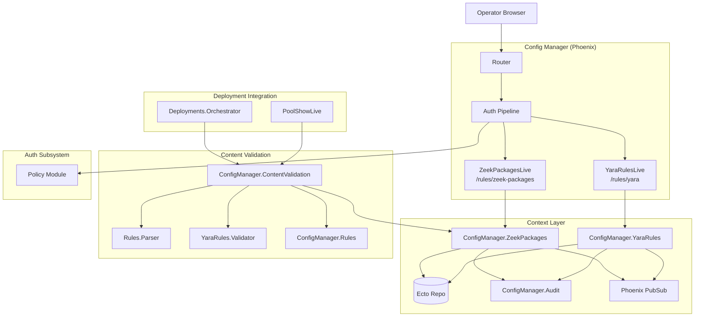
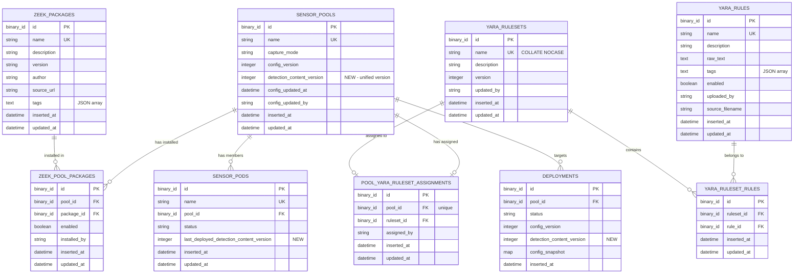

# Design Document: Detection Content Lifecycle Management

## Overview

This design extends the RavenWire Config Manager's detection content management beyond Suricata rules to cover all three detection engines in the sensor stack: Suricata rules (already managed by the rule-store-management spec), Zeek packages (installed and managed per pool via the Zeek Package Manager), and YARA rules (uploaded and assigned to sensor pools for Strelka file analysis). It adds unified content versioning across all three engines so operators can track which detection content version is deployed to each pool, and content validation before deployment to catch errors before they reach production sensors.

The implementation introduces new database tables for Zeek package registry entries, pool-scoped Zeek package state, YARA rules, and YARA rulesets. New fields are added to `sensor_pools` (`detection_content_version`), `deployments` (`detection_content_version`), and `sensor_pods` (`last_deployed_detection_content_version`). Two new context modules — `ConfigManager.ZeekPackages` and `ConfigManager.YaraRules` — provide the public APIs for Zeek and YARA operations respectively. A `ConfigManager.ContentValidation` module handles pre-deployment validation across all three engines. New LiveView pages at `/rules/zeek-packages` and `/rules/yara` provide management interfaces, with YARA rules and rulesets presented as tabs within the YARA area.

### Key Design Decisions

1. **Separate context modules for Zeek and YARA**: Rather than overloading the existing `ConfigManager.Rules` context (which handles Suricata rules), Zeek package management lives in `ConfigManager.ZeekPackages` and YARA rule management in `ConfigManager.YaraRules`. This keeps each context focused and follows the project's pattern of one context per domain (e.g., `ConfigManager.Enrollment`, `ConfigManager.Pools`).

2. **Zeek package registry as a seeded table**: The Zeek package registry is stored as a local database table (`zeek_packages`) populated from a bundled JSON manifest or manual entry. This avoids runtime dependency on external package registries and gives operators full control over which packages are available. Per-pool installation state is tracked in a separate `zeek_pool_packages` join table.

3. **YARA rule storage as raw text with parsed metadata**: YARA rules are stored as raw rule text in the database. On upload, the system parses rule names, descriptions, and tags from the rule text for display and search. The raw text is preserved exactly as uploaded for deployment. This avoids lossy round-trips through an AST.

4. **One YARA ruleset per pool**: Consistent with the Suricata ruleset assignment model (one ruleset per pool), each pool can have at most one YARA ruleset. This simplifies the deployment model — operators know exactly which detection content a pool runs.

5. **Unified `detection_content_version` incremented by all engines**: A single integer on `sensor_pools` increments whenever any pool-effective detection content changes: Suricata ruleset assignment/version change, Zeek package install/uninstall/toggle, YARA ruleset assignment/version change, or a YARA rule availability change that affects an assigned ruleset. This provides a single number for drift detection across all engines.

6. **Content validation as a separate module**: `ConfigManager.ContentValidation` orchestrates validation across all three engines. It reuses the existing Suricata rule parser from `ConfigManager.Rules.Parser`, adds YARA syntax validation, and verifies Zeek package state consistency. This module is called both by the deployment orchestrator's `validating` phase and by the standalone "Validate Content" button.

7. **`Ecto.Multi` for transactional audit writes**: Every detection content mutation uses `Ecto.Multi` with `Audit.append_multi/2` so the audit entry and data change succeed or fail atomically, consistent with all other Config Manager specs.

8. **PropCheck for property-based testing**: The project already includes `propcheck ~> 1.4`. Property tests validate YARA rule parsing round-trips, detection_content_version increment correctness, content validation consistency, and ruleset composition invariants.

9. **No automatic deployment on content changes**: All Zeek package and YARA rule changes update desired state only. Deploying detection content to sensors remains an explicit operator action through the deployment-tracking workflow. The UI displays clear messaging about this distinction.

10. **Deferred capabilities are explicitly excluded**: Automatic Zeek package updates, YARA compilation/profiling, A/B testing, and dependency resolution are documented as out of scope per Requirement 11.

## Architecture

### System Context




### Request Flow

**Zeek package browse and install:**
1. Browser navigates to `/rules/zeek-packages`
2. Auth pipeline validates session, checks `sensors:view` permission
3. `ZeekPackagesLive.mount/3` calls `ZeekPackages.list_packages/1` with default sort and pagination
4. User selects a pool from the pool selector dropdown
5. `ZeekPackages.list_packages_with_pool_state/2` returns packages annotated with per-pool status (available, installed, enabled, disabled)
6. User clicks "Install" on a package (requires `rules:manage`)
7. `handle_event("install", %{"package_id" => id}, socket)` calls `ZeekPackages.install_package/3`
8. Context creates `zeek_pool_packages` record, increments pool's `detection_content_version`, writes audit entry — all in one `Ecto.Multi` transaction
9. Broadcasts `{:zeek_package_installed, pool_id, package_id}` to `"zeek_packages:#{pool_id}"`
10. No automatic deployment — UI displays notice

**YARA rule upload:**
1. User navigates to `/rules/yara` (requires `sensors:view`)
2. User clicks "Upload" (requires `rules:manage`), selects `.yar`/`.yara` file(s)
3. `handle_event("upload", params, socket)` calls `YaraRules.upload_rules/3`
4. Context reads file content, calls `YaraRules.Validator.validate_syntax/1` for syntax validation
5. If validation fails: returns `{:error, validation_errors}`, LiveView displays errors
6. If validation passes: parses rule names/metadata, inserts `yara_rules` records, writes audit entry
7. Broadcasts `{:yara_rules_uploaded, count}` to `"yara_rules"`

**YARA ruleset assignment to pool:**
1. User opens the "Rulesets" tab on `/rules/yara` and clicks "Assign to Pool" (requires `rules:manage`)
2. Selects target pool from dropdown
3. `handle_event("assign_pool", %{"pool_id" => id, "ruleset_id" => ruleset_id}, socket)` calls `YaraRules.assign_ruleset_to_pool/3`
4. Context validates ruleset contains only enabled rules, replaces any existing YARA ruleset assignment for the pool, increments pool's `detection_content_version`, writes audit entry
5. Broadcasts assignment change to relevant PubSub topics

**YARA rule availability change:**
1. User toggles or deletes a YARA rule on `/rules/yara` (requires `rules:manage`)
2. `YaraRules.toggle_rule/2` or `YaraRules.delete_rule/2` updates the global rule state
3. If the rule belongs to any YARA ruleset assigned to a pool, the context updates affected ruleset membership/version as needed, increments each affected pool's `detection_content_version`, and writes audit details listing affected pools
4. The UI displays that affected pools have saved detection-content changes pending deployment

**Suricata ruleset integration:**
1. Existing Suricata ruleset assignment/update flows in `ConfigManager.Rules` call a shared version helper when the pool-effective Suricata ruleset changes
2. The helper increments `sensor_pools.detection_content_version` in the same transaction as the Suricata mutation
3. Deployment snapshots include both the Suricata ruleset version and unified `detection_content_version`

**Content validation (standalone):**
1. User on pool detail page clicks "Validate Content" (requires `sensors:view`)
2. `handle_event("validate_content", _, socket)` calls `ContentValidation.validate_pool/1`
3. Validator checks: Suricata rules syntax, YARA rules syntax, Zeek package state consistency
4. Returns `{:ok, results}` with per-engine validation status
5. LiveView displays validation results inline
6. If all pass: writes audit entry with action `content_validation_passed`
7. If any fail: writes audit entry with action `content_validation_failed` with error details

**Content validation (deployment integration):**
1. Deployment orchestrator enters `validating` phase
2. Calls `ContentValidation.validate_pool/1` for the target pool
3. If validation fails: transitions deployment to `failed` with validation error details
4. If validation passes: proceeds to `deploying` phase

### Module Layout

```
lib/config_manager/
├── zeek_packages.ex                       # Zeek packages context (public API)
├── zeek_packages/
│   ├── zeek_package.ex                    # Ecto schema — registry entry
│   ├── zeek_pool_package.ex               # Ecto schema — per-pool state
├── yara_rules.ex                          # YARA rules context (public API)
├── yara_rules/
│   ├── yara_rule.ex                       # Ecto schema — individual rule
│   ├── yara_ruleset.ex                    # Ecto schema — named collection
│   ├── yara_ruleset_rule.ex               # Ecto schema — ruleset membership
│   ├── pool_yara_ruleset_assignment.ex    # Ecto schema — pool assignment
│   ├── validator.ex                       # YARA syntax validation
├── content_validation.ex                  # Cross-engine validation orchestrator

lib/config_manager_web/
├── live/
│   ├── rules_live/
│   │   ├── zeek_packages_live.ex          # /rules/zeek-packages
│   │   └── yara_rules_live.ex             # /rules/yara, with rules and rulesets tabs
│   ├── pool_live/
│   │   └── show_live.ex                   # Updated: detection content summary, Validate Content button
├── router.ex                              # Extended with new routes

priv/repo/migrations/
├── YYYYMMDDHHMMSS_create_zeek_packages.exs
├── YYYYMMDDHHMMSS_create_yara_rules_tables.exs
├── YYYYMMDDHHMMSS_add_detection_content_version.exs
```

## Components and Interfaces

### 1. `ConfigManager.ZeekPackages` — Zeek Packages Context Module

The public API for all Zeek package operations.

```elixir
defmodule ConfigManager.ZeekPackages do
  @moduledoc "Zeek package management context — registry, per-pool install/enable/disable."

  alias ConfigManager.{Repo, SensorPool, Audit}
  alias ConfigManager.ZeekPackages.{ZeekPackage, ZeekPoolPackage}
  alias Ecto.Multi
  import Ecto.Query

  # ── Registry ───────────────────────────────────────────────────────────────

  @doc "Lists all known Zeek packages with search, sort, and pagination."
  def list_packages(opts \\ [])
      :: %{entries: [ZeekPackage.t()], page: integer(), total_pages: integer(), total_count: integer()}

  @doc "Lists packages annotated with per-pool installation state."
  def list_packages_with_pool_state(pool_id, opts \\ [])
      :: %{entries: [%{package: ZeekPackage.t(), pool_state: map() | nil}], page: integer(), total_pages: integer()}

  @doc "Gets a single package by ID."
  def get_package(id) :: ZeekPackage.t() | nil

  @doc "Searches packages by name or description substring match."
  def search_packages(query, opts \\ [])
      :: %{entries: [ZeekPackage.t()], page: integer(), total_pages: integer()}

  # ── Per-Pool State ─────────────────────────────────────────────────────────

  @doc """
  Installs a Zeek package for a pool. Creates zeek_pool_packages record
  with status "installed" and enabled: true. Increments pool's
  detection_content_version. Writes audit entry.
  """
  def install_package(pool, package_id, actor)
      :: {:ok, ZeekPoolPackage.t()} | {:error, :already_installed | Ecto.Changeset.t()}

  @doc """
  Uninstalls a Zeek package from a pool. Removes zeek_pool_packages record.
  Increments pool's detection_content_version. Writes audit entry.
  """
  def uninstall_package(pool, package_id, actor)
      :: {:ok, ZeekPoolPackage.t()} | {:error, :not_installed}

  @doc """
  Toggles a Zeek package's enabled state for a pool.
  Increments pool's detection_content_version. Writes audit entry.
  """
  def toggle_package(pool, package_id, actor)
      :: {:ok, ZeekPoolPackage.t()} | {:error, :not_installed | Ecto.Changeset.t()}

  @doc "Lists installed packages for a pool with their enabled state."
  def list_pool_packages(pool_id)
      :: [%{package: ZeekPackage.t(), enabled: boolean(), installed_at: DateTime.t()}]

  @doc "Returns the count of installed packages for a pool."
  def installed_count(pool_id) :: integer()

  @doc "Returns the count of enabled packages for a pool."
  def enabled_count(pool_id) :: integer()

  @doc """
  Verifies all installed packages for a pool are in a consistent state.
  Used by ContentValidation. Returns :ok or {:error, issues}.
  """
  def verify_pool_packages(pool_id)
      :: :ok | {:error, [String.t()]}
end
```

### 2. `ConfigManager.YaraRules` — YARA Rules Context Module

The public API for all YARA rule and ruleset operations.

```elixir
defmodule ConfigManager.YaraRules do
  @moduledoc "YARA rule management context — upload, browse, rulesets, pool assignment."

  alias ConfigManager.{Repo, SensorPool, Audit}
  alias ConfigManager.YaraRules.{YaraRule, YaraRuleset, YaraRulesetRule, PoolYaraRulesetAssignment, Validator}
  alias Ecto.Multi
  import Ecto.Query

  # ── Rule CRUD ──────────────────────────────────────────────────────────────

  @doc "Lists all YARA rules with search, sort, and pagination."
  def list_rules(opts \\ [])
      :: %{entries: [YaraRule.t()], page: integer(), total_pages: integer(), total_count: integer()}

  @doc "Gets a single YARA rule by ID."
  def get_rule(id) :: YaraRule.t() | nil

  @doc """
  Uploads one or more YARA rule files. For each file:
  1. Validates syntax via Validator.validate_syntax/1
  2. Parses rule names and metadata
  3. Inserts yara_rules records
  4. Writes audit entry with action yara_rule_uploaded

  Returns {:ok, %{uploaded: count}} or {:error, %{file: filename, errors: [...]}}
  """
  def upload_rules(file_entries, actor)
      :: {:ok, %{uploaded: integer()}} | {:error, map()}

  @doc """
  Toggles a YARA rule's global enabled state. If disabling the rule affects
  any assigned YARA rulesets, removes the rule from those rulesets, increments
  affected ruleset versions, increments affected pools' detection_content_version,
  and writes audit details listing affected pools.
  """
  def toggle_rule(rule, actor)
      :: {:ok, %{rule: YaraRule.t(), affected_pools: [SensorPool.t()]}} | {:error, Ecto.Changeset.t()}

  @doc """
  Deletes a YARA rule. Removes it from any rulesets, increments affected ruleset
  versions and affected pools' detection_content_version, and writes audit entry.
  """
  def delete_rule(rule, actor)
      :: {:ok, %{rule: YaraRule.t(), affected_pools: [SensorPool.t()]}} | {:error, term()}

  # ── Ruleset Management ─────────────────────────────────────────────────────

  @doc "Lists all YARA rulesets with rule counts and pool assignment info."
  def list_rulesets()
      :: [%{ruleset: YaraRuleset.t(), rule_count: integer(), assigned_pool: SensorPool.t() | nil}]

  @doc "Gets a YARA ruleset by ID with preloaded rules."
  def get_ruleset(id) :: YaraRuleset.t() | nil

  @doc "Gets a YARA ruleset by ID. Raises if not found."
  def get_ruleset!(id) :: YaraRuleset.t()

  @doc """
  Creates a YARA ruleset from a list of enabled YARA rule IDs.
  Validates all referenced rules are globally enabled.
  Writes audit entry.
  """
  def create_ruleset(attrs, rule_ids, actor)
      :: {:ok, YaraRuleset.t()} | {:error, Ecto.Changeset.t() | :disabled_rules_included}

  @doc """
  Updates a YARA ruleset's name, description, or rule membership.
  Increments version when rule membership changes.
  Validates all referenced rules are globally enabled.
  Writes audit entry.
  """
  def update_ruleset(ruleset, attrs, rule_ids, actor)
      :: {:ok, YaraRuleset.t()} | {:error, Ecto.Changeset.t() | :disabled_rules_included}

  @doc "Deletes a YARA ruleset and its pool assignments. Writes audit entry."
  def delete_ruleset(ruleset, actor)
      :: {:ok, YaraRuleset.t()} | {:error, term()}

  # ── Pool Assignment ────────────────────────────────────────────────────────

  @doc """
  Assigns a YARA ruleset to a pool. Replaces any existing assignment.
  Increments pool's detection_content_version. Writes audit entry.
  """
  def assign_ruleset_to_pool(ruleset, pool, actor)
      :: {:ok, PoolYaraRulesetAssignment.t()} | {:error, term()}

  @doc """
  Removes the YARA ruleset assignment from a pool.
  Increments pool's detection_content_version. Writes audit entry.
  """
  def unassign_ruleset_from_pool(pool, actor)
      :: {:ok, PoolYaraRulesetAssignment.t()} | {:error, :no_assignment}

  @doc "Gets the current YARA ruleset assignment for a pool."
  def pool_assignment(pool_id) :: PoolYaraRulesetAssignment.t() | nil

  @doc "Gets the assigned YARA ruleset for a pool."
  def pool_ruleset(pool_id) :: YaraRuleset.t() | nil

  @doc "Returns the effective YARA rules for a pool's assigned ruleset."
  def effective_rules(pool_id) :: [YaraRule.t()]

  @doc """
  Returns pools whose assigned YARA rulesets include the given rule.
  Used by toggle/delete operations to update pool-effective desired state.
  """
  def affected_pools_for_rule(rule_id) :: [SensorPool.t()]
end
```

### 3. `ConfigManager.ContentValidation` — Cross-Engine Validation

```elixir
defmodule ConfigManager.ContentValidation do
  @moduledoc """
  Orchestrates pre-deployment content validation across all detection engines.
  Called by the deployment orchestrator's validating phase and by the
  standalone "Validate Content" button on the pool detail page.
  """

  alias ConfigManager.{Rules, ZeekPackages, YaraRules, Audit}

  @doc """
  Validates all detection content for a pool.
  Returns a structured result with per-engine validation status.

  Checks:
  - Suricata: rule syntax validation via Rules.Parser
  - YARA: rule syntax validation via YaraRules.Validator
  - Zeek: package state consistency (all referenced packages installed)

  Returns {:ok, results} or {:error, results} where results contains
  per-engine status and any error details.
  """
  def validate_pool(pool_id)
      :: {:ok, %{suricata: :ok | {:error, [map()]},
                 yara: :ok | {:error, [map()]},
                 zeek: :ok | {:error, [map()]}}}
       | {:error, %{suricata: term(), yara: term(), zeek: term()}}

  @doc """
  Validates Suricata rules for a pool's assigned ruleset.
  Reuses the existing Rules.Parser for syntax checking.
  """
  def validate_suricata(pool_id)
      :: :ok | {:error, [%{sid: integer(), message: String.t()}]}

  @doc """
  Validates YARA rules for a pool's assigned YARA ruleset.
  Checks syntax of all rules in the assigned ruleset.
  """
  def validate_yara(pool_id)
      :: :ok | {:error, [%{rule_name: String.t(), message: String.t()}]}

  @doc """
  Validates Zeek package state for a pool.
  Verifies all enabled packages are installed for the pool and still exist
  in the local package registry. Disabled installed packages are retained
  but excluded from generated deployment content.
  """
  def validate_zeek(pool_id)
      :: :ok | {:error, [%{package_name: String.t(), message: String.t()}]}

  @doc """
  Records a content validation result as an audit entry.
  Action is content_validation_passed or content_validation_failed.
  """
  def record_validation_result(pool_id, results, actor)
      :: {:ok, term()}
end
```

### 4. Ecto Schemas

SQLite note: list-like fields such as `tags` are stored as JSON-encoded text and encoded/decoded at context boundaries. LiveViews and public context return values should expose tags as string lists, not raw JSON strings.

#### `ConfigManager.ZeekPackages.ZeekPackage` — Registry Entry

```elixir
defmodule ConfigManager.ZeekPackages.ZeekPackage do
  use Ecto.Schema
  import Ecto.Changeset

  @primary_key {:id, :binary_id, autogenerate: true}

  schema "zeek_packages" do
    field :name, :string
    field :description, :string
    field :version, :string
    field :author, :string
    field :source_url, :string
    field :tags, :string, default: "[]"  # JSON-encoded string list for SQLite

    timestamps()
  end

  def changeset(package, attrs) do
    package
    |> cast(attrs, [:name, :description, :version, :author, :source_url, :tags])
    |> validate_required([:name])
    |> validate_length(:name, min: 1, max: 255)
    |> unique_constraint(:name)
  end
end
```

#### `ConfigManager.ZeekPackages.ZeekPoolPackage` — Per-Pool State

```elixir
defmodule ConfigManager.ZeekPackages.ZeekPoolPackage do
  use Ecto.Schema
  import Ecto.Changeset

  @primary_key {:id, :binary_id, autogenerate: true}
  @foreign_key_type :binary_id

  schema "zeek_pool_packages" do
    field :pool_id, :binary_id
    field :package_id, :binary_id
    field :enabled, :boolean, default: true
    field :installed_by, :string

    belongs_to :pool, ConfigManager.SensorPool, define_field: false
    belongs_to :package, ConfigManager.ZeekPackages.ZeekPackage, define_field: false

    timestamps()
  end

  def changeset(record, attrs) do
    record
    |> cast(attrs, [:pool_id, :package_id, :enabled, :installed_by])
    |> validate_required([:pool_id, :package_id, :installed_by])
    |> unique_constraint([:pool_id, :package_id],
         name: :zeek_pool_packages_pool_id_package_id_index)
    |> foreign_key_constraint(:pool_id)
    |> foreign_key_constraint(:package_id)
  end

  def toggle_changeset(record) do
    change(record, enabled: !record.enabled)
  end
end
```

#### `ConfigManager.YaraRules.YaraRule` — Individual Rule

```elixir
defmodule ConfigManager.YaraRules.YaraRule do
  use Ecto.Schema
  import Ecto.Changeset

  @primary_key {:id, :binary_id, autogenerate: true}

  schema "yara_rules" do
    field :name, :string
    field :description, :string
    field :raw_text, :string
    field :tags, :string, default: "[]"  # JSON-encoded string list for SQLite
    field :enabled, :boolean, default: true
    field :uploaded_by, :string
    field :source_filename, :string

    timestamps()
  end

  def changeset(rule, attrs) do
    rule
    |> cast(attrs, [:name, :description, :raw_text, :tags, :enabled, :uploaded_by, :source_filename])
    |> validate_required([:name, :raw_text, :uploaded_by])
    |> validate_length(:name, min: 1, max: 255)
    |> unique_constraint(:name)
  end

  def toggle_changeset(rule) do
    change(rule, enabled: !rule.enabled)
  end
end
```

#### `ConfigManager.YaraRules.YaraRuleset` — Named Collection

```elixir
defmodule ConfigManager.YaraRules.YaraRuleset do
  use Ecto.Schema
  import Ecto.Changeset

  @primary_key {:id, :binary_id, autogenerate: true}

  @name_format ~r/^[a-zA-Z0-9._-]+$/

  schema "yara_rulesets" do
    field :name, :string
    field :description, :string
    field :version, :integer, default: 1
    field :updated_by, :string

    has_many :ruleset_rules, ConfigManager.YaraRules.YaraRulesetRule
    has_many :rules, through: [:ruleset_rules, :rule]

    timestamps()
  end

  def create_changeset(ruleset, attrs, actor) do
    ruleset
    |> cast(attrs, [:name, :description])
    |> normalize_name()
    |> validate_required([:name])
    |> validate_length(:name, min: 1, max: 255)
    |> validate_format(:name, @name_format,
         message: "must contain only alphanumeric characters, hyphens, underscores, and periods")
    |> unique_constraint(:name, name: :yara_rulesets_name_nocase_index)
    |> put_change(:version, 1)
    |> put_change(:updated_by, actor)
  end

  def update_changeset(ruleset, attrs, actor, membership_changed?) do
    changeset =
      ruleset
      |> cast(attrs, [:name, :description])
      |> normalize_name()
      |> validate_required([:name])
      |> validate_length(:name, min: 1, max: 255)
      |> validate_format(:name, @name_format,
           message: "must contain only alphanumeric characters, hyphens, underscores, and periods")
      |> unique_constraint(:name, name: :yara_rulesets_name_nocase_index)

    if membership_changed? do
      current = get_field(changeset, :version) || 1
      changeset
      |> put_change(:version, current + 1)
      |> put_change(:updated_by, actor)
    else
      changeset
    end
  end

  defp normalize_name(changeset) do
    case get_change(changeset, :name) do
      nil -> changeset
      name -> put_change(changeset, :name, String.trim(name))
    end
  end
end
```

#### `ConfigManager.YaraRules.YaraRulesetRule` — Ruleset Membership

```elixir
defmodule ConfigManager.YaraRules.YaraRulesetRule do
  use Ecto.Schema
  import Ecto.Changeset

  @primary_key {:id, :binary_id, autogenerate: true}
  @foreign_key_type :binary_id

  schema "yara_ruleset_rules" do
    field :ruleset_id, :binary_id
    field :rule_id, :binary_id

    belongs_to :ruleset, ConfigManager.YaraRules.YaraRuleset, define_field: false
    belongs_to :rule, ConfigManager.YaraRules.YaraRule, define_field: false

    timestamps()
  end

  def changeset(record, attrs) do
    record
    |> cast(attrs, [:ruleset_id, :rule_id])
    |> validate_required([:ruleset_id, :rule_id])
    |> unique_constraint([:ruleset_id, :rule_id],
         name: :yara_ruleset_rules_ruleset_id_rule_id_index)
    |> foreign_key_constraint(:ruleset_id)
    |> foreign_key_constraint(:rule_id)
  end
end
```

#### `ConfigManager.YaraRules.PoolYaraRulesetAssignment` — Pool Assignment

```elixir
defmodule ConfigManager.YaraRules.PoolYaraRulesetAssignment do
  use Ecto.Schema
  import Ecto.Changeset

  @primary_key {:id, :binary_id, autogenerate: true}
  @foreign_key_type :binary_id

  schema "pool_yara_ruleset_assignments" do
    field :pool_id, :binary_id
    field :ruleset_id, :binary_id
    field :assigned_by, :string

    belongs_to :pool, ConfigManager.SensorPool, define_field: false
    belongs_to :ruleset, ConfigManager.YaraRules.YaraRuleset, define_field: false

    timestamps()
  end

  def changeset(assignment, attrs) do
    assignment
    |> cast(attrs, [:pool_id, :ruleset_id, :assigned_by])
    |> validate_required([:pool_id, :ruleset_id, :assigned_by])
    |> unique_constraint(:pool_id, name: :pool_yara_ruleset_assignments_pool_id_index)
    |> foreign_key_constraint(:pool_id)
    |> foreign_key_constraint(:ruleset_id)
  end
end
```

### 5. `ConfigManager.YaraRules.Validator` — YARA Syntax Validation

```elixir
defmodule ConfigManager.YaraRules.Validator do
  @moduledoc """
  Validates YARA rule syntax. Uses a configured YARA compiler command or
  library when available, and falls back to structural checks on rule text
  to catch common errors before storage or deployment.
  """

  @doc """
  Validates YARA rule text for syntax correctness.
  Checks:
  - If configured, external YARA compiler accepts the rule file
  - Matching rule blocks (rule name { ... })
  - Valid rule names (alphanumeric + underscore, starting with letter/underscore)
  - Required sections (strings or condition)
  - Balanced braces and parentheses

  Returns :ok or {:error, [%{line: integer(), message: String.t()}]}
  """
  def validate_syntax(rule_text)
      :: :ok | {:error, [%{line: integer(), message: String.t()}]}

  @doc """
  Parses YARA rule text to extract rule names and metadata.
  Returns a list of parsed rule entries.
  """
  def parse_metadata(rule_text)
      :: {:ok, [%{name: String.t(), description: String.t() | nil, tags: [String.t()]}]}
       | {:error, String.t()}

  @doc """
  Validates that a filename has a valid YARA extension (.yar or .yara).
  """
  def valid_extension?(filename) :: boolean()
end
```


### 6. LiveView Modules

#### `RulesLive.ZeekPackagesLive` — Zeek Packages Page (`/rules/zeek-packages`)

```elixir
defmodule ConfigManagerWeb.RulesLive.ZeekPackagesLive do
  use ConfigManagerWeb, :live_view

  # Mount: load pools for selector, load paginated packages, subscribe to "zeek_packages" topic
  # Assigns: packages, pools, selected_pool_id, page, total_pages, search_query,
  #          sort_field (:name default), sort_dir (:asc default), current_user
  # Events:
  #   "select_pool" — change pool context, reload package states
  #   "search" — filter packages by name/description substring
  #   "sort" — change sort column
  #   "page" — pagination (25 per page default)
  #   "install" — install package for selected pool (rules:manage)
  #   "uninstall" — uninstall package from pool (rules:manage)
  #   "toggle" — enable/disable package for pool (rules:manage)
  # PubSub: {:zeek_package_installed, pool_id, _} etc. — refresh package states
  # RBAC: sensors:view for page; rules:manage for install/uninstall/toggle
  # Empty state: "No matching packages found" when search returns zero results
end
```

#### `RulesLive.YaraRulesLive` — YARA Rules and Rulesets Page (`/rules/yara`)

```elixir
defmodule ConfigManagerWeb.RulesLive.YaraRulesLive do
  use ConfigManagerWeb, :live_view

  # Mount: load paginated YARA rules and rulesets, subscribe to "yara_rules" and "yara_rulesets" topics
  # Assigns: active_tab (:rules or :rulesets), rules, rulesets, selected_ruleset,
  #          pools, page, total_pages, search_query, current_user, upload_errors
  # Events:
  #   "tab" — switch between rules and rulesets
  #   "search" — filter rules by name/tags
  #   "page" — pagination
  #   "upload" — handle file upload (rules:manage), supports .yar/.yara
  #   "bulk_upload" — handle multiple file upload (rules:manage)
  #   "toggle" — enable/disable rule (rules:manage)
  #   "delete" — delete rule with confirmation (rules:manage)
  #   "create_ruleset" — create YARA ruleset from enabled rules (rules:manage)
  #   "update_ruleset" — update ruleset metadata or membership (rules:manage)
  #   "delete_ruleset" — delete ruleset with confirmation (rules:manage)
  #   "assign_pool" — assign ruleset to pool (rules:manage)
  #   "unassign_pool" — remove pool assignment (rules:manage)
  # PubSub: {:yara_rules_uploaded, _} — refresh list
  # RBAC: sensors:view for page; rules:manage for upload/toggle/delete and ruleset actions
  # Upload: uses Phoenix.LiveView.Upload for file handling
end
```

### 7. Router Changes

New detection content routes added to the authenticated scope:

```elixir
# Inside the authenticated scope, after existing rule store routes:
live "/rules/zeek-packages", RulesLive.ZeekPackagesLive, :index,
  private: %{required_permission: "sensors:view"}
live "/rules/yara", RulesLive.YaraRulesLive, :index,
  private: %{required_permission: "sensors:view"}
```

Permission mapping:

| Route | Permission |
|-------|-----------|
| `/rules/zeek-packages` | `sensors:view` (write actions check `rules:manage` in `handle_event`) |
| `/rules/yara` | `sensors:view` (rule and ruleset write actions check `rules:manage` in `handle_event`) |

### 8. PubSub Topics and Messages

| Topic | Message | Triggered By |
|-------|---------|-------------|
| `"zeek_packages:#{pool_id}"` | `{:zeek_package_installed, pool_id, package_id}` | `ZeekPackages.install_package/3` |
| `"zeek_packages:#{pool_id}"` | `{:zeek_package_uninstalled, pool_id, package_id}` | `ZeekPackages.uninstall_package/3` |
| `"zeek_packages:#{pool_id}"` | `{:zeek_package_toggled, pool_id, package_id, enabled}` | `ZeekPackages.toggle_package/3` |
| `"yara_rules"` | `{:yara_rules_uploaded, count}` | `YaraRules.upload_rules/3` |
| `"yara_rules"` | `{:yara_rule_toggled, rule_id, enabled}` | `YaraRules.toggle_rule/2` |
| `"yara_rules"` | `{:yara_rule_deleted, rule_id}` | `YaraRules.delete_rule/2` |
| `"yara_rulesets"` | `{:yara_ruleset_created, ruleset}` | `YaraRules.create_ruleset/3` |
| `"yara_rulesets"` | `{:yara_ruleset_updated, ruleset}` | `YaraRules.update_ruleset/4` |
| `"yara_rulesets"` | `{:yara_ruleset_deleted, ruleset_id}` | `YaraRules.delete_ruleset/2` |
| `"pool:#{pool_id}"` | `{:yara_ruleset_assigned, pool_id, ruleset_id}` | `YaraRules.assign_ruleset_to_pool/3` |
| `"pool:#{pool_id}"` | `{:yara_ruleset_unassigned, pool_id}` | `YaraRules.unassign_ruleset_from_pool/2` |
| `"pool:#{pool_id}"` | `{:detection_content_version_changed, pool_id, new_version}` | Any pool-effective content mutation |

### 9. Navigation Integration

**Rules navigation section**: The existing "Rules" nav section gains sub-links:
- "Suricata Rules" → `/rules/store` (existing)
- "Zeek Packages" → `/rules/zeek-packages` (new)
- "YARA Rules" → `/rules/yara` (new)

**Pool detail page** (`PoolShowLive`): Updated to display a detection content summary section showing:
- Suricata ruleset name and version (from existing `pool_ruleset_assignments`)
- Zeek packages: count of installed/enabled packages
- YARA ruleset name and version (from `pool_yara_ruleset_assignments`)
- Unified `detection_content_version`
- "Validate Content" button that runs `ContentValidation.validate_pool/1`
- Drift indicator when one or more member sensors have `last_deployed_detection_content_version` that differs from the pool's `detection_content_version`

**Deployment detail page**: Updated to display `detection_content_version` alongside existing config versions.

**Deployment snapshot integration**: The deployment-tracking snapshot builder includes:
- `detection_content_version` from the target pool
- Suricata ruleset identity, version, and compiled rule file summary
- Enabled Zeek packages for the pool with package name, version, and source URL
- Assigned YARA ruleset identity, version, and enabled rule names/checksums

When each Deployment_Result transitions to `success`, the deployment-tracking context updates `sensor_pods.last_deployed_detection_content_version` to the Deployment's `detection_content_version` in the same update that records the deployment result.

### 10. Audit Entry Patterns

| Action | target_type | target_id | Detail Fields |
|--------|------------|-----------|---------------|
| `zeek_package_installed` | `zeek_pool_package` | pool_package.id | `%{package_name, pool_name, pool_id, detection_content_version}` |
| `zeek_package_toggled` | `zeek_pool_package` | pool_package.id | `%{package_name, pool_name, pool_id, enabled, detection_content_version}` |
| `zeek_package_uninstalled` | `zeek_pool_package` | pool_package.id | `%{package_name, pool_name, pool_id, detection_content_version}` |
| `yara_rule_uploaded` | `yara_rule` | rule.id | `%{rule_name, source_filename, tags}` |
| `yara_rule_toggled` | `yara_rule` | rule.id | `%{rule_name, enabled, affected_pool_ids, affected_ruleset_ids}` |
| `yara_rule_deleted` | `yara_rule` | rule.id | `%{rule_name, affected_pool_ids, affected_ruleset_ids}` |
| `yara_ruleset_assigned_to_pool` | `pool_yara_ruleset_assignment` | assignment.id | `%{ruleset_name, pool_name, pool_id, detection_content_version}` |
| `yara_ruleset_unassigned_from_pool` | `pool_yara_ruleset_assignment` | assignment.id | `%{ruleset_name, pool_name, pool_id, detection_content_version}` |
| `content_validation_passed` | `sensor_pool` | pool.id | `%{pool_name, engines_validated: ["suricata", "yara", "zeek"]}` |
| `content_validation_failed` | `sensor_pool` | pool.id | `%{pool_name, errors: %{engine => [error_details]}}` |

## Data Models

### New Tables

#### `zeek_packages` — Zeek Package Registry

```sql
CREATE TABLE zeek_packages (
  id BLOB PRIMARY KEY,
  name TEXT NOT NULL,
  description TEXT,
  version TEXT,
  author TEXT,
  source_url TEXT,
  tags TEXT DEFAULT '[]',  -- JSON array
  inserted_at TEXT NOT NULL,
  updated_at TEXT NOT NULL
);

CREATE UNIQUE INDEX zeek_packages_name_index ON zeek_packages (name);
```

#### `zeek_pool_packages` — Per-Pool Zeek Package State

```sql
CREATE TABLE zeek_pool_packages (
  id BLOB PRIMARY KEY,
  pool_id BLOB NOT NULL REFERENCES sensor_pools(id) ON DELETE CASCADE,
  package_id BLOB NOT NULL REFERENCES zeek_packages(id) ON DELETE CASCADE,
  enabled INTEGER NOT NULL DEFAULT 1,
  installed_by TEXT NOT NULL,
  inserted_at TEXT NOT NULL,
  updated_at TEXT NOT NULL
);

CREATE UNIQUE INDEX zeek_pool_packages_pool_id_package_id_index
  ON zeek_pool_packages (pool_id, package_id);
CREATE INDEX zeek_pool_packages_pool_id_index ON zeek_pool_packages (pool_id);
```

#### `yara_rules` — YARA Rules

```sql
CREATE TABLE yara_rules (
  id BLOB PRIMARY KEY,
  name TEXT NOT NULL,
  description TEXT,
  raw_text TEXT NOT NULL,
  tags TEXT DEFAULT '[]',  -- JSON array
  enabled INTEGER NOT NULL DEFAULT 1,
  uploaded_by TEXT NOT NULL,
  source_filename TEXT,
  inserted_at TEXT NOT NULL,
  updated_at TEXT NOT NULL
);

CREATE UNIQUE INDEX yara_rules_name_index ON yara_rules (name);
```

#### `yara_rulesets` — YARA Rulesets

```sql
CREATE TABLE yara_rulesets (
  id BLOB PRIMARY KEY,
  name TEXT NOT NULL,
  description TEXT,
  version INTEGER NOT NULL DEFAULT 1,
  updated_by TEXT NOT NULL,
  inserted_at TEXT NOT NULL,
  updated_at TEXT NOT NULL
);

CREATE UNIQUE INDEX yara_rulesets_name_nocase_index ON yara_rulesets (name COLLATE NOCASE);
```

#### `yara_ruleset_rules` — Ruleset Membership

```sql
CREATE TABLE yara_ruleset_rules (
  id BLOB PRIMARY KEY,
  ruleset_id BLOB NOT NULL REFERENCES yara_rulesets(id) ON DELETE CASCADE,
  rule_id BLOB NOT NULL REFERENCES yara_rules(id) ON DELETE CASCADE,
  inserted_at TEXT NOT NULL,
  updated_at TEXT NOT NULL
);

CREATE UNIQUE INDEX yara_ruleset_rules_ruleset_id_rule_id_index
  ON yara_ruleset_rules (ruleset_id, rule_id);
CREATE INDEX yara_ruleset_rules_ruleset_id_index ON yara_ruleset_rules (ruleset_id);
```

#### `pool_yara_ruleset_assignments` — Pool YARA Ruleset Assignment

```sql
CREATE TABLE pool_yara_ruleset_assignments (
  id BLOB PRIMARY KEY,
  pool_id BLOB NOT NULL REFERENCES sensor_pools(id) ON DELETE CASCADE,
  ruleset_id BLOB NOT NULL REFERENCES yara_rulesets(id) ON DELETE CASCADE,
  assigned_by TEXT NOT NULL,
  inserted_at TEXT NOT NULL,
  updated_at TEXT NOT NULL
);

CREATE UNIQUE INDEX pool_yara_ruleset_assignments_pool_id_index
  ON pool_yara_ruleset_assignments (pool_id);
```

### Altered Tables

#### `sensor_pools` — Add `detection_content_version`

```sql
ALTER TABLE sensor_pools ADD COLUMN detection_content_version INTEGER NOT NULL DEFAULT 1;
```

#### `deployments` — Add `detection_content_version`

```sql
ALTER TABLE deployments ADD COLUMN detection_content_version INTEGER;
```

> Migration ordering: this alter migration must run after the deployment-tracking migration that creates `deployments`. If deployment tracking is not installed in the current branch yet, keep this column addition in the deployment-tracking migration or gate it in the same feature branch that introduces `deployments`.

#### `sensor_pods` — Add `last_deployed_detection_content_version`

```sql
ALTER TABLE sensor_pods ADD COLUMN last_deployed_detection_content_version INTEGER;
```

### Ecto Migrations

```elixir
defmodule ConfigManager.Repo.Migrations.CreateZeekPackages do
  use Ecto.Migration

  def change do
    create table(:zeek_packages, primary_key: false) do
      add :id, :binary_id, primary_key: true
      add :name, :string, null: false
      add :description, :text
      add :version, :string
      add :author, :string
      add :source_url, :string
      add :tags, :text, default: "[]"

      timestamps()
    end

    create unique_index(:zeek_packages, [:name])

    create table(:zeek_pool_packages, primary_key: false) do
      add :id, :binary_id, primary_key: true
      add :pool_id, references(:sensor_pools, type: :binary_id, on_delete: :delete_all), null: false
      add :package_id, references(:zeek_packages, type: :binary_id, on_delete: :delete_all), null: false
      add :enabled, :boolean, null: false, default: true
      add :installed_by, :string, null: false

      timestamps()
    end

    create unique_index(:zeek_pool_packages, [:pool_id, :package_id])
    create index(:zeek_pool_packages, [:pool_id])
  end
end
```

```elixir
defmodule ConfigManager.Repo.Migrations.CreateYaraRulesTables do
  use Ecto.Migration

  def up do
    create table(:yara_rules, primary_key: false) do
      add :id, :binary_id, primary_key: true
      add :name, :string, null: false
      add :description, :text
      add :raw_text, :text, null: false
      add :tags, :text, default: "[]"
      add :enabled, :boolean, null: false, default: true
      add :uploaded_by, :string, null: false
      add :source_filename, :string

      timestamps()
    end

    create unique_index(:yara_rules, [:name])

    create table(:yara_rulesets, primary_key: false) do
      add :id, :binary_id, primary_key: true
      add :name, :string, null: false
      add :description, :text
      add :version, :integer, null: false, default: 1
      add :updated_by, :string, null: false

      timestamps()
    end

    execute "CREATE UNIQUE INDEX yara_rulesets_name_nocase_index ON yara_rulesets (name COLLATE NOCASE)"

    create table(:yara_ruleset_rules, primary_key: false) do
      add :id, :binary_id, primary_key: true
      add :ruleset_id, references(:yara_rulesets, type: :binary_id, on_delete: :delete_all), null: false
      add :rule_id, references(:yara_rules, type: :binary_id, on_delete: :delete_all), null: false

      timestamps()
    end

    create unique_index(:yara_ruleset_rules, [:ruleset_id, :rule_id])
    create index(:yara_ruleset_rules, [:ruleset_id])

    create table(:pool_yara_ruleset_assignments, primary_key: false) do
      add :id, :binary_id, primary_key: true
      add :pool_id, references(:sensor_pools, type: :binary_id, on_delete: :delete_all), null: false
      add :ruleset_id, references(:yara_rulesets, type: :binary_id, on_delete: :delete_all), null: false
      add :assigned_by, :string, null: false

      timestamps()
    end

    create unique_index(:pool_yara_ruleset_assignments, [:pool_id])
  end

  def down do
    drop table(:pool_yara_ruleset_assignments)
    drop table(:yara_ruleset_rules)
    execute "DROP INDEX IF EXISTS yara_rulesets_name_nocase_index"
    drop table(:yara_rulesets)
    drop table(:yara_rules)
  end
end
```

```elixir
defmodule ConfigManager.Repo.Migrations.AddDetectionContentVersion do
  use Ecto.Migration

  def change do
    alter table(:sensor_pools) do
      add :detection_content_version, :integer, null: false, default: 1
    end

    alter table(:sensor_pods) do
      add :last_deployed_detection_content_version, :integer
    end

    # The deployments table is created by the deployment-tracking spec migration.
    # This migration adds the detection_content_version column to it.
    alter table(:deployments) do
      add :detection_content_version, :integer
    end
  end
end
```

### Entity Relationship Diagram




## Correctness Properties

*A property is a characteristic or behavior that should hold true across all valid executions of a system — essentially, a formal statement about what the system should do. Properties serve as the bridge between human-readable specifications and machine-verifiable correctness guarantees.*

### Property 1: Zeek package install/uninstall round-trip preserves pool isolation

*For any* Sensor_Pool and any Zeek_Package, installing the package for the pool SHALL create a `zeek_pool_packages` record with `enabled: true` and the correct `pool_id` and `package_id`. Subsequently uninstalling that same package SHALL remove the record. Throughout this round-trip, the package state for any other pool SHALL remain unchanged.

**Validates: Requirements 2.1, 2.3, 2.4**

### Property 2: Zeek package toggle is self-inverse

*For any* installed Zeek_Package in any pool, toggling the enabled state twice SHALL return the package to its original enabled state. A single toggle SHALL flip the `enabled` field from `true` to `false` or from `false` to `true`.

**Validates: Requirements 2.2**

### Property 3: Zeek package search returns only matching results

*For any* search query string and any set of Zeek packages in the registry, every package returned by the search SHALL contain the query as a case-insensitive substring of either its name or its description. No package whose name and description both lack the query substring SHALL appear in the results.

**Validates: Requirements 1.4**

### Property 4: YARA rule upload preserves raw text

*For any* valid YARA rule text, uploading the rule and then retrieving it SHALL return `raw_text` that is byte-identical to the original upload content. The parsed `name` field SHALL match the rule name extracted from the rule block header.

**Validates: Requirements 3.3**

### Property 5: YARA syntax validation accepts valid rules and rejects invalid rules

*For any* well-formed YARA rule text (containing a valid rule block with `rule name { condition: ... }`), the validator SHALL return `:ok`. *For any* YARA text with unbalanced braces, missing `condition` section, or invalid rule name characters, the validator SHALL return `{:error, errors}` with at least one error entry.

**Validates: Requirements 3.4, 3.5**

### Property 6: YARA ruleset composition includes only enabled rules

*For any* YARA_Ruleset, all member YARA_Rules SHALL have `enabled: true` at the time of creation, update, or assignment. Attempting to create or update a ruleset to include any rule with `enabled: false` SHALL fail with `:disabled_rules_included`. If an enabled rule is later disabled or deleted, assigned rulesets containing that rule SHALL be updated or invalidated in the same transaction, affected ruleset versions SHALL increment, affected pool `detection_content_version` values SHALL increment, and `YaraRules.effective_rules/1` SHALL continue returning only enabled rules.

**Validates: Requirements 4.1, 10.5**

### Property 7: At most one YARA ruleset per pool

*For any* Sensor_Pool, assigning a YARA_Ruleset SHALL replace any previously assigned ruleset. After assignment, querying `YaraRules.pool_assignment/1` SHALL return exactly one assignment record. The `pool_yara_ruleset_assignments` table SHALL contain at most one row per `pool_id`.

**Validates: Requirements 4.2**

### Property 8: Unified detection_content_version increments on any content change

*For any* Sensor_Pool, performing any of the following operations SHALL increment the pool's `detection_content_version` by exactly 1: installing a Zeek package, uninstalling a Zeek package, toggling a Zeek package's enabled state, assigning a YARA ruleset, unassigning a YARA ruleset, or changing YARA rule availability in a way that changes the pool's assigned effective ruleset. The version SHALL be a monotonically increasing positive integer starting from 1. Operations that do not change pool-effective detection content (e.g., pool metadata edits or uploading an unassigned YARA rule) SHALL NOT change `detection_content_version`.

**Validates: Requirements 2.7, 4.3, 4.6, 5.1**

### Property 9: Detection content drift detection correctness

*For any* Sensor_Pod assigned to a Sensor_Pool, drift is detected if and only if the sensor's `last_deployed_detection_content_version` differs from the pool's current `detection_content_version`. When a Deployment_Result transitions to `success`, the sensor's `last_deployed_detection_content_version` SHALL equal the Deployment's `detection_content_version`. A sensor with `last_deployed_detection_content_version` equal to `nil` SHALL be classified as `:never_deployed`.

**Validates: Requirements 5.3, 5.4, 5.6**

### Property 10: Audit entries are complete and transactional

*For any* detection content mutation (Zeek install/uninstall/toggle, YARA upload/toggle/delete, YARA ruleset assign/unassign, content validation), the corresponding Audit_Entry SHALL contain non-nil values for `actor`, `actor_type`, `action`, `target_type`, `target_id`, `result`, and `detail`. If the mutation transaction is rolled back, no Audit_Entry SHALL exist for that operation. If the mutation succeeds, exactly one Audit_Entry with the correct action name SHALL exist.

**Validates: Requirements 8.1, 8.2, 8.3**

### Property 11: Content validation catches inconsistent Zeek package states

*For any* Sensor_Pool, if all installed Zeek packages for the pool exist in the `zeek_packages` registry and have valid `zeek_pool_packages` records, then `ContentValidation.validate_zeek/1` SHALL return `:ok`. If any referenced package is missing from the registry (e.g., deleted after installation), the validator SHALL return `{:error, issues}` listing the inconsistent packages.

**Validates: Requirements 6.4**

## Error Handling

### Upload Errors

- **Invalid YARA file extension**: Files without `.yar` or `.yara` extension are rejected with a clear error message before any parsing is attempted.
- **YARA syntax validation failure**: The validator returns structured errors with line numbers and messages. The LiveView displays these inline next to the upload form. The upload is fully rejected — no partial storage of valid rules from a multi-rule file that contains errors.
- **Duplicate YARA rule name**: If an uploaded rule has the same name as an existing rule, the upload is rejected with a uniqueness error. Operators must delete the existing rule first or use a different name.
- **Bulk upload partial failure**: If any file in a bulk upload fails validation, the entire batch is rejected. This prevents partial state where some rules from a batch are stored and others are not.
- **Disabling or deleting assigned YARA rules**: If a rule belongs to assigned rulesets, the operation updates affected rulesets and pool versions transactionally and displays the affected pools before confirmation.

### Zeek Package Errors

- **Install already-installed package**: Returns `{:error, :already_installed}`. The UI disables the Install button for packages already installed in the selected pool.
- **Uninstall not-installed package**: Returns `{:error, :not_installed}`. The UI only shows Uninstall for installed packages.
- **Toggle not-installed package**: Returns `{:error, :not_installed}`. The UI only shows toggle for installed packages.

### Content Validation Errors

- **Suricata validation failure**: Returns per-rule errors with SID and error message. The deployment transitions to `failed` with these details in the `failure_reason`.
- **YARA validation failure**: Returns per-rule errors with rule name and error message.
- **Zeek validation failure**: Returns per-package errors listing inconsistent packages.
- **Multiple engine failures**: All engines are validated independently. The result contains errors from all failing engines, not just the first failure.

### RBAC Errors

- **Unauthorized write attempt**: The RBAC gate denies the action, the LiveView displays an error flash ("You don't have permission to perform this action"), and an audit entry with action `permission_denied` is recorded. The page state is not modified.

### Database Errors

- **Foreign key violation on pool deletion**: When a pool is deleted, `zeek_pool_packages` and `pool_yara_ruleset_assignments` records are cascade-deleted (ON DELETE CASCADE). No orphaned records remain.
- **Transaction failure**: All mutations use `Ecto.Multi`. If any step fails, the entire transaction rolls back including the audit entry. The LiveView receives the error and displays it.

## Testing Strategy

### Property-Based Tests (PropCheck)

The project uses `propcheck ~> 1.4` for property-based testing. Each correctness property maps to one or more property-based tests with a minimum of 100 iterations.

**Test configuration:**
- Library: PropCheck (already in project dependencies)
- Minimum iterations: 100 per property
- Tag format: `# Feature: detection-content-lifecycle, Property N: <title>`

**Property test plan:**

| Property | Test Module | Generator Strategy |
|----------|------------|-------------------|
| P1: Zeek install/uninstall round-trip | `ZeekPackagesPropertyTest` | Generate random package names, pool IDs, actor strings |
| P2: Zeek toggle self-inverse | `ZeekPackagesPropertyTest` | Generate random installed packages with random initial enabled state |
| P3: Zeek search correctness | `ZeekPackagesPropertyTest` | Generate random package lists with random names/descriptions, random search queries |
| P4: YARA upload preserves raw text | `YaraRulesPropertyTest` | Generate random valid YARA rule text with varying names, tags, conditions |
| P5: YARA validation correctness | `YaraRulesPropertyTest` | Generate both valid and structurally invalid YARA rule text |
| P6: YARA ruleset enabled-only | `YaraRulesPropertyTest` | Generate random rule sets with mixed enabled/disabled states |
| P7: One YARA ruleset per pool | `YaraRulesPropertyTest` | Generate random sequences of ruleset assignments to the same pool |
| P8: Unified version increment | `ContentVersionPropertyTest` | Generate random sequences of content operations across all engines |
| P9: Drift detection | `ContentVersionPropertyTest` | Generate random pools with sensors at various deployed versions |
| P10: Audit completeness | `AuditPropertyTest` | Generate random detection content operations, verify audit entries |
| P11: Zeek validation consistency | `ContentValidationPropertyTest` | Generate random pool package states with some inconsistencies |

### Unit Tests (ExUnit)

Unit tests cover specific examples, edge cases, and integration points:

- **YARA Validator**: Specific valid/invalid rule examples, edge cases (empty file, single rule, nested braces, comments, imports)
- **Zeek package search**: Empty query returns all, special characters in query, case-insensitive matching
- **RBAC enforcement**: Each write action with and without `rules:manage` permission
- **Audit entry structure**: Verify JSON detail fields for each of the 10 action types
- **Navigation**: Verify sub-links appear in Rules section
- **Pool detail page**: Verify detection content summary section renders correctly
- **Pagination**: Verify default page size of 25, boundary conditions
- **Empty states**: Verify empty state messages for zero results

### Integration Tests

- **Deployment with content validation**: End-to-end test of deployment creation → validation phase → success/failure
- **Content validation standalone**: "Validate Content" button triggers validation without creating deployment
- **Cross-engine version tracking**: Suricata ruleset change + Zeek package change + YARA ruleset change all increment `detection_content_version`
- **Cascade deletion**: Pool deletion cascades to `zeek_pool_packages` and `pool_yara_ruleset_assignments`
- **Deployment success updates sensor version**: Full deployment flow updates `last_deployed_detection_content_version`
