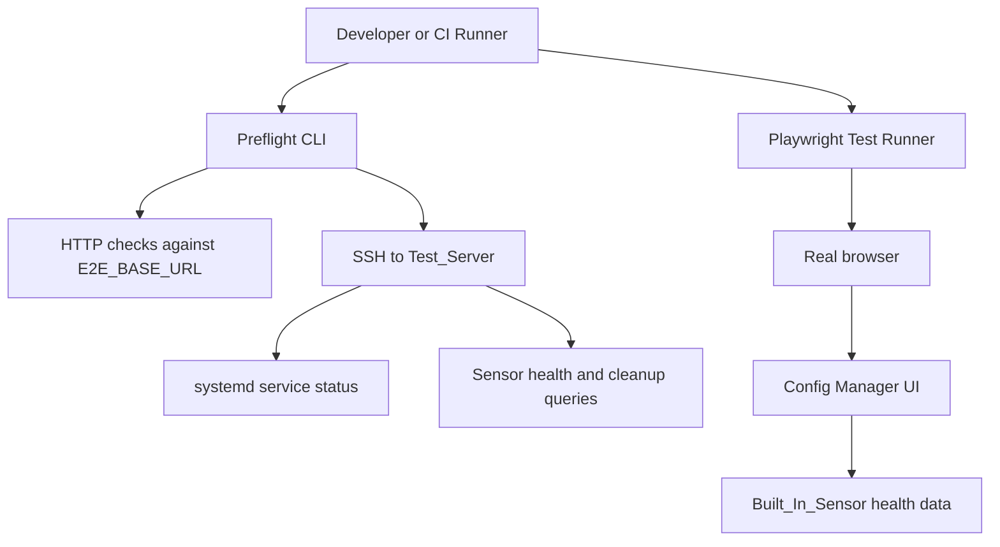

# Design Document: End-to-End Browser Test Suite

## Overview

This design adds a Playwright-based browser regression suite for RavenWire. The suite runs from a developer workstation or CI runner against a deployed Test_Server, performs SSH-assisted preflight checks, logs into the real Config Manager UI, verifies Phoenix LiveView connectivity, exercises critical operator workflows, and records artifacts for failed runs.

The suite is intentionally external to Phoenix LiveView unit tests. LiveView tests remain valuable for server-rendered behavior, but they do not prove that deployed JavaScript assets, websocket connectivity, browser form handling, reverse-proxy behavior, service health, and real sensor reporting all work together.

### Key Design Decisions

1. **Use Playwright for browser automation**: Playwright provides reliable browser control, traces, screenshots, videos, console collection, and CI support. It can test Chromium first and later expand to Firefox/WebKit if needed.

2. **Run against a deployed server by default**: The suite targets `E2E_BASE_URL` rather than starting a local Phoenix server. This catches deployment and packaging regressions, including missing static assets.

3. **Separate preflight from browser tests**: Preflight checks server reachability, static assets, service state, and sensor health before browser assertions. This makes environment failures explicit.

4. **Require LiveView connection assertions**: Every LiveView workflow test checks that the LiveView client is loaded and connected before submitting forms. This directly protects against the `/pools/new` plain POST regression.

5. **Use isolated `e2e-` records**: Tests create unique records and clean up only those records. Cleanup can use UI flows first, public APIs when available, and SSH/database cleanup only behind an explicit opt-in.

6. **Tag tests by profile**: Smoke tests cover login, dashboard, assets, LiveView connectivity, and pool creation. Full tests cover all implemented workflows.

## Architecture



## Proposed File Layout

```text
e2e/
+-- package.json
+-- playwright.config.ts
+-- README.md
+-- tests/
|   +-- smoke.spec.ts
|   +-- dashboard.spec.ts
|   +-- pools.spec.ts
|   +-- bpf.spec.ts
|   +-- rules.spec.ts
|   +-- deployments.spec.ts
+-- support/
|   +-- env.ts
|   +-- auth.ts
|   +-- live-view.ts
|   +-- preflight.ts
|   +-- ssh.ts
|   +-- cleanup.ts
|   +-- test-data.ts
+-- test-results/
```

The `test-results/` directory is ignored by git. If the project later prefers colocating JavaScript tooling under `config-manager/assets`, the same structure can move there, but a top-level `e2e/` directory keeps deployed-environment tests separate from app asset builds.

## Configuration

The suite reads configuration from environment variables:

```text
E2E_BASE_URL=http://172.16.10.38:4000
E2E_ADMIN_USER=<required>
E2E_ADMIN_PASSWORD=<required>
E2E_SSH_USER=eric
E2E_SSH_HOST=172.16.10.38
E2E_PROFILE=smoke|full
E2E_ALLOW_DB_CLEANUP=false
E2E_SENSOR_NAME=sensor-01
```

Secrets are never committed. A local `.env.e2e.example` may document variable names with placeholder values only.

## Preflight Design

`support/preflight.ts` performs checks before the browser suite:

1. `GET /login` returns a successful HTML response.
2. Static asset checks confirm `app.js`, `phoenix.min.js`, and `phoenix_live_view.min.js` are served.
3. SSH checks confirm required services are active:
   - `config-manager.service`
   - `sensor-agent.service`
   - `pcap-ring-writer.service`
   - `zeek.service`
   - `suricata.service`
   - `vector.service`
4. Sensor health check confirms the expected sensor is enrolled and recently seen.
5. Results are written to the test report and exposed to tests as metadata.

If SSH is unavailable but HTTP checks pass, local smoke tests may run only when explicitly requested with a documented override. The default full suite requires SSH preflight.

## Browser Test Design

### Authentication Helper

`support/auth.ts` logs in through `/login`, waits for the authenticated landing page, and stores the browser context state for reuse across tests. It does not bypass the UI with direct cookie injection unless a future authenticated API is added.

### LiveView Helper

`support/live-view.ts` provides:

```typescript
await expectLiveViewConnected(page)
await expectNoUnexpectedConsoleErrors(page)
await expectNoPlainPostNavigation(page, action)
```

`expectLiveViewConnected` checks that `window.liveSocket` exists and reports an active connection on LiveView pages. Form workflow tests call it before submit actions.

### Test Data Helper

`support/test-data.ts` creates unique names:

```text
e2e-<profile>-<timestamp>-<short-random>
```

`support/cleanup.ts` records created resources and removes only tracked `e2e-` records. Cleanup order is child resources first, then parent resources.

## Smoke Profile

The smoke profile is the minimum gate for any browser-visible change:

1. Preflight passes.
2. Login succeeds.
3. Dashboard shows the built-in sensor and does not show the disconnected empty state.
4. LiveView assets are loaded and the LiveView socket is connected.
5. Pool creation at `/pools/new` succeeds without a plain POST failure.
6. The test-created pool is cleaned up.

## Full Profile

The full profile includes the smoke profile plus all implemented workflows:

1. Pool list, create, detail, edit, assignment views, and cleanup.
2. Sensor dashboard and sensor detail pages.
3. Vector forwarding schema mode, file sink CRUD/toggle/delete, audit events, sensor detail summary, and read-only role behavior.
4. BPF editor create/open, rule add, validate, save, pending deployment indicator, reset, and cleanup.
5. Rule store workflows once implemented.
6. Deployment tracking and drift workflows once implemented.
7. PCAP search/retrieval and support bundle workflows once implemented.
8. RBAC checks for read-only and write-capable users when test users exist.

Not-yet-implemented workflow tests are committed as skipped tests with clear references to the owning spec requirement.

## Artifacts

Playwright is configured to collect:

- Screenshot on failure.
- Trace on first retry or on failure.
- Video on failure when enabled by environment.
- Console logs.
- Failed network requests.
- A JSON summary containing the Test_Server, profile, preflight status, browser, and failed test names.

Artifacts are stored under `e2e/test-results/` or `test-results/e2e/`, whichever is selected during implementation, and ignored by git.

## Safety

The suite does not store secrets in repository files. Trace redaction removes authentication headers and cookies when supported. Direct database cleanup is disabled unless `E2E_ALLOW_DB_CLEANUP=true`; when enabled, cleanup only targets tracked `e2e-` records.

## Test Strategy

The E2E suite complements, but does not replace, existing tests:

- Unit tests validate isolated modules.
- Integration and LiveView tests validate Phoenix behavior in the test environment.
- Property tests validate parser, validator, and expression-generation invariants.
- Browser E2E tests validate deployed behavior in a real browser against the real Test_Server.

The full regression command runs all applicable layers before a feature is marked complete.
