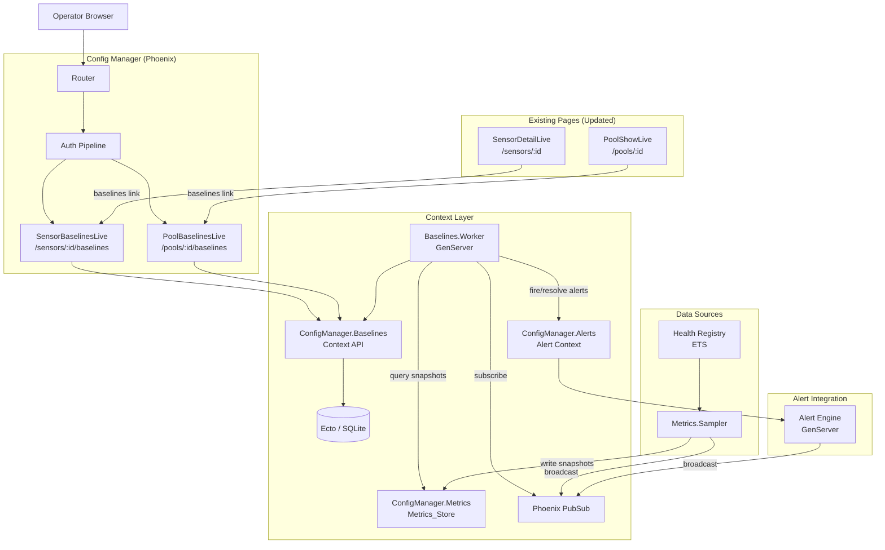
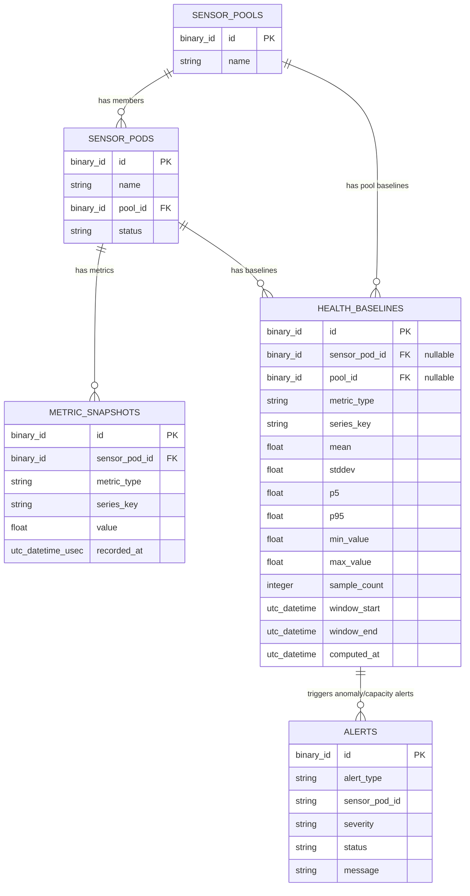

# Design Document: Health Baselines and Capacity Warnings

## Overview

This design adds statistical health baselines, anomaly detection, and capacity forecasting to the RavenWire Config Manager. The existing historical-metrics spec persists time-series metric snapshots and the platform-alert-center spec provides threshold-based alerting — but both use static thresholds that cannot distinguish normal variance from genuine anomalies. This feature bridges that gap by computing per-sensor and per-pool statistical profiles from historical data, detecting deviations using sigma-based analysis, and projecting capacity exhaustion using linear regression.

The implementation introduces five new modules and one new database table:

1. **`ConfigManager.Baselines`** — The Ecto-backed context module providing the public API for baseline CRUD, anomaly evaluation, and capacity forecasting. All LiveView modules and the Baseline Worker call through this context.

2. **`ConfigManager.Baselines.HealthBaseline`** — Ecto schema for the `health_baselines` table storing computed statistical profiles (mean, stddev, percentiles, min, max, sample count, time window).

3. **`ConfigManager.Baselines.Worker`** — A supervised GenServer that periodically recomputes baselines, evaluates incoming metrics against baselines for anomaly detection, computes capacity forecasts, and integrates with the Alert Engine for firing/auto-resolving `baseline_anomaly` and `capacity_warning` alerts.

4. **`ConfigManagerWeb.BaselinesLive.SensorBaselinesLive`** — A LiveView at `/sensors/:id/baselines` displaying per-sensor baseline summary cards, anomaly indicators, and capacity warnings with real-time updates.

5. **`ConfigManagerWeb.BaselinesLive.PoolBaselinesLive`** — A LiveView at `/pools/:id/baselines` displaying pool-level aggregate baselines, per-sensor deviation comparisons, and outlier identification.

### Key Design Decisions

1. **Single Worker GenServer for baselines, anomaly detection, and forecasting**: Rather than separate GenServers for each concern, a single `Baselines.Worker` handles periodic baseline recomputation, anomaly evaluation on each metrics update, and capacity forecast recomputation. This keeps coordination simple — the worker subscribes to `"sensor_metrics:*"` updates via a wildcard-style approach (subscribing per-sensor as they appear) and runs periodic timers for recomputation and forecasting. The three concerns share state (cached baselines, cooldown tracking, forecast results).

2. **Baselines computed from Metrics_Store queries, not raw ETS**: The worker queries `ConfigManager.Metrics.list_snapshots/4` for the baseline window rather than reading raw HealthReports from the Health Registry. This ensures baselines are computed from the same persisted, deduplicated, rate-computed data that the charts display, avoiding discrepancies between what operators see and what anomaly detection uses.

3. **Pure computation functions for testability**: All statistical computation (mean, stddev, percentiles, anomaly scoring, linear regression, forecast projection) is implemented as pure functions in the `Baselines` context module. The Worker orchestrates scheduling and I/O; the context owns the math. This makes property-based testing straightforward.

4. **Cooldown tracking in Worker state, not DB**: Anomaly alert cooldowns (default 15 minutes) are tracked in the Worker's GenServer state as a map of `{sensor_pod_id, metric_type} => last_alert_at`. This avoids DB queries on every metric evaluation. The cooldown map is rebuilt from recent alerts on Worker startup.

5. **Linear regression for capacity forecasting**: Capacity forecasts use ordinary least squares (OLS) linear regression on the most recent 6 hours of metric snapshots. This is simple, interpretable, and sufficient for detecting steady resource consumption trends. The slope and intercept are used to project the metric value at the forecast horizon (default 24 hours). Non-linear trends and seasonal patterns are explicitly deferred (Requirement 9).

6. **Alert Engine integration via existing `Alerts.fire_alert/1` and `Alerts.auto_resolve_alert/1`**: The Worker calls the existing Alert context functions rather than bypassing them. This ensures deduplication, audit logging, and PubSub broadcasting all work identically to other alert types. New alert types `baseline_anomaly` and `capacity_warning` are registered as additional Alert Rules with default seeds.

7. **Reuse existing navigation patterns**: The baselines pages follow the same patterns as the existing metrics pages — tab-based navigation on sensor/pool detail pages, `sensors:view` permission, PubSub subscriptions for real-time updates, and 404 handling for missing entities.

8. **PropCheck for property-based testing**: The project already includes `propcheck ~> 1.4`. Property tests will validate statistical computations, anomaly detection logic, capacity forecasting, and alert integration.

9. **Exclusion window for baseline computation**: The most recent 10 minutes of data are excluded from baseline computation to prevent transient spikes from contaminating the statistical profile. This is implemented as a simple timestamp filter in the query.

10. **Zero-stddev handling**: When a metric has zero standard deviation (constant value), the anomaly score is defined as 0 when the current value equals the mean, and anomalous only when the absolute difference exceeds a configurable minimum delta per metric type. This avoids division-by-zero while still detecting meaningful deviations from constant baselines.


## Architecture

### System Context



### Request Flow

**Baseline recomputation (periodic, default every 1 hour):**
1. Worker receives `:recompute_baselines` timer message
2. Queries all enrolled sensor pods from DB
3. For each sensor and each metric type:
   a. Queries `Metrics.list_snapshots/4` for the baseline window (default 48h), excluding the most recent 10 minutes
   b. If sample count < minimum (4 hours of data at 1-minute intervals ≈ 240 samples), skips this metric
   c. Computes statistical profile: mean, stddev, p5, p95, min, max, sample_count
   d. Upserts the `health_baselines` row for `(sensor_pod_id, metric_type, series_key)`
4. For each pool with ≥ 2 sensors having sufficient data:
   a. Combines all member sensor snapshots for each metric type
   b. Computes aggregate statistical profile
   c. Upserts the `health_baselines` row for `(pool_id, metric_type, series_key)`
5. Caches computed baselines in Worker state for fast anomaly evaluation
6. Broadcasts `{:baselines_updated}` on `"baselines"` PubSub topic
7. Schedules next recomputation timer

**Anomaly detection (on each metrics update):**
1. Worker receives `{:metrics_updated, sensor_pod_id}` from Metrics Sampler PubSub
2. Reads latest metric snapshots for the sensor from Metrics_Store
3. For each metric with a cached baseline:
   a. Computes anomaly score: `abs(value - mean) / stddev` (or uses min_delta logic for zero-stddev)
   b. If score exceeds configured sigma threshold (default 3.0) or value outside p5/p95:
      - Checks cooldown map for `{sensor_pod_id, metric_type}`
      - If not in cooldown → fires `baseline_anomaly` alert via `Alerts.fire_alert/1`
      - Updates cooldown map with current timestamp
   c. If previously anomalous and now within range → auto-resolves via `Alerts.auto_resolve_alert/1`
4. Broadcasts `{:anomaly_status, sensor_pod_id, anomaly_map}` on `"baselines:sensor:#{sensor_pod_id}"` topic

**Capacity forecasting (periodic, default every 15 minutes):**
1. Worker receives `:recompute_forecasts` timer message
2. For each sensor and each capacity metric (disk, CPU, memory, drops):
   a. Queries last 6 hours of snapshots from Metrics_Store
   b. If sample count < minimum (default 12), skips
   c. Runs OLS linear regression to get slope and intercept
   d. Projects value at forecast horizon (default 24h from now)
   e. If projected value exceeds critical threshold → fires `capacity_warning` alert
   f. If previously warned and projection no longer exceeds threshold → auto-resolves
3. Caches forecast results in Worker state
4. Broadcasts `{:forecasts_updated, sensor_pod_id}` on `"baselines:sensor:#{sensor_pod_id}"` topic
5. Schedules next forecast timer

**Sensor baselines page load:**
1. Browser navigates to `/sensors/:id/baselines`
2. Auth pipeline validates session, checks `sensors:view` permission
3. `SensorBaselinesLive.mount/3` loads the SensorPod from DB
4. Queries `Baselines.list_baselines_for_sensor/1` for all metric baselines
5. Queries current metric values from Health Registry or latest snapshots
6. Computes current anomaly scores for display
7. Queries active capacity forecasts from Worker state (via `Baselines.get_forecasts/1`)
8. Subscribes to `"baselines:sensor:#{sensor_pod_id}"` and `"sensor_metrics:#{sensor_pod_id}"` for real-time updates
9. Renders summary cards per metric type

**Pool baselines page load:**
1. Browser navigates to `/pools/:id/baselines`
2. Auth pipeline validates session, checks `sensors:view` permission
3. `PoolBaselinesLive.mount/3` loads the pool and member sensors
4. Queries `Baselines.list_baselines_for_pool/1` for pool-level baselines
5. Queries per-sensor baselines for deviation comparison
6. Computes outlier identification (sensors deviating from pool baseline)
7. Subscribes to `"baselines:pool:#{pool_id}"` for real-time updates
8. Renders aggregate baselines and per-sensor comparison table

### Module Layout

```
lib/config_manager/
├── baselines.ex                                    # Baselines context (public API)
├── baselines/
│   ├── health_baseline.ex                          # Ecto schema
│   ├── worker.ex                                   # GenServer: recompute, anomaly, forecast
│   └── statistics.ex                               # Pure statistical functions

lib/config_manager_web/
├── live/
│   ├── baselines_live/
│   │   ├── sensor_baselines_live.ex                # /sensors/:id/baselines
│   │   └── pool_baselines_live.ex                  # /pools/:id/baselines
├── router.ex                                       # Extended with baselines routes

priv/repo/migrations/
├── YYYYMMDDHHMMSS_create_health_baselines.exs      # New migration
├── YYYYMMDDHHMMSS_add_baseline_alert_rules.exs     # Seed baseline alert rules
```


## Components and Interfaces

### 1. `ConfigManager.Baselines.HealthBaseline` — Ecto Schema

```elixir
defmodule ConfigManager.Baselines.HealthBaseline do
  @moduledoc """
  Ecto schema for a computed health baseline statistical profile.

  Each row represents the statistical summary of a metric's normal operating
  range for a specific sensor or pool, computed from historical metric snapshots.
  """

  use Ecto.Schema
  import Ecto.Changeset

  @primary_key {:id, :binary_id, autogenerate: true}
  @foreign_key_type :binary_id

  schema "health_baselines" do
    field :sensor_pod_id, :binary_id    # Set for per-sensor baselines, NULL for pool baselines
    field :pool_id, :binary_id          # Set for pool baselines, NULL for per-sensor baselines
    field :metric_type, :string
    field :series_key, :string, default: "default"
    field :mean, :float
    field :stddev, :float
    field :p5, :float                   # 5th percentile
    field :p95, :float                  # 95th percentile
    field :min_value, :float
    field :max_value, :float
    field :sample_count, :integer
    field :window_start, :utc_datetime
    field :window_end, :utc_datetime
    field :computed_at, :utc_datetime

    timestamps()
  end

  def changeset(baseline, attrs) do
    baseline
    |> cast(attrs, [
      :sensor_pod_id, :pool_id, :metric_type, :series_key,
      :mean, :stddev, :p5, :p95, :min_value, :max_value,
      :sample_count, :window_start, :window_end, :computed_at
    ])
    |> validate_required([
      :metric_type, :mean, :stddev, :p5, :p95, :min_value, :max_value,
      :sample_count, :window_start, :window_end, :computed_at
    ])
    |> validate_number(:sample_count, greater_than: 0)
    |> validate_number(:stddev, greater_than_or_equal_to: 0)
    |> validate_scope()
    |> unique_constraint([:sensor_pod_id, :metric_type, :series_key],
         name: :health_baselines_sensor_unique_index)
    |> unique_constraint([:pool_id, :metric_type, :series_key],
         name: :health_baselines_pool_unique_index)
  end

  # Exactly one of sensor_pod_id or pool_id must be set
  defp validate_scope(changeset) do
    sensor_id = get_field(changeset, :sensor_pod_id)
    pool_id = get_field(changeset, :pool_id)

    case {sensor_id, pool_id} do
      {nil, nil} -> add_error(changeset, :sensor_pod_id, "either sensor_pod_id or pool_id must be set")
      {_, nil} -> changeset
      {nil, _} -> changeset
      {_, _} -> add_error(changeset, :pool_id, "cannot set both sensor_pod_id and pool_id")
    end
  end
end
```

### 2. `ConfigManager.Baselines.Statistics` — Pure Statistical Functions

```elixir
defmodule ConfigManager.Baselines.Statistics do
  @moduledoc """
  Pure statistical computation functions for baseline analysis.
  No side effects, no DB access — designed for property-based testing.
  """

  @doc """
  Computes a statistical profile from a list of numeric values.
  Returns a map with :mean, :stddev, :p5, :p95, :min_value, :max_value, :sample_count.
  Returns {:error, :insufficient_data} if fewer than the minimum samples.
  """
  @spec compute_profile([number()], pos_integer()) ::
    {:ok, %{mean: float(), stddev: float(), p5: float(), p95: float(),
            min_value: float(), max_value: float(), sample_count: pos_integer()}}
    | {:error, :insufficient_data}
  def compute_profile(values, min_samples \\ 240)

  @doc """
  Computes the anomaly score for a value against a baseline.
  Returns the number of standard deviations from the mean.
  Handles zero-stddev case using min_delta.
  """
  @spec anomaly_score(number(), float(), float(), float()) :: float()
  def anomaly_score(value, mean, stddev, min_delta \\ 0.0)

  @doc """
  Determines if a value is anomalous given a baseline and sigma threshold.
  Returns {:anomaly, score} or :normal.
  """
  @spec classify(number(), %{mean: float(), stddev: float(), p5: float(), p95: float()},
                 float(), float()) :: {:anomaly, float()} | :normal
  def classify(value, baseline, sigma_threshold \\ 3.0, min_delta \\ 0.0)

  @doc """
  Computes OLS linear regression on a list of {timestamp_unix, value} pairs.
  Returns {:ok, %{slope: float(), intercept: float(), r_squared: float()}}
  or {:error, :insufficient_data}.
  """
  @spec linear_regression([{number(), number()}], pos_integer()) ::
    {:ok, %{slope: float(), intercept: float(), r_squared: float()}}
    | {:error, :insufficient_data}
  def linear_regression(points, min_points \\ 12)

  @doc """
  Projects a value at a future timestamp using regression parameters.
  Returns the projected value.
  """
  @spec project(float(), float(), number()) :: float()
  def project(slope, intercept, future_timestamp)

  @doc """
  Computes the timestamp at which the projected value will reach a threshold.
  Returns {:ok, unix_timestamp} or {:error, :no_breach} if the trend doesn't
  reach the threshold within the horizon, or {:error, :flat_trend} if slope ≈ 0.
  """
  @spec time_to_threshold(float(), float(), float(), number()) ::
    {:ok, number()} | {:error, :no_breach | :flat_trend}
  def time_to_threshold(slope, intercept, threshold, horizon_end_timestamp)

  @doc """
  Computes the percentile value from a sorted list of numbers.
  Uses linear interpolation between nearest ranks.
  """
  @spec percentile([number()], float()) :: float()
  def percentile(sorted_values, p) when p >= 0 and p <= 100
end
```

### 3. `ConfigManager.Baselines` — Context Module

```elixir
defmodule ConfigManager.Baselines do
  @moduledoc """
  Baselines context — compute, store, query health baselines and capacity forecasts.
  """

  alias ConfigManager.{Repo, Metrics}
  alias ConfigManager.Baselines.{HealthBaseline, Statistics}
  import Ecto.Query

  # ── Baseline CRUD ──────────────────────────────────────────────────────────

  @doc "Upserts a health baseline for a sensor+metric+series_key combination."
  @spec upsert_baseline(map()) :: {:ok, HealthBaseline.t()} | {:error, Ecto.Changeset.t()}
  def upsert_baseline(attrs)

  @doc "Returns all baselines for a sensor, ordered by metric_type."
  @spec list_baselines_for_sensor(binary()) :: [HealthBaseline.t()]
  def list_baselines_for_sensor(sensor_pod_id)

  @doc "Returns the pool-level baselines for a pool, ordered by metric_type."
  @spec list_baselines_for_pool(binary()) :: [HealthBaseline.t()]
  def list_baselines_for_pool(pool_id)

  @doc "Returns a single baseline for a sensor+metric+series_key."
  @spec get_baseline(binary(), String.t(), String.t()) :: HealthBaseline.t() | nil
  def get_baseline(sensor_pod_id, metric_type, series_key \\ "default")

  @doc "Returns a single pool baseline for a pool+metric+series_key."
  @spec get_pool_baseline(binary(), String.t(), String.t()) :: HealthBaseline.t() | nil
  def get_pool_baseline(pool_id, metric_type, series_key \\ "default")

  @doc "Deletes all baselines for a sensor (used when sensor is removed)."
  @spec delete_baselines_for_sensor(binary()) :: {non_neg_integer(), nil}
  def delete_baselines_for_sensor(sensor_pod_id)

  # ── Baseline Computation ───────────────────────────────────────────────────

  @doc """
  Computes a baseline for a sensor+metric from historical snapshots.
  Queries the Metrics_Store for the baseline window, excludes the most recent
  10 minutes, and computes the statistical profile.
  Returns {:ok, profile_map} or {:error, :insufficient_data}.
  """
  @spec compute_sensor_baseline(binary(), String.t(), String.t(), keyword()) ::
    {:ok, map()} | {:error, :insufficient_data}
  def compute_sensor_baseline(sensor_pod_id, metric_type, series_key \\ "default", opts \\ [])

  @doc """
  Computes a pool-level baseline by combining snapshots from all member sensors.
  Requires at least 2 sensors with sufficient data.
  Returns {:ok, profile_map} or {:error, :insufficient_sensors | :insufficient_data}.
  """
  @spec compute_pool_baseline(binary(), String.t(), String.t(), keyword()) ::
    {:ok, map()} | {:error, :insufficient_sensors | :insufficient_data}
  def compute_pool_baseline(pool_id, metric_type, series_key \\ "default", opts \\ [])

  # ── Anomaly Detection ──────────────────────────────────────────────────────

  @doc """
  Evaluates a metric value against a baseline.
  Returns {:anomaly, score, details} or :normal.
  """
  @spec evaluate_anomaly(number(), HealthBaseline.t(), keyword()) ::
    {:anomaly, float(), map()} | :normal
  def evaluate_anomaly(value, baseline, opts \\ [])

  # ── Capacity Forecasting ───────────────────────────────────────────────────

  @doc """
  Computes a capacity forecast for a sensor+metric.
  Queries the last 6 hours of snapshots, runs linear regression,
  and projects to the forecast horizon.
  Returns {:ok, forecast_map} or {:error, reason}.
  """
  @spec compute_forecast(binary(), String.t(), String.t(), keyword()) ::
    {:ok, map()} | {:error, atom()}
  def compute_forecast(sensor_pod_id, metric_type, series_key \\ "default", opts \\ [])

  @doc "Returns the critical threshold for a capacity metric type."
  @spec capacity_threshold(String.t()) :: float() | nil
  def capacity_threshold(metric_type)

  # ── Configuration ──────────────────────────────────────────────────────────

  @doc "Returns the configured baseline window in hours (default 48)."
  def baseline_window_hours, do: config(:baseline_window_hours, 48)

  @doc "Returns the configured anomaly sigma threshold (default 3.0)."
  def default_sigma, do: config(:anomaly_default_sigma, 3.0)

  @doc "Returns the configured anomaly cooldown in minutes (default 15)."
  def cooldown_minutes, do: config(:anomaly_cooldown_minutes, 15)

  @doc "Returns the configured forecast horizon in hours (default 24)."
  def forecast_horizon_hours, do: config(:capacity_forecast_horizon_hours, 24)

  defp config(key, default) do
    value = Application.get_env(:config_manager, key, default)
    if valid_config?(key, value), do: value, else: log_and_default(key, value, default)
  end
end
```

### 4. `ConfigManager.Baselines.Worker` — GenServer

```elixir
defmodule ConfigManager.Baselines.Worker do
  @moduledoc """
  Supervised GenServer that periodically recomputes baselines, evaluates
  incoming metrics for anomalies, and computes capacity forecasts.

  Configuration (application environment under :config_manager):
    - :baseline_recompute_interval_ms — recomputation interval (default 3_600_000 = 1 hour)
    - :capacity_forecast_interval_ms — forecast interval (default 900_000 = 15 minutes)
    - :anomaly_default_sigma — default sigma threshold (default 3.0)
    - :anomaly_cooldown_minutes — cooldown between repeated alerts (default 15)
    - :baseline_window_hours — historical data window (default 48)
    - :capacity_forecast_horizon_hours — forecast horizon (default 24)
  """

  use GenServer

  alias ConfigManager.{Baselines, Metrics, Alerts}

  # ── State ──
  # %{
  #   baselines: %{{sensor_pod_id, metric_type, series_key} => %HealthBaseline{}},
  #   pool_baselines: %{{pool_id, metric_type, series_key} => %HealthBaseline{}},
  #   cooldowns: %{{sensor_pod_id, metric_type} => DateTime.t()},
  #   forecasts: %{{sensor_pod_id, metric_type} => forecast_map},
  #   active_anomalies: MapSet.t({sensor_pod_id, metric_type}),
  #   active_warnings: MapSet.t({sensor_pod_id, metric_type}),
  #   sensor_subscriptions: MapSet.t(String.t()),
  #   recompute_interval: pos_integer(),
  #   forecast_interval: pos_integer()
  # }

  def start_link(opts \\ [])

  @doc "Returns cached forecasts for a sensor. Called by LiveView."
  def get_forecasts(sensor_pod_id)

  @doc "Returns cached anomaly status for a sensor. Called by LiveView."
  def get_anomaly_status(sensor_pod_id)

  # ── GenServer Callbacks ────────────────────────────────────────────────────

  @impl true
  def init(_opts)
  # 1. Load existing baselines from DB into state cache
  # 2. Rebuild cooldown map from recent baseline_anomaly alerts
  # 3. Rebuild active_anomalies and active_warnings from active alerts
  # 4. Subscribe to "baselines" topic for coordination
  # 5. Subscribe to sensor_metrics topics for all known sensors
  # 6. Schedule first baseline recomputation and forecast computation
  # 7. Run initial baseline computation if none exist

  @impl true
  def handle_info(:recompute_baselines, state)
  # Recompute all sensor and pool baselines
  # Update state cache
  # Broadcast {:baselines_updated}

  @impl true
  def handle_info(:recompute_forecasts, state)
  # Recompute capacity forecasts for all sensors and capacity metrics
  # Fire/auto-resolve capacity_warning alerts as needed
  # Update state cache
  # Broadcast forecast updates

  @impl true
  def handle_info({:metrics_updated, sensor_pod_id}, state)
  # Evaluate latest metrics against cached baselines
  # Fire/auto-resolve baseline_anomaly alerts as needed
  # Respect cooldown periods
  # Broadcast anomaly status updates

  @impl true
  def handle_call({:get_forecasts, sensor_pod_id}, _from, state)
  # Return cached forecasts for the sensor

  @impl true
  def handle_call({:get_anomaly_status, sensor_pod_id}, _from, state)
  # Return current anomaly status for the sensor
end
```

### 5. `ConfigManagerWeb.BaselinesLive.SensorBaselinesLive` — Sensor Baselines Page

```elixir
defmodule ConfigManagerWeb.BaselinesLive.SensorBaselinesLive do
  use ConfigManagerWeb, :live_view

  alias ConfigManager.{Baselines, Metrics, Health.Registry}

  @metric_order ~w(
    packets_received_rate drop_percent cpu_percent memory_bytes
    pcap_disk_used_percent clock_offset_ms
  )

  @impl true
  def mount(%{"id" => id}, _session, socket) do
    # 1. Load SensorPod from DB by UUID
    # 2. If not found → {:ok, assign(socket, :not_found, true)}
    # 3. Load baselines for sensor via Baselines.list_baselines_for_sensor/1
    # 4. Load current metric values from Health Registry or latest snapshots
    # 5. Compute current anomaly scores for each metric
    # 6. Load capacity forecasts via Baselines.Worker.get_forecasts/1
    # 7. Subscribe to "baselines:sensor:#{sensor_pod_id}" and
    #    "sensor_metrics:#{sensor_pod_id}" when connected
    # 8. Assign: pod, baselines, current_values, anomaly_scores, forecasts, metric_order
  end

  @impl true
  def handle_info({:anomaly_status, sensor_pod_id, anomaly_map}, socket)
  # Update anomaly indicators in real time

  @impl true
  def handle_info({:forecasts_updated, sensor_pod_id}, socket)
  # Refresh capacity warning displays

  @impl true
  def handle_info({:metrics_updated, sensor_pod_id}, socket)
  # Update current values and recompute anomaly scores

  @impl true
  def handle_info({:baselines_updated}, socket)
  # Reload baselines from DB
end
```

**Socket assigns:**
- `pod` — `%SensorPod{}` from database
- `baselines` — `%{metric_type => %HealthBaseline{}}` keyed by metric type
- `current_values` — `%{metric_type => number()}` latest metric values
- `anomaly_scores` — `%{metric_type => %{score: float(), status: :normal | :warning | :anomaly}}`
- `forecasts` — `%{metric_type => %{projected: float(), time_to_breach: DateTime.t() | nil, slope: float()}}`
- `metric_order` — ordered list of metric types to display
- `not_found` — boolean for 404 rendering
- `current_user` — assigned by auth on_mount hook

### 6. `ConfigManagerWeb.BaselinesLive.PoolBaselinesLive` — Pool Baselines Page

```elixir
defmodule ConfigManagerWeb.BaselinesLive.PoolBaselinesLive do
  use ConfigManagerWeb, :live_view

  alias ConfigManager.{Baselines, Repo, SensorPod}

  @impl true
  def mount(%{"id" => pool_id}, _session, socket) do
    # 1. Load pool from DB
    # 2. If not found → {:ok, assign(socket, :not_found, true)}
    # 3. Load member sensors
    # 4. Load pool-level baselines via Baselines.list_baselines_for_pool/1
    # 5. Load per-sensor baselines for all members
    # 6. Compute per-sensor deviations from pool baseline
    # 7. Identify outliers (sensors deviating > 2σ from pool mean)
    # 8. Subscribe to "baselines:pool:#{pool_id}" when connected
    # 9. Assign: pool, members, pool_baselines, sensor_baselines, deviations, outliers
  end

  @impl true
  def handle_info({:baselines_updated}, socket)
  # Reload pool and sensor baselines, recompute deviations
end
```

**Socket assigns:**
- `pool` — `%SensorPool{}` from database
- `members` — list of `%SensorPod{}` member sensors
- `pool_baselines` — `%{metric_type => %HealthBaseline{}}` pool-level baselines
- `sensor_baselines` — `%{sensor_pod_id => %{metric_type => %HealthBaseline{}}}` per-sensor
- `deviations` — `%{sensor_pod_id => %{metric_type => %{value: float(), pool_mean: float(), sensor_mean: float(), deviation: float()}}}`
- `outliers` — `MapSet.t(sensor_pod_id)` sensors flagged as outliers
- `not_found` — boolean for 404 rendering
- `current_user` — assigned by auth on_mount hook

### 7. Router Changes

New routes added to the authenticated scope:

```elixir
# Inside the authenticated live_session block:
live "/sensors/:id/baselines", BaselinesLive.SensorBaselinesLive, :show,
  private: %{required_permission: "sensors:view"}

live "/pools/:id/baselines", BaselinesLive.PoolBaselinesLive, :show,
  private: %{required_permission: "sensors:view"}
```

### 8. Alert Rule Seeds for Baseline Alert Types

Two new default alert rules are added alongside the existing 9 rules:

| Alert Type | Description | Threshold | Unit | Severity |
|---|---|---|---|---|
| `baseline_anomaly` | Metric deviates significantly from baseline | 3.0 | sigma | warning |
| `capacity_warning` | Metric trend predicts capacity exhaustion | 24 | hours | warning |

These are seeded by extending the existing `Alerts.seed_default_rules/0` function or via a separate migration seed.

### 9. PubSub Topics

| Topic | Message | Triggered By |
|-------|---------|-------------|
| `"baselines"` | `{:baselines_updated}` | Worker after recomputation |
| `"baselines:sensor:#{sensor_pod_id}"` | `{:anomaly_status, sensor_pod_id, anomaly_map}` | Worker after anomaly evaluation |
| `"baselines:sensor:#{sensor_pod_id}"` | `{:forecasts_updated, sensor_pod_id}` | Worker after forecast recomputation |
| `"baselines:pool:#{pool_id}"` | `{:pool_baselines_updated, pool_id}` | Worker after pool baseline recomputation |

### 10. Application Supervision Tree Extension

```elixir
# In ConfigManager.Application.start/2, add after Metrics.Sampler (or Alert Engine):
children = [
  # ... existing children ...
  ConfigManager.Health.Registry,
  # ConfigManager.Metrics.Sampler,       # (from historical-metrics spec)
  # ConfigManager.Alerts.AlertEngine,    # (from platform-alert-center spec)

  # Baselines Worker — recomputes baselines, detects anomalies, forecasts capacity
  ConfigManager.Baselines.Worker,

  # ... rest of existing children ...
]
```

### 11. Configuration Summary

| Config Key | Default | Description |
|-----------|---------|-------------|
| `:baseline_window_hours` | `48` | Hours of historical data for baseline computation |
| `:baseline_recompute_interval_ms` | `3_600_000` | Baseline recomputation interval (1 hour) |
| `:anomaly_default_sigma` | `3.0` | Default sigma threshold for anomaly detection |
| `:anomaly_cooldown_minutes` | `15` | Cooldown between repeated anomaly alerts |
| `:anomaly_min_delta_by_metric` | `%{}` | Per-metric minimum delta for zero-stddev baselines |
| `:capacity_forecast_horizon_hours` | `24` | Forecast projection horizon |
| `:capacity_forecast_interval_ms` | `900_000` | Forecast recomputation interval (15 minutes) |
| `:capacity_min_forecast_samples` | `12` | Minimum samples required for forecast |

### 12. Capacity Thresholds

| Metric Type | Critical Threshold | Unit |
|------------|-------------------|------|
| `pcap_disk_used_percent` | 95.0 | % |
| `cpu_percent` | 95.0 | % |
| `memory_bytes` | 90% of total | bytes |
| `drop_percent` | 10.0 | % |


## Data Models

### New: `health_baselines` Table

```elixir
defmodule ConfigManager.Repo.Migrations.CreateHealthBaselines do
  use Ecto.Migration

  def change do
    create table(:health_baselines, primary_key: false) do
      add :id, :binary_id, primary_key: true
      add :sensor_pod_id, references(:sensor_pods, type: :binary_id, on_delete: :delete_all),
        null: true
      add :pool_id, references(:sensor_pools, type: :binary_id, on_delete: :delete_all),
        null: true
      add :metric_type, :string, null: false
      add :series_key, :string, null: false, default: "default"
      add :mean, :float, null: false
      add :stddev, :float, null: false
      add :p5, :float, null: false
      add :p95, :float, null: false
      add :min_value, :float, null: false
      add :max_value, :float, null: false
      add :sample_count, :integer, null: false
      add :window_start, :utc_datetime, null: false
      add :window_end, :utc_datetime, null: false
      add :computed_at, :utc_datetime, null: false

      timestamps()
    end

    # Unique index: at most one baseline per sensor+metric+series_key
    create unique_index(:health_baselines, [:sensor_pod_id, :metric_type, :series_key],
      name: :health_baselines_sensor_unique_index,
      where: "sensor_pod_id IS NOT NULL")

    # Unique index: at most one baseline per pool+metric+series_key
    create unique_index(:health_baselines, [:pool_id, :metric_type, :series_key],
      name: :health_baselines_pool_unique_index,
      where: "pool_id IS NOT NULL")

    # Index for querying all baselines for a sensor
    create index(:health_baselines, [:sensor_pod_id])

    # Index for querying all baselines for a pool
    create index(:health_baselines, [:pool_id])
  end
end
```

### Column Details

| Column | Type | Constraints | Description |
|--------|------|-------------|-------------|
| `id` | `binary_id` | PK, autogenerated | Unique row identifier |
| `sensor_pod_id` | `binary_id` | FK → sensor_pods, nullable, on_delete: delete_all | Owning sensor (NULL for pool baselines) |
| `pool_id` | `binary_id` | FK → sensor_pools, nullable, on_delete: delete_all | Owning pool (NULL for sensor baselines) |
| `metric_type` | `string` | NOT NULL | Metric series identifier (matches Metrics_Store types) |
| `series_key` | `string` | NOT NULL, default `"default"` | Series disambiguator (e.g., `container:zeek`) |
| `mean` | `float` | NOT NULL | Arithmetic mean of values in the baseline window |
| `stddev` | `float` | NOT NULL, ≥ 0 | Population standard deviation |
| `p5` | `float` | NOT NULL | 5th percentile value |
| `p95` | `float` | NOT NULL | 95th percentile value |
| `min_value` | `float` | NOT NULL | Minimum observed value in window |
| `max_value` | `float` | NOT NULL | Maximum observed value in window |
| `sample_count` | `integer` | NOT NULL, > 0 | Number of snapshots used in computation |
| `window_start` | `utc_datetime` | NOT NULL | Start of the data window used |
| `window_end` | `utc_datetime` | NOT NULL | End of the data window used (excludes last 10 min) |
| `computed_at` | `utc_datetime` | NOT NULL | Timestamp when this baseline was computed |

### Index Summary

| Index | Columns | Purpose |
|-------|---------|---------|
| Primary key | `id` | Row identity |
| Sensor unique | `(sensor_pod_id, metric_type, series_key)` WHERE sensor_pod_id IS NOT NULL | One baseline per sensor+metric+series |
| Pool unique | `(pool_id, metric_type, series_key)` WHERE pool_id IS NOT NULL | One baseline per pool+metric+series |
| Sensor lookup | `(sensor_pod_id)` | Query all baselines for a sensor |
| Pool lookup | `(pool_id)` | Query all baselines for a pool |

### Entity Relationship Diagram



### Existing Tables (No Changes)

- **`sensor_pods`**: The `health_baselines.sensor_pod_id` FK references this table with `on_delete: :delete_all`. No schema changes needed.
- **`sensor_pools`**: The `health_baselines.pool_id` FK references this table with `on_delete: :delete_all`. No schema changes needed.
- **`metric_snapshots`**: Read-only dependency — baselines are computed from snapshot queries. No schema changes needed.
- **`alerts`**: Two new alert types (`baseline_anomaly`, `capacity_warning`) are added as alert rules. The `alerts` table schema is unchanged; new rows use the existing columns.
- **`alert_rules`**: Two new rows are seeded for the new alert types. The table schema is unchanged.


## Correctness Properties

*A property is a characteristic or behavior that should hold true across all valid executions of a system — essentially, a formal statement about what the system should do. Properties serve as the bridge between human-readable specifications and machine-verifiable correctness guarantees.*

### Property 1: Statistical profile correctness

*For any* list of at least 240 finite float values, `Statistics.compute_profile/2` SHALL return `{:ok, profile}` where `profile.mean` equals the arithmetic mean of the values, `profile.stddev` equals the population standard deviation, `profile.p5` equals the 5th percentile (via linear interpolation), `profile.p95` equals the 95th percentile, `profile.min_value` equals the minimum value, `profile.max_value` equals the maximum value, and `profile.sample_count` equals the length of the input list.

**Validates: Requirements 1.2**

### Property 2: Insufficient data threshold

*For any* list of fewer than the configured minimum samples (default 240), `Statistics.compute_profile/2` SHALL return `{:error, :insufficient_data}`. *For any* list of at least the minimum samples, it SHALL return `{:ok, profile}`.

**Validates: Requirements 1.1, 1.5**

### Property 3: Exclusion window filtering

*For any* set of metric snapshots with timestamps spanning a 48-hour window, baseline computation SHALL exclude snapshots whose `recorded_at` falls within the most recent 10 minutes of the window. The resulting baseline's `sample_count` SHALL equal the count of snapshots outside the exclusion zone, and the `window_end` SHALL be at least 10 minutes before the current time.

**Validates: Requirements 1.6**

### Property 4: Baseline upsert round-trip and uniqueness

*For any* valid baseline attributes, upserting a baseline and reading it back SHALL return a record with identical `mean`, `stddev`, `p5`, `p95`, `min_value`, `max_value`, `sample_count`, `window_start`, `window_end`, and `computed_at` values. *For any* two consecutive upserts with the same `(sensor_pod_id, metric_type, series_key)` key but different statistical values, the table SHALL contain exactly one row for that key, and its values SHALL match the second upsert.

**Validates: Requirements 1.4, 1.7**

### Property 5: Pool aggregate baseline combines all member data

*For any* pool with N ≥ 2 sensors each having sufficient data, the pool-level baseline's `sample_count` SHALL equal the sum of all member sensors' sample counts for that metric. The pool-level `mean` SHALL equal the overall mean of all combined values (not the mean of means). The pool-level `min_value` SHALL be less than or equal to every member sensor's `min_value`, and the pool-level `max_value` SHALL be greater than or equal to every member sensor's `max_value`.

**Validates: Requirements 2.1, 2.2**

### Property 6: Pool minimum sensor threshold

*For any* pool with fewer than 2 sensors having sufficient data for a metric type, `compute_pool_baseline/4` SHALL return `{:error, :insufficient_sensors}`. *For any* pool with 2 or more sensors having sufficient data, it SHALL return `{:ok, profile}`.

**Validates: Requirements 2.5**

### Property 7: Anomaly score computation

*For any* value, mean, and stddev where stddev > 0, `Statistics.anomaly_score/4` SHALL return `abs(value - mean) / stddev`. *For any* value equal to the mean (regardless of stddev), the score SHALL be 0.0.

**Validates: Requirements 3.3**

### Property 8: Anomaly classification with zero-stddev handling

*For any* value, baseline with stddev > 0, and sigma threshold, `Statistics.classify/4` SHALL return `{:anomaly, score}` when `abs(value - mean) / stddev > sigma_threshold` or when the value falls outside `[p5, p95]`, and `:normal` otherwise. *For any* baseline with stddev = 0, classify SHALL return `:normal` when `value == mean`, and `{:anomaly, score}` only when `abs(value - mean) > min_delta`.

**Validates: Requirements 3.2, 3.8**

### Property 9: Cooldown suppression

*For any* sequence of anomalous metric readings for the same `(sensor_pod_id, metric_type)` pair, the Worker SHALL fire at most one `baseline_anomaly` alert within any cooldown window (default 15 minutes). Subsequent anomalous readings within the cooldown period SHALL not produce additional alerts. An anomalous reading after the cooldown period has elapsed SHALL fire a new alert.

**Validates: Requirements 3.6**

### Property 10: Anomaly auto-resolve on return to normal

*For any* sensor with an active `baseline_anomaly` alert for a metric type, when the metric value returns within the baseline range (within sigma threshold and inside [p5, p95]), the Worker SHALL auto-resolve the alert. After auto-resolution, the `active_anomalies` set SHALL no longer contain that `(sensor_pod_id, metric_type)` pair.

**Validates: Requirements 3.7, 7.5**

### Property 11: Linear regression accuracy on known trends

*For any* set of at least 12 points generated from a known linear function `y = slope * x + intercept + noise` where noise is bounded, `Statistics.linear_regression/2` SHALL return a slope within a tolerance of the true slope proportional to the noise magnitude. The projection at a future timestamp SHALL be within a tolerance of the true projected value.

**Validates: Requirements 4.2**

### Property 12: Capacity warning threshold breach detection

*For any* regression result (slope, intercept) and critical threshold, `Statistics.time_to_threshold/4` SHALL return `{:ok, timestamp}` when the projected value at the horizon exceeds the threshold and the slope is positive (for upper thresholds), and `{:error, :no_breach}` when the projection stays below the threshold. The returned timestamp SHALL satisfy `slope * timestamp + intercept ≈ threshold`.

**Validates: Requirements 4.3**

### Property 13: Minimum samples for forecast

*For any* set of fewer than the configured minimum points (default 12), `Statistics.linear_regression/2` SHALL return `{:error, :insufficient_data}`. *For any* set of at least the minimum points, it SHALL return `{:ok, result}`.

**Validates: Requirements 4.9**

### Property 14: Capacity warning auto-resolve

*For any* sensor with an active `capacity_warning` alert for a metric type, when the recomputed forecast no longer predicts a threshold breach within the horizon (trend reversed or flattened), the Worker SHALL auto-resolve the alert. After auto-resolution, the `active_warnings` set SHALL no longer contain that `(sensor_pod_id, metric_type)` pair.

**Validates: Requirements 4.7, 7.5**

### Property 15: Outlier identification from pool baseline

*For any* pool baseline and set of per-sensor current values, a sensor SHALL be identified as an outlier if and only if its current value deviates from the pool baseline mean by more than 2 standard deviations. The set of outliers SHALL be exactly the sensors meeting this criterion.

**Validates: Requirements 6.3**

### Property 16: Configuration validation with fallback

*For any* configuration key and *for any* invalid value (negative numbers for intervals, non-numeric values, nil), the configuration accessor SHALL return the documented default value. *For any* valid value, it SHALL return that value unchanged.

**Validates: Requirements 8.1, 8.3**


## Error Handling

### Worker Errors

| Scenario | Behavior |
|----------|----------|
| Metrics_Store query failure during baseline computation | Log error, skip this sensor/metric, continue with remaining. Do not crash the Worker. |
| Database write failure on baseline upsert | Log error, skip this baseline. Retry on next recomputation cycle. |
| Anomaly evaluation with missing baseline | Skip anomaly check for this metric. No alert fired. |
| Alert Engine fire_alert failure | Log error. Anomaly is still tracked in Worker state for auto-resolve on next cycle. |
| Alert Engine auto_resolve failure | Log error. Retry on next evaluation cycle. Alert remains in active set. |
| PubSub broadcast failure | Log warning. LiveView will catch up on next query or PubSub message. |
| Linear regression with collinear points (all same timestamp) | Return `{:error, :insufficient_data}`. Skip forecast for this metric. |
| Division by zero in anomaly score (stddev = 0) | Use min_delta logic per Requirement 3.8. Never divide by zero. |
| Health Registry unavailable | Log error, skip current metric value lookup. Use latest snapshot from DB as fallback. |
| Sensor deleted during computation | FK cascade deletes baselines. Worker evicts from state on next cycle. |

### Baselines Page Errors

| Scenario | Behavior |
|----------|----------|
| Non-existent sensor ID in `/sensors/:id/baselines` | Render 404 page with "Sensor not found" message |
| Non-existent pool ID in `/pools/:id/baselines` | Render 404 page with "Pool not found" message |
| No baselines computed yet | Render "Baselines are being computed. Check back shortly." message |
| Insufficient data for a metric | Render "Insufficient data for baseline" placeholder for that metric card |
| Insufficient data for forecast | Render "Insufficient data for forecast" in the capacity section |
| Pool with no members | Render "No sensors assigned to this pool" message |
| Pool with < 2 sensors with data | Render "Insufficient sensors for pool baseline" message |
| PubSub subscription failure | Page loads with static data; real-time updates unavailable. Log warning. |

### Configuration Errors

| Scenario | Behavior |
|----------|----------|
| Invalid `baseline_window_hours` (≤ 0) | Fall back to default 48, log warning |
| Invalid `anomaly_default_sigma` (≤ 0) | Fall back to default 3.0, log warning |
| Invalid `anomaly_cooldown_minutes` (< 0) | Fall back to default 15, log warning |
| Invalid `capacity_forecast_horizon_hours` (≤ 0) | Fall back to default 24, log warning |
| Invalid interval milliseconds (≤ 0) | Fall back to respective defaults, log warning |
| Missing Metrics_Store dependency | Worker logs error on startup, retries on first timer. Does not crash supervisor. |

## Testing Strategy

### Dual Testing Approach

This feature uses both unit/example-based tests and property-based tests for comprehensive coverage:

- **Property-based tests (PropCheck)**: Validate universal properties across randomized inputs. Each property test runs a minimum of 100 iterations and references its design document property by number.
- **Unit/example tests (ExUnit)**: Validate specific examples, edge cases, integration points, and UI rendering behavior.

### Property-Based Testing Configuration

- **Library**: PropCheck (`propcheck ~> 1.4`, already in project dependencies)
- **Minimum iterations**: 100 per property test
- **Tag format**: `# Feature: health-baselines, Property N: <property_text>`

### Property Test Plan

| Property | Module Under Test | Generator Strategy |
|----------|------------------|-------------------|
| 1: Statistical profile correctness | `Baselines.Statistics` | Generate lists of 240+ random floats (including negative, zero, large values). Verify mean, stddev, percentiles, min, max against reference implementations. |
| 2: Insufficient data threshold | `Baselines.Statistics` | Generate lists with lengths from 0 to 300. Verify compute_profile returns error below threshold and ok above. |
| 3: Exclusion window filtering | `Baselines.compute_sensor_baseline/4` | Generate snapshot sets with timestamps spanning 48h window including last 10 minutes. Verify excluded snapshots don't affect the result. |
| 4: Baseline upsert round-trip | `Baselines` | Generate random baseline attributes, upsert, read back, verify equality. Upsert twice with same key, verify single row with latest values. |
| 5: Pool aggregate baseline | `Baselines` | Generate 2-5 sensors with random snapshot sets. Verify pool sample_count = sum, pool mean = overall mean, pool min ≤ all sensor mins, pool max ≥ all sensor maxes. |
| 6: Pool minimum sensor threshold | `Baselines` | Generate pools with 0-3 sensors having sufficient data. Verify error for < 2, ok for ≥ 2. |
| 7: Anomaly score computation | `Baselines.Statistics` | Generate random (value, mean, stddev) triples with stddev > 0. Verify formula. |
| 8: Anomaly classification | `Baselines.Statistics` | Generate random (value, baseline, sigma, min_delta) tuples including zero-stddev cases. Verify classification correctness. |
| 9: Cooldown suppression | `Baselines.Worker` (internal) | Generate sequences of anomalous readings with timestamps. Verify alert count respects cooldown. |
| 10: Anomaly auto-resolve | `Baselines.Worker` (internal) | Generate anomaly → normal sequences. Verify auto-resolve fires. |
| 11: Linear regression accuracy | `Baselines.Statistics` | Generate points from known linear functions with bounded noise. Verify slope and projection accuracy. |
| 12: Capacity warning threshold breach | `Baselines.Statistics` | Generate random (slope, intercept, threshold, horizon) tuples. Verify time_to_threshold correctness. |
| 13: Minimum samples for forecast | `Baselines.Statistics` | Generate point sets with lengths from 0 to 20. Verify error below threshold, ok above. |
| 14: Capacity warning auto-resolve | `Baselines.Worker` (internal) | Generate warning → trend-reversal sequences. Verify auto-resolve fires. |
| 15: Outlier identification | `Baselines` | Generate pool baselines and per-sensor values. Verify outlier set matches 2σ criterion. |
| 16: Configuration validation | `Baselines` | Generate random config values (valid and invalid). Verify fallback behavior. |

### Unit/Example Test Plan

| Area | Test Cases |
|------|-----------|
| **Migration** | Table exists, columns have correct types, all indexes present, FK constraints with delete_all, unique constraints reject duplicates |
| **Schema** | HealthBaseline changeset validates required fields, rejects both sensor_pod_id and pool_id set, rejects both nil, validates stddev ≥ 0, validates sample_count > 0 |
| **Alert rule seeds** | Verify baseline_anomaly and capacity_warning rules exist with correct defaults after seeding |
| **Capacity thresholds** | Verify capacity_threshold/1 returns 95.0 for disk, 95.0 for CPU, 10.0 for drops, nil for non-capacity metrics |
| **Per-metric sigma** | Verify classify uses per-metric sigma override when configured |
| **Worker lifecycle** | Starts under supervisor, schedules recomputation and forecast timers at configured intervals |
| **Sensor baselines page** | Renders summary cards for each metric, shows placeholder for insufficient data, handles 404, RBAC enforcement |
| **Pool baselines page** | Renders pool baselines and comparison table, shows empty pool message, handles 404, RBAC enforcement |
| **Navigation** | Baselines link on sensor detail page, baselines link on pool detail page |
| **Real-time updates** | PubSub subscription on mount, anomaly status updates reach LiveView, forecast updates reach LiveView |
| **Deferred capabilities** | No time-of-day profiles, no ML detection, no capacity recommendations, no baseline export |

### Integration Test Plan

| Area | Test Cases |
|------|-----------|
| **FK cascade** | Delete SensorPod, verify all its baselines are deleted. Delete SensorPool, verify pool baselines are deleted. |
| **End-to-end anomaly flow** | Metrics Sampler writes snapshot → Worker evaluates → anomaly detected → alert fired → LiveView updated |
| **End-to-end capacity flow** | Trending metric data → Worker computes forecast → threshold breach predicted → capacity warning fired → LiveView shows time-to-breach |
| **Auto-resolve flow** | Anomaly alert active → metric returns to normal → Worker auto-resolves → LiveView updates |
| **Baseline recomputation** | Worker timer fires → baselines recomputed → DB updated → PubSub broadcast → LiveView refreshes |
| **Alert rules integration** | Disable baseline_anomaly rule → verify no anomaly alerts fired. Re-enable → verify alerts resume. |