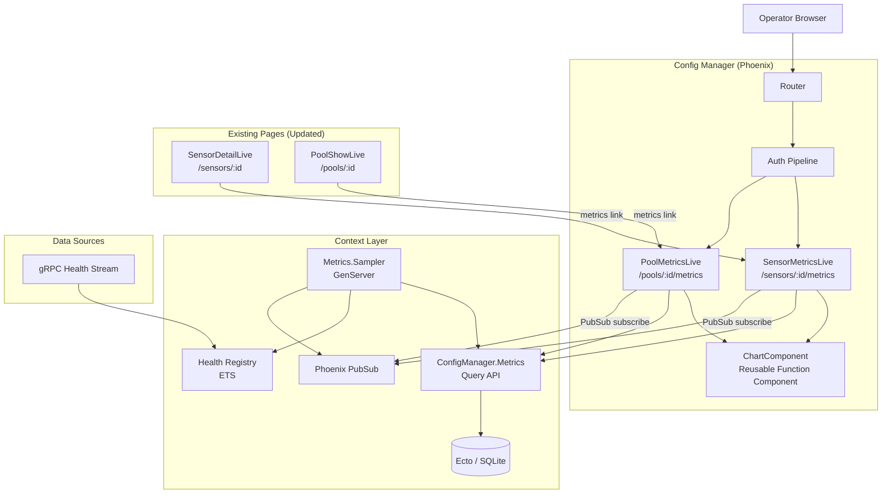
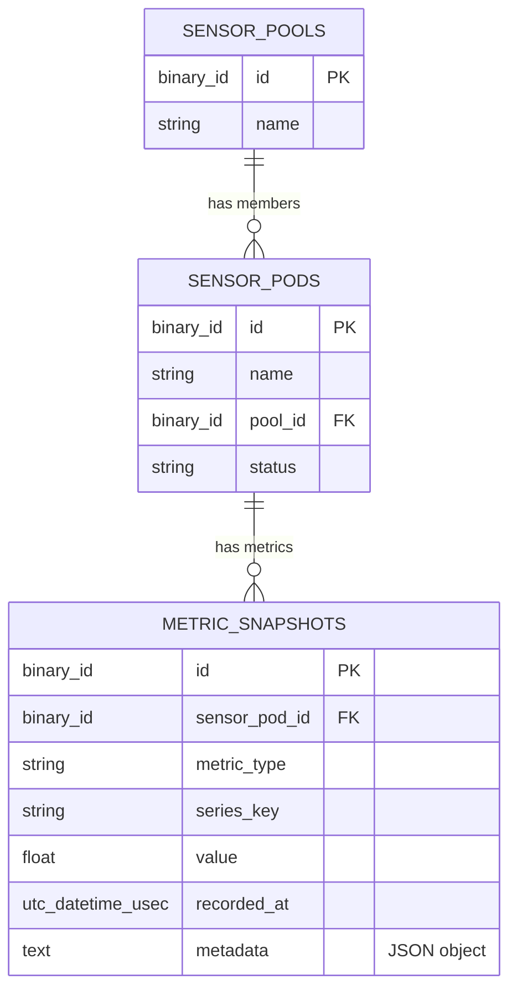

# Design Document: Historical Metrics

## Overview

This design adds historical metrics persistence and time-series charting to the RavenWire Config Manager. The current Health Registry stores only the latest HealthReport per sensor in ETS, providing no visibility into past health state. This feature introduces a SQLite-backed metrics persistence layer that periodically snapshots key health metrics, retains them for a configurable period (minimum 72 hours), prunes older data automatically, and renders interactive time-series charts on new LiveView pages.

The implementation introduces four new modules and one new database table:

1. **`ConfigManager.Metrics`** — The Ecto-backed context module (Metrics_Store) that provides the public API for writing, querying, pruning, and downsampling historical metric snapshots. All LiveView modules call through this context. It owns the `MetricSnapshot` schema and all query logic including time-range validation, bucketing/downsampling, and pool-level aggregation.

2. **`ConfigManager.Metrics.Sampler`** — A supervised GenServer that runs on a configurable interval (default 60 seconds), reads the latest HealthReport from the Health Registry for each known sensor, extracts key metric values, computes rate-based metrics from deltas between consecutive reports, and writes MetricSnapshots to the database via the Metrics_Store. It also runs periodic pruning of expired data. It broadcasts PubSub messages so open chart pages receive updates in real time.

3. **`ConfigManagerWeb.MetricsLive.SensorMetricsLive`** — A LiveView at `/sensors/:id/metrics` that displays per-sensor time-series charts for all defined metric types. It subscribes to PubSub for real-time chart updates and supports time range selection (1h/6h/24h/72h).

4. **`ConfigManagerWeb.MetricsLive.PoolMetricsLive`** — A LiveView at `/pools/:id/metrics` that displays aggregate time-series charts across all sensors in a pool. For pools with more than 10 sensors, it shows min/max/avg summary charts with an option to expand to individual lines. It subscribes to pool membership changes and per-sensor metrics updates.

5. **`ConfigManagerWeb.Components.ChartComponent`** — A reusable function component that renders a single time-series chart using Chart.js via a LiveView JavaScript hook. It handles threshold zones, legends, tooltips, accessible table fallback, and incremental data point appending.

### Key Design Decisions

1. **Dedicated `ConfigManager.Metrics` context module**: All snapshot CRUD, querying, pruning, and downsampling logic lives in a single context module. This follows the project's existing pattern (e.g., `ConfigManager.Enrollment`, `ConfigManager.Pools`) and keeps LiveView modules thin — they call context functions and handle UI concerns only.

2. **Sampler combines sampling and pruning**: Rather than running two separate GenServers, the Sampler handles both periodic snapshot writing and periodic pruning on separate timer intervals. This reduces supervision complexity while keeping the two concerns on independent schedules (default: sample every 60s, prune every 15min).

3. **Rate metrics computed from consecutive HealthReport deltas**: The Sampler tracks the previous HealthReport per sensor in its GenServer state. Rate-based metrics like `packets_received_rate` are computed as `(current_counter - previous_counter) / elapsed_seconds`. Counter resets, non-advancing timestamps, and first-sample conditions are handled by skipping the rate metric for that cycle rather than writing misleading values.

4. **Weighted drop_percent from raw counters when available**: Aggregate `drop_percent` is computed as `sum(dropped) / sum(received + dropped) * 100` when raw packet counters are present. When only per-consumer `drop_percent` values are available (no raw counters), an unweighted average is used and the method is recorded in metadata. This avoids misleading averages when consumers have vastly different traffic volumes.

5. **Chart.js via LiveView hook**: Chart.js is a well-established, lightweight charting library that supports line charts, threshold annotations, tooltips, and incremental updates. The LiveView hook pushes data points to the client without re-rendering the entire chart DOM, which is critical for real-time updates. The hook uses `chart.update()` for appending new points and shifting the time window.

6. **Downsampling via bounded queries and bucketing**: When a query would return more points than the configured chart point limit (default 1000), the Metrics_Store applies simple time-bucket averaging in SQL using integer timestamp buckets. If LTTB (Largest Triangle Three Buckets) is added later, it runs in application code after a bounded query rather than being described as a SQLite operation. This bounds both query cost and rendering cost.

7. **Series_Key for container-level disambiguation**: Per-container metrics (cpu_percent, memory_bytes) use `series_key = "container:<sanitized_name>"` to distinguish lines in the same chart. Single-series metrics use `series_key = "default"`. The unique index on `(sensor_pod_id, metric_type, series_key, recorded_at)` prevents duplicate samples.

8. **Distinct placeholders for unavailable vs. empty data**: Metrics whose data source does not exist in the current HealthReport protobuf (vector_records_per_sec, sink_buffer_used_percent) show "Data source not yet available" with a distinct visual style. Metrics whose source exists but has no recorded data show "No data recorded in the selected time range". This prevents operator confusion about why a chart is empty.

9. **PropCheck for property-based testing**: The project already includes `propcheck ~> 1.4`. Property tests will validate rate computation, drop_percent aggregation, downsampling invariants, time-range query bounds, pruning correctness, and series_key stability.

10. **Debounced pool metrics updates**: The pool metrics page uses `Process.send_after/3` with a configurable debounce window (default 500ms) to coalesce rapid PubSub metrics updates from multiple sensors. This follows the same pattern established by the `PoolPipelineLive` design.

## Architecture

### System Context



### Request Flow

**Sensor metrics page load:**
1. Browser navigates to `/sensors/:id/metrics`
2. Auth pipeline validates session, checks `sensors:view` permission
3. `SensorMetricsLive.mount/3` loads the `SensorPod` from SQLite by ID
4. If not found → render 404 page
5. If found → parse time range from URL query string (default `6h`)
6. Query `Metrics.list_snapshots/4` for each metric type within the time range
7. Query `Metrics.available_metric_types/1` to determine which metrics have data
8. Subscribe to `"sensor_metrics:#{sensor_pod_id}"` when connected
9. Render chart slots: Chart_Component for metrics with data, placeholders for missing/unavailable metrics

**Real-time sensor metrics update:**
1. Sampler writes new snapshots and broadcasts `{:metrics_updated, sensor_pod_id}` to `"sensor_metrics:#{sensor_pod_id}"`
2. `SensorMetricsLive.handle_info/2` receives the message
3. Queries `Metrics.latest_snapshots/3` for each metric type to get new data points for every active series
4. Pushes new points to the client-side Chart.js hooks via `push_event/3`
5. Chart.js hook appends points and shifts the time window

**Pool metrics page load:**
1. Browser navigates to `/pools/:id/metrics`
2. Auth pipeline validates session, checks `sensors:view` permission
3. `PoolMetricsLive.mount/3` loads the pool and its member sensors from SQLite
4. If pool not found → render 404; if zero members → render empty state message
5. Parse time range from URL query string (default `6h`)
6. Query `Metrics.list_snapshots_for_pool/4` for each metric type
7. Subscribe to `"pool:#{pool_id}"` for membership changes and `"sensor_metrics:#{sensor_pod_id}"` for each member
8. Render aggregate charts grouped by sensor and series (individual lines for ≤10 sensors, min/max/avg summary for >10)

**Real-time pool metrics update:**
1. Metrics update arrives for a member sensor via PubSub
2. `PoolMetricsLive.handle_info/2` marks update as pending, schedules debounced re-query via `Process.send_after/3` (default 500ms)
3. When debounce timer fires, queries latest snapshots for affected sensors and active series keys
4. Pushes new points to client-side charts

**Sampler periodic cycle:**
1. GenServer receives `:sample` timer message
2. Reads all health entries from `Registry.list_pods/0`
3. Uses each HealthReport's `sensor_pod_id` as the Health_Key and maps it to a SensorPod database record by matching `SensorPod.name`
4. For each matched sensor, extracts metric values from the HealthReport
5. Computes rate metrics by comparing with previous report stored in GenServer state
6. Writes batch of MetricSnapshots via `Metrics.write_snapshots/1`
7. Broadcasts `{:metrics_updated, sensor_pod_id}` for each sensor that had new snapshots
8. Schedules next `:sample` timer

**Pruner periodic cycle (within Sampler):**
1. GenServer receives `:prune` timer message
2. Computes UTC cutoff = `DateTime.utc_now() - retention_hours`
3. Calls `Metrics.prune_before/2` with cutoff and batch size
4. Logs deleted count at `:info` level
5. Schedules next `:prune` timer

### Module Layout

```
lib/config_manager/
├── metrics.ex                                  # Metrics context (public API)
├── metrics/
│   ├── metric_snapshot.ex                      # Ecto schema
│   └── sampler.ex                              # GenServer: sampling + pruning

lib/config_manager_web/
├── live/
│   ├── metrics_live/
│   │   ├── sensor_metrics_live.ex              # /sensors/:id/metrics
│   │   └── pool_metrics_live.ex                # /pools/:id/metrics
│   ├── components/
│   │   └── chart_component.ex                  # Reusable chart function component
├── router.ex                                   # Extended with metrics routes

assets/js/
├── hooks/
│   └── chart_hook.js                           # Chart.js LiveView hook

priv/repo/migrations/
├── YYYYMMDDHHMMSS_create_metric_snapshots.exs  # New migration
```


## Components and Interfaces

### 1. `ConfigManager.Metrics.MetricSnapshot` — Ecto Schema

```elixir
defmodule ConfigManager.Metrics.MetricSnapshot do
  @moduledoc """
  Ecto schema for a single point-in-time metric sample.

  Each row represents one metric value for one sensor at one timestamp,
  optionally scoped by series_key for per-container disambiguation.
  """

  use Ecto.Schema
  import Ecto.Changeset

  @primary_key {:id, :binary_id, autogenerate: true}
  @foreign_key_type :binary_id

  @valid_metric_types ~w(
    packets_received_rate drop_percent cpu_percent memory_bytes
    pcap_disk_used_percent clock_offset_ms
    vector_records_per_sec sink_buffer_used_percent
  )

  @series_key_format ~r/^\S+$/

  schema "metric_snapshots" do
    field :sensor_pod_id, :binary_id
    field :metric_type, :string
    field :series_key, :string, default: "default"
    field :value, :float
    field :recorded_at, :utc_datetime_usec
    field :metadata, :string
  end

  @doc "Changeset for inserting a new metric snapshot."
  def changeset(snapshot, attrs) do
    snapshot
    |> cast(attrs, [:sensor_pod_id, :metric_type, :series_key, :value, :recorded_at, :metadata])
    |> validate_required([:sensor_pod_id, :metric_type, :value, :recorded_at])
    |> put_default_series_key()
    |> validate_inclusion(:metric_type, @valid_metric_types)
    |> validate_format(:series_key, @series_key_format,
         message: "must be non-empty and contain no whitespace")
    |> validate_finite_value()
    |> validate_metadata_json()
    |> foreign_key_constraint(:sensor_pod_id)
    |> unique_constraint([:sensor_pod_id, :metric_type, :series_key, :recorded_at],
         name: :metric_snapshots_unique_sample_index)
  end

  defp validate_finite_value(changeset) do
    case get_change(changeset, :value) do
      nil -> changeset
      val when is_number(val) -> validate_finite_number(changeset, val)
      _ -> changeset
    end
  end

  defp put_default_series_key(changeset) do
    case get_field(changeset, :series_key) do
      nil -> put_change(changeset, :series_key, "default")
      "" -> put_change(changeset, :series_key, "default")
      _ -> changeset
    end
  end

  defp validate_finite_number(changeset, val) do
    # Implement with the runtime's finite-float predicate or an equivalent guard
    # that rejects NaN and +/-Infinity before values reach SQLite.
    if finite_number?(val), do: changeset, else: add_error(changeset, :value, "must be a finite number")
  end

  defp finite_number?(val), do: is_number(val) and val == val

  defp validate_metadata_json(changeset) do
    case get_change(changeset, :metadata) do
      nil -> changeset
      json_str ->
        case Jason.decode(json_str) do
          {:ok, decoded} when is_map(decoded) -> changeset
          _ -> add_error(changeset, :metadata, "must be a valid JSON object")
        end
    end
  end

  def valid_metric_types, do: @valid_metric_types
end
```

### 2. `ConfigManager.Metrics` — Metrics Context Module

The primary public API for all metrics operations. All LiveView modules and the Sampler call through this context.

```elixir
defmodule ConfigManager.Metrics do
  @moduledoc """
  Metrics context — write, query, prune, and downsample historical metric snapshots.
  """

  alias ConfigManager.{Repo, Metrics.MetricSnapshot}
  import Ecto.Query

  # ── Metric Type Constants ──────────────────────────────────────────────────

  @protobuf_available_types ~w(
    packets_received_rate drop_percent cpu_percent memory_bytes
    pcap_disk_used_percent clock_offset_ms
  )

  @future_types ~w(vector_records_per_sec sink_buffer_used_percent)

  @valid_time_ranges ~w(1h 6h 24h 72h)

  # ── Write API ──────────────────────────────────────────────────────────────

  @doc """
  Inserts a list of MetricSnapshot changesets in a single transaction.
  Validates and sanitizes all rows before insertion, then uses insert_all with
  on_conflict: :nothing to handle duplicate
  (sensor_pod_id, metric_type, series_key, recorded_at) tuples gracefully.
  Returns {:ok, inserted_count}.
  """
  @spec write_snapshots([map()]) :: {:ok, non_neg_integer()} | {:error, term()}
  def write_snapshots(snapshots)

  # ── Query API ──────────────────────────────────────────────────────────────

  @doc """
  Returns MetricSnapshots for a sensor within a time range, ordered by
  recorded_at ascending. Applies downsampling when result count exceeds
  the chart point limit.

  Options:
    - :series_key — filter to a specific series (e.g., "container:zeek")
    - :limit — override chart point limit (default from config)
    - :metadata_filter — map of metadata key/value pairs, e.g. %{container: "zeek"}
    - :downsample — :bucket_avg | :lttb | :none (default :bucket_avg)
  """
  @spec list_snapshots(binary(), String.t(), String.t(), keyword()) :: [MetricSnapshot.t()]
  def list_snapshots(sensor_pod_id, metric_type, time_range, opts \\ [])

  @doc """
  Returns MetricSnapshots for all sensors in a pool within a time range,
  grouped by sensor_pod_id and series_key, ordered by recorded_at ascending
  within each group.

  Options:
    - :series_key — filter to a specific series
    - :metadata_filter — map of metadata key/value pairs, e.g. %{container: "zeek"}
    - :limit — override chart point limit per sensor
  """
  @spec list_snapshots_for_pool(binary(), String.t(), String.t(), keyword()) ::
    %{binary() => %{String.t() => [MetricSnapshot.t()]}}
  def list_snapshots_for_pool(pool_id, metric_type, time_range, opts \\ [])

  @doc """
  Returns the list of MetricTypes for which at least one snapshot exists
  for the given sensor.
  """
  @spec available_metric_types(binary()) :: [String.t()]
  def available_metric_types(sensor_pod_id)

  @doc """
  Returns the most recent MetricSnapshot for a sensor and metric type,
  optionally scoped by series_key. For multi-series charts, use latest_snapshots/3.
  """
  @spec latest_snapshot(binary(), String.t(), keyword()) :: MetricSnapshot.t() | nil
  def latest_snapshot(sensor_pod_id, metric_type, opts \\ [])

  @doc """
  Returns the most recent MetricSnapshot for every series_key for a sensor and
  metric type, keyed by series_key.
  """
  @spec latest_snapshots(binary(), String.t(), keyword()) :: %{String.t() => MetricSnapshot.t()}
  def latest_snapshots(sensor_pod_id, metric_type, opts \\ [])

  # ── Pruning API ────────────────────────────────────────────────────────────

  @doc """
  Deletes snapshots older than cutoff_datetime in batches.
  Returns the total number of deleted rows.
  """
  @spec prune_before(DateTime.t(), pos_integer()) :: {:ok, non_neg_integer()} | {:error, term()}
  def prune_before(cutoff_datetime, batch_size \\ 1000)

  # ── Helpers ────────────────────────────────────────────────────────────────

  @doc """
  Validates a time range string and returns the corresponding
  {start_datetime, end_datetime} tuple. Returns {:error, :invalid_range}
  for unrecognized values.
  """
  @spec parse_time_range(String.t()) :: {:ok, {DateTime.t(), DateTime.t()}} | {:error, :invalid_range}
  def parse_time_range(time_range)

  @doc """
  Returns true if the metric type's data source exists in the current
  HealthReport protobuf schema.
  """
  @spec protobuf_available?(String.t()) :: boolean()
  def protobuf_available?(metric_type)

  @doc "Returns the list of valid time range strings."
  def valid_time_ranges, do: @valid_time_ranges

  @doc "Returns metric types available in the current protobuf."
  def protobuf_available_types, do: @protobuf_available_types

  @doc "Returns metric types not yet available in the protobuf."
  def future_types, do: @future_types
end
```

### 3. `ConfigManager.Metrics.Sampler` — GenServer

```elixir
defmodule ConfigManager.Metrics.Sampler do
  @moduledoc """
  Supervised GenServer that periodically samples metrics from the Health Registry
  and writes MetricSnapshots to the database. Also runs periodic pruning.

  Configuration (application environment under :config_manager):
    - :metrics_sample_interval_ms — sampling interval (default 60_000)
    - :metrics_retention_hours — retention period (default 72, minimum 72)
    - :metrics_prune_interval_ms — pruning interval (default 900_000)
    - :metrics_prune_batch_size — rows per prune batch (default 1000)
  """

  use GenServer

  alias ConfigManager.Health.Registry
  alias ConfigManager.{Repo, SensorPod, Metrics}
  import Ecto.Query

  # ── Public API ─────────────────────────────────────────────────────────────

  def start_link(opts \\ []) do
    GenServer.start_link(__MODULE__, opts, name: __MODULE__)
  end

  # ── GenServer Callbacks ────────────────────────────────────────────────────

  @impl true
  def init(opts) do
    sample_interval = config(:metrics_sample_interval_ms, 60_000)
    prune_interval = config(:metrics_prune_interval_ms, 900_000)

    state = %{
      sample_interval: sample_interval,
      prune_interval: prune_interval,
      prune_batch_size: config(:metrics_prune_batch_size, 1000),
      retention_hours: validated_retention_hours(),
      previous_reports: %{},  # %{health_key => {report, timestamp_unix_ms}}
      sensor_pod_map: %{}     # %{health_key => sensor_pod_id} — refreshed each cycle
    }

    # Schedule first sample and prune
    schedule_sample(sample_interval)
    schedule_prune(prune_interval)

    {:ok, state}
  end

  @impl true
  def handle_info(:sample, state) do
    state = do_sample(state)
    schedule_sample(state.sample_interval)
    {:noreply, state}
  end

  def handle_info(:prune, state) do
    do_prune(state)
    schedule_prune(state.prune_interval)
    {:noreply, state}
  end

  # ── Sampling Logic ─────────────────────────────────────────────────────────

  defp do_sample(state) do
    # 1. Read all health entries from Registry
    # 2. Build health_key → sensor_pod_id map from DB, using
    #    HealthReport.sensor_pod_id as the Health_Key and SensorPod.name as
    #    the matching enrollment identity.
    # 3. For each matched entry:
    #    a. Extract single-value metrics (storage, clock)
    #    b. Extract per-container metrics (cpu, memory) with sanitized series_key
    #    c. Compute rate metrics from previous report delta
    #    d. Compute aggregate drop_percent (weighted or unweighted)
    #    e. Skip metrics where data is missing in HealthReport
    # 4. Write batch via Metrics.write_snapshots/1
    # 5. Broadcast {:metrics_updated, sensor_pod_id} for each sensor
    # 6. Update previous_reports in state and evict entries no longer present
    state
  end

  defp do_prune(state) do
    cutoff = DateTime.add(DateTime.utc_now(), -state.retention_hours * 3600, :second)

    case Metrics.prune_before(cutoff, state.prune_batch_size) do
      {:ok, count} ->
        require Logger
        Logger.info("Metrics pruner deleted #{count} expired snapshots")
      {:error, reason} ->
        require Logger
        Logger.error("Metrics pruner failed: #{inspect(reason)}")
    end
  end

  # ── Rate Computation ───────────────────────────────────────────────────────

  @doc false
  # Computes packets_received_rate from two consecutive HealthReports.
  # Returns nil if:
  #   - No previous report exists
  #   - Counter decreased (reset)
  #   - Timestamp did not advance or elapsed time is zero/negative
  defp compute_packets_received_rate(current_report, previous_report, previous_ts)

  @doc false
  # Computes aggregate drop_percent.
  # Prefers weighted: sum(dropped) / sum(received + dropped) * 100
  # Falls back to unweighted average of per-consumer drop_percent values.
  # Returns {value, metadata_map} or nil if no data.
  defp compute_aggregate_drop_percent(capture_stats)

  @doc false
  # Builds a stable series key for multi-series metrics. Replaces whitespace and
  # other unsafe characters so series_key always satisfies the schema format.
  defp series_key(scope, name)

  # ── Helpers ────────────────────────────────────────────────────────────────

  defp schedule_sample(interval), do: Process.send_after(self(), :sample, interval)
  defp schedule_prune(interval), do: Process.send_after(self(), :prune, interval)

  defp config(key, default) do
    value = Application.get_env(:config_manager, key, default)
    validate_config_value(key, value, default)
  end

  defp validate_config_value(_key, value, _default) when is_integer(value) and value > 0, do: value
  defp validate_config_value(key, value, default) do
    require Logger
    Logger.warning("Invalid #{inspect(key)}=#{inspect(value)}; using default #{inspect(default)}")
    default
  end

  defp validated_retention_hours do
    hours = config(:metrics_retention_hours, 72)
    env = Application.get_env(:config_manager, :env, :prod)

    if hours < 72 and env != :test do
      require Logger
      Logger.warning("metrics_retention_hours #{hours} below minimum 72, using 72")
      72
    else
      hours
    end
  end
end
```

### 4. `ConfigManagerWeb.MetricsLive.SensorMetricsLive` — Sensor Metrics Page

```elixir
defmodule ConfigManagerWeb.MetricsLive.SensorMetricsLive do
  use ConfigManagerWeb, :live_view

  alias ConfigManager.{Repo, SensorPod, Metrics}

  @default_time_range "6h"
  @chart_order ~w(
    packets_received_rate drop_percent cpu_percent memory_bytes
    pcap_disk_used_percent clock_offset_ms
    vector_records_per_sec sink_buffer_used_percent
  )

  # ── Mount ──────────────────────────────────────────────────────────────────

  @impl true
  def mount(%{"id" => id}, _session, socket) do
    # 1. Load SensorPod from DB by UUID
    # 2. If not found → {:ok, assign(socket, :not_found, true)}
    # 3. Parse time_range in handle_params/3 from URL params (default 6h, validate)
    # 4. Query snapshots for each metric type in chart_order
    # 5. Determine available_types and unavailable_types
    # 6. Subscribe to "sensor_metrics:#{sensor_pod_id}" when connected
    # 7. Assign: pod, time_range, chart_data, available_types, chart_order
  end

  @impl true
  def handle_params(params, _uri, socket) do
    time_range = validate_time_range(params["range"])
    # Re-query if time_range changed
    {:noreply, maybe_reload_data(socket, time_range)}
  end

  # ── Events ─────────────────────────────────────────────────────────────────

  @impl true
  def handle_event("select_range", %{"range" => range}, socket) do
    validated = validate_time_range(range)
    {:noreply, push_patch(socket, to: ~p"/sensors/#{socket.assigns.pod.id}/metrics?range=#{validated}")}
  end

  def handle_event("toggle_table_view", %{"metric" => metric_type}, socket) do
    # Toggle table view for a specific chart
    table_views = Map.update(socket.assigns.table_views, metric_type, true, &(!&1))
    {:noreply, assign(socket, :table_views, table_views)}
  end

  # ── PubSub Handlers ────────────────────────────────────────────────────────

  @impl true
  def handle_info({:metrics_updated, sensor_pod_id}, socket) do
    if sensor_pod_id == socket.assigns.pod.id do
      # Query latest snapshots for each metric type and series_key
      # Push new data points to Chart.js hooks via push_event
      {:noreply, push_new_data_points(socket)}
    else
      {:noreply, socket}
    end
  end

  # ── Helpers ────────────────────────────────────────────────────────────────

  defp validate_time_range(range) when range in ~w(1h 6h 24h 72h), do: range
  defp validate_time_range(_), do: @default_time_range

  defp maybe_reload_data(socket, time_range) do
    if time_range != socket.assigns[:time_range] do
      chart_data = load_chart_data(socket.assigns.pod.id, time_range)
      assign(socket, time_range: time_range, chart_data: chart_data)
    else
      socket
    end
  end
end
```

**Socket assigns:**
- `pod` — `%SensorPod{}` from database
- `time_range` — current time range string (`"1h"`, `"6h"`, `"24h"`, `"72h"`)
- `chart_data` — `%{metric_type => %{series_key => [%MetricSnapshot{}]}}` for each metric type and active series
- `available_types` — list of metric types with data for this sensor
- `table_views` — `%{metric_type => boolean}` tracking which charts show table view
- `not_found` — boolean for 404 rendering
- `current_user` — assigned by auth on_mount hook

### 5. `ConfigManagerWeb.MetricsLive.PoolMetricsLive` — Pool Metrics Page

```elixir
defmodule ConfigManagerWeb.MetricsLive.PoolMetricsLive do
  use ConfigManagerWeb, :live_view

  alias ConfigManager.{Repo, SensorPod, Metrics}

  @default_time_range "6h"
  @debounce_ms 500
  @large_pool_threshold 10

  # ── Mount ──────────────────────────────────────────────────────────────────

  @impl true
  def mount(%{"id" => pool_id}, _session, socket) do
    # 1. Load pool from DB
    # 2. If not found → {:ok, assign(socket, :not_found, true)}
    # 3. Load member sensors
    # 4. If zero members → assign empty state
    # 5. Parse time_range in handle_params/3 from URL params
    # 6. Query pool-level snapshots for each metric type
    # 7. Subscribe to "pool:#{pool_id}" for membership changes
    # 8. Subscribe to "sensor_metrics:#{sensor_pod_id}" for each member
    # 9. Assign: pool, members, time_range, chart_data, expanded_charts
  end

  @impl true
  def handle_params(params, _uri, socket) do
    time_range = validate_time_range(params["range"])
    {:noreply, maybe_reload_data(socket, time_range)}
  end

  # ── PubSub Handlers ────────────────────────────────────────────────────────

  @impl true
  def handle_info({:metrics_updated, sensor_pod_id}, socket) do
    if MapSet.member?(socket.assigns.member_ids, sensor_pod_id) do
      schedule_debounced_update(socket)
    else
      {:noreply, socket}
    end
  end

  def handle_info({:debounced_update, token}, socket) do
    if socket.assigns.debounce_token == token do
      {:noreply, push_new_pool_data_points(socket)}
    else
      {:noreply, socket}
    end
  end

  def handle_info({:sensors_assigned, pool_id, _sensor_ids}, socket) do
    if pool_id == socket.assigns.pool.id do
      # Reload members, subscribe to new sensor topics, re-query
      {:noreply, reload_pool_members(socket)}
    else
      {:noreply, socket}
    end
  end

  def handle_info({:sensors_removed, pool_id, _sensor_ids}, socket) do
    if pool_id == socket.assigns.pool.id do
      # Reload members, unsubscribe from removed sensor topics, re-query
      {:noreply, reload_pool_members(socket)}
    else
      {:noreply, socket}
    end
  end

  # ── Events ─────────────────────────────────────────────────────────────────

  @impl true
  def handle_event("select_range", %{"range" => range}, socket) do
    validated = validate_time_range(range)
    {:noreply, push_patch(socket, to: ~p"/pools/#{socket.assigns.pool.id}/metrics?range=#{validated}")}
  end

  def handle_event("expand_chart", %{"metric" => metric_type}, socket) do
    # Toggle between summary (min/max/avg) and individual lines for large pools
    expanded = Map.update(socket.assigns.expanded_charts, metric_type, true, &(!&1))
    {:noreply, assign(socket, :expanded_charts, expanded)}
  end

  # ── Helpers ────────────────────────────────────────────────────────────────

  defp validate_time_range(range) when range in ~w(1h 6h 24h 72h), do: range
  defp validate_time_range(_), do: @default_time_range

  defp maybe_reload_data(socket, time_range) do
    if time_range != socket.assigns[:time_range] do
      chart_data = load_pool_chart_data(socket.assigns.pool.id, time_range)
      assign(socket, time_range: time_range, chart_data: chart_data)
    else
      socket
    end
  end

  defp schedule_debounced_update(socket) do
    if socket.assigns[:debounce_timer] do
      Process.cancel_timer(socket.assigns.debounce_timer)
    end

    token = make_ref()
    timer = Process.send_after(self(), {:debounced_update, token}, @debounce_ms)
    {:noreply, assign(socket, debounce_timer: timer, debounce_token: token)}
  end
end
```

**Socket assigns:**
- `pool` — `%SensorPool{}` from database
- `members` — list of `%SensorPod{}` member sensors
- `member_ids` — `MapSet.t(binary())` of sensor_pod_id values for fast PubSub filtering
- `time_range` — current time range string
- `chart_data` — `%{metric_type => %{sensor_pod_id => %{series_key => [%MetricSnapshot{}]}}}` grouped data
- `expanded_charts` — `%{metric_type => boolean}` tracking which charts show individual lines
- `table_views` — `%{metric_type => boolean}` tracking which charts show table view
- `debounce_timer` — timer reference for coalescing rapid updates
- `debounce_token` — unique reference for stale timer detection
- `not_found` — boolean for 404 rendering
- `current_user` — assigned by auth on_mount hook

### 6. `ConfigManagerWeb.Components.ChartComponent` — Reusable Chart Component

```elixir
defmodule ConfigManagerWeb.Components.ChartComponent do
  @moduledoc """
  Reusable function component for rendering time-series charts.

  Renders a Chart.js canvas via a LiveView hook, with accessible table
  fallback, threshold zones, and incremental update support.
  Does NOT query any data source directly.
  """

  use Phoenix.Component

  # ── Metric Display Configuration ───────────────────────────────────────────

  @metric_config %{
    "packets_received_rate" => %{title: "Packets Received Rate", unit: "pps", thresholds: nil},
    "drop_percent" => %{title: "Packet Drop Rate", unit: "%",
      thresholds: [%{value: 1.0, level: :warning, label: "Warning (1%)"}, %{value: 5.0, level: :critical, label: "Critical (5%)"}]},
    "cpu_percent" => %{title: "CPU Usage", unit: "%",
      thresholds: [%{value: 80.0, level: :warning, label: "Warning (80%)"}, %{value: 95.0, level: :critical, label: "Critical (95%)"}]},
    "memory_bytes" => %{title: "Memory Usage", unit: "MB"},
    "pcap_disk_used_percent" => %{title: "PCAP Disk Usage", unit: "%",
      thresholds: [%{value: 85.0, level: :warning, label: "Warning (85%)"}, %{value: 95.0, level: :critical, label: "Critical (95%)"}]},
    "clock_offset_ms" => %{title: "Clock Offset", unit: "ms",
      thresholds: [%{value: 50.0, level: :warning, label: "Warning (±50ms)"}, %{value: 100.0, level: :critical, label: "Critical (±100ms)"}]},
    "vector_records_per_sec" => %{title: "Vector Records/sec", unit: "rec/s", thresholds: nil},
    "sink_buffer_used_percent" => %{title: "Sink Buffer Usage", unit: "%", thresholds: nil}
  }

  # ── Attributes ─────────────────────────────────────────────────────────────

  attr :metric_type, :string, required: true
  attr :data, :list, required: true
  attr :series_map, :map, default: %{}
  attr :time_range, :string, required: true
  attr :mode, :atom, values: [:sensor, :pool], required: true
  attr :chart_id, :string, required: true
  attr :show_table, :boolean, default: false
  attr :downsampled, :boolean, default: false
  attr :sensor_names, :map, default: %{}

  @doc """
  Renders a time-series chart with Chart.js hook.

  In :sensor mode, renders a single-line or multi-series chart (per container).
  In :pool mode, renders per-sensor lines or min/max/avg summary.
  """
  def chart(assigns)

  @doc """
  Renders a placeholder for unavailable or empty metric data.

  type: :unavailable — data source not in protobuf
  type: :no_data — source exists but no snapshots in range
  """
  attr :metric_type, :string, required: true
  attr :type, :atom, values: [:unavailable, :no_data], required: true
  def chart_placeholder(assigns)

  @doc """
  Renders the accessible data table fallback for a chart.
  Sorted by timestamp descending with human-readable formatting.
  """
  attr :data, :list, required: true
  attr :metric_type, :string, required: true
  attr :sensor_names, :map, default: %{}
  def data_table(assigns)
end
```

### 7. Chart.js LiveView Hook

```javascript
// assets/js/hooks/chart_hook.js
const ChartHook = {
  mounted() {
    // 1. Read chart config from data attributes (metric_type, thresholds, unit)
    // 2. Initialize Chart.js line chart with:
    //    - Time x-axis with appropriate formatting
    //    - Y-axis with metric-specific unit
    //    - Threshold annotation lines/zones
    //    - Tooltip configuration
    //    - Reduced-motion: disable animations if prefers-reduced-motion
    // 3. Populate with initial data from server-rendered JSON
    this.handleEvent(`chart_update_${this.el.id}`, (payload) => {
      // Append new data points to existing datasets
      // Shift time window to maintain selected range
      // Call chart.update() — no full re-render
    });
  },

  updated() {
    // Handle full data replacement (e.g., time range change)
    // Replace all datasets and call chart.update()
  },

  destroyed() {
    // Clean up Chart.js instance
    if (this.chart) this.chart.destroy();
  }
};

export default ChartHook;
```

### 8. Router Changes

New metrics routes are added to the authenticated scope:

```elixir
# Inside the authenticated scope (or live_session block):
live "/sensors/:id/metrics", MetricsLive.SensorMetricsLive, :show,
  private: %{required_permission: "sensors:view"}

live "/pools/:id/metrics", MetricsLive.PoolMetricsLive, :show,
  private: %{required_permission: "sensors:view"}
```

Permission mapping:

| Route | Permission | Notes |
|-------|-----------|-------|
| `/sensors/:id/metrics` | `sensors:view` | Read-only metrics charts |
| `/pools/:id/metrics` | `sensors:view` | Read-only aggregate charts |

### 9. PubSub Topics

| Topic | Message | Triggered By |
|-------|---------|-------------|
| `"sensor_metrics:#{sensor_pod_id}"` | `{:metrics_updated, sensor_pod_id}` | `Metrics.Sampler` after writing snapshots |
| `"pool:#{pool_id}"` | `{:sensors_assigned, pool_id, sensor_ids}` | Existing pool management (reused) |
| `"pool:#{pool_id}"` | `{:sensors_removed, pool_id, sensor_ids}` | Existing pool management (reused) |

The `"sensor_metrics:#{sensor_pod_id}"` topic is new. Pool membership topics are reused from the sensor-pool-management design.

### 10. Navigation Integration Updates

**Sensor detail page** (`SensorDetailLive`): Add a "Metrics" navigation link in the page header, linking to `/sensors/:id/metrics`.

**Pool detail page** (`PoolShowLive`): Add a "Metrics" navigation link in the pool navigation, linking to `/pools/:id/metrics`.

**Pool metrics page**: Each sensor's chart line or legend entry links to that sensor's individual metrics page (`/sensors/:sensor_id/metrics`).

### 11. Configuration Summary

| Config Key | Default | Description |
|-----------|---------|-------------|
| `:metrics_sample_interval_ms` | `60_000` | Sampling interval in milliseconds |
| `:metrics_retention_hours` | `72` | Minimum retention period (floor: 72 outside test) |
| `:metrics_prune_interval_ms` | `900_000` | Pruning interval (15 minutes) |
| `:metrics_prune_batch_size` | `1000` | Rows deleted per prune batch |
| `:metrics_chart_point_limit` | `1000` | Max points per series before downsampling |


## Data Models

### New: `metric_snapshots` Table

The migration creates the metrics persistence table with all required indexes:

```elixir
defmodule ConfigManager.Repo.Migrations.CreateMetricSnapshots do
  use Ecto.Migration

  def change do
    create table(:metric_snapshots, primary_key: false) do
      add :id, :binary_id, primary_key: true
      add :sensor_pod_id, references(:sensor_pods, type: :binary_id, on_delete: :delete_all),
        null: false
      add :metric_type, :string, null: false
      add :series_key, :string, null: false, default: "default"
      add :value, :float, null: false
      add :recorded_at, :utc_datetime_usec, null: false
      add :metadata, :text
    end

    # Index for efficient pruning of old snapshots
    create index(:metric_snapshots, [:recorded_at])

    # Composite index for pool-level and aggregate queries across sensors
    create index(:metric_snapshots, [:metric_type, :recorded_at])

    # Unique index prevents duplicate samples and serves per-sensor time-range queries
    create unique_index(:metric_snapshots, [:sensor_pod_id, :metric_type, :series_key, :recorded_at],
      name: :metric_snapshots_unique_sample_index)
  end
end
```

### Column Details

| Column | Type | Constraints | Description |
|--------|------|-------------|-------------|
| `id` | `binary_id` | PK, autogenerated | Unique row identifier |
| `sensor_pod_id` | `binary_id` | FK → sensor_pods, NOT NULL, on_delete: delete_all | Owning sensor |
| `metric_type` | `string` | NOT NULL, validated against allowed types | Metric series identifier |
| `series_key` | `string` | NOT NULL, default `"default"` | Disambiguator for multi-series metrics (e.g., `container:zeek`) |
| `value` | `float` | NOT NULL, must be finite | Metric value at the recorded timestamp |
| `recorded_at` | `utc_datetime_usec` | NOT NULL | Timestamp with microsecond precision in UTC |
| `metadata` | `text` | Nullable, must be valid JSON object when present | Supplementary context (container name, computation method, timestamp source) |

### Index Summary

| Index | Columns | Purpose |
|-------|---------|---------|
| Primary key | `id` | Row identity |
| Pruning | `(recorded_at)` | Efficient batch deletion of expired rows |
| Pool/aggregate | `(metric_type, recorded_at)` | Cross-sensor queries for pool metrics |
| Unique sample/query | `(sensor_pod_id, metric_type, series_key, recorded_at)` | Prevent duplicate samples and support per-sensor time-range chart queries |

### Existing Tables (No Changes)

- **`sensor_pods`**: The `metric_snapshots.sensor_pod_id` foreign key references this table with `on_delete: :delete_all`. No schema changes needed.
- **`sensor_pools`**: Pool metrics queries join through `sensor_pods.pool_id`. No schema changes needed.

### Entity Relationship Diagram



### Metric Type Definitions

| Metric Type | Unit | Series Key Pattern | Source in HealthReport | Available Now |
|------------|------|-------------------|----------------------|---------------|
| `packets_received_rate` | pps | `default` | `capture.consumers` (computed rate from delta) | Yes |
| `drop_percent` | % | `default` | `capture.consumers` (weighted aggregate) | Yes |
| `cpu_percent` | % | `container:<sanitized_name>` | `containers[].cpu_percent` | Yes |
| `memory_bytes` | bytes | `container:<sanitized_name>` | `containers[].memory_bytes` | Yes |
| `pcap_disk_used_percent` | % | `default` | `storage.used_percent` | Yes |
| `clock_offset_ms` | ms | `default` | `clock.offset_ms` | Yes |
| `vector_records_per_sec` | rec/s | `default` | Not in current protobuf | No |
| `sink_buffer_used_percent` | % | `default` | Not in current protobuf | No |

### Sampler State Model

The Sampler GenServer maintains the following state for rate computation:

```elixir
%{
  sample_interval: pos_integer(),
  prune_interval: pos_integer(),
  prune_batch_size: pos_integer(),
  retention_hours: pos_integer(),
  previous_reports: %{
    health_key => %{
      report: HealthReport.t(),
      timestamp_unix_ms: integer(),
      total_packets_received: integer(),
      total_packets_dropped: integer()
    }
  },
  sensor_pod_map: %{health_key => sensor_pod_id}
}
```

The `previous_reports` map stores the last HealthReport and its timestamp for each sensor, along with pre-computed aggregate packet counters. This enables rate computation on the next sample cycle. The map is keyed by Health_Key, which is the HealthReport `sensor_pod_id` value matched against `SensorPod.name`. Entries are evicted when a sensor is no longer present in the Health Registry.


## Correctness Properties

*A property is a characteristic or behavior that should hold true across all valid executions of a system — essentially, a formal statement about what the system should do. Properties serve as the bridge between human-readable specifications and machine-verifiable correctness guarantees.*

### Property 1: Changeset validation rejects invalid inputs and accepts valid ones

*For any* MetricSnapshot attributes map: if `metric_type` is not in the defined valid types, or `series_key` contains whitespace or is empty, or `value` is non-finite (infinity, NaN), or `metadata` is not a valid JSON object string, then the changeset SHALL be invalid with errors on the corresponding fields. Conversely, *for any* attributes where `metric_type` is valid, `series_key` is non-empty without whitespace, `value` is a finite float, `sensor_pod_id` references an existing sensor, and `metadata` is either nil or a valid JSON object string, the changeset SHALL be valid.

**Validates: Requirements 1.6**

### Property 2: Recorded timestamp microsecond round-trip

*For any* valid `DateTime` with microsecond precision, writing a MetricSnapshot with that `recorded_at` value and reading it back SHALL produce an identical `DateTime` value with microsecond precision preserved.

**Validates: Requirements 1.7**

### Property 3: Sampler metadata never contains secrets

*For any* HealthReport input to the Sampler (including reports where `SensorPod` records contain non-nil `public_key_pem`, `cert_pem`, or `ca_chain_pem` fields), the `metadata` JSON string of every generated MetricSnapshot SHALL NOT contain PEM headers (`-----BEGIN`), certificate material, API tokens, or private key data.

**Validates: Requirements 1.9**

### Property 4: Sampler produces snapshots only for matched sensors and available metrics

*For any* set of Health Registry entries and SensorPod database records, the Sampler SHALL write MetricSnapshots only for health entries whose Health_Key, taken from `HealthReport.sensor_pod_id`, matches a known SensorPod name. For each matched sensor, the Sampler SHALL write snapshots only for metric types whose source data is present in the HealthReport — never for metric types whose source fields are nil or absent. The set of written metric types for a sensor SHALL be a subset of the protobuf-available types that have non-nil source data in that sensor's HealthReport.

**Validates: Requirements 2.3, 2.4, 2.6**

### Property 5: Aggregate drop_percent uses weighted formula when counters are available

*For any* set of capture consumers where all consumers have non-nil `packets_received` and `packets_dropped` counters with `packets_received + packets_dropped > 0`, the computed aggregate `drop_percent` SHALL equal `sum(packets_dropped) / sum(packets_received + packets_dropped) * 100`. When raw counters are not available but per-consumer `drop_percent` values are, the computed value SHALL equal the arithmetic mean of the per-consumer values, and the metadata SHALL contain `{"drop_percent_method": "unweighted"}`.

**Validates: Requirements 2.5**

### Property 6: Rate computation skips on counter reset, non-advancing timestamp, or first sample

*For any* pair of consecutive HealthReports for the same sensor: if the current total `packets_received` counter is less than the previous counter (reset), or the current `timestamp_unix_ms` does not exceed the previous timestamp, or the elapsed time is zero or negative, or no previous report exists, then the Sampler SHALL skip the `packets_received_rate` metric for that sample. Otherwise, the computed rate SHALL equal `(current_counter - previous_counter) / elapsed_seconds` where `elapsed_seconds` is derived from the timestamp difference.

**Validates: Requirements 2.9, 2.10**

### Property 7: Timestamp source selection

*For any* HealthReport, if `timestamp_unix_ms` is present, positive, and converts to a valid UTC DateTime, the Sampler SHALL use it as `recorded_at`. If `timestamp_unix_ms` is nil, zero, negative, or invalid, the Sampler SHALL use the current UTC time as `recorded_at` and SHALL include `{"timestamp_source": "sampler"}` in the metadata.

**Validates: Requirements 2.11**

### Property 8: Series_key determinism and stability

*For any* container name string, the series_key for per-container metrics (cpu_percent, memory_bytes) SHALL equal `"container:<sanitized_container_name>"`, where sanitization is deterministic and removes or replaces whitespace so the schema format is always satisfied. For single-series metrics (packets_received_rate, drop_percent, pcap_disk_used_percent, clock_offset_ms), the series_key SHALL equal `"default"`. Applying the series_key derivation function twice to the same input SHALL produce the identical string.

**Validates: Requirements 2.12, 13.1, 13.5**

### Property 9: Pruning deletes exactly the expired rows regardless of batch size

*For any* set of MetricSnapshots with `recorded_at` values spanning before and after a UTC cutoff datetime, and *for any* positive batch size, calling `prune_before(cutoff, batch_size)` SHALL delete all snapshots where `recorded_at < cutoff` and SHALL preserve all snapshots where `recorded_at >= cutoff`. The returned count SHALL equal the number of deleted rows.

**Validates: Requirements 3.1, 3.3, 12.6**

### Property 10: Retention floor enforcement

*For any* configured `metrics_retention_hours` value less than 72 in a non-test environment, the effective retention period used by the Sampler SHALL be 72 hours. The pruning cutoff SHALL never be more recent than `DateTime.utc_now() - 72 hours` in non-test environments.

**Validates: Requirements 3.7, 14.5**

### Property 11: Downsampling preserves time range bounds and respects point limit

*For any* set of N MetricSnapshots where N exceeds the configured chart point limit L, the downsampled result SHALL contain at most L points ordered by `recorded_at` ascending. The earliest timestamp in the downsampled result SHALL be greater than or equal to the earliest timestamp in the original set, and the latest timestamp SHALL be less than or equal to the latest timestamp in the original set. When the query returns summary envelopes for large pool charts, the min and max series SHALL preserve the original value range for each bucket.

**Validates: Requirements 4.10, 8.11, 12.8**

### Property 12: Time range queries are always bounded

*For any* string input to `parse_time_range/1`, the function SHALL return either a valid `{start_datetime, end_datetime}` tuple where `start_datetime < end_datetime` and the duration matches one of {1h, 6h, 24h, 72h}, or `{:error, :invalid_range}`. The `list_snapshots` and `list_snapshots_for_pool` functions SHALL never execute a query without a bounded time range — invalid or missing range inputs SHALL fall back to the default 6h window.

**Validates: Requirements 6.7, 12.7**

### Property 13: list_snapshots returns only in-range results in ascending order

*For any* sensor_pod_id, metric_type, and valid time range, `list_snapshots/4` SHALL return only MetricSnapshots where `recorded_at` falls within the specified time range. The results SHALL be ordered by `recorded_at` ascending. No snapshot outside the time range SHALL appear in the results.

**Validates: Requirements 12.1**

### Property 14: list_snapshots_for_pool returns only pool member data

*For any* pool_id, metric_type, and valid time range, `list_snapshots_for_pool/4` SHALL return MetricSnapshots only for sensors whose `pool_id` matches the specified pool. Snapshots for sensors not in the pool SHALL not appear in the results, even if those sensors have snapshots for the same metric type and time range.

**Validates: Requirements 12.2**

### Property 15: Pool metrics page ignores non-member sensor updates

*For any* mounted pool metrics page displaying pool P, receiving a `{:metrics_updated, sensor_pod_id}` PubSub message where `sensor_pod_id` is not a member of pool P SHALL NOT change the chart data, trigger a re-query, or push new data points to the client.

**Validates: Requirements 7.6**


## Error Handling

### Page-Level Errors

| Scenario | Behavior |
|----------|----------|
| Non-existent sensor ID in `/sensors/:id/metrics` | Render 404 page with "Sensor not found" message |
| Non-existent pool ID in `/pools/:id/metrics` | Render 404 page with "Pool not found" message |
| Pending sensor | Render status banner "Sensor enrollment is pending" above charts; still display any existing historical snapshots |
| Revoked sensor | Render status banner "Sensor has been revoked" above charts; still display any existing historical snapshots |
| Empty pool (no members) | Render "No sensors assigned to this pool" message instead of charts |
| Database query failure | Log error; render "Unable to load metrics data" message in place of charts |
| Invalid time range in URL | Fall back to default 6h range silently; do not display error to user |

### Sampler Error Handling

| Scenario | Behavior |
|----------|----------|
| Health Registry ETS read failure | Log error at `:error` level; skip this sample cycle; retry on next interval |
| Database write failure (write_snapshots) | Log error at `:error` level; skip this batch; retry on next interval; do not crash |
| No SensorPod match for a health entry | Skip silently (expected for sensors not yet enrolled) |
| Rate computation edge case (counter reset, zero elapsed) | Skip the rate metric for this sensor this cycle; log at `:debug` level |
| HealthReport missing expected fields | Skip affected metric types; write snapshots for available types |
| PubSub broadcast failure | Log warning; do not block snapshot writing |

### Pruner Error Handling

| Scenario | Behavior |
|----------|----------|
| Database deletion failure | Log error at `:error` level; retry on next prune interval; do not crash |
| Zero rows to prune | Log the zero count at `:info` level; no action needed |
| Large backlog (many expired rows) | Process in batches; each batch is a separate transaction to avoid long write locks |

### Chart Component Error Handling

| Scenario | Behavior |
|----------|----------|
| Chart.js fails to initialize | Display fallback message "Chart unavailable — view data as table" with table toggle |
| Empty data array for a chart | Display appropriate placeholder (see Requirement 9) |
| Push event with malformed data | Chart hook ignores malformed payloads; logs warning to browser console |

## Testing Strategy

### Dual Testing Approach

This feature uses both unit/example-based tests and property-based tests for comprehensive coverage:

- **Property-based tests (PropCheck)**: Validate universal properties across randomized inputs. Each property test runs a minimum of 100 iterations and references its design document property by number.
- **Unit/example tests (ExUnit)**: Validate specific examples, edge cases, integration points, and UI rendering behavior.

### Property-Based Testing Configuration

- **Library**: PropCheck (`propcheck ~> 1.4`, already in project dependencies)
- **Minimum iterations**: 100 per property test
- **Tag format**: `# Feature: historical-metrics, Property N: <property_text>`

### Property Test Plan

| Property | Module Under Test | Generator Strategy |
|----------|------------------|-------------------|
| 1: Changeset validation | `MetricSnapshot` | Generate random attrs with valid/invalid metric_types, series_keys with/without whitespace, finite/non-finite values, valid/invalid JSON |
| 2: Timestamp round-trip | `MetricSnapshot` + `Repo` | Generate random DateTimes with microsecond precision |
| 3: No secrets in metadata | `Metrics.Sampler` | Generate HealthReports paired with SensorPods containing PEM fields |
| 4: Sampler extraction correctness | `Metrics.Sampler` | Generate random Health Registry states and SensorPod sets with varying overlap |
| 5: Aggregate drop_percent | `Metrics.Sampler` (internal) | Generate random consumer maps with varying packet counts and drop_percent values |
| 6: Rate computation | `Metrics.Sampler` (internal) | Generate pairs of HealthReports with increasing/decreasing/equal counters and timestamps |
| 7: Timestamp source selection | `Metrics.Sampler` (internal) | Generate HealthReports with valid, nil, zero, and negative timestamp_unix_ms values |
| 8: Series_key determinism | `Metrics.Sampler` (internal) | Generate random container name strings |
| 9: Pruning correctness | `Metrics.prune_before/2` | Generate random snapshot sets with timestamps spanning a cutoff, vary batch sizes |
| 10: Retention floor | `Metrics.Sampler` | Generate random retention_hours values including values below 72 |
| 11: Downsampling bounds | `Metrics.list_snapshots/4` | Generate large snapshot sets exceeding chart point limit |
| 12: Time range validation | `Metrics.parse_time_range/1` | Generate random strings including valid ranges, empty strings, and arbitrary text |
| 13: list_snapshots in-range | `Metrics.list_snapshots/4` | Generate snapshots spanning before/during/after a time range |
| 14: Pool member filtering | `Metrics.list_snapshots_for_pool/4` | Generate pools with members and non-members, all with snapshots |
| 15: Non-member update ignored | `PoolMetricsLive` | Generate random sensor_pod_ids, some in pool and some not |

### Unit/Example Test Plan

| Area | Test Cases |
|------|-----------|
| **Migration** | Table exists, columns have correct types, all indexes present, FK constraint with delete_all, unique constraint rejects duplicates |
| **Sampler lifecycle** | Starts under supervisor, fires on interval, writes snapshots for known sensors, skips unknown sensors |
| **Sampler rate metrics** | Skips on first sample, skips on counter reset, skips on non-advancing timestamp, computes correctly for normal delta |
| **Sampler unavailable metrics** | Skips vector_records_per_sec and sink_buffer_used_percent, writes available types |
| **Pruning** | Deletes old rows, preserves new rows, handles empty table, logs count |
| **Sensor metrics LiveView** | Renders charts for available metrics, shows correct placeholders, handles 404, handles pending/revoked status, RBAC enforcement |
| **Pool metrics LiveView** | Renders aggregate charts, shows empty pool message, handles 404, RBAC enforcement, membership changes update subscriptions |
| **Time range** | Default 6h, URL param preserved, invalid falls back to 6h, re-query on change |
| **Real-time updates** | PubSub subscription on mount, new points pushed to client, non-member updates ignored, debounce coalesces rapid updates |
| **Chart accessibility** | aria-label present with metric name and range, table toggle renders HTML table, table sorted descending, threshold text labels present, keyboard-navigable time range selector |
| **Secrets** | Metadata does not contain PEM headers, cert material, or API tokens |
| **Downsampling** | Applied when exceeding point limit, note displayed, time bounds preserved, pool min/max summary preserves bucket extrema |
| **Navigation** | Metrics link on sensor detail page, metrics link on pool detail page, per-sensor links in pool view |

### Integration Test Plan

| Area | Test Cases |
|------|-----------|
| **FK cascade** | Delete SensorPod, verify all its MetricSnapshots are deleted |
| **PubSub flow** | Sampler writes → PubSub broadcast → LiveView receives → pushes to client |
| **Pool membership** | Add sensor to pool → pool metrics page subscribes to new sensor topic |
| **End-to-end** | Health Registry update → Sampler samples → Snapshot written → Chart updates |
