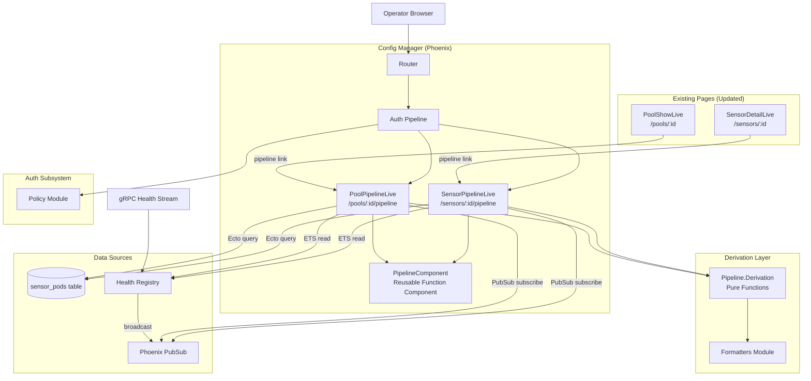
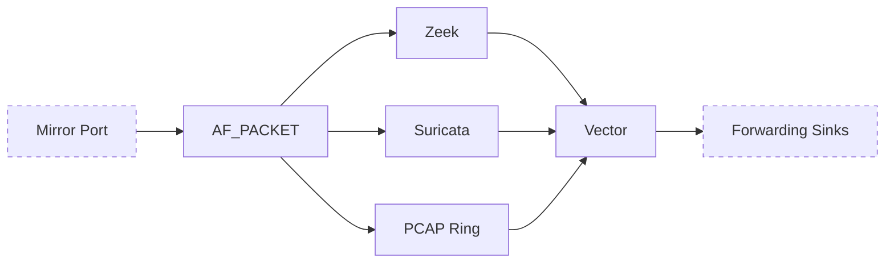
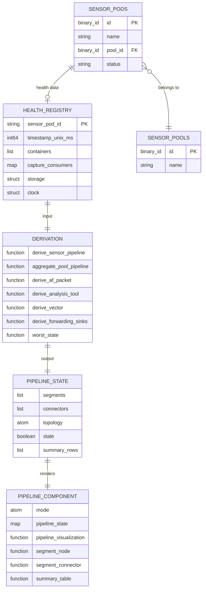

# Design Document: Live Data-Flow Visualization

## Overview

This design adds a live data-flow visualization to the RavenWire Config Manager that renders the sensor pipeline as a visual flow map with throughput annotations and health-state indicators on each segment. The visualization is available per-sensor at `/sensors/:id/pipeline` and per-pool at `/pools/:id/pipeline`. Each pipeline segment displays its current state using color-coded, icon-annotated, and text-labeled indicators so operators can instantly see where data is flowing, where it is degraded, where it has stopped, and where telemetry is not available.

The implementation introduces three new modules:

1. **`ConfigManager.Pipeline.Derivation`** — A pure-function module that transforms a `Health.HealthReport` struct and sensor metadata into a structured pipeline state map. This module contains all segment state derivation rules, throughput formatting, storage threshold logic, and tooltip data assembly. It has zero side effects and no dependencies on LiveView, PubSub, or ETS, making it fully property-testable.

2. **`ConfigManagerWeb.PipelineLive.SensorPipelineLive`** — A LiveView at `/sensors/:id/pipeline` that loads the sensor identity from SQLite, reads health data from the Health Registry, subscribes to pod-scoped PubSub, and passes derived pipeline state to the rendering component.

3. **`ConfigManagerWeb.PipelineLive.PoolPipelineLive`** — A LiveView at `/pools/:id/pipeline` that loads all member sensors for a pool, derives per-sensor pipeline states, aggregates them into per-segment state counts, and subscribes to pool-scoped PubSub with debounced re-derivation.

The rendering is handled by a single reusable function component (`ConfigManagerWeb.PipelineComponent`) that accepts a structured pipeline state map and a mode attribute (`:sensor` or `:pool`). The component renders the canonical topology as semantic HTML with SVG connectors, accessible labels, keyboard navigation, and a screen-reader summary table. It does not query any data source directly.

### Key Design Decisions

1. **Pure derivation module separate from LiveView**: All segment state derivation, threshold evaluation, and tooltip assembly lives in `ConfigManager.Pipeline.Derivation`. This follows the project's pattern of keeping business logic out of LiveViews (similar to how `DashboardLive` delegates status derivation to helper functions). The derivation module is the primary target for property-based testing with PropCheck.

2. **Single reusable component for both modes**: The `PipelineComponent` accepts a mode attribute and structured data. In `:sensor` mode it renders per-segment state indicators with throughput annotations. In `:pool` mode it renders per-segment state count summaries with worst-state coloring. This avoids duplicating the topology layout and visual state palette logic.

3. **Semantic HTML with SVG connectors, not canvas**: The pipeline is rendered as positioned HTML elements (segments) connected by inline SVG paths (connectors). This provides native accessibility support, keyboard focusability, LiveView diff efficiency via stable DOM IDs, and compatibility with screen readers. No JavaScript canvas or D3.js dependency is needed.

4. **Debounced pool aggregation**: The `PoolPipelineLive` uses `Process.send_after/3` with a configurable debounce window (default 500ms) to coalesce rapid PubSub health updates. When a health update arrives, it marks the aggregation as dirty and schedules a re-derive. If another update arrives before the timer fires, the timer is reset. This prevents unbounded re-renders for pools with many sensors reporting simultaneously.

5. **Explicit `no_data` state for missing telemetry**: The derivation module never infers health from absence. Missing capture data, missing forwarding data, missing storage data, and missing container data all produce the `no_data` segment state. Zero throughput values are preserved as real telemetry ("0 bps"), distinct from missing telemetry ("—").

6. **PropCheck for property-based testing**: The project already includes `propcheck ~> 1.4`. Property tests will validate derivation rules, throughput formatting, storage threshold logic, aggregate worst-state computation, and the distinction between zero values and missing telemetry.

7. **Pod-scoped PubSub reuse**: The sensor pipeline page subscribes to `"sensor_pod:#{health_key}"` using the same pattern established by the sensor detail page design. This design depends on the sensor-detail-page Registry extension that broadcasts `:pod_updated`, `:pod_degraded`, and `:pod_recovered` events to pod-scoped topics in addition to `"sensor_pods"`. If that extension has not landed yet, it must be implemented before or with this feature.

## Architecture

### System Context



### Request Flow

**Sensor pipeline page load:**
1. Browser navigates to `/sensors/:id/pipeline`
2. Auth pipeline validates session, checks `sensors:view` permission
3. `SensorPipelineLive.mount/3` loads the `SensorPod` from SQLite by ID
4. If not found → render 404 page
5. If found → derive `health_key = pod.name`, read health data from `Registry.get(health_key)`, read degradation from `Registry.get_degraded_pods()[health_key]`
6. Call `Derivation.derive_sensor_pipeline/3` with the health report, sensor pod, and config to produce the structured pipeline state
7. Subscribe to `"sensor_pod:#{health_key}"` PubSub topic when connected
8. Pass pipeline state to `PipelineComponent` with `mode=:sensor`

**Real-time sensor pipeline update:**
1. Sensor Agent streams `HealthReport` via gRPC
2. Health Registry updates ETS, broadcasts `{:pod_updated, health_key}` to `"sensor_pod:#{health_key}"`
3. `SensorPipelineLive.handle_info/2` receives the message, reads fresh health data from Registry
4. Re-derives pipeline state via `Derivation.derive_sensor_pipeline/3`
5. LiveView diffs only changed segment attributes thanks to stable DOM IDs

**Pool pipeline page load:**
1. Browser navigates to `/pools/:id/pipeline`
2. Auth pipeline validates session, checks `sensors:view` permission
3. `PoolPipelineLive.mount/3` loads the pool and its member sensors from SQLite
4. If pool not found → render 404; if zero members → render empty state
5. For each member sensor, read health data from Registry and derive individual pipeline states
6. Call `Derivation.aggregate_pool_pipeline/1` with the list of per-sensor pipeline states to produce aggregate state counts and worst-state indicators
7. Subscribe to `"pool:#{pool_id}"` for membership changes and to `"sensor_pod:#{health_key}"` for each member sensor
8. Pass aggregate pipeline state to `PipelineComponent` with `mode=:pool`

**Real-time pool pipeline update:**
1. Health update arrives for a member sensor via PubSub
2. `PoolPipelineLive.handle_info/2` marks aggregation as dirty, schedules debounced re-derive via `Process.send_after/3` (default 500ms)
3. When debounce timer fires, re-reads health data for all members, re-derives aggregate state
4. LiveView diffs only changed aggregate counts

### Module Layout

```
lib/config_manager/
├── pipeline/
│   └── derivation.ex                      # Pure derivation functions
├── health/
│   ├── registry.ex                        # Existing (unchanged for this feature)
│   └── proto/health.pb.ex                 # Existing protobuf (unchanged)
├── sensor_pod.ex                          # Existing (unchanged)

lib/config_manager_web/
├── live/
│   ├── pipeline_live/
│   │   ├── sensor_pipeline_live.ex        # /sensors/:id/pipeline
│   │   └── pool_pipeline_live.ex          # /pools/:id/pipeline
│   ├── components/
│   │   └── pipeline_component.ex          # Reusable pipeline visualization component
│   ├── dashboard_live.ex                  # Existing (updated: link to sensor pipeline)
│   └── ...                                # Other existing LiveViews
├── router.ex                              # Extended with pipeline routes
```

## Components and Interfaces

### 1. `ConfigManager.Pipeline.Derivation` — Pure Derivation Module

The core logic module. All functions are pure — they accept data and return data with no side effects. This is the primary target for property-based testing.

```elixir
defmodule ConfigManager.Pipeline.Derivation do
  @moduledoc """
  Pure-function module for deriving pipeline segment states from HealthReport data.

  Transforms raw health telemetry into a structured pipeline state map suitable
  for rendering by PipelineComponent. No side effects, no ETS reads, no PubSub.
  """

  alias ConfigManagerWeb.Formatters

  # ── Types ──────────────────────────────────────────────────────────────────

  @type segment_state :: :healthy | :degraded | :failed | :disabled | :pending_reload | :no_data

  @type segment :: %{
    id: String.t(),
    label: String.t(),
    state: segment_state(),
    metrics: map(),
    warnings: [String.t()],
    badges: [map()],
    tooltip: map(),
    accessible_summary: String.t()
  }

  @type connector :: %{
    id: String.t(),
    source_id: String.t(),
    target_id: String.t(),
    throughput_label: String.t(),
    secondary_label: String.t() | nil,
    accessible_summary: String.t()
  }

  @type pipeline_state :: %{
    segments: [segment()],
    connectors: [connector()],
    topology: :canonical,
    stale: boolean(),
    stale_age_seconds: non_neg_integer() | nil,
    last_report_timestamp: DateTime.t() | nil,
    sensor_status: String.t() | nil,
    status_banners: [map()],
    summary_rows: [map()]
  }

  @type aggregate_segment :: %{
    id: String.t(),
    label: String.t(),
    overall_state: segment_state(),
    state_counts: %{segment_state() => non_neg_integer()},
    badges: [map()],
    accessible_summary: String.t()
  }

  @type aggregate_pipeline_state :: %{
    segments: [aggregate_segment()],
    connectors: [connector()],
    topology: :canonical,
    total_members: non_neg_integer(),
    reporting_members: non_neg_integer(),
    summary_rows: [map()]
  }

  # ── Segment State Constants ────────────────────────────────────────────────

  @drop_percent_threshold 5.0
  @cpu_percent_threshold 90.0
  @storage_warning_threshold 85.0
  @storage_critical_threshold 95.0

  @canonical_segment_ids [
    "mirror_port", "af_packet",
    "zeek", "suricata", "pcap_ring",
    "vector", "forwarding_sinks"
  ]

  @expected_containers %{
    "zeek" => "zeek",
    "suricata" => "suricata",
    "pcap_ring" => "pcap_ring_writer",
    "vector" => "vector"
  }

  # ── Public API ─────────────────────────────────────────────────────────────

  @doc """
  Derives the complete pipeline state for a single sensor.

  Accepts a HealthReport (or nil), a SensorPod struct, and an options keyword
  list with :stale_threshold_sec (default 60) and :now (default DateTime.utc_now()).

  Returns a %pipeline_state{} map ready for PipelineComponent rendering.
  """
  @spec derive_sensor_pipeline(
    health_report :: map() | nil,
    sensor_pod :: map(),
    opts :: keyword()
  ) :: pipeline_state()
  def derive_sensor_pipeline(health_report, sensor_pod, opts \\ [])

  @doc """
  Aggregates multiple per-sensor pipeline states into a pool-level aggregate.

  Accepts a list of {sensor_id, sensor_name, pipeline_state} tuples.
  Returns an %aggregate_pipeline_state{} map.

  Worst-state logic: failed > degraded > pending_reload > healthy > disabled.
  If some members are no_data but reporting members are healthy, overall stays
  healthy with a visible no_data count badge.
  """
  @spec aggregate_pool_pipeline(
    member_states :: [{String.t(), String.t(), pipeline_state()}]
  ) :: aggregate_pipeline_state()
  def aggregate_pool_pipeline(member_states)

  # ── Segment Derivation (Internal) ─────────────────────────────────────────

  @doc """
  Derives the AF_PACKET segment state from capture stats.

  - Healthy: at least one consumer, no drop_percent > 5.0, no bpf_restart_pending
  - Degraded: any consumer has drop_percent > 5.0
  - Pending Reload: any consumer has bpf_restart_pending == true
  - No Data: no capture data present
  - Failed: reserved for future explicit failure reporting
  """
  @spec derive_af_packet(capture_stats :: map() | nil) :: segment()
  def derive_af_packet(capture_stats)

  @doc """
  Derives an analysis-tool segment state (Zeek, Suricata, PCAP Ring) from
  container health and capture consumer stats.

  - Healthy: container running, no degradation conditions
  - Degraded: container running but CPU > 90% or consumer drop_percent > 5.0
  - Failed: container state is "error" or "stopped"
  - Disabled: component intentionally disabled (from config)
  - No Data: container not present in HealthReport
  """
  @spec derive_analysis_tool(
    segment_id :: String.t(),
    container :: map() | nil,
    consumer_stats :: map() | nil,
    opts :: keyword()
  ) :: segment()
  def derive_analysis_tool(segment_id, container, consumer_stats, opts \\ [])

  @doc """
  Derives the Vector segment state from container health.

  - Healthy: container running
  - Degraded: container running but forwarding buffer > 85% (when available)
  - Failed: container state is "error" or "stopped"
  - No Data: container not present
  """
  @spec derive_vector(container :: map() | nil, forwarding_data :: map() | nil) :: segment()
  def derive_vector(container, forwarding_data)

  @doc """
  Derives forwarding sink segment states from forwarding telemetry.

  Returns a list of segments — one per configured sink when data is available,
  or a single "Forwarding Sinks" no_data segment when telemetry is missing.
  """
  @spec derive_forwarding_sinks(forwarding_data :: map() | nil) :: [segment()]
  def derive_forwarding_sinks(forwarding_data)

  @doc """
  Derives the Mirror Port segment. Always no_data with the current HealthReport
  schema since host interface telemetry is not yet available.
  """
  @spec derive_mirror_port(health_report :: map() | nil) :: segment()
  def derive_mirror_port(health_report)

  @doc """
  Derives PCAP Ring storage badges based on used_percent thresholds.

  - Warning: used_percent > 85% and <= 95%
  - Critical: used_percent > 95%
  - No warning otherwise
  - No-data badge when storage stats are nil
  """
  @spec derive_storage_warnings(storage_stats :: map() | nil) :: %{
    level: :none | :warning | :critical | :no_data,
    label: String.t(),
    used_percent: float() | nil
  }
  def derive_storage_warnings(storage_stats)

  # ── Throughput Formatting ──────────────────────────────────────────────────

  @doc """
  Formats a throughput value in bps to a human-readable string.

  - nil → "—" (missing telemetry)
  - 0 → "0 bps" (real zero, not missing)
  - Positive → scaled to bps/Kbps/Mbps/Gbps
  """
  @spec format_throughput(bps :: number() | nil) :: String.t()
  def format_throughput(bps)

  @doc """
  Formats a packet count with optional rate annotation.

  - nil → "—"
  - Integer → comma-formatted count
  - With rate → "1,234 (5.2k pps)"
  """
  @spec format_packet_count(count :: integer() | nil, rate :: number() | nil) :: String.t()
  def format_packet_count(count, rate \\ nil)

  # ── Staleness Check ────────────────────────────────────────────────────────

  @doc """
  Determines if a HealthReport is stale based on its timestamp.

  Returns {is_stale, age_seconds} where age_seconds is the number of seconds
  since the report timestamp.
  """
  @spec check_staleness(
    timestamp_unix_ms :: integer() | nil,
    opts :: keyword()
  ) :: {boolean(), non_neg_integer() | nil}
  def check_staleness(timestamp_unix_ms, opts \\ [])

  # ── Worst-State Logic ──────────────────────────────────────────────────────

  @doc """
  Computes the worst state from a list of segment states for pool aggregation.

  Priority: failed > degraded > pending_reload > healthy > disabled.
  no_data does not override reporting members — if some members report healthy
  and others are no_data, the overall state is healthy with a no_data count.
  """
  @spec worst_state([segment_state()]) :: segment_state()
  def worst_state(states)
end
```

### 2. `ConfigManagerWeb.PipelineLive.SensorPipelineLive` — Sensor Pipeline Page

```elixir
defmodule ConfigManagerWeb.PipelineLive.SensorPipelineLive do
  use ConfigManagerWeb, :live_view

  alias ConfigManager.{Repo, SensorPod}
  alias ConfigManager.Health.Registry
  alias ConfigManager.Pipeline.Derivation

  @stale_threshold_sec 60

  # ── Mount ──────────────────────────────────────────────────────────────────

  @impl true
  def mount(%{"id" => id}, _session, socket) do
    # 1. Load SensorPod from DB by UUID
    # 2. If not found → {:ok, assign(socket, :not_found, true)}
    # 3. Derive health_key from pod.name
    # 4. Read health from Registry.get(health_key)
    # 5. Read degradation from Registry.get_degraded_pods()
    # 6. Derive pipeline state via Derivation.derive_sensor_pipeline/3
    # 7. Subscribe to "sensor_pod:#{health_key}" when connected
    # 8. Assign: pod, health_key, pipeline_state, last_report_time
  end

  # ── PubSub Handlers ────────────────────────────────────────────────────────

  @impl true
  def handle_info({:pod_updated, health_key}, socket) do
    # Only process if health_key matches socket.assigns.health_key.
    # Re-read health from Registry, re-derive pipeline state
  end

  def handle_info({:pod_degraded, health_key, _reason, _value}, socket) do
    # Only process if health_key matches socket.assigns.health_key.
    # Re-derive pipeline state (degradation affects segment states)
  end

  def handle_info({:pod_recovered, health_key, _reason}, socket) do
    # Only process if health_key matches socket.assigns.health_key.
    # Re-derive pipeline state
  end

  # Ignore PubSub messages for other pods (safety check)
  def handle_info(_, socket), do: {:noreply, socket}
end
```

**Socket assigns:**
- `pod` — `%SensorPod{}` from database
- `health_key` — string key for Health Registry and PubSub topic
- `pipeline_state` — `%Derivation.pipeline_state{}` derived from health data
- `not_found` — boolean for 404 rendering
- `current_user` — assigned by auth on_mount hook

### 3. `ConfigManagerWeb.PipelineLive.PoolPipelineLive` — Pool Pipeline Page

```elixir
defmodule ConfigManagerWeb.PipelineLive.PoolPipelineLive do
  use ConfigManagerWeb, :live_view

  alias ConfigManager.{Repo, SensorPod, Pools}
  alias ConfigManager.Health.Registry
  alias ConfigManager.Pipeline.Derivation

  @debounce_ms 500
  @stale_threshold_sec 60

  # ── Mount ──────────────────────────────────────────────────────────────────

  @impl true
  def mount(%{"id" => pool_id}, _session, socket) do
    # 1. Load pool from DB
    # 2. If not found → {:ok, assign(socket, :not_found, true)}
    # 3. Load member sensors via Pools.list_pool_sensors(pool_id)
    # 4. For each member: read health from Registry, derive pipeline state
    # 5. Aggregate via Derivation.aggregate_pool_pipeline/1
    # 6. Subscribe to "pool:#{pool_id}" for membership changes
    # 7. Subscribe to "sensor_pod:#{health_key}" for each member
    # 8. Assign: pool, members, aggregate_state, debounce_timer, debounce_token
  end

  # ── PubSub Handlers ────────────────────────────────────────────────────────

  @impl true
  def handle_info({:pod_updated, health_key}, socket) do
    # Only process if health_key belongs to a current member
    # Mark dirty, schedule debounced re-derive
    if MapSet.member?(socket.assigns.member_health_keys, health_key) do
      schedule_rederive(socket)
    else
      {:noreply, socket}
    end
  end

  def handle_info({:rederive, token}, socket) do
    # Ignore stale timer messages whose token no longer matches debounce_token.
    # Re-read health for all members, re-derive aggregate, clear debounce_timer/debounce_token.
    if socket.assigns.debounce_token == token do
      # rederive...
      {:noreply, socket}
    else
      {:noreply, socket}
    end
  end

  def handle_info({:sensors_assigned, pool_id, _sensor_ids}, socket) do
    # Only process if pool_id matches socket.assigns.pool.id.
    # Reload member list, subscribe to new members, re-derive aggregate
  end

  def handle_info({:sensors_removed, pool_id, _sensor_ids}, socket) do
    # Only process if pool_id matches socket.assigns.pool.id.
    # Reload member list, unsubscribe from removed members, re-derive aggregate
  end

  # ── Debounce Helper ────────────────────────────────────────────────────────

  defp schedule_rederive(socket) do
    if socket.assigns[:debounce_timer] do
      Process.cancel_timer(socket.assigns.debounce_timer)
    end

    token = make_ref()
    timer = Process.send_after(self(), {:rederive, token}, @debounce_ms)
    {:noreply, assign(socket, debounce_timer: timer, debounce_token: token)}
  end
end
```

**Socket assigns:**
- `pool` — `%SensorPool{}` from database
- `members` — list of `%SensorPod{}` member sensors
- `member_health_keys` — `MapSet.t(String.t())` for fast PubSub filtering
- `aggregate_state` — `%Derivation.aggregate_pipeline_state{}` derived from all members
- `debounce_timer` — timer reference for coalescing rapid updates
- `debounce_token` — unique reference carried by the scheduled message so stale timer messages can be ignored
- `not_found` — boolean for 404 rendering
- `current_user` — assigned by auth on_mount hook

### 4. `ConfigManagerWeb.PipelineComponent` — Reusable Visualization Component

```elixir
defmodule ConfigManagerWeb.PipelineComponent do
  @moduledoc """
  Reusable function component for rendering the pipeline visualization.

  Accepts pre-derived pipeline state data and a mode attribute.
  Does NOT query Health Registry, database, or PubSub.
  """

  use Phoenix.Component

  # ── Visual State Palette ───────────────────────────────────────────────────

  @state_styles %{
    healthy:        %{bg: "bg-green-100", border: "border-green-500", text: "text-green-800", icon: "hero-check-circle", label: "Healthy", border_style: "border-solid"},
    degraded:       %{bg: "bg-yellow-100", border: "border-yellow-500", text: "text-yellow-800", icon: "hero-exclamation-triangle", label: "Degraded", border_style: "border-solid"},
    failed:         %{bg: "bg-red-100", border: "border-red-500", text: "text-red-800", icon: "hero-x-circle", label: "Failed", border_style: "border-solid"},
    disabled:       %{bg: "bg-gray-100", border: "border-gray-400", text: "text-gray-600", icon: "hero-no-symbol", label: "Disabled", border_style: "border-solid"},
    pending_reload: %{bg: "bg-blue-100", border: "border-blue-500", text: "text-blue-800", icon: "hero-arrow-path", label: "Pending Reload", border_style: "border-solid"},
    no_data:        %{bg: "bg-gray-50", border: "border-gray-300", text: "text-gray-500", icon: "hero-question-mark-circle", label: "No Data", border_style: "border-dashed"}
  }

  # ── Attributes ─────────────────────────────────────────────────────────────

  attr :pipeline_state, :map, required: true
  attr :mode, :atom, values: [:sensor, :pool], required: true
  attr :stale, :boolean, default: false
  attr :stale_age_seconds, :integer, default: nil
  attr :sensor_status, :string, default: nil
  attr :pool_member_links, :list, default: []

  @doc """
  Renders the pipeline visualization.

  In :sensor mode, renders individual segment states with throughput annotations.
  In :pool mode, renders aggregate state counts with worst-state coloring.
  """
  def pipeline_visualization(assigns)

  # ── Sub-components ─────────────────────────────────────────────────────────

  @doc "Renders a single pipeline segment node."
  def segment_node(assigns)
  # Renders: icon, label, state text, metrics, warnings, storage annotation
  # Attributes: segment map, mode, stale overlay flag
  # Accessible: aria-label with segment name, state, and key metrics

  @doc "Renders an SVG connector between two segments."
  def segment_connector(assigns)
  # Renders: SVG path with throughput label
  # Attributes: connector map
  # Accessible: aria-label with source, destination, throughput

  @doc "Renders the tooltip/popover for a segment."
  def segment_tooltip(assigns)
  # Renders: detailed metrics popover on hover/focus
  # Dismissible via Escape key
  # Accessible to screen readers

  @doc "Renders the screen-reader summary table."
  def summary_table(assigns)
  # Renders: HTML table with segment name, state, key metrics
  # Visually hidden but accessible to screen readers

  @doc "Renders status banners (stale, revoked, pending, offline)."
  def status_banner(assigns)
  # Renders: warning/info banners for stale data, revoked/pending status, no health data
end
```

### 5. Router Changes

New pipeline routes are added to the authenticated scope:

```elixir
# Inside the authenticated live_session block:
live "/sensors/:id/pipeline", PipelineLive.SensorPipelineLive, :show,
  private: %{required_permission: "sensors:view"}

live "/pools/:id/pipeline", PipelineLive.PoolPipelineLive, :show,
  private: %{required_permission: "sensors:view"}
```

Permission mapping:

| Route | Permission | Notes |
|-------|-----------|-------|
| `/sensors/:id/pipeline` | `sensors:view` | Read-only visualization |
| `/pools/:id/pipeline` | `sensors:view` | Read-only visualization |

### 6. PubSub Topics (Reused, No New Topics)

The pipeline pages reuse existing PubSub topics. No new topics are introduced.

| Page | Topic | Messages Handled |
|------|-------|-----------------|
| Sensor Pipeline | `"sensor_pod:#{health_key}"` | `{:pod_updated, _}`, `{:pod_degraded, _, _, _}`, `{:pod_recovered, _, _}` |
| Pool Pipeline | `"pool:#{pool_id}"` | `{:sensors_assigned, _, _}`, `{:sensors_removed, _, _}`, `{:pool_config_updated, _}` |
| Pool Pipeline | `"sensor_pod:#{health_key}"` (per member) | `{:pod_updated, _}`, `{:pod_degraded, _, _, _}`, `{:pod_recovered, _, _}` |

### 7. Navigation Integration Updates

**Sensor detail page** (`SensorDetailLive`): Add a "Pipeline" link/tab in the page header navigation, linking to `/sensors/:id/pipeline`.

**Pool detail page** (`PoolShowLive`): Add a "Pipeline" link/tab in the pool navigation, linking to `/pools/:id/pipeline`.

**Sensor pipeline page**: Include breadcrumb links:
- Back to sensor detail: `/sensors/:id`
- To pool pipeline (when sensor belongs to a pool): `/pools/:pool_id/pipeline`

**Pool pipeline page**: Include breadcrumb links:
- Back to pool detail: `/pools/:id`
- Per-member sensor pipeline links in the aggregate view

**Segment click navigation**: Clicking a segment on the sensor pipeline page navigates to the corresponding section on the sensor detail page (e.g., clicking Zeek navigates to `/sensors/:id#containers`).

### 8. Segment State Derivation Rules Summary

| Segment | Healthy | Degraded | Failed | Disabled | Pending Reload | No Data |
|---------|---------|----------|--------|----------|----------------|---------|
| Mirror Port | — | — | — | — | — | Always (no host telemetry) |
| AF_PACKET | ≥1 consumer, no drops >5%, no BPF pending | Any consumer drop >5% | Future: explicit failure | — | Any BPF restart pending | No capture data |
| Zeek | Container "running", no degradation | Container "running" + CPU >90% or drops >5% | Container "error"/"stopped" | Intentionally disabled | — | Container missing |
| Suricata | Container "running", no degradation | Container "running" + CPU >90% or drops >5% | Container "error"/"stopped" | Intentionally disabled | — | Container missing |
| PCAP Ring | Container "running", no degradation | Container "running" + consumer drops >5% or CPU >90% | Container "error"/"stopped" | Intentionally disabled | — | Container missing |
| Vector | Container "running" | Container "running" + buffer >85% | Container "error"/"stopped" | — | — | Container missing |
| Forwarding Sinks | Sink connected/healthy | Elevated latency/partial failures | Sink disconnected/unreachable | — | — | No forwarding data |

PCAP storage pressure is represented as a warning, critical, or no-data badge on the PCAP Ring segment. It does not by itself change the segment state to failed; the failed state remains tied to explicit container or future explicit failure telemetry.

### 9. Visual State Palette

| State | Background/Border | Icon | Text Label | Border Style |
|-------|------------------|------|------------|-------------|
| Healthy | Green | ✓ Checkmark circle | "Healthy" | Solid |
| Degraded | Yellow | ⚠ Warning triangle | "Degraded" | Solid |
| Failed | Red | ✕ X circle | "Failed" | Solid |
| Disabled | Gray | ⊘ Circle slash | "Disabled" | Solid |
| Pending Reload | Blue | ↻ Refresh | "Pending Reload" | Solid |
| No Data | Light gray | ? Question circle | "No Data" | Dashed |

### 10. Pipeline Topology Diagram



The topology is rendered left-to-right. The analysis stage (Zeek, Suricata, PCAP Ring) forms parallel branches from AF_PACKET, converging at Vector. Additional capture consumers from the HealthReport are rendered as extra parallel branches in the analysis stage.

## Data Models

### No New Database Tables or Migrations

This feature does not add any database tables or columns. All data is derived at runtime from:

1. **`sensor_pods` table** (existing) — sensor identity, pool membership, enrollment status
2. **`sensor_pools` table** (existing) — pool metadata for pool pipeline page
3. **Health Registry ETS** (existing) — real-time `HealthReport` data

### Pipeline State Data Structures (In-Memory Only)

The derivation module produces structured maps that flow from LiveView to component. These are not persisted.

**Sensor Pipeline State:**
```elixir
%{
  segments: [
    %{
      id: "af_packet",
      label: "AF_PACKET",
      state: :healthy,
      metrics: %{
        aggregate_throughput_bps: 8_200_000_000.0,
        consumer_count: 3
      },
      warnings: [],
      badges: [],
      tooltip: %{
        aggregate_throughput: "8.2 Gbps",
        consumers: [
          %{name: "zeek", packets_received: 1_234_567, drop_percent: 0.1},
          %{name: "suricata", packets_received: 1_234_567, drop_percent: 0.2},
          %{name: "pcap_ring_writer", packets_received: 1_234_567, drop_percent: 0.0}
        ],
        bpf_restart_pending: false
      },
      accessible_summary: "AF_PACKET: Healthy. 3 consumers, 8.2 Gbps aggregate throughput, 0% drops."
    },
    # ... more segments
  ],
  connectors: [
    %{
      id: "af_packet->zeek",
      source_id: "af_packet",
      target_id: "zeek",
      throughput_label: "2.7 Gbps",
      secondary_label: "1,234,567 pkts",
      accessible_summary: "AF_PACKET to Zeek: 2.7 Gbps, 1,234,567 packets."
    },
    # ... more connectors
  ],
  topology: :canonical,
  stale: false,
  stale_age_seconds: nil,
  last_report_timestamp: ~U[2024-01-15 14:30:45Z],
  sensor_status: "enrolled",
  status_banners: [],
  summary_rows: [
    %{segment: "AF_PACKET", state: "Healthy", throughput: "8.2 Gbps", details: "3 consumers"},
    # ... more rows for screen-reader table
  ]
}
```

**Aggregate Pool Pipeline State:**
```elixir
%{
  segments: [
    %{
      id: "af_packet",
      label: "AF_PACKET",
      overall_state: :degraded,
      state_counts: %{
        healthy: 8,
        degraded: 1,
        failed: 0,
        disabled: 0,
        pending_reload: 1,
        no_data: 2
      },
      badges: [%{kind: :no_data_count, label: "2 no data"}],
      accessible_summary: "AF_PACKET: Degraded overall. 8 healthy, 1 degraded, 1 pending reload, 2 no data."
    },
    # ... more segments
  ],
  connectors: [
    %{
      id: "af_packet->zeek",
      source_id: "af_packet",
      target_id: "zeek",
      throughput_label: "",
      secondary_label: nil,
      accessible_summary: "AF_PACKET to Zeek."
    },
    # ... more connectors
  ],
  topology: :canonical,
  total_members: 12,
  reporting_members: 10,
  summary_rows: [
    %{segment: "AF_PACKET", overall_state: "Degraded", healthy: 8, degraded: 1, failed: 0, no_data: 2},
    # ... more rows
  ]
}
```

### Entity Relationship (Data Flow)



## Correctness Properties

*A property is a characteristic or behavior that should hold true across all valid executions of a system — essentially, a formal statement about what the system should do. Properties serve as the bridge between human-readable specifications and machine-verifiable correctness guarantees.*

### Property 1: Canonical topology structure invariant

*For any* HealthReport (including nil) and any SensorPod, the derived pipeline state SHALL contain all canonical segment IDs (`mirror_port`, `af_packet`, `zeek`, `suricata`, `pcap_ring`, `vector`, `forwarding_sinks`) in the correct topology order. Every connector's `source_id` and `target_id` SHALL reference segment IDs that exist in the segments list. The AF_PACKET segment SHALL have outgoing connectors to each analysis-stage segment (Zeek, Suricata, PCAP Ring), and each analysis-stage segment SHALL have an outgoing connector to Vector.

**Validates: Requirements 2.1, 2.2, 2.3**

### Property 2: Derivation output structural completeness

*For any* HealthReport (including nil) and any SensorPod, every segment in the derived pipeline state SHALL contain all required fields: a non-empty `id` string, a non-empty `label` string, a `state` value from the set {`:healthy`, `:degraded`, `:failed`, `:disabled`, `:pending_reload`, `:no_data`}, a `metrics` map, a `warnings` list, a `badges` list, a `tooltip` map, and a non-empty `accessible_summary` string. Every connector SHALL contain `id`, `source_id`, `target_id`, `throughput_label`, and `accessible_summary` fields.

**Validates: Requirements 3.1, 14.6**

### Property 3: AF_PACKET segment state derivation

*For any* capture stats map with varying consumer counts, drop percentages, and BPF restart pending flags, the AF_PACKET segment state SHALL be derived as follows: `:healthy` when at least one consumer is present and no consumer has `drop_percent > 5.0` and no consumer has `bpf_restart_pending == true`; `:degraded` when any consumer has `drop_percent > 5.0`; `:pending_reload` when any consumer has `bpf_restart_pending == true` and no consumer has `drop_percent > 5.0`; `:no_data` when no capture data is present. The derivation SHALL never produce `:failed` from the current HealthReport schema.

**Validates: Requirements 4.1**

### Property 4: Analysis-tool segment state derivation

*For any* analysis-tool segment (Zeek, Suricata, PCAP Ring) and any combination of container health state, CPU percentage, and capture consumer drop percentage, the segment state SHALL be derived as follows: `:healthy` when the container state is `"running"` and CPU ≤ 90% and consumer drop ≤ 5.0%; `:degraded` when the container state is `"running"` and either CPU > 90% or consumer drop > 5.0%; `:failed` when the container state is `"error"` or `"stopped"`; `:no_data` when the container is not present in the HealthReport. The same derivation rules SHALL apply identically to all three analysis-tool segment types.

**Validates: Requirements 4.2**

### Property 5: Vector segment state derivation

*For any* Vector container health state and forwarding buffer usage value, the Vector segment state SHALL be derived as follows: `:healthy` when the container state is `"running"` and buffer usage ≤ 85% (or buffer data unavailable); `:degraded` when the container state is `"running"` and buffer usage > 85%; `:failed` when the container state is `"error"` or `"stopped"`; `:no_data` when the Vector container is not present in the HealthReport.

**Validates: Requirements 4.3**

### Property 6: Missing telemetry produces no_data state

*For any* HealthReport field that is nil or absent, the corresponding derived output SHALL explicitly represent missing telemetry: missing capture stats make the AF_PACKET segment `:no_data` and connector throughput labels `"—"`; missing forwarding data makes forwarding sink segments `:no_data`; missing individual expected container entries make those component segments `:no_data`; missing storage stats add a no-data storage badge to PCAP Ring. When the entire HealthReport is nil, ALL segments SHALL be `:no_data`. The derivation SHALL never infer `:healthy` or `:failed` from the absence of telemetry data.

**Validates: Requirements 3.4, 9.1, 9.2, 9.4**

### Property 7: Zero throughput does not produce failed state

*For any* HealthReport where all throughput values (`throughput_bps`) are zero but containers are in the `"running"` state, no segment SHALL be derived as `:failed`. Zero throughput with running containers SHALL produce `:healthy` (or `:degraded` if other degradation conditions apply), because a live sensor may have no observed traffic during the reporting interval.

**Validates: Requirements 4.6**

### Property 8: Throughput formatting with zero/nil distinction

*For any* non-negative number representing bits per second, `format_throughput/1` SHALL return a string containing exactly one of the unit suffixes {`"bps"`, `"Kbps"`, `"Mbps"`, `"Gbps"`} with the correct magnitude scaling. For input value `0` or `0.0`, the function SHALL return `"0 bps"`. For `nil` input, the function SHALL return `"—"`. The outputs for zero and nil SHALL always be distinguishable — zero is real telemetry, nil is missing telemetry.

**Validates: Requirements 5.5, 5.7**

### Property 9: Storage threshold classification

*For any* `used_percent` float value, `derive_storage_warnings/1` SHALL classify the storage level as follows: `:none` when `used_percent ≤ 85.0`; `:warning` when `85.0 < used_percent ≤ 95.0`; `:critical` when `used_percent > 95.0`; `:no_data` when storage stats are nil. The boundary values 85.0 and 95.0 SHALL be classified as `:none` and `:warning` respectively (thresholds are exclusive on the lower bound).

**Validates: Requirements 6.2, 6.3**

### Property 10: Staleness detection

*For any* HealthReport timestamp (as `timestamp_unix_ms`) and any staleness threshold in seconds, `check_staleness/2` SHALL return `{true, age}` when the age of the report exceeds the threshold and `{false, age}` when it does not. For nil timestamps, it SHALL return `{true, nil}`. The age SHALL be computed as the difference between the current time and the report timestamp in seconds.

**Validates: Requirements 4.5, 13.1, 13.2**

### Property 11: Aggregate state count correctness

*For any* list of per-sensor pipeline states (each containing segments with states), the aggregate pipeline state SHALL contain, for each canonical segment ID, a `state_counts` map where the count for each state equals the number of member sensors whose corresponding segment has that state. The sum of all state counts for a segment SHALL equal the total number of member sensors. The `total_members` field SHALL equal the length of the input list, and `reporting_members` SHALL equal the count of members with at least one non-`:no_data` segment.

**Validates: Requirements 7.3, 7.4**

### Property 12: Worst-state aggregation logic

*For any* list of segment states, `worst_state/1` SHALL return the highest-priority state according to the ordering: `:failed` > `:degraded` > `:pending_reload` > `:healthy` > `:disabled`. When the list contains only `:no_data` states, the result SHALL be `:no_data`. When the list contains a mix of `:no_data` and reporting states (`:healthy`, `:degraded`, etc.), the `:no_data` states SHALL NOT override the worst reporting state — the result SHALL be determined by the reporting states only.

**Validates: Requirements 7.5**

### Property 13: Derivation is deterministic with stable IDs

*For any* HealthReport and SensorPod, calling `derive_sensor_pipeline/3` twice with the same inputs SHALL produce identical pipeline states — same segment IDs, same connector IDs, same states, same metrics, same throughput labels. The segment and connector IDs SHALL be deterministic functions of the input data, enabling LiveView to diff efficiently without replacing the entire DOM on each update.

**Validates: Requirements 15.3**

### Property 14: Tooltip data completeness per segment type

*For any* derived pipeline segment with non-`:no_data` state, the tooltip map SHALL contain all fields specified for that segment type: AF_PACKET tooltips SHALL include aggregate throughput, per-consumer packet counts, per-consumer drop percentages, and BPF restart status; analysis-tool tooltips SHALL include container state, uptime, CPU percentage, memory usage, packets received, packets dropped, and drop percentage; PCAP Ring tooltips SHALL include container state, storage path, total bytes, used bytes, available bytes, and used percentage; Vector tooltips SHALL include container state, uptime, CPU percentage, memory usage, and forwarding buffer usage (or "not available"). For `:no_data` segments, the tooltip SHALL contain a "data not available" message.

**Validates: Requirements 12.1, 12.2, 12.3, 12.4, 12.5, 12.6**

### Property 15: No secrets in tooltip or accessible summary data

*For any* HealthReport and SensorPod (including records where `public_key_pem`, `cert_pem`, or `ca_chain_pem` are non-nil), no tooltip field value or accessible summary string in the derived pipeline state SHALL contain PEM headers (`-----BEGIN`), bearer token patterns, API key prefixes, or raw certificate/key material. The derivation module SHALL never copy secret fields from the SensorPod into the pipeline state output.

**Validates: Requirements 12.9**

### Property 16: Accessible summaries and summary table rows

*For any* derived pipeline state (sensor or aggregate mode), every segment SHALL have a non-empty `accessible_summary` string that contains the segment label and the state label. Every connector SHALL have a non-empty `accessible_summary` string that contains the source and destination segment names. The `summary_rows` list SHALL contain exactly one row per segment, and each row SHALL include the segment name and state.

**Validates: Requirements 10.1, 10.2, 10.5**

## Error Handling

### Page-Level Errors

| Scenario | Behavior |
|----------|----------|
| Non-existent sensor ID in route | Render 404 page with "Sensor not found" message |
| Non-existent pool ID in route | Render 404 page with "Pool not found" message |
| Pending sensor | Render pipeline with available telemetry (or all no_data), display pending enrollment banner |
| Revoked sensor | Render pipeline with available telemetry (or all no_data), display revoked status banner |
| Database query failure | Render 500 error page; log error |
| Health Registry ETS read failure | Render pipeline with all segments in no_data state; display "health data unavailable" banner |

### Segment-Level Error States

| Scenario | Behavior |
|----------|----------|
| Missing container in HealthReport | Segment state = `:no_data`, tooltip shows "data not available" |
| Missing capture stats | AF_PACKET and analysis connectors show no_data, throughput = "—" |
| Missing storage stats | PCAP Ring shows "storage data not available", storage warnings = `:no_data` |
| Missing forwarding data | Forwarding sinks show no_data, "Forwarding data not available" label |
| Stale HealthReport (> threshold) | All segments retain derived state but display stale overlay; banner shows time since last report |
| No HealthReport in Registry | All segments = no_data; prominent "sensor not reporting" banner |
| Zero throughput values | Displayed as "0 bps" — NOT treated as missing or error |
| Container state "error" | Segment state = `:failed` with red indicator |
| Container state "stopped" | Segment state = `:failed` with red indicator |

### Pool Pipeline Error States

| Scenario | Behavior |
|----------|----------|
| Pool with zero members | Empty state message: "No sensors assigned to this pool" |
| All members have no HealthReport | All aggregate segments show no_data; reporting_members = 0 |
| Some members have no HealthReport | no_data count shown as badge; overall state determined by reporting members only |
| Rapid PubSub bursts | Debounced re-derivation (500ms default) prevents unbounded re-renders |
| Member added/removed during view | Membership change PubSub triggers member list reload and re-aggregation |

### PubSub Error Handling

| Scenario | Behavior |
|----------|----------|
| PubSub message for unrelated pod (sensor page) | Ignored — health_key mismatch check |
| PubSub message for non-member sensor (pool page) | Ignored — member_health_keys set check |
| PubSub subscription failure | Page renders with initial data; no real-time updates; no crash |
| WebSocket disconnection | LiveView reconnects automatically; re-mounts with fresh data |

## Testing Strategy

### Dual Testing Approach

This feature uses both property-based tests (via PropCheck) and example-based unit tests. The pure derivation module is the primary target for property-based testing, while LiveView integration tests cover PubSub behavior, rendering, and RBAC enforcement.

### Property-Based Tests (PropCheck)

**Target module:** `ConfigManager.Pipeline.Derivation`

**Configuration:**
- Minimum 100 iterations per property test
- Each property test references its design document property
- Tag format: `Feature: live-data-flow-viz, Property {number}: {property_text}`

**Property test files:**
- `test/config_manager/pipeline/derivation_property_test.exs` — All 16 correctness properties

**Generator strategy:**
- Generate random `Health.HealthReport` structs with varying:
  - Container lists (0-6 containers with random names, states, CPU%, memory)
  - Capture consumer maps (0-5 consumers with random throughput, drop%, BPF flags)
  - Storage stats (random used_percent 0-100, random byte values, or nil)
  - Clock stats (random offset, sync status)
  - Timestamp (recent, stale, or nil)
- Generate random `SensorPod` structs with varying:
  - Status (pending, enrolled, revoked)
  - Pool membership (with or without pool_id)
- Generate random throughput values (0, sub-Kbps, Kbps, Mbps, Gbps, nil)
- Generate random used_percent values (boundary: 84.9, 85.0, 85.1, 94.9, 95.0, 95.1)
- Generate random lists of segment states for worst-state testing

**Key properties to test:**
1. Topology structure invariant (Property 1)
2. Output structural completeness (Property 2)
3. AF_PACKET derivation rules with threshold boundaries (Property 3)
4. Analysis-tool derivation rules with CPU and drop thresholds (Property 4)
5. Vector derivation rules with buffer thresholds (Property 5)
6. Missing telemetry → no_data (Property 6)
7. Zero throughput ≠ failed (Property 7)
8. Throughput formatting zero/nil distinction (Property 8)
9. Storage threshold classification with boundaries (Property 9)
10. Staleness detection (Property 10)
11. Aggregate state count correctness (Property 11)
12. Worst-state logic (Property 12)
13. Deterministic derivation / stable IDs (Property 13)
14. Tooltip data completeness (Property 14)
15. No secrets in output (Property 15)
16. Accessible summaries present (Property 16)

### Example-Based Unit Tests

**Target modules:** `ConfigManager.Pipeline.Derivation`, `ConfigManagerWeb.PipelineComponent`

**Test file:** `test/config_manager/pipeline/derivation_test.exs`

- Specific derivation examples with known inputs and expected outputs
- Boundary value tests for thresholds (drop_percent = 5.0, CPU = 90.0, storage = 85.0, 95.0)
- Dynamic segment generation for extra capture consumers (Requirement 2.4)
- PCAP Ring storage annotation content (Requirement 6.1)
- Forwarding sink segment generation with and without telemetry
- Sensor status banner logic (pending, enrolled, revoked)
- Empty pool handling

### LiveView Integration Tests

**Test files:**
- `test/config_manager_web/live/pipeline_live/sensor_pipeline_live_test.exs`
- `test/config_manager_web/live/pipeline_live/pool_pipeline_live_test.exs`

**Coverage:**
- Page mount and rendering for existing/non-existent sensors and pools
- PubSub subscription verification on mount
- Real-time update: send PubSub message, verify re-render with updated data
- Unrelated PubSub messages do not change displayed state (Requirement 8.8)
- Stale data overlay and banner rendering (Requirement 13.1, 13.2)
- Revoked and pending sensor banner rendering (Requirement 13.4, 13.5)
- Pool aggregate updates with membership changes (Requirement 8.7)
- Pool debounce behavior under rapid updates (Requirement 8.9)
- RBAC enforcement: sensors:view required for both pages (Requirements 1.4, 7.2)
- Empty pool rendering (Requirement 7.9)
- 404 for non-existent sensor/pool (Requirements 1.3, 7.10)

### Accessibility Tests

**Test file:** `test/config_manager_web/live/pipeline_live/accessibility_test.exs`

**Coverage:**
- Each segment has an `aria-label` containing segment name and state
- Each connector has an `aria-label` containing source, destination, and throughput
- Summary table is present in rendered HTML with correct segment data
- Visual state palette produces distinct icon + text label for each state (not color alone)
- Tooltip content is accessible to screen readers (appropriate ARIA attributes)

### Formatting Tests

**Test file:** `test/config_manager/pipeline/derivation_test.exs` (formatting section)

**Coverage:**
- Throughput formatting across magnitudes: 0, 500, 1500, 1_500_000, 1_500_000_000, 8_200_000_000
- Zero throughput → "0 bps" (not "—")
- Nil throughput → "—"
- Packet count formatting with and without rate
- Storage percentage display
