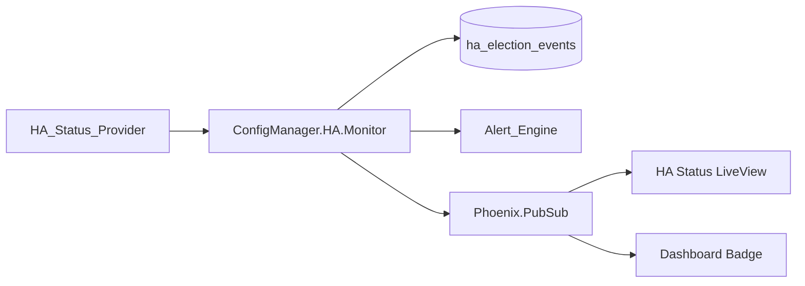

# Design Document: Multi-Manager High Availability Status

## Overview

This design adds HA status visibility to the Config Manager without implementing the HA control plane itself. The Config Manager reads cluster, leader, sync, and election information through a pluggable `ConfigManager.HA.StatusProvider` behaviour. The default provider reports single-instance status, so the UI is useful in every deployment and does not imply HA guarantees where none exist.

The feature integrates with:

- `auth-rbac-audit` for `system:manage` route authorization and audit events.
- `platform-alert-center` for HA alert types and alert lifecycle.
- `dashboard_live` for the compact HA badge.

## Key Design Decisions

1. **Provider boundary is the hard line**: The UI never performs leader election, replication, promotion, or failover. It only renders provider-reported state.
2. **Typed structs normalize provider output**: Providers return RavenWire structs, not arbitrary maps, so LiveViews, alert evaluation, and tests share the same contract.
3. **Single-instance provider is the default**: Deployments without HA configured get deterministic status and no false alerts.
4. **Status is cached briefly**: A GenServer polls the configured provider and broadcasts PubSub updates. LiveViews do not call providers directly on every render.
5. **Election audit is idempotent**: Election records are keyed by provider election ID or by a deterministic tuple when no ID exists.
6. **Admin-only visibility**: HA pages use `system:manage`, granted only to `platform-admin` through the auth-rbac-audit source of truth.

## Architecture



### Module Layout

```text
lib/config_manager/ha/
├── status_provider.ex
├── single_instance_provider.ex
├── monitor.ex
├── cluster_status.ex
├── instance_status.ex
├── leader_info.ex
├── sync_status.ex
└── election_event.ex

lib/config_manager_web/live/ha_live/
└── status_live.ex
```

## Components and Interfaces

### `ConfigManager.HA.StatusProvider`

```elixir
defmodule ConfigManager.HA.StatusProvider do
  @callback cluster_status() :: {:ok, ClusterStatus.t()} | {:error, term()}
  @callback instances() :: {:ok, [InstanceStatus.t()]} | {:error, term()}
  @callback leader() :: {:ok, LeaderInfo.t() | nil} | {:error, term()}
  @callback sync_status(instance_id :: String.t()) :: {:ok, SyncStatus.t()} | {:error, term()}
  @callback election_history(limit :: pos_integer()) :: {:ok, [ElectionEvent.t()]} | {:error, term()}
end
```

### Structs

```elixir
defmodule ConfigManager.HA.ClusterStatus do
  defstruct [
    :cluster_id,
    :instance_count,
    :leader_instance_id,
    :this_instance_id,
    :this_instance_role,
    :health,
    :last_updated_at,
    :single_instance?
  ]
end

defmodule ConfigManager.HA.InstanceStatus do
  defstruct [
    :instance_id,
    :role,
    :status,
    :last_heartbeat_at,
    :uptime_seconds,
    :sync_status,
    :sync_lag_seconds,
    :last_successful_sync_at
  ]
end

defmodule ConfigManager.HA.LeaderInfo do
  defstruct [
    :leader_instance_id,
    :last_election_at,
    :last_election_reason,
    :previous_leader_instance_id
  ]
end

defmodule ConfigManager.HA.ElectionEvent do
  defstruct [
    :event_id,
    :occurred_at,
    :previous_leader_instance_id,
    :new_leader_instance_id,
    :reason
  ]
end
```

Valid enum values:

```text
cluster health: healthy | degraded | critical | unknown
instance role: leader | follower | single | unknown
instance status: online | offline | unknown
sync status: in_sync | syncing | lag_detected | sync_failed | unknown
election reason: initial_startup | previous_leader_timeout | manual_failover | network_partition_recovery | unknown
```

### `ConfigManager.HA.SingleInstanceProvider`

The default provider returns:

- one instance using `RAVENWIRE_INSTANCE_ID` or hostname.
- role `single`.
- cluster health `healthy`.
- `single_instance? = true`.
- no leader election history.
- no sync lag.

The alert evaluator skips HA alert generation when `single_instance?` is true.

### `ConfigManager.HA.Monitor`

The monitor is a supervised GenServer.

Responsibilities:

- Poll the configured provider every `RAVENWIRE_HA_STATUS_INTERVAL_MS` (default 30 seconds).
- Cache the last successful snapshot in memory.
- Broadcast `{:ha_status_updated, snapshot}` on PubSub topic `"ha:status"`.
- Detect newly reported leader elections and append idempotent audit entries with action `ha_leader_elected`.
- Evaluate HA alert conditions and call the Alert Engine.
- Preserve the previous snapshot to detect local role changes for banner display.

Provider errors do not crash the monitor. The monitor emits a degraded `unknown` snapshot with error details redacted for UI display.

## Routes and RBAC

| Route | Permission | Purpose |
| --- | --- | --- |
| `/admin/ha` | `system:manage` | Full HA status page |
| `/admin/ha/status` | `system:manage` | Alias or focused status page |
| `/` | `dashboard:view` | Optional HA badge for platform admins |

The HA badge is visible only when HA is configured and the current user has `system:manage`. The page remains read-only even when the current instance is a follower.

## Alert Integration

The monitor registers or seeds the following alert types through `platform-alert-center`:

| Alert Type | Severity | Default Threshold |
| --- | --- | --- |
| `ha_instance_offline` | critical | 60 seconds without heartbeat |
| `ha_sync_lag_exceeded` | warning | 30 seconds lag |
| `ha_split_brain_detected` | critical | multiple leaders |
| `ha_failover_failed` | critical | provider reports failed failover |

Alerts are keyed by `{alert_type, instance_id}` where an instance applies, otherwise by `{alert_type, cluster_id}`. The monitor auto-resolves alerts when the provider reports the condition has cleared.

## Data Model

### `ha_election_events`

Stores deduplicated election audit support data. The normal audit log remains the primary audit record.

```elixir
create table(:ha_election_events, primary_key: false) do
  add :id, :binary_id, primary_key: true
  add :event_key, :string, null: false
  add :occurred_at, :utc_datetime_usec, null: false
  add :previous_leader_instance_id, :string
  add :new_leader_instance_id, :string, null: false
  add :reason, :string, null: false
  timestamps(type: :utc_datetime_usec)
end

create unique_index(:ha_election_events, [:event_key])
```

`event_key` is the provider `event_id` when present; otherwise it is a deterministic hash of `{occurred_at, previous_leader_instance_id, new_leader_instance_id, reason}`.

## Correctness Properties

### Property 1: Single-instance provider never fires HA alerts

For any monitor tick where `ClusterStatus.single_instance?` is true, the monitor SHALL NOT create or update HA alerts.

**Validates: Requirements 1.4, 4.6**

### Property 2: Split-brain detection is exact

For any provider snapshot, `ha_split_brain_detected` SHALL fire if and only if more than one online instance reports role `leader`.

**Validates: Requirements 4.1, 4.3**

### Property 3: Election audit is idempotent

For any repeated election event from the provider, the Config Manager SHALL create at most one `ha_leader_elected` audit entry and one `ha_election_events` row.

**Validates: Requirements 2.3**

### Property 4: Unknown provider data stays unknown

For any provider response that lacks sync status for a follower, the UI SHALL render `unknown` and SHALL NOT infer healthy or unhealthy state.

**Validates: Requirements 3.6**

## Error Handling

| Condition | Behavior |
| --- | --- |
| Provider callback raises or returns error | Render degraded unknown state, log sanitized error, keep last known snapshot available |
| No leader reported in multi-instance cluster | Render warning banner and fire no-leader UI state |
| Multiple leaders reported | Render critical split-brain banner and fire alert |
| Election event missing ID | Use deterministic event key |
| Alert Engine unavailable | Log warning, continue rendering HA status |

## Testing Strategy

- Unit tests for `SingleInstanceProvider` returned structs.
- Unit tests for provider normalization and enum validation.
- GenServer tests for monitor polling, cache updates, PubSub broadcasts, and provider errors.
- Property tests for split-brain detection, single-instance alert suppression, and election audit idempotence.
- LiveView tests for `/admin/ha`, `/admin/ha/status`, single-instance empty state, multi-instance table, leader banner, and RBAC.
- Alert integration tests using a fake Alert Engine.
