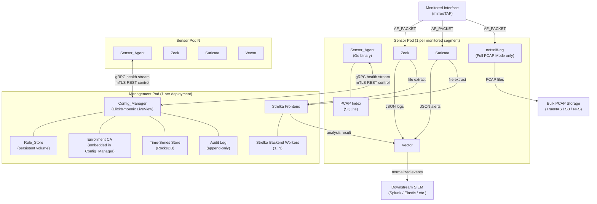
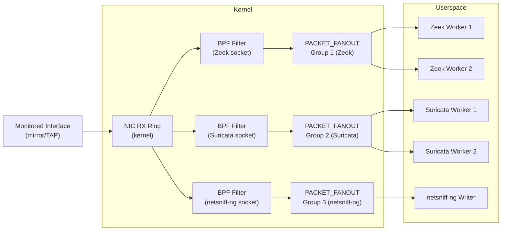
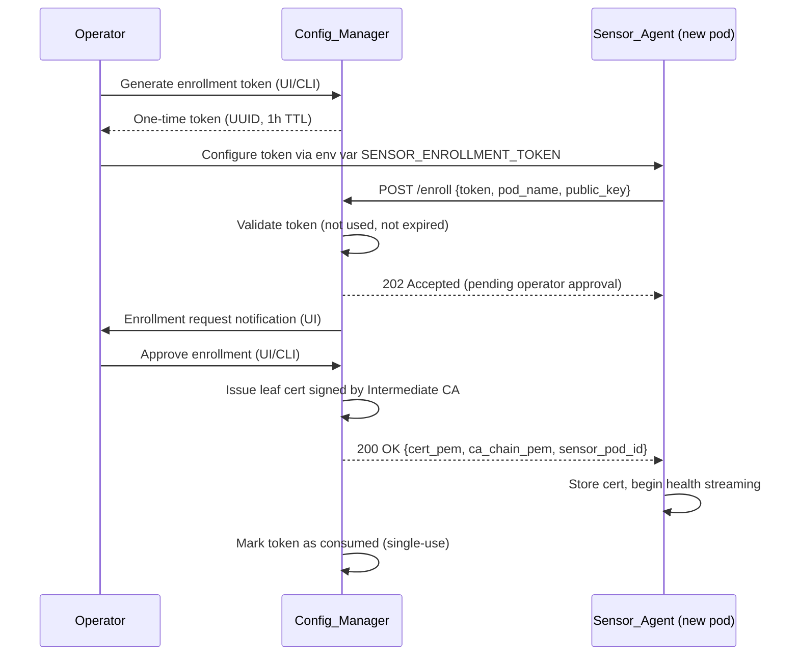
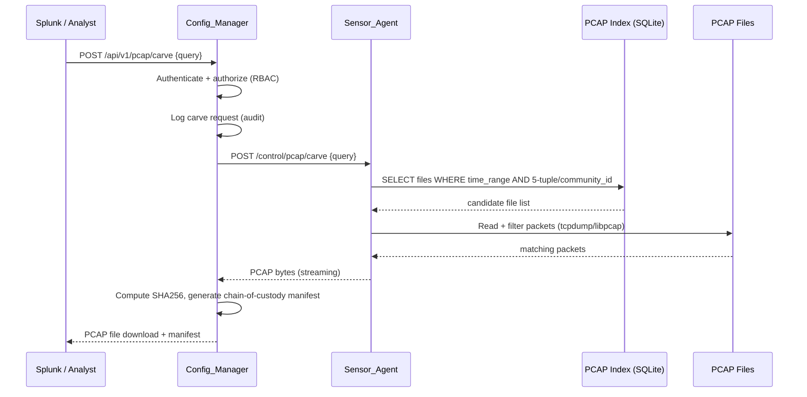
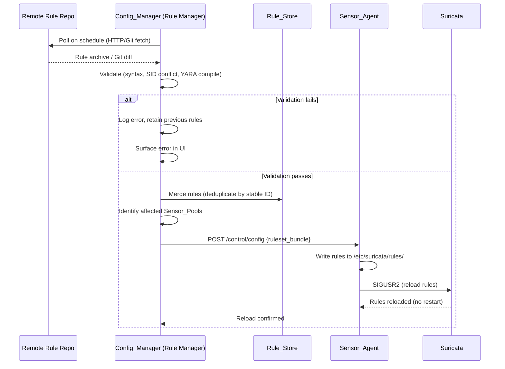
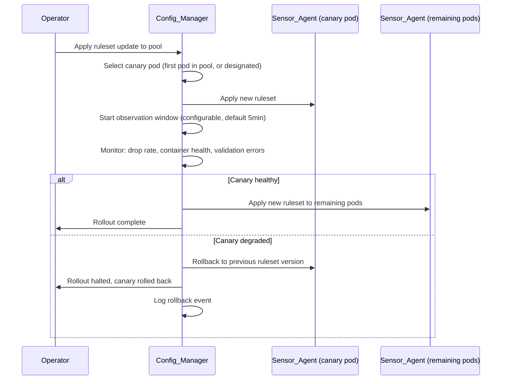
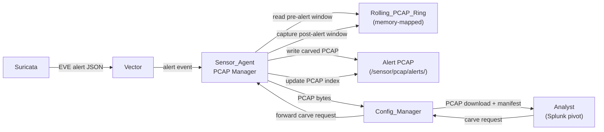
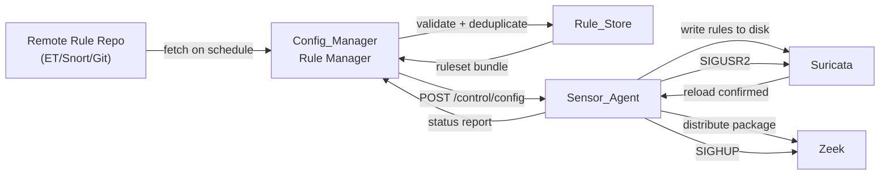

# Design Document: Network Sensor Stack

## Overview

The Network Sensor Stack is a containerized (Podman) network monitoring and analysis system designed for high-throughput traffic capture and analysis up to 25Gbps. It deploys as two pod types: a single **Management_Pod** providing centralized configuration, rule management, and health visibility, and one or more **Sensor_Pods** each performing independent packet capture and analysis for a monitored network segment.

The system integrates Zeek (protocol analysis), Suricata (signature detection), Strelka (file analysis), and Vector (log aggregation) as its core analysis stack. Each capture consumer attaches independently to the monitored interface via its own AF_PACKET socket with a distinct PACKET_FANOUT group, ensuring intra-tool worker scaling without inter-tool coupling. BPF filters shed elephant flows in the kernel before any packet reaches userspace.

Two operational modes are supported: **Full PCAP Mode** (netsniff-ng writes all packets to a three-tier storage hierarchy) and **Alert-Driven PCAP Mode** (a rolling ring buffer preserves pre/post-alert packet windows on qualifying detections). Mode switching is live and does not require a pod restart.

All pod-to-pod communication uses mutual TLS. The Sensor_Agent is the sole process with Podman socket access in each Sensor_Pod, enforcing a narrow control API that prevents the management plane from becoming a host-compromise path.

### Key Design Decisions

- **Elixir/Phoenix LiveView for Config_Manager**: BEAM's lightweight process model and built-in distribution primitives make it well-suited for maintaining thousands of concurrent health streams from Sensor_Pods. LiveView eliminates a separate WebSocket layer for the UI.
- **Podman Quadlet for container definitions**: Quadlet generates systemd units from container definitions, enabling native systemd supervision, dependency ordering, and journal integration without a container daemon.
- **SQLite for PCAP file index**: Per-Sensor_Pod SQLite database provides fast time-range and file-level lookups without an external database dependency. WAL mode supports concurrent reads during writes. Flow-level session indexing is an optional Tier 2 enhancement populated from Zeek/Suricata metadata.
- **RocksDB-backed time-series store**: Embedded RocksDB in the Config_Manager provides efficient time-ordered metric writes and range scans for the 72-hour history window without an external TSDB.
- **gRPC for health streaming**: Bidirectional gRPC streams between Sensor_Agent and Config_Manager provide efficient multiplexed health telemetry with built-in backpressure and reconnection semantics.
- **mTLS with ECDSA P-256 certificates**: Short-lived (24h) ECDSA certificates issued by an embedded CA in the Config_Manager. Rotation is automated and non-disruptive.
- **Rolling PCAP Ring as a separate capture process**: In Alert-Driven Mode, the Rolling_PCAP_Ring is maintained by a dedicated `pcap_ring_writer` process (not the Sensor_Agent itself) to keep the Sensor_Agent off the high-rate packet path. The Sensor_Agent's PCAP Manager controls the ring writer and handles carve operations.

---

## Non-Goals

The following are explicitly out of scope for this platform:

- **Not a SIEM replacement**: The platform does not provide case management, ticketing, or investigation workflows. It is designed to feed existing SIEM platforms (Splunk, Elastic, OpenSearch).
- **Not an endpoint telemetry platform**: The platform monitors network traffic only. Endpoint agents, EDR, and host-based detection are out of scope.
- **Not a full SOC-in-a-box**: The platform does not bundle a SIEM, SOAR, or threat intelligence platform. It is a sensor fabric with a management plane.
- **No Kubernetes requirement**: The platform runs on Podman with Quadlet/systemd. Kubernetes is not required and not targeted.
- **No specialized NIC requirement for v1**: v1 targets standard Intel/Broadcom NICs. AF_XDP, DPDK, and PF_RING are v2+ optional engines.
- **No guaranteed 25Gbps on commodity hardware**: 25Gbps operation requires validated hardware (NIC, NVMe, CPU) as defined in the benchmark profiles. Commodity hardware is supported at lower throughput tiers.
- **No built-in threat intelligence enrichment**: TI enrichment is handled downstream in Cribl/Splunk/Vector transforms, not in the sensor platform itself.

---

## Architecture

### System Architecture Diagram



### Pod Composition

**Management_Pod containers:**

| Container | Image Base | Purpose | Phase |
|---|---|---|---|
| config_manager | Elixir/OTP Alpine | Phoenix LiveView web app, CA, rule store, metric store | MVP |
| strelka_frontend | Python Alpine | File submission API, dedup cache, sighting tracker | v1 |
| strelka_backend | Python Alpine | File scanner workers (1..N, horizontally scalable) | v1 |

**Sensor_Pod containers:**

| Container | Image Base | Purpose | Phase |
|---|---|---|---|
| sensor_agent | Go Alpine (static) | Control API, health, config apply, PCAP manage | MVP |
| zeek | Zeek official | Protocol analysis, connection logs | MVP |
| suricata | Suricata official | Signature detection, alert generation | MVP |
| vector | Vector official | Log collection, normalization, forwarding | MVP |
| pcap_ring_writer | Go Alpine (static) | Alert-Driven rolling ring buffer (Alert-Driven Mode) | MVP |
| netsniff-ng | Debian slim | Full PCAP capture (Full PCAP Mode only) | v1.5 |
| arkime | Arkime official | Optional indexed session search | v2 |

All containers run as `sensor-svc` (UID 10000, non-root). Zeek and Suricata are granted `CAP_NET_RAW` and `CAP_NET_ADMIN` only. All other capabilities are explicitly dropped. No container uses `--privileged`.

### Privilege Exceptions Table

| Container | Required Capabilities | Reason | Runs as Root? |
|---|---|---|---|
| zeek | CAP_NET_RAW, CAP_NET_ADMIN | AF_PACKET socket access | No (sensor-svc) |
| suricata | CAP_NET_RAW, CAP_NET_ADMIN | AF_PACKET socket access | No (sensor-svc) |
| netsniff-ng | CAP_NET_RAW, CAP_NET_ADMIN | Raw packet capture | No (sensor-svc) |
| sensor_agent | Podman socket group membership | Controlled container lifecycle via allowlist | No (sensor-svc, podman group) |
| pcap_ring_writer | CAP_NET_RAW | AF_PACKET socket for rolling ring | No (sensor-svc) |
| vector | None | Log forwarding only | No (sensor-svc) |
| config_manager | None | Web app, no host access | No (sensor-svc) |
| strelka_frontend | None | File analysis API | No (sensor-svc) |
| strelka_backend | None | File scanner workers | No (sensor-svc) |
| arkime (optional) | CAP_NET_RAW, CAP_NET_ADMIN | Packet capture for session indexing | No (sensor-svc) |

The Sensor_Agent accesses the Podman socket via group membership (`podman` group), not root. It maintains an explicit allowlist of manageable containers and permitted actions — it cannot start arbitrary containers, pull images, or exec into containers.

---

## Packet Capture Path

### AF_PACKET Socket Architecture

Each capture consumer (Zeek, Suricata, netsniff-ng) binds its own `AF_PACKET` socket to the monitored interface. PACKET_FANOUT distributes traffic across each tool's internal worker threads — it does not duplicate the stream between tools. All consumers receive the full traffic stream independently.



### Fanout Group Assignment

Fanout group IDs are assigned statically in the Sensor_Pod configuration and validated by the Sensor_Agent before any capture process starts:

| Consumer | Fanout Group ID | Fanout Mode |
|---|---|---|
| Zeek | 1 | PACKET_FANOUT_HASH |
| Suricata | 2 | PACKET_FANOUT_HASH |
| netsniff-ng | 3 | PACKET_FANOUT_HASH |
| pcap_ring_writer | 4 | PACKET_FANOUT_HASH |

IDs are configurable but must be distinct. The Sensor_Agent validates uniqueness at startup and rejects duplicate IDs with a descriptive error.

### BPF Filter Application

BPF filters are loaded from a mounted filter file (`/etc/sensor/bpf_filters.conf`) and compiled to BPF bytecode by the Sensor_Agent using the kernel's `SO_ATTACH_FILTER` socket option. The filter is applied per-socket before the fanout group is joined.

Supported elephant flow exclusion classes:
- Storage replication: iSCSI (TCP/3260), NFS (TCP/UDP 2049) between configurable trusted CIDR pairs
- Encrypted media: configurable destination IP/port ranges (e.g., RTSP, HLS CDN ranges)
- Trusted bulk transfers: configurable source/destination CIDR pairs

**Hot reload**: When the BPF filter file changes, the Sensor_Agent validates the new filter profile and applies it per-consumer as follows:
- For **pcap_ring_writer**: the Sensor_Agent sends the updated BPF profile to pcap_ring_writer via its Unix socket control interface (`configure` command). pcap_ring_writer reattaches the filter to its own socket.
- For **Zeek and Suricata**: the Sensor_Agent writes the updated tool-specific capture configuration (Zeek's `af_packet.bpf_filter`, Suricata's `bpf-filter` in suricata.yaml) and triggers a controlled capture reload (SIGHUP/SIGUSR2). These tools own their own AF_PACKET sockets — the Sensor_Agent does not directly attach filters to them.

The Sensor_Agent reports per-consumer whether the filter was applied live or required a socket rebind, and reports the event to the Config_Manager.

### Ring Buffer Sizing

At 25Gbps with a 64-byte minimum frame, the packet rate is approximately 48Mpps. Ring buffer sizing recommendations per throughput tier:

| Tier | Line Rate | TPACKET_V3 Block Size | Ring Frames | Recommended NIC |
|---|---|---|---|---|
| 1Gbps | 1Gbps | 4MB | 2048 | Any 1G NIC |
| 10Gbps | 10Gbps | 64MB | 16384 | Intel X710 / Mellanox CX4 |
| 25Gbps | 25Gbps | 256MB | 65536 | Intel E810 / Mellanox CX5+ |

All consumers use `TPACKET_V3` (block-based) ring buffers for reduced syscall overhead.

### Optional Capture Engines

AF_XDP, DPDK, and PF_RING are documented as optional pluggable capture engines for v2+. They are not built in v1. The Sensor_Agent's Capture Manager module is designed with a pluggable backend interface to accommodate these engines without architectural changes.

---

## Components and Interfaces

### Sensor Agent

The Sensor_Agent is a statically compiled Go binary running as the sole process with Podman socket access in each Sensor_Pod. It exposes two interfaces to the Config_Manager:

1. **gRPC health stream** (persistent, mTLS): bidirectional stream for continuous health metric telemetry
2. **mTLS REST control API** (request/response): for all lifecycle and configuration operations

#### Internal Module Architecture

```
Sensor_Agent
├── Control API          — mTLS REST server, action allowlist enforcement
├── Health Collector     — scrapes container stats, AF_PACKET counters, disk, clock
├── Config Applier       — writes config files, signals services to reload
├── Capture Manager      — manages AF_PACKET socket lifecycle, BPF filter, pcap_ring_writer control
├── PCAP Manager         — controls ring writer, alert-driven carve, FIFO pruning, index updates
├── Rule Validator       — validates Suricata rules, YARA, Zeek packages, BPF syntax
├── Certificate Manager  — requests/rotates mTLS certs from Config_Manager CA
├── Local Audit Logger   — append-only local audit log (JSON lines)
└── Host Readiness Checker — pre-capture validation of host prerequisites
```

Each module exposes a well-defined internal interface and is independently unit-testable. The Control API module is the only module that accepts external input; all other modules are invoked internally. This boundary prevents the Sensor_Agent from becoming a monolithic hard-to-test daemon.

#### Control API Allowlist

The Sensor_Agent accepts only these actions over the mTLS REST API. Any other action is rejected with HTTP 403 and logged:

| Action | Method | Path | Description |
|---|---|---|---|
| reload-zeek | POST | /control/reload/zeek | Signal Zeek to reload scripts |
| reload-suricata | POST | /control/reload/suricata | Signal Suricata to reload rules |
| restart-vector | POST | /control/restart/vector | Restart Vector container |
| switch-capture-mode | POST | /control/capture-mode | Switch Full/Alert-Driven mode |
| apply-pool-config | POST | /control/config | Apply pool configuration bundle |
| rotate-cert | POST | /control/cert/rotate | Initiate certificate rotation |
| report-health | GET | /health | Return current health snapshot |
| carve-pcap | POST | /control/pcap/carve | Execute PCAP carve request |
| validate-config | POST | /control/config/validate | Validate config without applying |

#### Health Metric Schema (gRPC)

```protobuf
message HealthReport {
  string sensor_pod_id = 1;
  int64 timestamp_unix_ms = 2;
  repeated ContainerHealth containers = 3;
  CaptureStats capture = 4;
  StorageStats storage = 5;
  ClockStats clock = 6;
}

message ContainerHealth {
  string name = 1;
  string state = 2;       // running, stopped, error, restarting
  int64 uptime_seconds = 3;
  double cpu_percent = 4;
  uint64 memory_bytes = 5;
}

message CaptureStats {
  map<string, ConsumerStats> consumers = 1;  // keyed by consumer name
}

message ConsumerStats {
  uint64 packets_received = 1;
  uint64 packets_dropped = 2;
  double drop_percent = 3;
  double throughput_bps = 4;
}
```

#### Offline Operation

When the Config_Manager is unreachable, the Sensor_Agent:
1. Continues all capture operations using the last applied configuration (persisted to `/etc/sensor/last-known-config.json`)
2. Buffers health metrics to a local ring file (`/var/sensor/health-buffer.bin`, configurable max size)
3. Retries the gRPC connection with exponential backoff (1s → 2s → 4s → ... → 60s max)
4. On reconnection, replays buffered metrics and performs a config state reconciliation

### Config Manager

The Config_Manager is an Elixir/Phoenix application. Key library choices:

- **Phoenix LiveView**: real-time UI without a separate JS framework
- **Ecto + SQLite**: pool configs, enrollment records, rule store metadata, audit log
- **Mint/Finch**: HTTP client for rule repository polling
- **x509 (Erlang)**: certificate generation and CA operations
- **Prometheus.ex**: metrics exposition

#### Internal Module Architecture

```
Config_Manager (Elixir/OTP)
├── Web Layer (Phoenix)
│   ├── LiveView dashboards (health, data flow, pool management)
│   ├── REST API (public, token-authenticated)
│   └── Auth (OIDC/SAML via Ueberauth, local fallback)
├── Sensor Registry
│   ├── Enrollment workflow (token issuance, operator approval)
│   ├── Certificate Authority (ECDSA P-256, 24h leaf certs)
│   └── CRL management
├── Pool Manager
│   ├── Pool CRUD and membership
│   ├── Config versioning (timestamp + operator + diff)
│   └── Canary deployment orchestrator
├── Rule Manager
│   ├── Rule_Store (SQLite + file storage)
│   ├── Repository poller (GenServer per repo)
│   └── Ruleset composer and distributor
├── Health Aggregator
│   ├── gRPC server (accepts Sensor_Agent streams)
│   ├── Time-series writer (RocksDB)
│   └── Threshold monitor (annotations + alerts)
├── PCAP Carve API
│   ├── Request validator and router
│   └── Chain-of-custody manifest generator
└── Audit Logger
    └── Append-only audit log (SQLite WAL)
```

#### Config_Manager does NOT:
- Access the Podman socket directly
- SSH into sensor nodes
- Execute arbitrary commands on sensor nodes
- Pull or push container images to sensor nodes

All container lifecycle operations are mediated through the Sensor_Agent's narrow control API.

### Strelka

Strelka runs in the Management_Pod as a shared service for all Sensor_Pods.

- **Frontend**: Python FastAPI service accepting file submissions over HTTPS (mTLS). Maintains a Redis-backed deduplication cache keyed by SHA256 + TTL. Records per-sighting metadata (sensor ID, 5-tuple, Community_ID, timestamp) in a separate sightings table.
- **Backend workers**: Python workers consuming from a Redis work queue. Horizontally scalable (1..N containers). Each worker runs the configured scanner plugins.
- **Dedup TTL**: configurable (default 1 hour). Within the TTL window, identical files return cached results without re-processing.

### Vector

Vector runs in each Sensor_Pod and is the sole log egress path.

- Collects from: Zeek log directory (file source), Suricata EVE JSON socket (unix socket source), Strelka result stream (HTTP source)
- Transforms: Community_ID enrichment, schema normalization (raw / ECS / OCSF / Splunk CIM / custom remap)
- Sinks: configurable per deployment (syslog, HTTP/S, file, Kafka, S3, etc.)
- Buffer: disk-backed buffer (configurable max size, default 1GB) with FIFO drop on overflow

Schema mode is selectable per sink via the Config_Manager without restarting Vector. The active Vector configuration is written by the Sensor_Agent's Config Applier module and Vector is signaled to reload via SIGHUP.

---

## Data Models

### Sensor_Pod Identity

```elixir
# Ecto schema (Config_Manager)
schema "sensor_pods" do
  field :id, :string              # UUID, assigned at enrollment
  field :name, :string            # operator-assigned human name
  field :pool_id, :string         # FK to sensor_pools
  field :status, :string          # enrolled, pending, revoked
  field :cert_serial, :string     # current leaf cert serial
  field :cert_expires_at, :utc_datetime
  field :last_seen_at, :utc_datetime
  field :enrolled_at, :utc_datetime
  field :enrolled_by, :string     # operator identity
  timestamps()
end
```

### Sensor_Pool Configuration

```elixir
schema "sensor_pools" do
  field :id, :string
  field :name, :string
  field :capture_mode, :string    # full_pcap | alert_driven
  field :ruleset_id, :string      # FK to rulesets
  field :zeek_policy, :string
  field :bpf_filter_id, :string   # FK to bpf_filter_profiles
  field :strelka_policy, :map     # JSON blob
  field :suricata_config, :map    # JSON blob
  field :config_version, :integer
  field :config_updated_at, :utc_datetime
  field :config_updated_by, :string
  timestamps()
end
```

### Rule Store Entry

```elixir
schema "rules" do
  field :id, :string              # UUID
  field :type, :string            # suricata | yara | zeek_package
  field :stable_id, :string       # SID for Suricata, name/hash for YARA
  field :content, :binary         # rule text or package reference
  field :source_repo_id, :string  # FK to rule_repositories
  field :enabled, :boolean
  field :category, :string
  field :fetched_at, :utc_datetime
  timestamps()
end
```

### PCAP Index Entry (SQLite, per Sensor_Pod)

The PCAP index has two layers:

**Tier 1 — File-level index** (MVP, always present): indexes PCAP files by time range. Fast and low-overhead.

**Tier 2 — Flow/session index** (optional, populated from Zeek/Suricata metadata): enables faster pivots by Community_ID, 5-tuple, Zeek UID, and Suricata alert ID. Populated asynchronously from Zeek conn.log and Suricata EVE JSON after capture.

```sql
-- Tier 1: file-level index (always present)
CREATE TABLE pcap_files (
    id           INTEGER PRIMARY KEY AUTOINCREMENT,
    file_path    TEXT NOT NULL,
    start_time   INTEGER NOT NULL,   -- Unix ms
    end_time     INTEGER NOT NULL,   -- Unix ms
    interface    TEXT NOT NULL,
    packet_count INTEGER NOT NULL,
    byte_count   INTEGER NOT NULL,
    alert_driven INTEGER DEFAULT 0   -- 1 if alert-triggered carve
);

CREATE INDEX idx_file_time_range ON pcap_files(start_time, end_time);

-- Tier 2: flow/session index (optional, populated from Zeek/Suricata)
CREATE TABLE pcap_flows (
    id                INTEGER PRIMARY KEY AUTOINCREMENT,
    file_id           INTEGER NOT NULL REFERENCES pcap_files(id),
    src_ip            TEXT,
    dst_ip            TEXT,
    src_port          INTEGER,
    dst_port          INTEGER,
    proto             INTEGER,
    community_id      TEXT,
    zeek_uid          TEXT,
    suricata_alert_id TEXT,
    flow_start        INTEGER,       -- Unix ms
    flow_end          INTEGER        -- Unix ms
);

CREATE INDEX idx_community_id ON pcap_flows(community_id);
CREATE INDEX idx_five_tuple   ON pcap_flows(src_ip, dst_ip, src_port, dst_port, proto);
CREATE INDEX idx_zeek_uid     ON pcap_flows(zeek_uid);
```

PCAP carve requests first query the file-level index to identify candidate files by time range, then optionally filter by flow metadata if the Tier 2 index is populated.

### Health Metric (Time-Series, RocksDB)

Key format: `{sensor_pod_id}:{container_name}:{metric_name}:{unix_ms_be}`

Value: MessagePack-encoded float64

This layout enables efficient range scans by pod+container+metric over any time window. Retention is enforced by a background compaction job that deletes keys older than the configured window (default 72h).

### Audit Log Entry

```json
{
  "id": "uuid",
  "timestamp": "2024-01-15T10:30:00.000Z",
  "actor": "user@example.com",
  "actor_type": "user | api_token | system",
  "action": "config_change | rule_change | mode_switch | pcap_carve | ...",
  "target_type": "sensor_pod | pool | rule | cert | ...",
  "target_id": "uuid",
  "result": "success | failure",
  "detail": { ... }
}
```

### PCAP Carve Request / Chain-of-Custody Manifest

```json
{
  "request": {
    "id": "uuid",
    "sensor_pod_id": "uuid",
    "requested_by": "user@example.com",
    "requested_at": "2024-01-15T10:30:00.000Z",
    "justification": "Investigation of alert SID:2034567",
    "query": {
      "start_time": "2024-01-15T10:00:00.000Z",
      "end_time": "2024-01-15T10:05:00.000Z",
      "community_id": "1:abc123...",
      "src_ip": "10.0.0.1",
      "dst_ip": "10.0.0.2",
      "src_port": 54321,
      "dst_port": 443,
      "proto": 6
    }
  },
  "result": {
    "status": "success | not_found | error",
    "file_sha256": "abc123...",
    "packet_count": 1234,
    "byte_count": 567890,
    "delivered_at": "2024-01-15T10:30:05.000Z"
  }
}
```

---

## mTLS and Certificate Lifecycle

### Certificate Authority

The Config_Manager hosts an embedded ECDSA P-256 certificate authority. The CA hierarchy is:

```
Root CA (offline, operator-held)
  └── Intermediate CA (Config_Manager, online)
        ├── Config_Manager server cert (24h, auto-rotated)
        ├── Sensor_Pod leaf cert (24h, issued at enrollment)
        └── API token signing cert (90d)
```

The Root CA private key is generated once during initial deployment and stored offline (operator responsibility). The Intermediate CA is the operational CA used for all day-to-day issuance.

### Enrollment Flow



### Certificate Rotation

Certificates are rotated automatically before expiry (default: rotate when 6h remain on a 24h cert). The rotation is non-disruptive:

1. Sensor_Agent requests a new cert from Config_Manager CA (`POST /control/cert/rotate`)
2. Config_Manager issues a new cert with the same sensor identity
3. Sensor_Agent loads the new cert into memory
4. Sensor_Agent begins using the new cert for new connections
5. Existing connections drain naturally (no forced disconnect)
6. Old cert is discarded after all connections have migrated

### Certificate Revocation

The Config_Manager maintains a CRL (Certificate Revocation List) distributed to all Sensor_Agents as part of the health stream. Sensor_Agents check the CRL on every incoming connection. Revoked sensor identities are rejected at the TLS handshake layer.

### Port Assignments

| Service | Port | Protocol | Direction |
|---|---|---|---|
| Config_Manager web UI | 8443 | HTTPS (mTLS optional) | inbound |
| Config_Manager REST API | 8443 | HTTPS + mTLS | inbound from Sensor_Agents |
| Sensor_Agent gRPC health stream | 9090 | gRPC/mTLS | outbound to Config_Manager |
| Sensor_Agent control API | 9091 | HTTPS/mTLS | inbound from Config_Manager |
| Strelka frontend | 57314 | HTTPS/mTLS | inbound from Sensor_Pods |
| Prometheus metrics | 9100 | HTTP (internal) | inbound from scraper |

---

## PCAP Storage Layout and Indexing

### Three-Tier Storage Hierarchy (Full PCAP Mode)

```
Sensor_Pod host filesystem:

/sensor/pcap/
├── tier0/          ← Tier 0: NVMe ring buffer (primary write target)
│   ├── ring_000.pcap
│   ├── ring_001.pcap
│   └── ...         (fixed-count rotating files, e.g., 100 × 10GB = 1TB)
├── tier1/          ← Tier 1: retained PCAP for indexed access
│   ├── 2024/01/15/
│   │   ├── 10_00_00.pcap
│   │   └── ...
│   └── pcap.db     ← SQLite PCAP index (WAL mode)
└── tier2/          ← Tier 2: mount point for remote storage (NFS/iSCSI/S3FS)
    └── (async replicated from tier1)
```

**Tier 0** is the primary write target. netsniff-ng writes directly to the Tier 0 ring. A background process (part of PCAP Manager) promotes completed ring files to Tier 1 and updates the SQLite index.

**Tier 1** is the indexed access layer. The SQLite index is updated atomically as files are promoted from Tier 0. PCAP carve requests query Tier 1.

**Tier 2** is optional async replication. At 25Gbps, remote storage cannot keep up with line-rate writes and is archival only. Replication uses `rsync` or an S3-compatible client depending on the configured backend.

### FIFO Pruning

When storage at the designated PCAP path reaches the critical threshold (default 90%), the PCAP Manager:
1. Queries the SQLite index for the oldest files by `start_time`
2. Deletes files in FIFO order, removing index entries atomically
3. Continues until storage drops below the low-water mark (default 75%)
4. If pruning cannot reclaim sufficient space within the configurable timeout (default 60s), logs a critical error and notifies the Config_Manager

### Alert-Driven PCAP Ring Buffer

In Alert-Driven Mode, a dedicated `pcap_ring_writer` process (separate from the Sensor_Agent) owns the AF_PACKET socket and maintains the `Rolling_PCAP_Ring`. This keeps the Sensor_Agent off the high-rate packet path — it acts as a control plane component only.

```
pcap_ring_writer (separate process, CAP_NET_RAW):
  - owns AF_PACKET socket (fanout group 4, distinct from Zeek/Suricata)
  - writes raw packets to memory-mapped ring at line rate
  - exposes a Unix socket control interface to the Sensor_Agent PCAP Manager

Sensor_Agent PCAP Manager:
  - controls pcap_ring_writer lifecycle (start/stop/configure)
  - listens for qualifying alerts from Vector alert listener
  - instructs pcap_ring_writer to carve a time window on alert
  - writes carved PCAP to disk and updates SQLite index
```

```
/dev/shm/sensor_pcap_ring    ← memory-mapped ring (configurable size, default 4GB)
/sensor/pcap/alerts/         ← carved alert PCAPs written here
    alert_{community_id}_{timestamp}.pcap
    pcap.db                  ← SQLite index for alert PCAPs
```

On a qualifying alert (severity >= configured threshold):
1. Suricata writes a JSON alert to its EVE socket
2. Vector forwards the alert to the Sensor_Agent's alert listener
3. PCAP Manager instructs pcap_ring_writer to mark the pre-alert window start
4. PCAP Manager waits for the post-alert window to expire
5. PCAP Manager instructs pcap_ring_writer to carve the combined window to disk
6. PCAP Manager updates the SQLite index with the carved file metadata

The ring buffer continuously overwrites the oldest packets when no alert fires. No disk I/O occurs during normal (no-alert) operation.

### PCAP Carve Execution



---

## Rule Deployment Flow

### Rule Store Architecture

The Rule_Store is backed by SQLite (metadata) + a local filesystem tree (rule content):

```
/data/rules/
├── suricata/
│   ├── emerging-threats/
│   │   └── *.rules
│   ├── snort-community/
│   │   └── *.rules
│   └── custom/
│       └── *.rules
├── yara/
│   ├── {repo_name}/
│   │   └── *.yar
│   └── custom/
│       └── *.yar
└── zeek/
    └── packages/
        └── {package_name}/
```

### Rule Update Flow



### Canary Deployment Flow



### Git-Backed Detection Repos

For Git-backed repositories:
1. Config_Manager clones/fetches the configured branch
2. Validates signatures on signed bundles (GPG or Sigstore)
3. Runs full validation suite (syntax, compile, SID conflict)
4. Only validated commits are eligible for deployment
5. Version pinning: operators can pin a pool to a specific Git commit SHA

### Zeek Package Management

Zeek packages are managed via `zkg` running inside the Config_Manager container:
- `zkg install {package}` → installs to Rule_Store
- `zkg bundle` → creates a distributable bundle
- Bundle is distributed to Sensor_Pods via the Sensor_Agent's `apply-pool-config` action
- Zeek is signaled to reload via `zeekctl deploy` equivalent (SIGHUP to the Zeek process)

---

## Data Flow Diagrams

### Live Capture → SIEM

```mermaid
graph LR
    NIC["Network Interface\n(mirror/TAP)"]
    ZK["Zeek\n(AF_PACKET)"]
    SU["Suricata\n(AF_PACKET)"]
    SF["Strelka Frontend\n(Management_Pod)"]
    VE["Vector\n(Sensor_Pod)"]
    SIEM["SIEM\n(Splunk/Elastic)"]

    NIC -->|raw packets| ZK
    NIC -->|raw packets| SU
    ZK -->|conn.log, dns.log, etc.\n(JSON, Community_ID)| VE
    SU -->|eve.json alerts\n(Community_ID)| VE
    ZK -->|extracted files| SF
    SU -->|extracted files| SF
    SF -->|analysis results\n(Community_ID, sightings)| VE
    VE -->|normalized events\n(ECS/OCSF/CIM/raw)| SIEM
```

### Alert → PCAP Carve



### Rule Update → Sensor



---

## Failure Mode Matrix

| Failure | Detection | Sensor_Pod Behavior | Config_Manager Behavior |
|---|---|---|---|
| Zeek container crash | Sensor_Agent health check | Restart Zeek (systemd); Suricata/Vector unaffected | Surface error in UI; alert if restart loop |
| Suricata container crash | Sensor_Agent health check | Restart Suricata; Zeek/Vector unaffected | Surface error in UI |
| Vector container crash | Sensor_Agent health check | Restart Vector; logs buffer in Zeek/Suricata output dirs | Surface error; warn on buffer fill |
| netsniff-ng crash (Full PCAP) | Sensor_Agent health check | Restart netsniff-ng; PCAP gap recorded in index | Surface error; note gap in PCAP coverage |
| AF_PACKET socket loss (Zeek) | Zeek internal reconnect | Zeek retries at configurable interval | Surface degraded status |
| BPF filter reload failure | Sensor_Agent validation | Retain previous filter; log error | Surface error; block deployment |
| PCAP storage full | PCAP Manager threshold check | FIFO prune; if prune fails → critical log | Surface critical alert with pod ID |
| Management_Pod unreachable | gRPC reconnect timeout | Continue with last-known config; buffer metrics | N/A (management plane down) |
| Management_Pod restored | gRPC reconnect success | Replay buffered metrics; reconcile config | Reconcile state; surface any drift |
| Invalid cert presented | TLS handshake | Reject connection; log rejection | Log rejection; alert if repeated |
| Revoked cert presented | CRL check at handshake | Reject connection; log | Alert operator |
| Clock drift > threshold | Sensor_Agent clock monitor | Report degraded clock metric | Mark pod degraded in UI; alert |
| Suricata rule reload failure | Sensor_Agent monitors SIGUSR2 result | Log error; retain previous rules | Surface error; halt pool rollout |
| Canary pod degradation | Config_Manager observation window | Rollback canary to previous config | Halt pool rollout; notify operator |
| Strelka frontend unreachable | Sensor_Pod submission timeout | Log timeout; discard pending submission | Surface Strelka connectivity error |
| Rule repo fetch failure | HTTP/Git error | N/A (Management_Pod operation) | Log failure; retain previous rules; surface in UI |
| Config_Manager container restart | Podman/systemd supervision | Continue operating; reconnect on restart | Restore state from SQLite + RocksDB |

---

## Performance Considerations and Benchmark Profiles

### Benchmark Profile Structure

Each benchmark profile defines a reproducible test scenario:

```yaml
# Example: 25Gbps benchmark profile
name: "25gbps-full-pcap"
throughput_tier: 25Gbps
packet_mix:
  avg_packet_size_bytes: 512
  min_packet_size_bytes: 64
  flows_per_second: 500000
  new_connections_per_second: 50000
  protocol_mix:
    tcp: 70%
    udp: 25%
    other: 5%
analysis:
  suricata_ruleset_size: 50000  # rules
  zeek_packages: ["base", "conn", "dns", "http", "ssl", "files"]
  file_extraction_enabled: true
  strelka_submission_enabled: true
pcap_mode: full_pcap
storage:
  tier0_target: local_nvme
  tier0_write_rate_target_gbps: 25
  tier1_enabled: true
  tier2_enabled: false  # not supported at 25Gbps line rate
host_baseline:
  cpu_cores: 32
  ram_gb: 128
  nic: "Intel E810 / Mellanox CX5+"
  nvme_write_speed_gbps: 7
acceptance_criteria:
  max_packet_loss_percent: 0.1
  max_cpu_percent: 85
  max_memory_percent: 80
```

### sensorctl benchmark Command

```
sensorctl benchmark --profile 25gbps-full-pcap --sensor-pod <id> --duration 300s
```

Output:
- Measured throughput (Gbps)
- Packet drop rate (%)
- CPU utilization per container
- Memory utilization per container
- Disk write rate (MB/s)
- AF_PACKET ring utilization per consumer

### Performance Tuning Recommendations

**NIC and kernel tuning** (documented in deployment guide, not hardcoded):
- `ethtool -G {iface} rx 4096` — maximize RX ring
- `ethtool -K {iface} gro off lro off` — disable offloads that interfere with AF_PACKET
- `net.core.rmem_max=134217728` — increase socket receive buffer
- `net.core.netdev_max_backlog=250000` — increase backlog queue
- CPU pinning: Zeek and Suricata workers pinned to isolated CPUs (NUMA-aware)
- IRQ affinity: NIC interrupts pinned to CPUs on the same NUMA node as the NIC

**Full PCAP at 25Gbps**:
- Requires local NVMe as Tier 0 write target (7+ GB/s sustained write)
- Remote NFS/iSCSI as sole write target is not supported at this throughput tier
- BPF filters are critical: elephant flow exclusion can reduce effective capture rate by 30-60% in typical enterprise environments

**Alert-Driven Mode at 25Gbps**:
- Rolling ring buffer sized to hold the configured pre-alert window at line rate
- At 25Gbps with 60s pre-alert window: ~187GB ring buffer required
- Memory-mapped ring avoids kernel/userspace copy overhead
- No disk I/O during normal operation; only on alert trigger

---

## Deployment Profiles

Four deployment profiles are defined to guide operators toward appropriate configurations for their environment.

### Lab Profile
- 1 Sensor_Pod, 1 Management_Pod on the same host or adjacent hosts
- Local disk storage (no remote archival required)
- No Strelka backend scaling (single worker)
- Local authentication (no SSO)
- Alert-Driven PCAP Mode (no NVMe requirement)
- Target throughput: 1Gbps
- Suitable for: development, testing, training, small network segments

### Enterprise Profile
- 1–N Sensor_Pods, 1 Management_Pod on dedicated hardware
- Cribl/Splunk log forwarding via Vector
- OIDC/SAML SSO + RBAC
- mTLS enrollment with operator approval
- Alert-Driven or Full PCAP Mode (local NVMe for Full PCAP)
- Remote TrueNAS/NFS/S3 for PCAP archival (Tier 2)
- Target throughput: 1–10Gbps
- Suitable for: enterprise SOC, MSSP sensor deployments

### High-Throughput Profile
- Dedicated sensor hardware per monitored segment
- Local NVMe as Tier 0 PCAP write target (mandatory)
- BPF elephant flow exclusions configured and validated
- NIC/IRQ/CPU tuning applied per performance guide
- Benchmark validation required before production
- Target throughput: 10–25Gbps
- Suitable for: data center core, high-speed transit monitoring

### Air-Gapped Profile
- All container images loaded from offline bundle
- Rule updates via offline bundle import (no internet connectivity)
- Local CA only (no external PKI)
- Local authentication (no external SSO)
- All documentation bundled locally
- Suitable for: classified environments, ICS/OT networks, isolated labs

---

## Release Roadmap

Requirements are phased to define a buildable MVP and a clear progression to the full platform.

| Phase | Label | Scope |
|---|---|---|
| Phase 0 | MVP | Proof of capture: Zeek + Suricata with distinct AF_PACKET fanout groups, BPF filter validation, Vector forwarding, basic packet/drop metrics, local-only config files |
| Phase 1 | MVP | Sensor Agent, Config Manager basic enrollment + health dashboard + mode switching, mTLS, Community ID, local PCAP file index, Alert-Driven PCAP Ring, Splunk/Cribl output, basic support bundle, internal dev CLI (`sensorctl enroll`, `status`, `show-drops`, `collect-support-bundle`) |
| Phase 2 | v1 | Sensor pools, rule store (Suricata + YARA + Zeek packages), config versioning, rollback, RBAC + local auth, PCAP carve API, chain of custody |
| Phase 3 | v1 | Strelka sightings, schema normalization (ECS/OCSF/CIM), Splunk workflow action, health metric history, benchmark tooling (1Gbps + 10Gbps profiles) |
| Phase 4 | v1.5 | Full PCAP Mode (netsniff-ng + NVMe Tier 0 + FIFO pruning), GitOps detection workflow, SSO/SAML/OIDC, canary rollout, detection testing against uploaded PCAPs, Management Pod HA |
| Phase 5 | v2 | Arkime optional integration, air-gapped bundles, signed releases/SBOM, full public sensorctl CLI, full public REST API documentation, 25Gbps benchmark profile |
| Phase 6 | future | AF_XDP/DPDK/PF_RING pluggable capture engines, advanced benchmark automation |

**MVP scope** (Phases 0–1) is intentionally narrow: a working sensor with secure enrollment, Community ID, alert-driven PCAP, Splunk/Cribl forwarding, and a basic internal CLI for development use. Everything else is additive.

> **Internal dev CLI note:** A minimal `sensorctl` binary covering `enroll`, `status`, `show-drops`, and `collect-support-bundle` is included in Phase 1 for development and testing convenience. It is not a stable public API. The full documented public CLI and REST API are Phase 5 deliverables.

---

## Correctness Properties

*A property is a characteristic or behavior that should hold true across all valid executions of a system — essentially, a formal statement about what the system should do. Properties serve as the bridge between human-readable specifications and machine-verifiable correctness guarantees.*

### Property 1: Capture Consumer Fanout Group Uniqueness

*For any* valid Sensor_Pod capture configuration containing two or more active consumers (Zeek, Suricata, netsniff-ng), all assigned PACKET_FANOUT group IDs SHALL be distinct — no two consumers share the same fanout group ID.

**Validates: Requirements 2.2**

---

### Property 2: Invalid Capture Configuration Rejection

*For any* capture configuration containing at least one invalid field (duplicate fanout group ID, unrecognized fanout mode, non-existent interface name, syntactically invalid BPF filter, or zero capture thread count), the Sensor_Agent SHALL reject the configuration and return a descriptive error without starting any capture process.

**Validates: Requirements 2.3**

---

### Property 3: PCAP Storage FIFO Pruning Invariant

*For any* PCAP storage state where used capacity exceeds the configured critical threshold, executing the FIFO pruning algorithm SHALL result in used capacity falling below the configured low-water mark, and the PCAP index SHALL remain consistent (no index entries referencing deleted files, no files without index entries).

**Validates: Requirements 4.5, 5.7**

---

### Property 4: Alert-Driven Pre-Alert Window Preservation

*For any* qualifying alert event, the PCAP file carved by the PCAP Manager SHALL contain packets with timestamps spanning from at least (alert_time - pre_alert_window) to at least (alert_time + post_alert_window), ensuring attack context preceding the detection is not lost.

**Validates: Requirements 5.3, 5.4**

---

### Property 5: Strelka Deduplication and Sighting Completeness

*For any* set of N file submissions where K submissions share the same SHA256 hash (K ≤ N), the Strelka frontend SHALL perform at most one analysis per unique SHA256 within the deduplication TTL window, AND SHALL record exactly N sighting entries (one per submission) regardless of deduplication.

**Validates: Requirements 8.2, 8.3**

---

### Property 6: Vector Log Buffering Under Sink Unavailability

*For any* sequence of log records totaling less than the configured buffer size limit, when the downstream sink is unavailable, all records SHALL be retained in the local buffer and forwarded in order when the sink becomes available — no records are lost below the buffer limit.

**Validates: Requirements 9.3**

---

### Property 7: Sensor_Agent Action Allowlist Enforcement

*For any* control action request received by the Sensor_Agent, if the action is not in the explicit allowlist (reload-zeek, reload-suricata, restart-vector, switch-capture-mode, apply-pool-config, rotate-cert, report-health, carve-pcap, validate-config), the Sensor_Agent SHALL reject the request with a logged error and SHALL NOT execute any container operation.

**Validates: Requirements 11.4, 15.7**

---

### Property 8: Pool Configuration Propagation Completeness

*For any* pool-level configuration change applied via the Config_Manager, every Sensor_Pod that is a member of that pool at the time of the change SHALL receive the updated configuration and confirm application — no pool member is silently skipped.

**Validates: Requirements 12.4**

---

### Property 9: Rule Store Deduplication

*For any* set of rules fetched from one or more Rule_Repositories where multiple repositories contain rules with the same stable identifier (Suricata SID or YARA rule name/hash), the Rule_Store SHALL contain exactly one copy of each unique rule — no stable identifier appears more than once in the store.

**Validates: Requirements 13.2, 13.12**

---

### Property 10: PCAP Carve Query Fidelity

*For any* valid PCAP carve request specifying a time range and at least one of (5-tuple, Community_ID, Suricata alert ID, Zeek UID), every packet in the returned PCAP file SHALL match the query parameters — no packets outside the requested time range or not matching the specified flow identifiers are included.

**Validates: Requirements 14.3**

---

### Property 11: Community_ID Preservation Across All Output Types

*For any* network flow event processed by the Sensor_Stack, the Community_ID computed from the flow's 5-tuple SHALL be present and identical in: the Zeek connection log, the Suricata alert (if triggered), the Strelka file result (if a file was extracted), the Vector-normalized output in all configured schema modes (raw, ECS, OCSF, CIM), and the PCAP carve metadata.

**Validates: Requirements 17.1, 17.3, 18.3**

---

### Property 12: Log Schema Normalization Completeness

*For any* log event produced by Zeek, Suricata, or Strelka, transforming it through Vector's normalization pipeline in any configured schema mode (raw, ECS, OCSF, Splunk CIM) SHALL produce a valid output conforming to that schema — no required fields are missing and no field values are corrupted.

**Validates: Requirements 18.1**

---

### Property 13: Enrollment Token Single-Use Enforcement

*For any* enrollment token issued by the Config_Manager, the token SHALL be accepted for exactly one enrollment request — a second use of the same token SHALL be rejected regardless of whether the first enrollment was approved or denied.

**Validates: Requirements 19.1**

---

### Property 14: Certificate Rejection for Invalid, Expired, or Revoked Identities

*For any* TLS connection attempt where the presenting certificate is (a) syntactically invalid, (b) expired, (c) signed by an untrusted CA, or (d) listed in the current CRL, the receiving service SHALL reject the connection at the TLS handshake layer and log the rejection with the presenting identity.

**Validates: Requirements 15.3, 19.4**

---

### Property 15: Configuration Validation Blocks Invalid Deployments

*For any* configuration change that fails validation (invalid Suricata rule syntax, SID conflict, YARA compile error, Zeek package incompatibility, invalid BPF filter syntax, or conflicting capture mode settings), the Config_Manager SHALL reject the deployment and return the specific validation errors — no partial changes are applied to any Sensor_Pod.

**Validates: Requirements 20.2, 27.3**

---

### Property 16: Clock Drift Threshold Enforcement

*For any* Sensor_Pod where the measured clock offset exceeds the configured drift threshold (default 100ms), the Config_Manager SHALL mark that pod as degraded in the UI and record a timestamped annotation in the time-series store — no pod with excessive drift is shown as healthy.

**Validates: Requirements 22.3**

---

### Property 17: RBAC Action Enforcement

*For any* authenticated request to the Config_Manager REST API or UI, if the requesting identity's role does not include permission for the requested action, the request SHALL be rejected with HTTP 403 and an audit log entry SHALL be created — no action is silently permitted beyond role scope.

**Validates: Requirements 24.1**

---

### Property 18: Audit Log Completeness

*For any* auditable action performed in the Config_Manager (login, failed login, config change, rule change, mode switch, PCAP carve request, PCAP download, sensor enrollment, certificate rotation, failed mTLS connection), an audit log entry SHALL be created containing timestamp, actor identity, action, target, and result — no auditable action is silently omitted from the log.

**Validates: Requirements 24.5**

---

### Property 19: PCAP Export Integrity

*For any* PCAP file exported via the carve API, the SHA256 hash computed by the Config_Manager SHALL match the SHA256 of the bytes delivered to the client, AND a chain-of-custody manifest SHALL be generated containing requesting user identity, request timestamp, Sensor_Pod ID, query parameters, file hash, and result status.

**Validates: Requirements 31.3, 31.4**

---

### Property 20: Stale or Unsigned Configuration Rejection

*For any* configuration push received by a Sensor_Agent after Management_Pod reconnection, if the configuration bundle is unsigned or has a timestamp older than the Sensor_Agent's last applied configuration, the Sensor_Agent SHALL reject the push and retain the current configuration — no stale or unsigned config is silently applied.

**Validates: Requirements 32.3**

---

## Error Handling

### Sensor_Agent Error Handling

- **Config validation failure**: Return structured error JSON with field-level details; do not apply partial config; log to local audit log
- **Container operation failure**: Retry up to 3 times with 5s backoff; if all retries fail, report error to Config_Manager and surface in UI
- **PCAP carve failure**: Return error to Config_Manager with reason; log to local audit log; do not leave partial PCAP files on disk
- **BPF filter compilation failure**: Retain previous filter; return error to Config_Manager; log event
- **Certificate rotation failure**: Retain current cert; retry rotation before expiry; alert Config_Manager if cert is within 1h of expiry and rotation has not succeeded
- **gRPC stream disconnect**: Reconnect with exponential backoff; buffer metrics locally; replay on reconnect

### Config_Manager Error Handling

- **Sensor_Agent unreachable**: Mark pod as unreachable in UI; continue serving other pods; retry connection
- **Rule repo fetch failure**: Log failure; retain previous rules; surface error in UI; do not disrupt active sensors
- **Validation failure on rule deploy**: Reject deployment; return specific errors to operator; no partial apply
- **Canary degradation**: Automatic rollback; halt pool rollout; notify operator; log rollback event with reason
- **CA certificate expiry**: Alert operator 30 days before expiry; block new enrollments if CA is expired
- **Database write failure**: Surface critical error; attempt to continue read-only; alert operator

### HTTP API Error Responses

All API errors return structured JSON:

```json
{
  "error": {
    "code": "VALIDATION_FAILED | NOT_FOUND | UNAUTHORIZED | FORBIDDEN | SENSOR_UNREACHABLE | ...",
    "message": "Human-readable description",
    "details": [ ... ]
  }
}
```

Standard HTTP status codes: 400 (validation), 401 (unauthenticated), 403 (forbidden), 404 (not found), 503 (sensor unreachable), 500 (internal error).

---

## Testing Strategy

### Dual Testing Approach

The testing strategy combines unit/example-based tests for specific behaviors with property-based tests for universal correctness properties.

**Property-Based Testing Library**: [PropCheck](https://github.com/alfert/propcheck) (Elixir, wraps PropEr) for Config_Manager properties; [rapid](https://github.com/flyingmutant/rapid) (Go) for Sensor_Agent properties.

Each property test runs a minimum of 100 iterations. Tests are tagged with the design property they validate.

### Unit and Example Tests

- Sensor_Agent control API: one test per allowlisted action, one test per rejection scenario
- BPF filter compilation: valid and invalid filter examples
- PCAP index queries: 5-tuple lookup, Community_ID lookup, time-range lookup
- Certificate issuance and rotation: happy path + expiry + revocation
- Rule deduplication: same SID from two repos → one entry
- Schema normalization: one example per schema mode (raw, ECS, OCSF, CIM)
- Enrollment workflow: token issuance → enrollment → approval → rejection → revocation
- RBAC: one test per role × action combination for boundary cases
- Audit log: verify entry created for each auditable action type

### Property Tests

Each property test references its design document property by number:

```
// Feature: network-sensor-stack, Property 1: Capture Consumer Fanout Group Uniqueness
property "all fanout group IDs are distinct for any valid config" do
  forall config <- capture_config_generator() do
    ids = Enum.map(config.consumers, & &1.fanout_group_id)
    length(ids) == length(Enum.uniq(ids))
  end
end
```

Property tests cover Properties 1–20 as defined in the Correctness Properties section above.

### Integration Tests

- Full capture pipeline: inject packets → verify Zeek logs + Suricata alerts appear in Vector output
- Strelka submission: submit file → verify dedup cache hit on second submission
- PCAP carve end-to-end: write PCAP → index → carve request → verify returned packets match query
- mTLS enforcement: connect with invalid cert → verify rejection
- Management_Pod outage: disconnect Config_Manager → verify Sensor_Pod continues capturing
- Rule hot reload: update rules → verify Suricata reloads without restart
- Mode switch: switch Full PCAP → Alert-Driven → verify netsniff-ng stops, ring buffer starts

### Smoke Tests

- Pod composition: verify Management_Pod and Sensor_Pod container definitions match spec
- Capability enforcement: verify no container has capabilities beyond its defined set
- No hardcoded values: verify no Node-specific values in container images
- SBOM presence: verify SBOM artifact exists for each container image
- Prometheus endpoints: verify metrics endpoints respond on both pod types

### Benchmark Tests

- Execute `sensorctl benchmark` for each defined profile (1Gbps, 10Gbps, 25Gbps)
- Verify measured metrics meet acceptance criteria defined in each profile
- Run as part of release validation, not CI (requires dedicated hardware)
