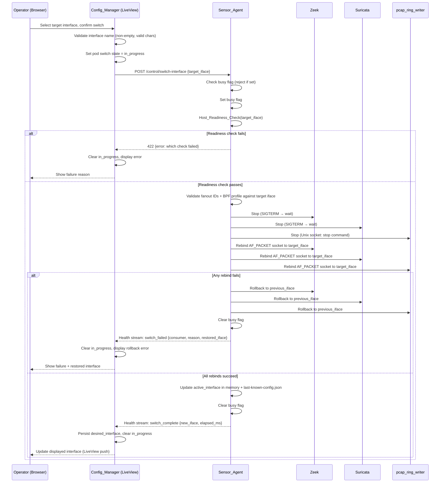
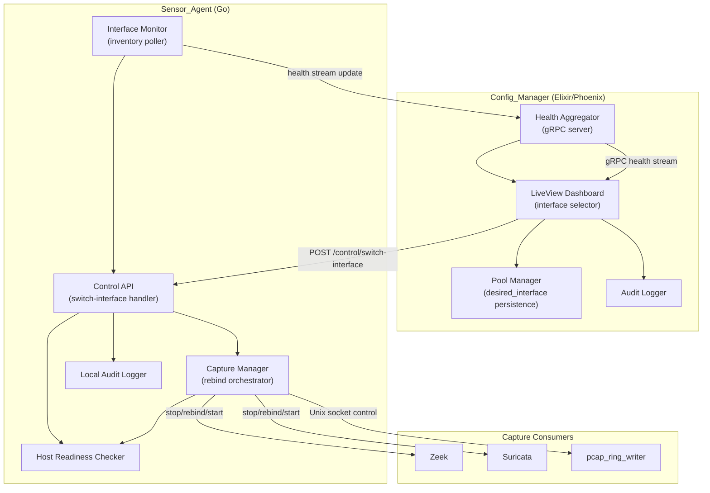

# Design Document: Interface Switching

## Overview

The Interface Switching feature extends the Sensor_Agent control API with a `switch-interface` action and adds corresponding UI and persistence support in the Config_Manager. It allows an operator to change the monitored network interface (mirror/TAP port) for a running Sensor_Pod from the Config_Manager web UI without SSH access, manual environment variable edits, or pod restarts.

The core challenge is that three independent capture consumers — Zeek, Suricata, and pcap_ring_writer — each hold their own AF_PACKET socket bound to the current interface. Changing the interface requires all three to release their sockets and rebind to the new interface in a coordinated sequence, with rollback if any step fails.

The feature preserves the Sensor_Stack's fundamental security invariant: the Config_Manager never touches the Podman socket, and all container lifecycle operations are mediated exclusively through the Sensor_Agent's narrow control API.

### Key Design Decisions

- **Stop-all-then-start-all rebind sequence**: All consumers are stopped before any consumer is started on the new interface. This prevents a split-brain state where Zeek is capturing from `eth1` while Suricata is still on `eth0`. The capture gap is bounded and predictable.
- **Sensor_Agent as the sole orchestrator**: The Config_Manager sends a single `switch-interface` action. The Sensor_Agent owns the entire rebind sequence, rollback logic, and state persistence. The Config_Manager is a passive observer that receives status updates via the health stream.
- **Optimistic locking via busy flag**: A single atomic boolean in the Sensor_Agent prevents concurrent control operations (BPF reload, config apply, cert rotation, interface switch) from interleaving. The flag is checked before any operation begins and cleared on completion or rollback.
- **Interface inventory via health stream**: Interface discovery is piggybacked on the existing gRPC health stream rather than a separate polling endpoint. This avoids a new API surface and reuses the existing reconnection and backpressure semantics.
- **No automatic reconciliation on reconnect**: When the Sensor_Agent reconnects after a disconnection, the Config_Manager surfaces any interface discrepancy to the operator but does not automatically re-issue a `switch-interface` command. Automatic reconciliation of a live capture parameter is too risky to do without operator intent.

---

## Architecture

### Control Flow



### Component Interaction Overview



---

## Components and Interfaces

### Sensor_Agent: New `switch-interface` Control Action

The `switch-interface` action is added as the 10th entry in the Sensor_Agent's control API allowlist:

| Action | Method | Path | Description |
|---|---|---|---|
| switch-interface | POST | /control/switch-interface | Rebind all capture consumers to a new monitored interface |

**Request payload:**
```json
{
  "target_interface": "eth1"
}
```

**Success response (202 Accepted):**
The action is asynchronous. A 202 is returned immediately after validation passes and the rebind sequence begins. Completion is reported via the health stream.

**Error responses (synchronous, before rebind begins):**
```json
{
  "error": {
    "code": "BUSY | INVALID_INTERFACE | READINESS_CHECK_FAILED | SAME_INTERFACE",
    "message": "Human-readable description",
    "details": {
      "failed_check": "link_state | af_packet_support | interface_not_found | loopback",
      "current_interface": "eth0"
    }
  }
}
```

### Sensor_Agent: Interface Monitor (new sub-module)

A new sub-module within the Sensor_Agent polls the host's network interfaces at a configurable interval (default 30s) and includes the Interface_Inventory in the health report.

```go
// InterfaceInfo represents a single interface in the inventory
type InterfaceInfo struct {
    Name         string `json:"name"`
    LinkUp       bool   `json:"link_up"`
    AFPacketOK   bool   `json:"af_packet_ok"`  // driver supports AF_PACKET
    IsLoopback   bool   `json:"is_loopback"`
    IsActive     bool   `json:"is_active"`      // currently the monitored interface
}

// InterfaceInventory is included in every HealthReport
type InterfaceInventory struct {
    Interfaces    []InterfaceInfo `json:"interfaces"`
    ActiveIface   string          `json:"active_interface"`
    LastRefreshed int64           `json:"last_refreshed_unix_ms"`
}
```

The Interface Monitor uses `net.Interfaces()` from the Go standard library to enumerate interfaces and checks link state via `SIOCGIFFLAGS`. AF_PACKET support is verified by attempting a probe socket bind (immediately closed) on each candidate interface.

### Sensor_Agent: Capture Manager — Rebind Orchestrator

The existing Capture Manager module gains a `RebindAll(targetIface string) error` method that implements the stop-all-then-start-all sequence:

```
RebindAll(targetIface):
  1. Record previous_iface = active_interface
  2. Stop Zeek (SIGTERM, wait up to 10s)
  3. Stop Suricata (SIGTERM, wait up to 10s)
  4. Stop pcap_ring_writer (Unix socket "stop" command, wait up to 5s)
  5. For each consumer in [Zeek, Suricata, pcap_ring_writer]:
       a. Create new AF_PACKET socket on targetIface
       b. Apply existing BPF_Filter profile
       c. Join existing Fanout_Group ID
       d. If any step fails → goto ROLLBACK
  6. Start pcap_ring_writer on new socket
  7. Start Suricata on new socket
  8. Start Zeek on new socket
  9. Update active_interface = targetIface
  10. Persist to last-known-config.json
  11. Return nil

ROLLBACK:
  1. For each consumer: attempt rebind to previous_iface
  2. Start all consumers that successfully rebound
  3. If rollback also fails: halt all consumers, log critical
  4. Return error with consumer name + reason
```

Zeek and Suricata are stopped via their container management interface (SIGTERM to the container process, managed by Podman). pcap_ring_writer is stopped via its existing Unix socket control interface (`stop` command), consistent with how BPF filter reloads are handled today.

### Sensor_Agent: Busy Flag

A single `sync.Mutex`-protected boolean `operationInProgress` is checked at the start of every control action handler. If set, the handler returns `BUSY` immediately without acquiring the lock for the operation itself. The flag is set before any state-mutating work begins and cleared in a `defer` on both success and failure paths.

This serializes: BPF filter reload, config apply, cert rotation, capture mode switch, and interface switch.

### Config_Manager: LiveView Interface Selector

The per-Sensor_Pod dashboard entry gains an interface selector component:

- Displays the currently active `Monitored_Interface` (from the latest health report)
- Renders a dropdown populated from the `InterfaceInventory` reported by that pod's Sensor_Agent
- Interfaces that are down, loopback, or lack AF_PACKET support are shown but disabled in the dropdown
- A "Switch Interface" button triggers a confirmation modal before sending the action
- While a switch is in progress (`switch_state = :in_progress`), the dropdown and button are disabled and a spinner is shown
- On success: the active interface label updates via LiveView push, spinner clears
- On failure: an error banner shows the failure reason and the restored interface name; the control re-enables

### Config_Manager: Health Aggregator — Switch Event Handling

The Health Aggregator processes two new event types from the health stream:

- `switch_complete`: updates the displayed active interface, clears in-progress state, persists `desired_interface`
- `switch_failed`: clears in-progress state, surfaces error with rollback details

### Config_Manager: Persistence

The `sensor_pods` Ecto schema gains one new field:

```elixir
field :desired_interface, :string   # last successfully applied interface name
```

This field is written on every `switch_complete` event and read on reconnection to detect drift.

---

## Data Models

### Updated HealthReport (gRPC protobuf)

The `HealthReport` message gains an `InterfaceInventory` field:

```protobuf
message HealthReport {
  string sensor_pod_id = 1;
  int64 timestamp_unix_ms = 2;
  repeated ContainerHealth containers = 3;
  CaptureStats capture = 4;
  StorageStats storage = 5;
  ClockStats clock = 6;
  InterfaceInventory interfaces = 7;   // NEW
  SwitchEvent switch_event = 8;        // NEW: non-nil only when a switch just completed/failed
}

message InterfaceInventory {
  repeated InterfaceInfo interfaces = 1;
  string active_interface = 2;
  int64 last_refreshed_unix_ms = 3;
}

message InterfaceInfo {
  string name = 1;
  bool link_up = 2;
  bool af_packet_ok = 3;
  bool is_loopback = 4;
  bool is_active = 5;
}

message SwitchEvent {
  enum Outcome {
    SUCCESS = 0;
    FAILED = 1;
    ROLLED_BACK = 2;
    ROLLBACK_FAILED = 3;
  }
  Outcome outcome = 1;
  string previous_interface = 2;
  string new_interface = 3;          // empty on failure
  string restored_interface = 4;     // set on ROLLED_BACK
  string failed_consumer = 5;        // set on FAILED/ROLLED_BACK
  string failure_reason = 6;
  int64 elapsed_ms = 7;
}
```

### Updated `last-known-config.json`

The `active_interface` field is added to the persisted config:

```json
{
  "capture_mode": "alert_driven",
  "active_interface": "eth1",
  "bpf_filter_profile": "...",
  "fanout_groups": {
    "zeek": 1,
    "suricata": 2,
    "pcap_ring_writer": 4
  }
}
```

### Updated `sensor_pods` Ecto Schema

```elixir
schema "sensor_pods" do
  field :id, :string
  field :name, :string
  field :pool_id, :string
  field :status, :string
  field :cert_serial, :string
  field :cert_expires_at, :utc_datetime
  field :last_seen_at, :utc_datetime
  field :enrolled_at, :utc_datetime
  field :enrolled_by, :string
  field :desired_interface, :string    # NEW: last successfully applied interface
  timestamps()
end
```

### Audit Log Entry for Interface Switch

```json
{
  "id": "uuid",
  "timestamp": "2024-01-15T10:30:00.000Z",
  "actor": "user@example.com",
  "actor_type": "user",
  "action": "interface_switch",
  "target_type": "sensor_pod",
  "target_id": "uuid",
  "result": "success | failure | rollback | rollback_failed",
  "detail": {
    "previous_interface": "eth0",
    "target_interface": "eth1",
    "restored_interface": "eth0",
    "failed_consumer": "suricata",
    "failure_reason": "AF_PACKET bind failed: no such device",
    "elapsed_ms": 1240
  }
}
```

---

## Correctness Properties

*A property is a characteristic or behavior that should hold true across all valid executions of a system — essentially, a formal statement about what the system should do. Properties serve as the bridge between human-readable specifications and machine-verifiable correctness guarantees.*


### Property 1: Interface Inventory Completeness

*For any* set of network interfaces present on the Sensor_Pod host, the Interface_Inventory built by the Sensor_Agent SHALL contain an entry for every interface, and each entry SHALL include the interface name, link state, AF_PACKET support flag, and loopback flag — no interface is silently omitted and no required field is missing.

**Validates: Requirements 1.1, 1.2**

---

### Property 2: Validation Precedes Rebind

*For any* `switch-interface` request where the target interface is invalid or ineligible (does not exist, link is down, does not support AF_PACKET, is a loopback, or is identical to the current interface), the Sensor_Agent SHALL return a structured error identifying the specific rejection reason AND SHALL NOT initiate any Capture_Consumer stop or rebind operation — all consumers remain bound to the current interface without interruption.

**Validates: Requirements 2.2, 2.3, 2.4, 2.5**

---

### Property 3: Interface Name Validation

*For any* string submitted as a target interface name, the Sensor_Agent SHALL accept it if and only if it satisfies all Linux IFNAMSIZ constraints: non-empty, at most 15 characters, and composed only of alphanumeric characters, hyphens, underscores, or dots. All non-conforming names SHALL be rejected with a descriptive error before any further processing.

**Validates: Requirements 6.2, 6.3**

---

### Property 4: Stop-All-Before-Start-Any Ordering

*For any* valid interface switch, the Sensor_Agent SHALL complete the stop phase for all active Capture_Consumers (Zeek, Suricata, pcap_ring_writer) before starting any consumer on the new interface — at no point during the switch is any consumer running on the new interface while any other consumer is still running on the old interface.

**Validates: Requirements 3.2, 3.4**

---

### Property 5: Capture Parameter Preservation Across Switch and Rollback

*For any* interface switch (successful or rolled back), the BPF_Filter profile and Fanout_Group ID applied to each Capture_Consumer's new AF_PACKET socket SHALL be identical to those that were active on the previous interface — no capture parameters are silently altered by the switch operation.

**Validates: Requirements 3.3, 4.2**

---

### Property 6: Successful Switch Completeness and Persistence

*For any* interface switch that completes without error, all three Capture_Consumers SHALL be actively capturing on the target interface, the Sensor_Agent's in-memory `active_interface` SHALL equal the target interface, the `last-known-config.json` SHALL contain the target interface name, and the Config_Manager's `desired_interface` field for that pod SHALL be updated to the target interface.

**Validates: Requirements 3.1, 3.5, 5.7, 7.1**

---

### Property 7: Partial Failure Triggers Rollback for All Consumers

*For any* switch attempt where at least one Capture_Consumer fails to bind its AF_PACKET socket to the target interface, the Sensor_Agent SHALL attempt to rebind every consumer (including those that succeeded) back to the previously active interface — no consumer is left on the target interface while others are rolled back.

**Validates: Requirements 4.1**

---

### Property 8: Double Failure Halts All Consumers

*For any* switch attempt where both the forward switch and the rollback fail, the Sensor_Agent SHALL halt all Capture_Consumers and report a `ROLLBACK_FAILED` event to the Config_Manager — no consumer is left in an indeterminate bind state.

**Validates: Requirements 4.4**

---

### Property 9: Busy Flag Mutual Exclusion

*For any* `switch-interface` request that arrives while the Sensor_Agent is executing another control operation (BPF reload, config apply, cert rotation, capture mode switch, or another interface switch), the request SHALL be rejected immediately with a `BUSY` error and no rebind operation SHALL be initiated.

**Validates: Requirements 6.1**

---

### Property 10: Switch Audit Log Completeness

*For any* `switch-interface` request received by the Sensor_Agent — whether accepted, rejected, completed, or rolled back — the local audit log SHALL contain an entry with the requesting actor identity (from the mTLS certificate CN), the target interface name, and the outcome. No switch request is silently omitted from the audit log.

**Validates: Requirements 2.6, 5.8**

---

### Property 11: In-Progress State Prevents Duplicate Requests

*For any* Sensor_Pod whose switch state is `:in_progress` in the Config_Manager, the interface selection dropdown and switch button SHALL be rendered as disabled — no duplicate switch request can be submitted for that pod while a switch is in progress.

**Validates: Requirements 5.4**

---

### Property 12: LiveView State Transitions on Switch Events

*For any* `switch_complete` event received from a Sensor_Agent, the Config_Manager SHALL update the displayed active interface to the new interface name and clear the in-progress state. *For any* `switch_failed` or `switch_rolled_back` event, the Config_Manager SHALL display the failure reason and restored interface name and re-enable the interface selection control.

**Validates: Requirements 5.5, 5.6**

---

### Property 13: Drift Detection Without Automatic Remediation

*For any* Sensor_Agent reconnection health report where the reported `active_interface` differs from the Config_Manager's persisted `desired_interface` for that pod, the Config_Manager SHALL surface the discrepancy in the UI AND SHALL NOT automatically send a `switch-interface` command — resolution requires explicit operator action.

**Validates: Requirements 7.3, 7.4**

---

### Property 14: Startup Halt on Bad Persisted Interface

*For any* Sensor_Agent startup where the `last-known-config.json` specifies a `Monitored_Interface` that fails the Host_Readiness_Check, the Sensor_Agent SHALL log a critical error and halt capture startup without binding any Capture_Consumer to a fallback interface.

**Validates: Requirements 7.5**

---

## Error Handling

### Sensor_Agent Error Handling

- **Busy flag set**: Return HTTP 409 with `BUSY` error code immediately; do not queue the request
- **Interface not found**: Return HTTP 422 with `READINESS_CHECK_FAILED`, `failed_check: interface_not_found`
- **Interface link down**: Return HTTP 422 with `READINESS_CHECK_FAILED`, `failed_check: link_state`
- **AF_PACKET not supported**: Return HTTP 422 with `READINESS_CHECK_FAILED`, `failed_check: af_packet_support`
- **Loopback interface**: Return HTTP 422 with `INVALID_INTERFACE`, `failed_check: loopback`
- **Same interface**: Return HTTP 422 with `SAME_INTERFACE`
- **Invalid interface name**: Return HTTP 400 with `INVALID_INTERFACE`, include the constraint violated
- **Consumer stop timeout**: After 10s (Zeek/Suricata) or 5s (pcap_ring_writer), force-kill and proceed; log warning
- **Consumer rebind failure**: Immediately initiate rollback for all consumers; report `switch_failed` via health stream
- **Rollback failure**: Halt all consumers; report `ROLLBACK_FAILED` via health stream; log critical error
- **Active carve in progress**: Wait up to the configured post-alert window duration for carve to complete; if it exceeds the timeout, abort the carve and proceed with the switch
- **last-known-config.json write failure**: Log error; the switch is still considered successful (in-memory state is correct); retry the write on next health report cycle

### Config_Manager Error Handling

- **Sensor_Agent returns BUSY**: Display "Another operation is in progress, please retry" to the operator; re-enable the control immediately
- **Sensor_Agent returns READINESS_CHECK_FAILED**: Display the specific failed check name; re-enable the control
- **Sensor_Agent unreachable during switch**: Mark the switch as failed; display "Sensor_Agent unreachable"; re-enable the control
- **switch_failed event received**: Display failure reason and restored interface; re-enable the control
- **ROLLBACK_FAILED event received**: Display critical error banner; mark pod as degraded; do not re-enable the switch control until the pod recovers
- **Interface name client-side validation failure**: Display inline validation error; do not send the action to the Sensor_Agent

---

## Testing Strategy

### Dual Testing Approach

Unit tests cover specific examples, edge cases, and error conditions. Property-based tests verify universal correctness properties across generated inputs. Both are required for comprehensive coverage.

**Property-Based Testing Library**: [rapid](https://github.com/flyingmutant/rapid) (Go) for Sensor_Agent properties; [PropCheck](https://github.com/alfert/propcheck) (Elixir, wraps PropEr) for Config_Manager properties.

Each property test runs a minimum of 100 iterations. Tests are tagged with the design property they validate using the format:
`// Feature: interface-switching, Property N: <property_text>`

### Unit and Example Tests

**Sensor_Agent (Go):**
- `switch-interface` added to allowlist: verify accepted; verify unknown action still rejected
- Each rejection condition: not found, link down, no AF_PACKET, loopback, same interface — one test each
- Interface name validation: valid names accepted, each invalid class rejected (too long, invalid chars, empty)
- Busy flag: set flag, send switch request, verify BUSY returned
- Consumer stop timeout: mock a consumer that hangs, verify force-kill after timeout
- Rollback event structure: verify `failed_consumer` and `failure_reason` fields present
- Elapsed time reporting: verify `elapsed_ms > 0` in switch completion event
- Active carve abort: simulate active carve, verify it completes/aborts before rebind begins
- Startup with bad persisted interface: mock readiness check failure, verify capture halted

**Config_Manager (Elixir):**
- Interface selector renders disabled for in-progress pod
- BUSY response from Sensor_Agent re-enables control immediately
- ROLLBACK_FAILED marks pod as degraded
- Drift detection: reported != desired → discrepancy shown, no auto-switch sent
- Audit log entry created for each switch outcome type

### Property Tests

Each property test references its design document property:

```go
// Feature: interface-switching, Property 2: Validation Precedes Rebind
rapid.Check(t, func(t *rapid.T) {
    iface := rapid.StringOf(rapid.RuneFrom(nil, unicode.Letter)).Draw(t, "iface")
    // inject as non-existent interface
    result := agent.HandleSwitchInterface(SwitchRequest{Target: iface})
    assert.Error(t, result.Err)
    assert.Zero(t, mockCapture.RebindCallCount)
})
```

```go
// Feature: interface-switching, Property 3: Interface Name Validation
rapid.Check(t, func(t *rapid.T) {
    name := rapid.String().Draw(t, "name")
    valid := isValidLinuxIfname(name)
    result := agent.ValidateInterfaceName(name)
    assert.Equal(t, valid, result == nil)
})
```

```go
// Feature: interface-switching, Property 5: Capture Parameter Preservation
rapid.Check(t, func(t *rapid.T) {
    params := rapid.Custom(genCaptureParams).Draw(t, "params")
    agent.SetCaptureParams(params)
    agent.HandleSwitchInterface(SwitchRequest{Target: "eth1"})
    applied := mockCapture.LastAppliedParams()
    assert.Equal(t, params.BPFProfile, applied.BPFProfile)
    assert.Equal(t, params.FanoutGroups, applied.FanoutGroups)
})
```

```elixir
# Feature: interface-switching, Property 1: Interface Inventory Completeness
property "inventory contains all interfaces with all required fields" do
  forall ifaces <- list(interface_gen()) do
    inventory = InterfaceMonitor.build_inventory(ifaces)
    Enum.all?(inventory.interfaces, fn i ->
      is_binary(i.name) and is_boolean(i.link_up) and
      is_boolean(i.af_packet_ok) and is_boolean(i.is_loopback)
    end)
  end
end
```

```elixir
# Feature: interface-switching, Property 13: Drift Detection Without Auto-Remediation
property "discrepancy surfaced but no auto-switch sent" do
  forall {reported, desired} <- {interface_name_gen(), interface_name_gen()} do
    implies reported != desired do
      state = handle_reconnect(%{active_interface: reported}, %{desired_interface: desired})
      state.drift_detected == true and state.switch_commands_sent == 0
    end
  end
end
```

### Integration Tests

- Full switch end-to-end: inject packets on `eth0`, switch to `eth1`, verify Zeek/Suricata logs appear on `eth1`
- Rollback end-to-end: mock Suricata bind failure, verify all consumers restored to `eth0`
- Offline switch: disconnect Config_Manager, perform switch, reconnect, verify health report contains new interface
- Concurrent operation rejection: start a BPF reload, immediately send switch-interface, verify BUSY
- Startup with persisted interface: write `last-known-config.json` with a valid interface, restart Sensor_Agent, verify it binds to that interface

### Smoke Tests

- `switch-interface` appears in the Sensor_Agent allowlist response
- Interface inventory appears in the health report protobuf
- `desired_interface` column exists in the `sensor_pods` table
- LiveView interface selector component renders without errors on a pod with a populated inventory
