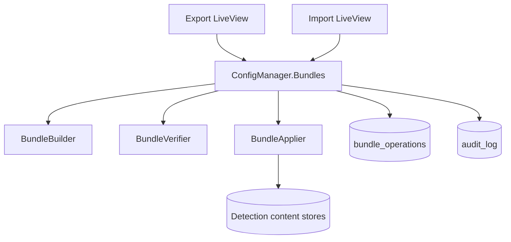

# Design Document: Offline Update Bundle Import

## Overview

This design adds an operator-driven bundle export/import workflow for disconnected environments. A bundle is a `.tar.gz` archive with a root `manifest.json`, optional `manifest.sig`, and content payloads for detection content and configuration templates. The import path verifies archive safety, manifest structure, file hashes, and optional signature before applying any content.

The feature integrates with:

- `auth-rbac-audit` for `system:manage` authorization and audit entries.
- `rule-store-management` for Suricata SID-based upserts.
- `detection-content-lifecycle` for Zeek packages and YARA rules.
- `bpf-filter-editor` and `vector-forwarding-mgmt` for non-secret configuration templates.
- `deployment-tracking` because imported content changes desired state but is never auto-deployed.

## Key Design Decisions

1. **Full snapshot bundles only**: This feature exports complete selected content sets. Differential bundles are deferred.
2. **Manifest-first verification**: Import validates the manifest and every listed file before applying content.
3. **Path-safe extraction**: Archive entries are rejected if they are absolute paths, contain `..`, or resolve outside the temporary import directory.
4. **Secrets excluded by construction**: Exports never include API tokens, sink secrets, HEC tokens, private keys, or encrypted secret blobs.
5. **Two-phase import**: Upload and verify first, then require explicit operator confirmation before content application.
6. **Best-effort atomicity**: Database changes occur in one transaction where possible. Filesystem payloads are staged and promoted only after database success.

## Archive Layout

```text
ravenwire-update-bundle-<version>.tar.gz
├── manifest.json
├── manifest.sig              # optional
├── suricata/
│   ├── repositories.json
│   └── rules/*.rules
├── zeek/
│   ├── packages.json
│   └── packages/<package-name>.tar.gz
├── yara/
│   ├── rules.json
│   └── rules/*.yar
├── bpf/
│   └── profiles.json
└── forwarding/
    └── templates.json
```

Only files listed in `manifest.json` are applied. Unlisted files are ignored after logging a warning.

## Manifest Schema

```json
{
  "bundle_version": 42,
  "format_version": "1",
  "created_at": "2026-05-01T12:00:00Z",
  "created_by": "admin",
  "source_instance": "ravenwire-manager-01",
  "description": "May detection refresh",
  "content_types": ["suricata_rules", "zeek_packages", "yara_rules"],
  "files": [
    {
      "path": "suricata/rules/emerging.rules",
      "sha256": "hex-encoded-sha256",
      "size_bytes": 123456,
      "content_type": "suricata_rules"
    }
  ]
}
```

Allowed `content_type` values:

```text
suricata_rules
zeek_packages
yara_rules
bpf_profiles
forwarding_templates
```

## Architecture



## Module Layout

```text
lib/config_manager/bundles/
├── bundle.ex
├── operation.ex
├── builder.ex
├── verifier.ex
├── applier.ex
├── manifest.ex
├── signer.ex
└── content_exporter.ex

lib/config_manager_web/live/bundle_live/
├── history_live.ex
├── export_live.ex
└── import_live.ex
```

## Components

### `ConfigManager.Bundles`

Public context for bundle operations.

```elixir
def create_export(attrs, actor) :: {:ok, Operation.t()} | {:error, changeset}
def build_bundle(operation, selected_content) :: {:ok, path} | {:error, term}
def stage_import(upload_path, actor) :: {:ok, staged_import} | {:error, term}
def verify_import(staged_import) :: {:ok, verification_result} | {:error, verification_error}
def apply_import(staged_import, selected_content_types, actor) :: {:ok, operation} | {:error, term}
def list_operations(opts) :: {entries, meta}
```

### `BundleBuilder`

Responsibilities:

- Query selected content stores.
- Serialize content payloads into the archive staging directory.
- Exclude secrets and secret ciphertext.
- Generate `manifest.json`.
- Sign the manifest when signing is configured.
- Create a `.tar.gz` archive and record operation metadata.

### `BundleVerifier`

Responsibilities:

- Validate archive type and size.
- Extract only safe paths into a temporary directory.
- Validate `manifest.json` structure.
- Verify optional `manifest.sig` when a trusted signing key is configured.
- Verify SHA-256 and size for every listed file.
- Return a content breakdown for review.

### `BundleApplier`

Responsibilities:

- Apply Suricata rules using SID/revision upsert semantics.
- Register Zeek packages as available, not installed or enabled.
- Import YARA rules disabled by default.
- Import BPF profiles as templates, not active pool profiles unless explicitly selected in a future feature.
- Import forwarding templates with secret fields omitted.
- Increment desired-state versions only when local content changes.

## Data Model

### `bundle_operations`

```elixir
create table(:bundle_operations, primary_key: false) do
  add :id, :binary_id, primary_key: true
  add :bundle_version, :integer, null: false
  add :operation_type, :string, null: false # export | import
  add :status, :string, null: false # pending | verified | success | failed | expired
  add :operator_id, references(:users, type: :binary_id, on_delete: :nilify_all)
  add :operator_name, :string, null: false
  add :source_instance, :string
  add :description, :text
  add :content_types, {:array, :string}, null: false, default: []
  add :file_count, :integer, null: false, default: 0
  add :total_size_bytes, :integer, null: false, default: 0
  add :download_path, :string
  add :download_expires_at, :utc_datetime_usec
  add :manifest, :map
  add :result_summary, :map
  add :error_summary, :map
  timestamps(type: :utc_datetime_usec)
end

create index(:bundle_operations, [:operation_type, :inserted_at])
create index(:bundle_operations, [:bundle_version])
```

Bundle files may be deleted after expiry; operation records remain.

## Routes and RBAC

| Route | Permission | Purpose |
| --- | --- | --- |
| `/admin/bundles` | `system:manage` | Bundle history |
| `/admin/bundles/export` | `system:manage` | Export workflow |
| `/admin/bundles/import` | `system:manage` | Upload, verify, review, apply |

All bundle actions must also check authorization inside LiveView event handlers.

## Audit Events

| Event | Result |
| --- | --- |
| `bundle_exported` | Export record and archive created |
| `bundle_download` | Export archive downloaded |
| `bundle_imported` | Upload staged and manifest parsed |
| `bundle_integrity_failed` | Verification failed |
| `bundle_content_applied` | Content application completed |
| `permission_denied` | Unauthorized access or action attempt |

Audit details include bundle version, content types, counts, source instance, and failure category. They never include secret values or full local file paths outside the bundle staging area.

## Correctness Properties

### Property 1: Manifest hash verification is complete

For any valid manifest and archive, verification SHALL read every listed file exactly once and reject the bundle if any computed SHA-256 differs from the manifest value.

**Validates: Requirements 3.1, 3.2**

### Property 2: Archive extraction cannot escape staging directory

For any archive entry path, extraction SHALL reject the import if the resolved path is absolute, contains parent traversal, or falls outside the staging directory.

**Validates: Requirements 3.7**

### Property 3: Secret values never appear in exported bundle content

For any exported forwarding template, the bundle SHALL contain only non-secret fields and boolean secret-present metadata. Plaintext secrets, encrypted secrets, API tokens, private keys, and bearer tokens SHALL NOT appear in any exported file or manifest field.

**Validates: Requirements 6.4**

### Property 4: Import does not deploy content

For any successful import, no deployment record SHALL be created and no Sensor_Agent control API call SHALL be dispatched.

**Validates: Requirements 4.7**

## Error Handling

| Condition | Behavior |
| --- | --- |
| Upload exceeds size limit | Reject upload with validation error |
| Invalid archive | Reject and audit failure |
| Missing manifest | Reject and audit failure |
| Invalid manifest JSON | Reject and show schema errors |
| Hash mismatch | Reject entire import and list failed files |
| Signature missing or invalid when required | Reject entire import |
| Content application fails | Roll back database changes and leave staged files unpromoted |
| Download link expired | Hide link and return 404 or expired message |

## Testing Strategy

- Unit tests for manifest validation and safe path resolution.
- Property tests for hash verification, path traversal rejection, and secret exclusion.
- Integration tests for export archive creation and import review workflow.
- Content application tests for Suricata SID/revision upsert, Zeek package availability, YARA disabled defaults, BPF template import, and forwarding secret omission.
- LiveView tests for `/admin/bundles`, `/admin/bundles/import`, and `/admin/bundles/export` including RBAC.
- Audit tests for success and failure paths.
