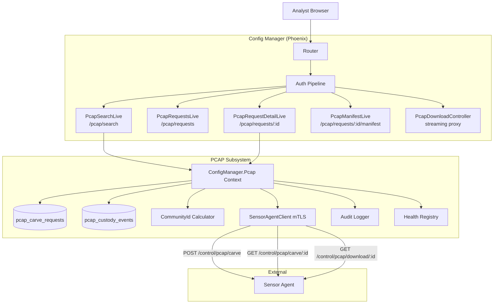
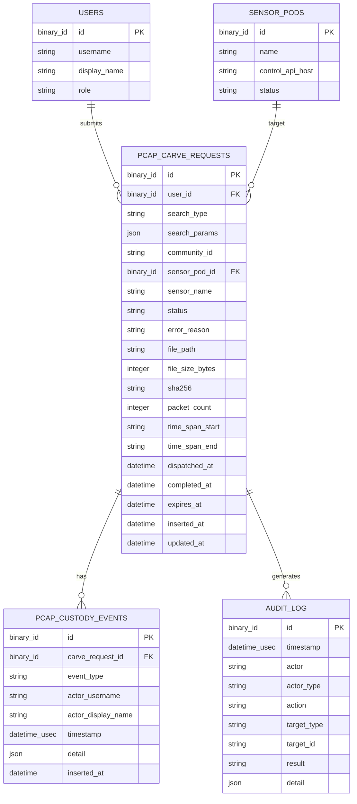

# Design Document: PCAP Search and Retrieval

## Overview

This design adds a full PCAP search, carve, download, and chain-of-custody workflow to the RavenWire Config Manager. The current application configures Alert-Driven PCAP parameters (ring size, pre/post-alert windows, severity threshold) but provides no way for analysts to actually retrieve packet captures from sensors. This feature closes that gap.

The system introduces:

- **PCAP search interface** with five search modes: time range, Community ID, 5-tuple, Suricata alert ID, and Zeek UID
- **Community ID as primary pivot** with a built-in calculator that computes Community ID v1 from a 5-tuple
- **Carve request lifecycle** tracking requests through `pending` → `dispatched` → `carving` → `completed` → `expired`/`failed`
- **Streaming PCAP download** proxied through the Config Manager with permission checks, never exposing direct sensor access
- **Request history** with user-scoped visibility and re-download/re-submit capabilities
- **Chain-of-custody manifest** — immutable, append-only records with SHA-256 integrity hashes and JSON export
- **Sensor Agent dispatch** via the existing `SensorAgentClient` mTLS pattern for carve, status poll, and file download
- **Audit logging** for all PCAP operations (7 action types) using the existing `audit_log` table
- **File expiration** with configurable retention (default 72 hours)

The Config Manager never performs PCAP carving itself. It dispatches carve requests to Sensor Agents via `POST /control/pcap/carve`, polls for status via `GET /control/pcap/carve/:request_id`, and streams the resulting file back to the analyst's browser via `GET /control/pcap/download/:request_id`.

### Key Design Decisions

1. **Community ID v1 as a pure Elixir module**: The Community ID computation (SHA-256 of canonically-ordered 5-tuple with seed) is implemented as a pure function module `ConfigManager.Pcap.CommunityId`. This makes it property-testable without network dependencies and reusable across search, calculator, and validation contexts.

2. **Carve requests as an Ecto schema with status machine**: Each carve request is a row in a new `pcap_carve_requests` table. Status transitions are enforced by changeset validation. One search targeting N sensors creates N carve request records, each tracked independently.

3. **Streaming proxy via Finch for downloads**: PCAP file downloads are streamed through the Config Manager using Finch's streaming response capability. The Config Manager never stores the PCAP file on its own disk — it proxies bytes from the Sensor Agent directly to the analyst's browser. This avoids disk pressure on the Config Manager host.

4. **Chain-of-custody as a separate append-only table**: Custody events (creation, downloads, exports) are stored in a `pcap_custody_events` table. The manifest for a carve request is the ordered set of all custody events for that request. Integrity is verified by computing SHA-256 over the serialized JSON of all events.

5. **LiveView with polling GenServer for status updates**: In-progress carve requests are polled by a per-request `Task` spawned under a `Task.Supervisor`. The LiveView subscribes to PubSub topics for real-time status push. When a carve completes or fails, the polling task broadcasts the final status and terminates.

6. **PropCheck for property-based testing**: Already present in `mix.exs`. Property tests validate Community ID computation (round-trip, canonical ordering), input validation, custody manifest integrity, and request lifecycle transitions.

7. **Reuse existing patterns**: The `SensorAgentClient` is extended with three new functions following the same mTLS/Finch pattern. Audit logging uses the existing `audit_log` table and schema. RBAC uses the existing `pcap:search` and `pcap:download` permissions from the auth-rbac-audit spec.

## Architecture

### System Context



### Request Flow

**PCAP search submission:**
1. Analyst fills search form on `/pcap/search` (Community ID mode is default)
2. LiveView validates inputs client-side, then submits via `handle_event`
3. Server-side validation: format checks on Community ID, IPs, ports, time range ≤ 24h
4. If no sensor selected → query Health Registry for all online sensors
5. Create one `CarveRequest` per target sensor with status `pending`
6. Record `pcap_search` audit entry
7. For each request: dispatch `POST /control/pcap/carve` via `SensorAgentClient`
8. Update status to `dispatched`, record `pcap_carve_dispatch` audit entry
9. Spawn polling task under `Task.Supervisor` for each dispatched request
10. LiveView subscribes to `"pcap_request:#{request_id}"` PubSub topics

**Carve status polling:**
1. Polling task calls `GET /control/pcap/carve/:request_id` every 5 seconds
2. On status change → update `CarveRequest` in DB, broadcast via PubSub
3. On `completed` → record file metadata, create custody manifest, record `pcap_carve_complete` audit entry, stop polling
4. On `failed` → record error, record `pcap_carve_failed` audit entry, stop polling
5. On timeout (5 min in `dispatched`) → mark `failed` with reason `timeout`

**PCAP download:**
1. Analyst clicks download button on completed request
2. Request hits `PcapDownloadController` (regular controller, not LiveView — for streaming)
3. Controller checks `pcap:download` permission
4. If denied → 403 + `permission_denied` audit entry
5. If expired → redirect back with flash message
6. Controller opens streaming Finch request to `GET /control/pcap/download/:request_id` on Sensor Agent
7. Sets `Content-Disposition: attachment` and `Content-Type: application/vnd.tcpdump.pcap`
8. Streams bytes to browser via `Plug.Conn.chunk/2`
9. On completion → append download event to custody manifest, record `pcap_download` audit entry

**Manifest export:**
1. Analyst clicks "Export JSON" on manifest page
2. Controller serializes all custody events for the request as JSON
3. Computes SHA-256 integrity hash over the serialized content
4. Returns JSON file with `Content-Disposition: attachment`
5. Records `pcap_manifest_export` audit entry

### Module Layout

```
lib/config_manager/
├── pcap/
│   ├── carve_request.ex           # Ecto schema for pcap_carve_requests
│   ├── custody_event.ex           # Ecto schema for pcap_custody_events
│   ├── community_id.ex            # Pure Community ID v1 computation
│   ├── search_params.ex           # Search parameter validation & structs
│   └── status_poller.ex           # GenServer/Task for polling carve status
├── pcap.ex                        # Context module (public API)
├── sensor_agent_client.ex         # Extended with pcap carve/status/download

lib/config_manager_web/
├── live/
│   ├── pcap_live/
│   │   ├── search_live.ex         # PCAP search form and results
│   │   ├── requests_live.ex       # Request history list
│   │   ├── request_detail_live.ex # Individual request detail + status
│   │   └── manifest_live.ex       # Chain-of-custody manifest view
│   └── pcap_live/components/
│       ├── search_form_component.ex    # Search form with mode switching
│       ├── community_id_calculator.ex  # 5-tuple → Community ID calculator
│       ├── sensor_selector_component.ex # Multi-sensor selection with status
│       └── request_status_component.ex  # Status badge and progress display
├── controllers/
│   └── pcap_download_controller.ex     # Streaming PCAP proxy + manifest export
├── router.ex                           # Extended with /pcap/* routes
```

## Components and Interfaces

### 1. `ConfigManager.Pcap` — PCAP Context Module

The primary public API for all PCAP search and retrieval operations.

```elixir
defmodule ConfigManager.Pcap do
  @moduledoc "PCAP search, carve request lifecycle, and chain-of-custody context."

  alias ConfigManager.Pcap.{CarveRequest, CustodyEvent, CommunityId, SearchParams}

  # Search and carve dispatch
  @spec submit_search(map(), map(), map()) :: {:ok, [CarveRequest.t()]} | {:error, Ecto.Changeset.t()}
  def submit_search(search_params, target_sensors, actor)

  @spec dispatch_carve(CarveRequest.t()) :: {:ok, CarveRequest.t()} | {:error, term()}
  def dispatch_carve(request)

  # Status management
  @spec update_status(CarveRequest.t(), String.t(), map()) :: {:ok, CarveRequest.t()} | {:error, term()}
  def update_status(request, new_status, metadata \\ %{})

  @spec check_timeout(CarveRequest.t()) :: :ok | {:expired, CarveRequest.t()}
  def check_timeout(request)

  @spec expire_completed_requests() :: {integer(), nil}
  def expire_completed_requests()

  # Query
  @spec get_request!(String.t()) :: CarveRequest.t()
  def get_request!(id)

  @spec list_requests(map(), map()) :: {[CarveRequest.t()], map()}
  def list_requests(filters, pagination)

  @spec list_user_requests(String.t(), map(), map()) :: {[CarveRequest.t()], map()}
  def list_user_requests(user_id, filters, pagination)

  # Download
  @spec stream_pcap_download(CarveRequest.t(), Plug.Conn.t()) :: Plug.Conn.t() | {:error, term()}
  def stream_pcap_download(request, conn)

  @spec download_filename(CarveRequest.t()) :: String.t()
  def download_filename(request)

  # Chain of custody
  @spec create_custody_manifest(CarveRequest.t()) :: {:ok, CustodyEvent.t()}
  def create_custody_manifest(request)

  @spec append_download_event(CarveRequest.t(), map()) :: {:ok, CustodyEvent.t()}
  def append_download_event(request, download_info)

  @spec get_manifest(String.t()) :: [CustodyEvent.t()]
  def get_manifest(request_id)

  @spec export_manifest_json(String.t()) :: {:ok, String.t(), String.t()}
  def export_manifest_json(request_id)
  # Returns {:ok, json_string, integrity_hash}

  # Community ID
  @spec compute_community_id(map()) :: {:ok, String.t()} | {:error, term()}
  def compute_community_id(five_tuple_params)
end
```

### 2. `ConfigManager.Pcap.CommunityId` — Pure Community ID v1 Computation

```elixir
defmodule ConfigManager.Pcap.CommunityId do
  @moduledoc """
  Community ID v1 computation following the published specification.
  Pure functions — no side effects, no database access.

  The algorithm:
  1. Canonically order source/destination by IP (then port for equal IPs)
  2. Pack: seed (uint16) + src_ip + dst_ip + protocol (uint8) + padding (uint8) + src_port (uint16) + dst_port (uint16)
  3. SHA-256 hash the packed binary
  4. Base64-encode the hash
  5. Prefix with "1:"
  """

  @type five_tuple :: %{
    src_ip: :inet.ip_address(),
    dst_ip: :inet.ip_address(),
    src_port: 0..65535,
    dst_port: 0..65535,
    protocol: non_neg_integer()
  }

  @default_seed 0

  @spec compute(five_tuple(), non_neg_integer()) :: String.t()
  def compute(five_tuple, seed \\ @default_seed)

  @spec valid_format?(String.t()) :: boolean()
  def valid_format?(community_id_string)

  @spec parse_ip(String.t()) :: {:ok, :inet.ip_address()} | {:error, :invalid_ip}
  def parse_ip(ip_string)

  @spec protocol_number(String.t()) :: {:ok, non_neg_integer()} | {:error, :unknown_protocol}
  def protocol_number(protocol_name)
  # "tcp" → 6, "udp" → 17, "icmp" → 1, "icmpv6" → 58, etc.
end
```

### 3. `ConfigManager.Pcap.SearchParams` — Input Validation

```elixir
defmodule ConfigManager.Pcap.SearchParams do
  @moduledoc "Validates and normalizes PCAP search parameters."

  @type search_type :: :time_range | :community_id | :five_tuple | :alert_id | :zeek_uid

  @type t :: %__MODULE__{
    search_type: search_type(),
    community_id: String.t() | nil,
    src_ip: String.t() | nil,
    dst_ip: String.t() | nil,
    src_port: integer() | nil,
    dst_port: integer() | nil,
    protocol: String.t() | nil,
    alert_id: String.t() | nil,
    zeek_uid: String.t() | nil,
    start_time: DateTime.t(),
    end_time: DateTime.t(),
    sensor_ids: [String.t()]
  }

  @spec validate(map()) :: {:ok, t()} | {:error, [{atom(), String.t()}]}
  def validate(raw_params)
  # Validates:
  # - Community ID matches "1:<base64>" format
  # - IPs are valid IPv4 or IPv6
  # - Ports are 0..65535
  # - start_time < end_time
  # - Time range ≤ 24 hours
  # - At least one search criterion is present

  @spec to_carve_payload(t()) :: map()
  def to_carve_payload(params)
  # Converts validated params to the JSON payload for Sensor Agent API
end
```

### 4. `ConfigManager.SensorAgentClient` — Extended with PCAP Functions

Three new functions added to the existing client module, following the same mTLS/Finch pattern:

```elixir
# In lib/config_manager/sensor_agent_client.ex

@doc """
Dispatches a PCAP carve request to the Sensor Agent.
POST /control/pcap/carve
"""
@spec request_pcap_carve(map(), map()) :: {:ok, map()} | {:error, term()}
def request_pcap_carve(pod, carve_payload)

@doc """
Polls the Sensor Agent for carve request status.
GET /control/pcap/carve/:request_id
"""
@spec get_pcap_carve_status(map(), String.t()) :: {:ok, map()} | {:error, term()}
def get_pcap_carve_status(pod, request_id)

@doc """
Streams a completed PCAP file from the Sensor Agent.
GET /control/pcap/download/:request_id
Returns a Finch stream reference for use with Plug.Conn.chunk/2.
"""
@pcap_download_timeout_ms 120_000
@spec stream_pcap_download(map(), String.t(), Plug.Conn.t()) :: Plug.Conn.t() | {:error, term()}
def stream_pcap_download(pod, request_id, conn)
```

### 5. `ConfigManager.Pcap.StatusPoller` — Carve Status Polling

```elixir
defmodule ConfigManager.Pcap.StatusPoller do
  @moduledoc """
  Polls a Sensor Agent for carve request status updates.
  Spawned as a Task under Task.Supervisor for each dispatched request.
  Broadcasts status changes via PubSub and terminates on completion/failure/timeout.
  """

  @default_poll_interval_ms 5_000
  @dispatch_timeout_ms 300_000  # 5 minutes

  @spec start(CarveRequest.t(), map()) :: {:ok, pid()}
  def start(request, pod)

  # Internal loop:
  # 1. Call SensorAgentClient.get_pcap_carve_status/2
  # 2. If status changed → update DB, broadcast PubSub
  # 3. If completed/failed → terminate
  # 4. If dispatched > 5 min → mark failed with timeout, terminate
  # 5. Otherwise → sleep poll_interval, repeat
end
```

### 6. `ConfigManagerWeb.PcapDownloadController` — Streaming Proxy

```elixir
defmodule ConfigManagerWeb.PcapDownloadController do
  @moduledoc """
  Controller for streaming PCAP file downloads and manifest exports.
  Uses regular controller (not LiveView) for HTTP streaming support.
  """

  use ConfigManagerWeb, :controller

  @doc "GET /pcap/requests/:id/download — stream PCAP file from sensor"
  def download(conn, %{"id" => request_id})
  # 1. Check pcap:download permission
  # 2. Load CarveRequest, verify status == completed and not expired
  # 3. Load SensorPod for control_api_host
  # 4. Set Content-Disposition and Content-Type headers
  # 5. Stream via SensorAgentClient.stream_pcap_download/3
  # 6. Append custody download event
  # 7. Record pcap_download audit entry

  @doc "GET /pcap/requests/:id/manifest/export — download manifest JSON"
  def export_manifest(conn, %{"id" => request_id})
  # 1. Check pcap:search permission
  # 2. Export manifest JSON with integrity hash
  # 3. Record pcap_manifest_export audit entry
end
```

### 7. LiveView Modules

**`ConfigManagerWeb.PcapLive.SearchLive`** — `/pcap/search`
- Default search mode: Community ID
- Mode switcher: time range, community_id, five_tuple, alert_id, zeek_uid
- Community ID calculator panel (5-tuple → Community ID)
- Sensor selector with online/offline status from Health Registry
- Real-time validation with field-level error display
- On submit: creates carve requests, shows status cards per sensor
- Subscribes to PubSub for real-time status updates

**`ConfigManagerWeb.PcapLive.RequestsLive`** — `/pcap/requests`
- Reverse chronological list of carve requests
- User-scoped: shows only current user's requests (platform-admin sees all)
- Filters: date range, status, sensor, search type
- Pagination: 25 per page
- Re-download button for completed+available requests
- Re-submit button for expired requests

**`ConfigManagerWeb.PcapLive.RequestDetailLive`** — `/pcap/requests/:id`
- Full request detail: search criteria, target sensor, status timeline
- Download button when completed (checks pcap:download permission)
- Real-time status updates via PubSub subscription
- Link to manifest page

**`ConfigManagerWeb.PcapLive.ManifestLive`** — `/pcap/requests/:id/manifest`
- Full chain-of-custody timeline
- Creation event, all download events
- Integrity hash display
- Export JSON button

### 8. Router Changes

```elixir
# Inside the authenticated live_session block:

# PCAP routes
live "/pcap", PcapLive.SearchLive, :index, private: %{required_permission: "pcap:search"}
live "/pcap/search", PcapLive.SearchLive, :search, private: %{required_permission: "pcap:search"}
live "/pcap/requests", PcapLive.RequestsLive, :index, private: %{required_permission: "pcap:search"}
live "/pcap/requests/:id", PcapLive.RequestDetailLive, :show, private: %{required_permission: "pcap:search"}
live "/pcap/requests/:id/manifest", PcapLive.ManifestLive, :show, private: %{required_permission: "pcap:search"}

# PCAP download and manifest export (regular controllers for streaming)
get "/pcap/requests/:id/download", PcapDownloadController, :download, private: %{required_permission: "pcap:download"}
get "/pcap/requests/:id/manifest/export", PcapDownloadController, :export_manifest, private: %{required_permission: "pcap:search"}
```

### 9. Navigation

A "PCAP" link is added to the main navigation bar, visible only to users with `pcap:search` permission. The link displays a badge with the count of active (non-terminal) carve requests for the current user.

## Data Models

### Carve Requests Table

```sql
CREATE TABLE pcap_carve_requests (
  id              BLOB PRIMARY KEY,     -- binary_id (UUID)
  user_id         BLOB NOT NULL,        -- requesting user
  search_type     TEXT NOT NULL,        -- time_range | community_id | five_tuple | alert_id | zeek_uid
  search_params   TEXT NOT NULL,        -- JSON: type-specific search parameters
  community_id    TEXT,                 -- computed Community ID (for reference, even on 5-tuple searches)
  sensor_pod_id   BLOB NOT NULL,       -- target sensor
  sensor_name     TEXT NOT NULL,        -- denormalized for display
  status          TEXT NOT NULL DEFAULT 'pending',  -- pending | dispatched | carving | completed | failed | expired
  error_reason    TEXT,                -- failure reason (when status = failed)
  -- File metadata (populated on completion)
  file_path       TEXT,                -- path on sensor
  file_size_bytes INTEGER,
  sha256          TEXT,
  packet_count    INTEGER,
  time_span_start TEXT,                -- ISO 8601 UTC
  time_span_end   TEXT,                -- ISO 8601 UTC
  -- Timestamps
  dispatched_at   TEXT,                -- when sent to sensor agent
  completed_at    TEXT,                -- when carve finished
  expires_at      TEXT,                -- completion + retention period
  inserted_at     TEXT NOT NULL,
  updated_at      TEXT NOT NULL
);

CREATE INDEX pcap_carve_requests_user_id_index ON pcap_carve_requests (user_id);
CREATE INDEX pcap_carve_requests_status_index ON pcap_carve_requests (status);
CREATE INDEX pcap_carve_requests_sensor_pod_id_index ON pcap_carve_requests (sensor_pod_id);
CREATE INDEX pcap_carve_requests_expires_at_index ON pcap_carve_requests (expires_at);
CREATE INDEX pcap_carve_requests_inserted_at_index ON pcap_carve_requests (inserted_at);
```

**Ecto Schema:**

```elixir
defmodule ConfigManager.Pcap.CarveRequest do
  use Ecto.Schema
  import Ecto.Changeset

  @primary_key {:id, :binary_id, autogenerate: true}
  @foreign_key_type :binary_id

  @valid_statuses ~w(pending dispatched carving completed failed expired)
  @valid_search_types ~w(time_range community_id five_tuple alert_id zeek_uid)
  @terminal_statuses ~w(completed failed expired)

  schema "pcap_carve_requests" do
    field :user_id, :binary_id
    field :search_type, :string
    field :search_params, :string          # JSON text
    field :community_id, :string
    field :sensor_pod_id, :binary_id
    field :sensor_name, :string
    field :status, :string, default: "pending"
    field :error_reason, :string
    field :file_path, :string
    field :file_size_bytes, :integer
    field :sha256, :string
    field :packet_count, :integer
    field :time_span_start, :string
    field :time_span_end, :string
    field :dispatched_at, :utc_datetime
    field :completed_at, :utc_datetime
    field :expires_at, :utc_datetime
    timestamps()
  end

  @doc "Changeset for creating a new carve request."
  def create_changeset(request, attrs) do
    request
    |> cast(attrs, [:user_id, :search_type, :search_params, :community_id,
                    :sensor_pod_id, :sensor_name])
    |> validate_required([:user_id, :search_type, :search_params, :sensor_pod_id, :sensor_name])
    |> validate_inclusion(:search_type, @valid_search_types)
  end

  @doc "Changeset for status transitions with validation."
  def status_changeset(request, new_status, attrs \\ %{}) do
    request
    |> cast(Map.put(attrs, :status, new_status), [
      :status, :error_reason, :file_path, :file_size_bytes, :sha256,
      :packet_count, :time_span_start, :time_span_end,
      :dispatched_at, :completed_at, :expires_at
    ])
    |> validate_inclusion(:status, @valid_statuses)
    |> validate_status_transition(request.status, new_status)
  end

  defp validate_status_transition(changeset, from, to) do
    valid_transitions = %{
      "pending" => ["dispatched", "failed"],
      "dispatched" => ["carving", "completed", "failed"],
      "carving" => ["completed", "failed"],
      "completed" => ["expired"]
    }

    allowed = Map.get(valid_transitions, from, [])
    if to in allowed do
      changeset
    else
      add_error(changeset, :status, "invalid transition from #{from} to #{to}")
    end
  end

  def terminal?(%__MODULE__{status: status}), do: status in @terminal_statuses
end
```

### Custody Events Table

```sql
CREATE TABLE pcap_custody_events (
  id              BLOB PRIMARY KEY,     -- binary_id (UUID)
  carve_request_id BLOB NOT NULL REFERENCES pcap_carve_requests(id),
  event_type      TEXT NOT NULL,        -- created | downloaded | manifest_exported
  actor_username  TEXT NOT NULL,
  actor_display_name TEXT,
  timestamp       TEXT NOT NULL,        -- UTC microsecond precision
  detail          TEXT NOT NULL,        -- JSON: event-specific data
  inserted_at     TEXT NOT NULL
);

CREATE INDEX pcap_custody_events_carve_request_id_index ON pcap_custody_events (carve_request_id);
CREATE INDEX pcap_custody_events_timestamp_index ON pcap_custody_events (timestamp);
```

**Ecto Schema:**

```elixir
defmodule ConfigManager.Pcap.CustodyEvent do
  use Ecto.Schema
  import Ecto.Changeset

  @primary_key {:id, :binary_id, autogenerate: true}
  @foreign_key_type :binary_id

  @valid_event_types ~w(created downloaded manifest_exported)

  schema "pcap_custody_events" do
    field :carve_request_id, :binary_id
    field :event_type, :string
    field :actor_username, :string
    field :actor_display_name, :string
    field :timestamp, :utc_datetime_usec
    field :detail, :string              # JSON text
    timestamps(updated_at: false)
  end

  def changeset(event, attrs) do
    event
    |> cast(attrs, [:carve_request_id, :event_type, :actor_username,
                    :actor_display_name, :timestamp, :detail])
    |> validate_required([:carve_request_id, :event_type, :actor_username, :timestamp, :detail])
    |> validate_inclusion(:event_type, @valid_event_types)
  end
end
```

### Entity Relationship Diagram




## Correctness Properties

*A property is a characteristic or behavior that should hold true across all valid executions of a system — essentially, a formal statement about what the system should do. Properties serve as the bridge between human-readable specifications and machine-verifiable correctness guarantees.*

### Property 1: Search input validation correctly accepts valid inputs and rejects invalid inputs

*For any* map of search parameters: if the Community ID matches `1:<valid-base64>`, IP addresses are valid IPv4/IPv6, ports are integers in 0..65535, start_time < end_time, and the time range does not exceed 24 hours, then `SearchParams.validate/1` SHALL return `{:ok, params}`. If any of these conditions is violated, it SHALL return `{:error, errors}` where `errors` is a non-empty list of `{field, message}` tuples identifying the invalid fields.

**Validates: Requirements 1.4, 1.5**

### Property 2: Community ID v1 computation produces correctly formatted output

*For any* valid 5-tuple (valid IPv4 or IPv6 source and destination addresses, ports in 0..65535, protocol number in 0..255), `CommunityId.compute/1` SHALL return a string matching the format `1:<base64-string>` where the base64 portion decodes to exactly 32 bytes (SHA-256 output). The function SHALL never return an empty string or raise an exception for valid inputs.

**Validates: Requirements 12.1, 12.2, 2.3**

### Property 3: Community ID canonical ordering is direction-independent

*For any* valid 5-tuple, computing the Community ID with (src_ip, dst_ip, src_port, dst_port, protocol) SHALL produce the same result as computing with (dst_ip, src_ip, dst_port, src_port, protocol). The Community ID is a property of the flow, not the direction.

**Validates: Requirements 12.4**

### Property 4: Community ID format validation accepts only well-formed IDs

*For any* string, `CommunityId.valid_format?/1` SHALL return `true` if and only if the string matches the pattern `1:<valid-base64>` where the base64 portion is non-empty and decodes successfully. For any Community ID produced by `CommunityId.compute/1`, `valid_format?/1` SHALL return `true` (round-trip consistency).

**Validates: Requirements 12.5**

### Property 5: Carve request status transitions follow the valid state machine

*For any* CarveRequest with current status S and attempted transition to status T: the `status_changeset/3` SHALL accept the transition if and only if (S, T) is in the set {(pending, dispatched), (pending, failed), (dispatched, carving), (dispatched, completed), (dispatched, failed), (carving, completed), (carving, failed), (completed, expired)}. All other (S, T) pairs SHALL produce a changeset error.

**Validates: Requirements 3.2**

### Property 6: Multi-sensor search creates exactly one request per target sensor

*For any* valid search targeting N sensors (N ≥ 1), `submit_search/3` SHALL create exactly N CarveRequest records, each with a distinct `sensor_pod_id` matching one of the target sensors, all sharing the same `search_type`, `search_params`, and `user_id`. No sensor SHALL appear more than once and no sensor SHALL be omitted.

**Validates: Requirements 3.1, 3.8**

### Property 7: Completed and failed status updates record correct metadata

*For any* CarveRequest transitioning to `completed` status, the updated record SHALL have non-nil values for `file_size_bytes`, `sha256`, `completed_at`, and `expires_at`. *For any* CarveRequest transitioning to `failed` status, the updated record SHALL have a non-nil, non-empty `error_reason` field. In both cases, the `updated_at` timestamp SHALL be greater than or equal to the previous `updated_at`.

**Validates: Requirements 3.4, 3.5**

### Property 8: PCAP permission enforcement is consistent across all access paths

*For any* (user_role, pcap_action) pair where pcap_action is one of {search, download, manifest_view, manifest_export}: access SHALL be granted if and only if the role has the required permission (`pcap:search` for search/manifest operations, `pcap:download` for download). When access is denied, the system SHALL return a 403 response and create an audit entry with action `permission_denied`. This property SHALL hold identically for browser routes, LiveView events, and controller actions.

**Validates: Requirements 4.2, 4.3, 8.7, 10.2**

### Property 9: Download filename contains sensor name, search criteria, and timestamp

*For any* completed CarveRequest, `download_filename/1` SHALL return a string containing: the sensor name, a summary of the search criteria (search type and primary parameter), and a timestamp. The filename SHALL end with `.pcap` and SHALL NOT contain characters invalid for filenames (/, \, :, *, ?, ", <, >, |).

**Validates: Requirements 4.5**

### Property 10: Every completed download appends a custody event with required fields

*For any* PCAP file download that completes successfully, the system SHALL append a CustodyEvent with `event_type = "downloaded"` to the manifest. The event SHALL contain the downloading user's username, the download timestamp (UTC, microsecond precision), and the client IP address in the detail field. The total count of custody events for the CarveRequest SHALL increase by exactly one.

**Validates: Requirements 4.7, 6.2**

### Property 11: Custody manifest records are immutable and append-only

*For any* existing CustodyEvent record, the system SHALL NOT provide any public function to update or delete it. The `Pcap` context module SHALL expose only `create_custody_manifest/1`, `append_download_event/2`, and read functions for custody events. Calling any write function SHALL only insert new records, never modify existing ones.

**Validates: Requirements 6.3**

### Property 12: Manifest integrity hash is deterministic and verifiable

*For any* set of CustodyEvents for a CarveRequest, `export_manifest_json/1` SHALL return a JSON string and a SHA-256 hex digest. Recomputing SHA-256 over the returned JSON string SHALL produce the same hex digest. Calling `export_manifest_json/1` twice for the same request (with no intervening custody events) SHALL produce identical JSON and identical hashes.

**Validates: Requirements 6.7**

### Property 13: Carve payload contains all required API contract fields

*For any* valid SearchParams, `SearchParams.to_carve_payload/1` SHALL return a map containing: `request_id` (non-nil UUID string), `search_type` (one of the five valid types), `params` (map with search-type-specific fields), `start_time` (ISO 8601 UTC string), and `end_time` (ISO 8601 UTC string). No required field SHALL be nil or missing.

**Validates: Requirements 7.2, 11.1**

### Property 14: Every PCAP lifecycle action produces a structurally complete audit entry

*For any* PCAP operation (search submission, carve dispatch, carve completion, carve failure, download, manifest export), the system SHALL create an audit entry containing: a non-nil `action` field matching the canonical action name (`pcap_search`, `pcap_carve_dispatch`, `pcap_carve_complete`, `pcap_carve_failed`, `pcap_download`, `pcap_manifest_export`), a non-nil `actor` field, a `target_type` of `"pcap_carve_request"`, a non-nil `target_id`, a `result` of `"success"` or `"failure"`, and a non-empty `detail` JSON field containing operation-specific metadata.

**Validates: Requirements 8.1, 8.2, 8.3, 8.4**

### Property 15: User-scoped request visibility enforces ownership

*For any* non-admin user U and set of CarveRequests from multiple users, `list_user_requests(U.id, ...)` SHALL return only requests where `user_id == U.id`. For a user with the `platform-admin` role, `list_requests(...)` SHALL return requests from all users. No non-admin user SHALL ever see another user's requests through the public API.

**Validates: Requirements 5.3**

### Property 16: Request history filtering returns only matching results

*For any* filter combination (date range, status, sensor name, search type) applied to a set of CarveRequests, every returned request SHALL match ALL applied filters. No request matching all filters SHALL be omitted from the results. Results SHALL be ordered by `inserted_at` descending.

**Validates: Requirements 5.2, 5.4**

### Property 17: Expiration lifecycle correctly blocks downloads after retention period

*For any* completed CarveRequest, `expires_at` SHALL equal `completed_at` plus the configured retention period (default 72 hours). *For any* CarveRequest where the current time exceeds `expires_at`, attempting to download SHALL be rejected and the request status SHALL be (or transition to) `expired`. The system SHALL NOT attempt to contact the Sensor Agent for expired requests.

**Validates: Requirements 9.1, 9.2**

## Error Handling

### Search Errors

| Scenario | Behavior |
|----------|----------|
| Invalid search inputs | Field-level validation errors displayed, no CarveRequest created |
| No sensors online | Error message: "No sensors are currently online", no CarveRequest created |
| Selected sensor offline | Warning per sensor, CarveRequest created but dispatch may fail |

### Dispatch Errors

| Scenario | Behavior |
|----------|----------|
| Sensor Agent unreachable (no `control_api_host`) | CarveRequest marked `failed` with reason `sensor_unreachable` |
| Sensor Agent connection failure | CarveRequest marked `failed` with reason from Finch error |
| Sensor Agent returns HTTP 422 | CarveRequest marked `failed` with Sensor Agent's error message |
| Sensor Agent returns HTTP 5xx | CarveRequest marked `failed` with `sensor_error` reason |
| Dispatch timeout (5 min in `dispatched`) | CarveRequest marked `failed` with reason `timeout` |

### Download Errors

| Scenario | Behavior |
|----------|----------|
| Missing `pcap:download` permission | 403 response, `permission_denied` audit entry |
| CarveRequest not found | 404 response |
| CarveRequest not completed | Redirect with flash: "PCAP file is not ready for download" |
| CarveRequest expired | Redirect with flash: "PCAP file has expired", offer re-submit |
| Sensor Agent unreachable during download | 502 response, flash error |
| Streaming interrupted | Partial download, no custody event recorded (download incomplete) |

### Manifest Errors

| Scenario | Behavior |
|----------|----------|
| CarveRequest not found | 404 response |
| No custody events (should not happen for completed requests) | Empty manifest with note |
| Export too large | Paginate or limit (unlikely for single-request manifests) |

### Polling Errors

| Scenario | Behavior |
|----------|----------|
| Sensor Agent unreachable during poll | Retry on next poll interval, log warning |
| Sensor Agent returns unexpected status | Log warning, continue polling |
| Polling task crashes | Task.Supervisor restarts are not automatic; request stays in current status until manual intervention or timeout |

## Testing Strategy

### Property-Based Testing (PropCheck)

The feature is well-suited for property-based testing. The core logic includes pure functions (Community ID computation, input validation, payload generation), state machine transitions, and data integrity properties.

**Configuration:**
- Library: `propcheck ~> 1.4` (already in `mix.exs`)
- Minimum 100 iterations per property test
- Each test tagged with: `Feature: pcap-search-retrieval, Property {number}: {title}`

**Property test files:**
- `test/config_manager/pcap/community_id_prop_test.exs` — Properties 2, 3, 4
- `test/config_manager/pcap/search_params_prop_test.exs` — Property 1
- `test/config_manager/pcap/carve_request_prop_test.exs` — Properties 5, 6, 7, 17
- `test/config_manager/pcap/custody_prop_test.exs` — Properties 10, 11, 12
- `test/config_manager/pcap/pcap_context_prop_test.exs` — Properties 13, 14, 15, 16
- `test/config_manager_web/pcap_download_prop_test.exs` — Properties 8, 9

### Unit Tests (ExUnit)

Unit tests cover specific examples, edge cases, and integration points:

- **Community ID**: Known test vectors from the Community ID spec (specific 5-tuples with expected outputs)
- **Search validation**: Specific invalid inputs (empty Community ID, invalid IPs, port out of range, time range > 24h)
- **Status transitions**: Each valid and invalid transition pair
- **Download controller**: Permission denied, expired request, successful download flow
- **Manifest export**: JSON structure, integrity hash verification
- **Audit logging**: Each of the 7 action types with correct fields
- **Expiration**: Requests at boundary of retention period

### Integration Tests

- **Carve dispatch**: Mock Sensor Agent HTTP responses, verify full dispatch flow
- **Status polling**: Mock Sensor Agent status endpoint, verify polling and status updates
- **Streaming download**: Mock Sensor Agent download endpoint, verify streaming proxy
- **LiveView**: Mount search page, submit search, verify real-time status updates via PubSub
- **Request history**: Create multiple requests, verify user-scoped visibility and filtering
- **End-to-end**: Search → dispatch → poll → complete → download → custody manifest
