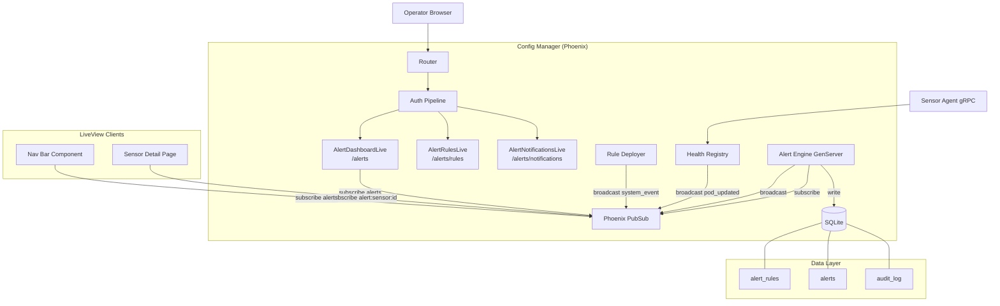
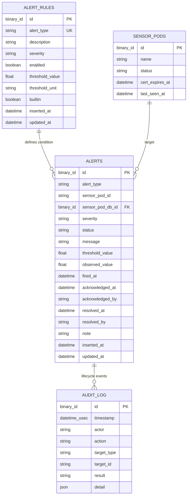

# Design Document: Platform Alert Center

## Overview

This design adds a centralized alerting subsystem to the RavenWire Config Manager. The Platform Alert Center derives platform-level alerts from health telemetry (clock drift, packet drops, disk usage, sensor offline) and system events (deployment failures, BPF validation errors, certificate expiration, PCAP prune failures, Vector sink down). It does not cover network traffic / SIEM alerts.

The subsystem consists of four major components:

1. **Alert Engine** — a GenServer that subscribes to Health Registry PubSub updates and system event broadcasts, evaluates configurable alert rules, fires or auto-resolves alerts, and enforces deduplication.
2. **Alert persistence layer** — Ecto schemas and context module for alerts, alert rules, and alert history stored in SQLite.
3. **Alert LiveView pages** — `/alerts` (dashboard), `/alerts/rules` (rule management), and `/alerts/notifications` (placeholder) with real-time PubSub updates.
4. **Integration points** — nav bar badge, sensor detail alert summary, sensor-scoped PubSub topics.

### Key Design Decisions

1. **Single Alert Engine GenServer**: The Alert Engine is a single GenServer process supervised in the application tree. It subscribes to the existing `"sensor_pods"` PubSub topic for health telemetry and to a new `"system_events"` topic for deployment/cert/prune events. A periodic timer (every 10 seconds) handles sensor offline detection and cert expiration checks. This keeps evaluation centralized and avoids race conditions in deduplication logic.

2. **Rule-driven evaluation with in-memory rule cache**: Alert rules are persisted in SQLite but cached in the Engine's GenServer state on startup and refreshed on rule updates. This avoids a DB query on every health report while keeping rules durable. Rule changes broadcast on a `"alert_rules"` PubSub topic so the Engine reloads its cache.

3. **Deduplication by (alert_type, sensor_pod_id) composite**: The Engine maintains an in-memory index of active alerts (firing or acknowledged) keyed by `{alert_type, sensor_pod_id}`. Before firing, it checks this index. The index is rebuilt from the database on Engine startup.

4. **Auto-resolve as a first-class transition**: When the Engine evaluates a health report and finds a previously-alerting condition now within threshold, it auto-resolves the alert. Auto-resolve sets `resolved_at`, `resolved_by = "system"`, and broadcasts the change. Manually resolved alerts are terminal and not re-opened by the Engine.

5. **PubSub topics for real-time delivery**: Alert events broadcast to `"alerts"` (fleet-wide, for the dashboard) and `"alert:sensor:{sensor_pod_id}"` (sensor-scoped, for the detail page). The dashboard LiveView subscribes to `"alerts"` and applies client-side filter matching to decide whether to prepend/update the visible list.

6. **PropCheck for property-based testing**: The project already includes `propcheck ~> 1.4`. Property tests will validate the Alert Engine evaluation logic, rule validation, alert lifecycle transitions, query filtering, and RBAC enforcement.

7. **Reuse existing Audit context**: Alert lifecycle events (fire, ack, resolve, rule change) use the existing `Audit.append_multi/2` pattern inside Ecto.Multi transactions, ensuring atomicity between alert state changes and audit entries.

8. **System events via PubSub, not polling**: Deployment failures, BPF validation errors, and PCAP prune failures are published by the existing `RuleDeployer` and future event sources to a `"system_events"` topic. The Alert Engine subscribes and evaluates. Cert expiration and sensor offline are checked periodically since they are time-based, not event-based.

## Architecture

### System Context



### Request Flow

**Alert evaluation (health telemetry):**
1. Sensor Agent streams `HealthReport` via gRPC
2. Health Registry updates ETS, broadcasts `{:pod_updated, pod_id}` to `"sensor_pods"`
3. Alert Engine receives `{:pod_updated, pod_id}`, reads health data from Registry
4. For each enabled health-telemetry rule, Engine evaluates the condition against the report
5. If condition met and no active alert exists for `{type, pod_id}` → fire alert (insert to DB, broadcast to PubSub)
6. If condition cleared and an active alert exists → auto-resolve (update DB, broadcast)

**Alert evaluation (system events):**
1. RuleDeployer completes a deployment, broadcasts `{:system_event, :rule_deploy_failed, pod_id, detail}` to `"system_events"`
2. Alert Engine receives the event, checks if the corresponding rule is enabled
3. If enabled and no active alert exists → fire alert
4. Resolution happens when a subsequent successful event is received or via periodic check

**Periodic checks (every 10 seconds):**
1. Engine timer fires `:check_periodic`
2. Engine iterates all known sensors, checks last-seen timestamps against `sensor_offline` threshold
3. Engine iterates all enrolled sensors, checks `cert_expires_at` against `cert_expiring` threshold
4. Fires or auto-resolves alerts as needed

**Alert acknowledgment/resolution (operator):**
1. Operator clicks ack/resolve on the alert dashboard
2. LiveView `handle_event` checks RBAC (`alerts:manage` permission)
3. If permitted → calls `Alerts.acknowledge_alert/3` or `Alerts.resolve_alert/3`
4. Context function uses `Ecto.Multi` to update alert + append audit entry
5. Broadcasts status change to `"alerts"` and `"alert:sensor:{pod_id}"` topics
6. All subscribed LiveView sessions update in real time

### Module Layout

```
lib/config_manager/
├── alerts/
│   ├── alert.ex                    # Ecto schema for alerts table
│   ├── alert_rule.ex               # Ecto schema for alert_rules table
│   └── alert_engine.ex             # GenServer: evaluation, firing, auto-resolve
├── alerts.ex                       # Context module (public API)

lib/config_manager_web/
├── live/
│   ├── alert_dashboard_live.ex     # /alerts — alert list with filters, search, pagination
│   ├── alert_rules_live.ex         # /alerts/rules — rule management
│   ├── alert_notifications_live.ex # /alerts/notifications — placeholder
│   └── components/
│       ├── alert_components.ex     # Shared alert UI components (badge, severity, status)
│       └── alert_nav_badge.ex      # Nav bar firing-count badge component
├── router.ex                       # Extended with /alerts routes
```

## Components and Interfaces

### 1. `ConfigManager.Alerts` — Alert Context Module

The primary public API for alert operations. All LiveViews and the Alert Engine call through this context.

```elixir
defmodule ConfigManager.Alerts do
  @moduledoc "Alert management context. Handles rules, alerts, and lifecycle transitions."

  alias ConfigManager.Alerts.{Alert, AlertRule}
  alias ConfigManager.{Audit, Repo}

  # ── Alert Rules ──

  @doc "Returns all alert rules, ordered by alert_type."
  def list_rules() :: [AlertRule.t()]

  @doc "Returns a single alert rule by ID."
  def get_rule!(id) :: AlertRule.t()

  @doc "Updates an alert rule's severity, enabled, and threshold. Writes audit entry."
  def update_rule(rule, attrs, actor) :: {:ok, AlertRule.t()} | {:error, Ecto.Changeset.t()}

  @doc "Seeds default alert rules if none exist. Called on application startup."
  def seed_default_rules() :: :ok

  # ── Alerts ──

  @doc "Fires a new alert. Used by Alert Engine. Returns {:ok, alert} or {:error, :duplicate}."
  def fire_alert(attrs) :: {:ok, Alert.t()} | {:error, :duplicate} | {:error, Ecto.Changeset.t()}

  @doc "Auto-resolves an alert. Sets resolved_by to 'system'."
  def auto_resolve_alert(alert) :: {:ok, Alert.t()}

  @doc "Acknowledges a firing alert. Requires operator attribution."
  def acknowledge_alert(alert, actor, opts \\ []) :: {:ok, Alert.t()} | {:error, atom()}

  @doc "Manually resolves a firing or acknowledged alert."
  def resolve_alert(alert, actor, opts \\ []) :: {:ok, Alert.t()} | {:error, atom()}

  @doc "Bulk acknowledges multiple alerts."
  def bulk_acknowledge(alert_ids, actor) :: {:ok, count :: integer()}

  @doc "Bulk resolves multiple alerts."
  def bulk_resolve(alert_ids, actor) :: {:ok, count :: integer()}

  @doc "Returns a single alert by ID."
  def get_alert!(id) :: Alert.t()

  @doc "Lists alerts with filtering, search, sorting, and pagination."
  def list_alerts(filters \\ %{}, pagination \\ %{}) :: {[Alert.t()], pagination_meta}

  @doc "Returns counts of alerts grouped by status."
  def alert_status_counts() :: %{firing: integer(), acknowledged: integer(), resolved: integer()}

  @doc "Returns count of currently firing alerts (for nav badge)."
  def firing_alert_count() :: integer()

  @doc "Returns active (firing + acknowledged) alerts for a specific sensor pod."
  def active_alerts_for_sensor(sensor_pod_id) :: [Alert.t()]

  @doc "Returns the set of active alert keys {type, pod_id} for Engine dedup cache rebuild."
  def active_alert_index() :: MapSet.t({String.t(), String.t()})
end
```

### 2. `ConfigManager.Alerts.AlertEngine` — GenServer

The core evaluation engine. Subscribes to PubSub, evaluates rules, fires/resolves alerts.

```elixir
defmodule ConfigManager.Alerts.AlertEngine do
  @moduledoc """
  GenServer that evaluates alert rules against health telemetry and system events.
  Fires and auto-resolves alerts. Maintains an in-memory deduplication index and
  rule cache to avoid DB queries on every health report.
  """

  use GenServer

  @check_interval_ms 10_000  # 10 seconds — satisfies ≤15s requirement for offline checks

  # ── State ──
  # %{
  #   rules: %{alert_type => %AlertRule{}},
  #   active_alerts: MapSet.t({alert_type, sensor_pod_id}),
  #   last_seen: %{sensor_pod_id => DateTime.t()}
  # }

  def start_link(opts \\ [])

  # ── GenServer Callbacks ──

  @impl true
  def init(_opts)
  # 1. Load enabled rules from DB into state.rules
  # 2. Rebuild active_alerts index from DB
  # 3. Initialize last_seen from Health Registry
  # 4. Subscribe to "sensor_pods", "system_events", "alert_rules" PubSub topics
  # 5. Schedule first periodic check

  @impl true
  def handle_info({:pod_updated, pod_id}, state)
  # Read health from Registry, evaluate health-telemetry rules

  @impl true
  def handle_info({:system_event, event_type, pod_id, detail}, state)
  # Evaluate system-event rules

  @impl true
  def handle_info(:check_periodic, state)
  # Check sensor_offline and cert_expiring for all known sensors

  @impl true
  def handle_info({:rules_updated}, state)
  # Reload rule cache from DB

  # ── Evaluation Logic (pure functions, testable) ──

  @doc "Evaluates a health report against a single rule. Returns :fire, :resolve, or :noop."
  def evaluate_health_rule(rule, health_report, pod_id) :: :fire | :resolve | :noop

  @doc "Checks if a sensor is offline based on last_seen and threshold."
  def check_offline(last_seen, threshold_sec, now) :: :fire | :resolve | :noop

  @doc "Checks if a cert is expiring within threshold hours."
  def check_cert_expiring(cert_expires_at, threshold_hours, now) :: :fire | :resolve | :noop
end
```

### 3. `ConfigManager.Alerts.AlertRule` — Ecto Schema

```elixir
defmodule ConfigManager.Alerts.AlertRule do
  use Ecto.Schema
  import Ecto.Changeset

  @primary_key {:id, :binary_id, autogenerate: true}

  @alert_types ~w(sensor_offline packet_drops_high clock_drift disk_critical
                  vector_sink_down rule_deploy_failed cert_expiring
                  bpf_validation_failed pcap_prune_failed)

  @severities ~w(critical warning info)

  schema "alert_rules" do
    field :alert_type, :string
    field :description, :string
    field :severity, :string, default: "warning"
    field :enabled, :boolean, default: true
    field :threshold_value, :float
    field :threshold_unit, :string  # "seconds", "percent", "milliseconds", "hours", "boolean"
    field :builtin, :boolean, default: true
    timestamps()
  end

  def changeset(rule, attrs) do
    rule
    |> cast(attrs, [:severity, :enabled, :threshold_value])
    |> validate_required([:alert_type, :severity, :enabled, :threshold_value])
    |> validate_inclusion(:alert_type, @alert_types)
    |> validate_inclusion(:severity, @severities)
    |> validate_threshold()
  end

  defp validate_threshold(changeset) do
    alert_type = get_field(changeset, :alert_type)
    threshold = get_field(changeset, :threshold_value)

    case {alert_type, threshold} do
      {_, nil} -> add_error(changeset, :threshold_value, "is required")
      {"packet_drops_high", v} when v < 0 or v > 100 ->
        add_error(changeset, :threshold_value, "must be between 0 and 100")
      {"disk_critical", v} when v < 0 or v > 100 ->
        add_error(changeset, :threshold_value, "must be between 0 and 100")
      {"clock_drift", v} when v <= 0 ->
        add_error(changeset, :threshold_value, "must be greater than 0")
      {"sensor_offline", v} when v <= 0 ->
        add_error(changeset, :threshold_value, "must be greater than 0")
      {"cert_expiring", v} when v <= 0 ->
        add_error(changeset, :threshold_value, "must be greater than 0")
      _ -> changeset
    end
  end
end
```

### 4. `ConfigManager.Alerts.Alert` — Ecto Schema

```elixir
defmodule ConfigManager.Alerts.Alert do
  use Ecto.Schema
  import Ecto.Changeset

  @primary_key {:id, :binary_id, autogenerate: true}

  @statuses ~w(firing acknowledged resolved)

  schema "alerts" do
    field :alert_type, :string
    field :sensor_pod_id, :string       # Health Registry key (pod name)
    field :sensor_pod_db_id, :binary_id # FK to sensor_pods.id for joins
    field :severity, :string
    field :status, :string, default: "firing"
    field :message, :string
    field :threshold_value, :float      # The rule threshold at time of firing
    field :observed_value, :float       # The actual value that triggered the alert
    field :fired_at, :utc_datetime
    field :acknowledged_at, :utc_datetime
    field :acknowledged_by, :string
    field :resolved_at, :utc_datetime
    field :resolved_by, :string         # operator username or "system"
    field :note, :string
    timestamps()
  end

  def fire_changeset(alert, attrs) do
    alert
    |> cast(attrs, [:alert_type, :sensor_pod_id, :sensor_pod_db_id, :severity,
                    :message, :threshold_value, :observed_value, :fired_at])
    |> validate_required([:alert_type, :sensor_pod_id, :severity, :status,
                          :message, :fired_at])
    |> put_change(:status, "firing")
  end

  def acknowledge_changeset(alert, attrs) do
    alert
    |> cast(attrs, [:acknowledged_by, :acknowledged_at, :note])
    |> validate_required([:acknowledged_by, :acknowledged_at])
    |> put_change(:status, "acknowledged")
    |> validate_transition(alert.status, "acknowledged")
  end

  def resolve_changeset(alert, attrs) do
    alert
    |> cast(attrs, [:resolved_by, :resolved_at, :note])
    |> validate_required([:resolved_by, :resolved_at])
    |> put_change(:status, "resolved")
    |> validate_transition(alert.status, "resolved")
  end

  defp validate_transition(changeset, current_status, target_status) do
    valid_transitions = %{
      "firing" => ["acknowledged", "resolved"],
      "acknowledged" => ["resolved"],
      "resolved" => []
    }

    allowed = Map.get(valid_transitions, current_status, [])

    if target_status in allowed do
      changeset
    else
      add_error(changeset, :status, "cannot transition from #{current_status} to #{target_status}")
    end
  end
end
```

### 5. Router Changes

New routes added to the authenticated scope:

```elixir
# Inside the authenticated live_session block:
live "/alerts", AlertDashboardLive, :index, private: %{required_permission: "sensors:view"}
live "/alerts/rules", AlertRulesLive, :index, private: %{required_permission: "alerts:manage"}
live "/alerts/notifications", AlertNotificationsLive, :index, private: %{required_permission: "sensors:view"}
```

### 6. `ConfigManagerWeb.AlertDashboardLive` — Alert Dashboard

```elixir
defmodule ConfigManagerWeb.AlertDashboardLive do
  use ConfigManagerWeb, :live_view

  alias ConfigManager.Alerts

  @impl true
  def mount(_params, _session, socket) do
    if connected?(socket) do
      Phoenix.PubSub.subscribe(ConfigManager.PubSub, "alerts")
    end

    {alerts, meta} = Alerts.list_alerts(%{}, %{page: 1, page_size: 25})
    counts = Alerts.alert_status_counts()

    {:ok, assign(socket,
      alerts: alerts,
      meta: meta,
      counts: counts,
      filters: %{},
      search: "",
      page: 1,
      page_size: 25,
      selected: MapSet.new()
    )}
  end

  # PubSub handlers for real-time updates
  @impl true
  def handle_info({:alert_fired, alert}, socket)
  def handle_info({:alert_updated, alert}, socket)
  def handle_info({:alert_resolved, alert}, socket)

  # Filter, search, pagination, ack, resolve, bulk actions
  @impl true
  def handle_event("filter", params, socket)
  def handle_event("search", %{"q" => query}, socket)
  def handle_event("page", %{"page" => page}, socket)
  def handle_event("acknowledge", %{"id" => id}, socket)
  def handle_event("resolve", %{"id" => id}, socket)
  def handle_event("bulk_acknowledge", _params, socket)
  def handle_event("bulk_resolve", _params, socket)
  def handle_event("toggle_select", %{"id" => id}, socket)
  def handle_event("select_all", _params, socket)
end
```

### 7. `ConfigManagerWeb.AlertRulesLive` — Rule Management

```elixir
defmodule ConfigManagerWeb.AlertRulesLive do
  use ConfigManagerWeb, :live_view

  alias ConfigManager.Alerts

  @impl true
  def mount(_params, _session, socket) do
    rules = Alerts.list_rules()
    {:ok, assign(socket, rules: rules, editing: nil, changeset: nil)}
  end

  @impl true
  def handle_event("edit", %{"id" => id}, socket)
  def handle_event("save", %{"alert_rule" => params}, socket)
  def handle_event("cancel", _params, socket)
  def handle_event("toggle_enabled", %{"id" => id}, socket)
end
```

### 8. `ConfigManagerWeb.Components.AlertComponents` — Shared UI Components

```elixir
defmodule ConfigManagerWeb.Components.AlertComponents do
  use Phoenix.Component

  @doc "Renders a severity badge with color coding."
  attr :severity, :string, required: true
  def severity_badge(assigns)
  # critical → red, warning → amber, info → blue

  @doc "Renders a status badge."
  attr :status, :string, required: true
  def status_badge(assigns)

  @doc "Renders the alert summary bar with status counts."
  attr :counts, :map, required: true
  def status_summary(assigns)

  @doc "Renders the sub-navigation tabs for alert pages."
  attr :active, :atom, required: true
  def alert_nav_tabs(assigns)
end
```

### 9. `ConfigManagerWeb.Components.AlertNavBadge` — Nav Bar Badge

A function component used in the root layout to show the firing alert count.

```elixir
defmodule ConfigManagerWeb.Components.AlertNavBadge do
  use Phoenix.Component

  attr :count, :integer, required: true

  def alert_badge(assigns) do
    ~H"""
    <a href="/alerts" class="relative">
      Alerts
      <%= if @count > 0 do %>
        <span class="absolute -top-1 -right-2 bg-red-500 text-white text-xs rounded-full px-1.5 py-0.5 min-w-[1.25rem] text-center">
          <%= @count %>
        </span>
      <% end %>
    </a>
    """
  end
end
```

### 10. Policy Module Extension

The existing `ConfigManager.Auth.Policy` module's `@roles_permissions` map is extended:

```elixir
# New permission added:
"alerts:manage"

# Added to these roles:
"sensor-operator" => [...existing..., "alerts:manage"]
"rule-manager"    => [...existing..., "alerts:manage"]
"platform-admin"  => :all  # already covers everything

# alerts:view is an alias — implemented by checking sensors:view
# The dashboard route uses "sensors:view" as its required_permission
```

### 11. Application Supervision Tree Extension

```elixir
# In ConfigManager.Application.start/2, add after Health.Registry:
children = [
  # ... existing children ...
  ConfigManager.Health.Registry,

  # Alert Engine — evaluates rules against health telemetry and system events
  ConfigManager.Alerts.AlertEngine,

  # ... rest of existing children ...
]
```

The `seed_default_rules/0` function is called during application startup (in `Application.start/2` after Repo is available) or via a migration seed.

### 12. System Event Broadcasting

The existing `RuleDeployer` and future event sources broadcast system events:

```elixir
# In RuleDeployer.deploy_to_pool/3, after processing each pod result:
case result do
  {:error, reason} ->
    Phoenix.PubSub.broadcast(
      ConfigManager.PubSub,
      "system_events",
      {:system_event, :rule_deploy_failed, pod.id, %{reason: reason, pool_id: pool_id}}
    )
  {:ok, _} ->
    Phoenix.PubSub.broadcast(
      ConfigManager.PubSub,
      "system_events",
      {:system_event, :rule_deploy_success, pod.id, %{pool_id: pool_id}}
    )
end
```

Similar broadcasts are added for BPF validation failures and PCAP prune failures at their respective call sites.

## Data Models

### `alert_rules` Table

```sql
CREATE TABLE alert_rules (
  id              BLOB PRIMARY KEY,
  alert_type      TEXT NOT NULL UNIQUE,
  description     TEXT NOT NULL,
  severity        TEXT NOT NULL DEFAULT 'warning',
  enabled         BOOLEAN NOT NULL DEFAULT TRUE,
  threshold_value REAL NOT NULL,
  threshold_unit  TEXT NOT NULL,
  builtin         BOOLEAN NOT NULL DEFAULT TRUE,
  inserted_at     TEXT NOT NULL,
  updated_at      TEXT NOT NULL
);

CREATE UNIQUE INDEX alert_rules_alert_type_index ON alert_rules (alert_type);
```

### `alerts` Table

```sql
CREATE TABLE alerts (
  id                BLOB PRIMARY KEY,
  alert_type        TEXT NOT NULL,
  sensor_pod_id     TEXT NOT NULL,
  sensor_pod_db_id  BLOB,
  severity          TEXT NOT NULL,
  status            TEXT NOT NULL DEFAULT 'firing',
  message           TEXT NOT NULL,
  threshold_value   REAL,
  observed_value    REAL,
  fired_at          TEXT NOT NULL,
  acknowledged_at   TEXT,
  acknowledged_by   TEXT,
  resolved_at       TEXT,
  resolved_by       TEXT,
  note              TEXT,
  inserted_at       TEXT NOT NULL,
  updated_at        TEXT NOT NULL
);

CREATE INDEX alerts_alert_type_index ON alerts (alert_type);
CREATE INDEX alerts_sensor_pod_id_index ON alerts (sensor_pod_id);
CREATE INDEX alerts_status_index ON alerts (status);
CREATE INDEX alerts_fired_at_index ON alerts (fired_at);
CREATE INDEX alerts_severity_index ON alerts (severity);
-- Composite index for deduplication queries
CREATE INDEX alerts_type_pod_status_index ON alerts (alert_type, sensor_pod_id, status);
```

### Default Rule Seeds

| Alert Type | Description | Threshold | Unit | Severity |
|---|---|---|---|---|
| `sensor_offline` | Sensor stopped reporting health data | 60 | seconds | critical |
| `packet_drops_high` | Capture consumer packet drop rate exceeded | 5.0 | percent | warning |
| `clock_drift` | System clock offset exceeded threshold | 100 | milliseconds | warning |
| `disk_critical` | Storage usage exceeded threshold | 90.0 | percent | critical |
| `vector_sink_down` | Vector log forwarding sink unreachable | 0 | boolean | critical |
| `rule_deploy_failed` | Rule deployment failed on sensor | 0 | boolean | warning |
| `cert_expiring` | Sensor certificate approaching expiration | 72 | hours | warning |
| `bpf_validation_failed` | BPF filter validation failed during deployment | 0 | boolean | warning |
| `pcap_prune_failed` | PCAP storage prune operation failed | 0 | boolean | critical |

### Entity Relationship Diagram




## Correctness Properties

*A property is a characteristic or behavior that should hold true across all valid executions of a system — essentially, a formal statement about what the system should do. Properties serve as the bridge between human-readable specifications and machine-verifiable correctness guarantees.*

### Property 1: Alert rule threshold validation accepts valid values and rejects invalid values

*For any* alert type and *for any* numeric value, the `AlertRule.changeset/2` validation SHALL accept the value if and only if it falls within the allowed range for that alert type (0–100 for percent-based rules, >0 for time-based rules). Values outside the range, non-numeric values, and nil SHALL be rejected with a validation error.

**Validates: Requirements 1.4, 1.8**

### Property 2: Alert rule update round-trip with audit

*For any* existing alert rule and *for any* valid combination of severity, enabled status, and threshold value, calling `update_rule/3` SHALL persist the exact values to the database and produce an audit log entry with action `"alert_rule_updated"`, the rule ID as target, and the actor username. Reading the rule back SHALL return the updated values.

**Validates: Requirements 1.3, 1.5**

### Property 3: Disabled rules produce no alerts

*For any* health report or system event that would trigger an alert under an enabled rule, if that rule is disabled, the Alert Engine SHALL NOT fire an alert. The set of alerts before and after evaluation SHALL be identical.

**Validates: Requirements 1.6, 3.6**

### Property 4: Health telemetry alert fires when metric exceeds threshold

*For any* health report where a monitored metric (clock offset, packet drop percent, disk used percent) exceeds the corresponding enabled rule's threshold, and no active alert exists for that `{alert_type, sensor_pod_id}`, the Alert Engine SHALL fire exactly one alert with the correct alert type, sensor pod ID, severity matching the rule, and observed value matching the metric.

**Validates: Requirements 3.1, 3.2, 3.3**

### Property 5: Auto-resolve when condition clears

*For any* active (firing or acknowledged) alert whose triggering condition is no longer met (metric returned within threshold, sensor reconnected, successful re-deployment), the Alert Engine SHALL transition the alert to `resolved` status with `resolved_by = "system"` and a `resolved_at` timestamp. The alert SHALL be removed from the active alert index.

**Validates: Requirements 3.5, 4.6, 10.4**

### Property 6: Alert deduplication — no duplicate active alerts per type and sensor

*For any* sequence of health reports or system events that would trigger the same alert type for the same sensor pod, if an alert with status `firing` or `acknowledged` already exists for that `{alert_type, sensor_pod_id}` pair, the Engine SHALL NOT create a second alert. The count of active alerts for that pair SHALL remain exactly one.

**Validates: Requirements 3.7**

### Property 7: System event alert fires for matching enabled rules

*For any* system event (deployment failure, BPF validation failure, PCAP prune failure, Vector sink down) targeting a sensor pod, if the corresponding rule is enabled and no active alert exists for that `{alert_type, sensor_pod_id}`, the Engine SHALL fire exactly one alert with the correct type and sensor pod ID.

**Validates: Requirements 4.1, 4.2, 4.4, 4.5**

### Property 8: Cert expiring alert fires within threshold window

*For any* enrolled sensor pod whose `cert_expires_at` is within the `cert_expiring` rule's threshold hours from now, and no active `cert_expiring` alert exists for that pod, the periodic check SHALL fire a `cert_expiring` alert. For any pod whose `cert_expires_at` is beyond the threshold, no alert SHALL be fired.

**Validates: Requirements 4.3**

### Property 9: Sensor offline detection fires and auto-resolves correctly

*For any* sensor pod whose last health report timestamp is older than the `sensor_offline` rule threshold, the periodic check SHALL fire a `sensor_offline` alert. *For any* sensor pod that was previously offline and resumes sending health reports, the Engine SHALL auto-resolve the `sensor_offline` alert.

**Validates: Requirements 3.4, 10.1, 10.2, 10.4**

### Property 10: Alert persistence contains all required fields

*For any* fired alert, the persisted database record SHALL contain non-nil values for: `alert_type`, `sensor_pod_id`, `severity`, `status` (= "firing"), `message` (non-empty string), `fired_at`, and `threshold_value`. The `observed_value` SHALL be non-nil for metric-based alerts (clock_drift, packet_drops_high, disk_critical).

**Validates: Requirements 5.1**

### Property 11: Alert lifecycle transitions are valid and terminal states are enforced

*For any* alert, the only valid status transitions SHALL be: `firing → acknowledged`, `firing → resolved`, `acknowledged → resolved`. Attempting to transition a `resolved` alert to any other status SHALL fail. Each successful transition SHALL update the corresponding timestamp field (`acknowledged_at` or `resolved_at`) and record the actor.

**Validates: Requirements 7.1, 7.2, 7.5**

### Property 12: Bulk operations transition all selected alerts

*For any* non-empty set of alert IDs where each alert is in a valid source status, bulk acknowledge SHALL transition all selected firing alerts to acknowledged, and bulk resolve SHALL transition all selected firing/acknowledged alerts to resolved. The count of transitioned alerts SHALL equal the count of eligible alerts in the selection.

**Validates: Requirements 7.3, 7.4**

### Property 13: Alert query filtering returns only matching results

*For any* combination of filter parameters (severity, alert_type, status, sensor_pod_id) and *for any* search string, the `list_alerts/2` function SHALL return only alerts that match ALL active filter predicates AND contain the search string in their message or sensor_pod_id. No non-matching alert SHALL appear in the results.

**Validates: Requirements 6.3, 6.4**

### Property 14: Alert query pagination returns correct slices in descending fired_at order

*For any* page number P and page size N, `list_alerts/2` SHALL return at most N alerts, all sorted by `fired_at` descending. The returned alerts SHALL correspond to the Pth slice of the full filtered result set. The pagination metadata SHALL include correct total count and page information.

**Validates: Requirements 6.1, 6.5**

### Property 15: Status summary counts match actual alert counts

*For any* set of alerts in the database, `alert_status_counts/0` SHALL return counts where `firing` equals the count of alerts with status "firing", `acknowledged` equals the count with status "acknowledged", and `resolved` equals the count with status "resolved". The sum of all counts SHALL equal the total number of alerts.

**Validates: Requirements 6.6**

### Property 16: Severity color mapping is correct and exhaustive

*For any* severity value in `{critical, warning, info}`, the severity badge component SHALL render with the CSS class containing `red` for critical, `amber`/`yellow` for warning, and `blue` for info. No two severities SHALL map to the same color family.

**Validates: Requirements 6.8**

### Property 17: RBAC enforcement — alerts:manage gates management actions

*For any* authenticated user, acknowledging, resolving, or editing alert rules SHALL succeed if and only if the user's role includes the `alerts:manage` permission. Users without `alerts:manage` SHALL see the alert dashboard in read-only mode with action buttons hidden, and server-side `handle_event` calls for those actions SHALL be rejected.

**Validates: Requirements 12.2, 12.3, 12.6**

### Property 18: Alert lifecycle events produce audit entries

*For any* alert fire, acknowledgment, manual resolution, or auto-resolution, the system SHALL create an audit log entry with the appropriate action name (`alert_fired`, `alert_acknowledged`, `alert_resolved`), the alert ID as `target_id`, `target_type = "alert"`, and a non-empty actor field. For auto-resolve, the actor SHALL be `"system"`.

**Validates: Requirements 5.5**

### Property 19: Nav badge count equals firing alert count

*For any* set of alerts in the database, the nav bar badge SHALL display a count equal to the number of alerts with status `"firing"`. When the count is zero, the badge element SHALL not be rendered.

**Validates: Requirements 11.1, 11.2**

### Property 20: Sensor detail alert summary shows only active alerts for that sensor

*For any* sensor pod, the alert summary section on the sensor detail page SHALL display exactly the alerts with status `"firing"` or `"acknowledged"` whose `sensor_pod_id` matches that sensor. Alerts for other sensors or in `"resolved"` status SHALL not appear.

**Validates: Requirements 11.3**

## Error Handling

### Alert Engine Errors

| Scenario | Behavior |
|----------|----------|
| Health Registry ETS read failure | Log error, skip evaluation for this cycle. Do not crash the Engine. |
| Database write failure on alert fire | Log error, retry on next evaluation cycle. Do not cache the alert as active. |
| Database write failure on auto-resolve | Log error, retry on next periodic check. Alert remains in active index. |
| PubSub broadcast failure | Log warning. Alert state in DB is authoritative; UI will catch up on next query. |
| Rule cache reload failure | Log error, continue with stale cache. Retry on next `:rules_updated` message. |

### Alert Dashboard Errors

| Scenario | Behavior |
|----------|----------|
| Database query failure | Flash error message, retain current list state. |
| Ack/resolve of already-resolved alert | Flash info "Alert already resolved", refresh alert list. |
| Ack/resolve without permission | Flash error "Insufficient permissions", no state change. |
| Bulk action with no selection | Flash info "No alerts selected", no action taken. |
| Invalid filter parameters | Ignore invalid values, apply only valid filters. |

### Alert Rule Errors

| Scenario | Behavior |
|----------|----------|
| Invalid threshold value | Display validation error on form, retain form state. |
| Attempt to delete built-in rule | Flash error "Built-in rules cannot be deleted". |
| Concurrent rule edit | Last write wins (optimistic). Audit log records both changes. |

### System Event Errors

| Scenario | Behavior |
|----------|----------|
| Malformed system event message | Log warning with event details, skip evaluation. |
| Unknown alert type in event | Log warning, skip. Do not crash the Engine. |
| Sensor pod not found in DB | Fire alert with `sensor_pod_db_id = nil`. Alert is still useful for the pod name. |

## Testing Strategy

### Property-Based Testing (PropCheck)

The project uses `propcheck ~> 1.4` (Erlang PropEr wrapper). Each property test runs a minimum of 100 iterations.

**Alert Engine evaluation logic** (Properties 3, 4, 5, 6, 7, 8, 9):
- Generate random health reports with varying metric values
- Generate random rule configurations with varying thresholds and enabled states
- Test the pure evaluation functions (`evaluate_health_rule/3`, `check_offline/3`, `check_cert_expiring/3`) in isolation
- Test deduplication by generating sequences of reports for the same pod

**Alert rule validation** (Property 1):
- Generate random `{alert_type, threshold_value}` pairs
- Verify changeset accepts/rejects correctly based on range rules

**Alert lifecycle transitions** (Properties 11, 12):
- Generate random alert states and transition attempts
- Verify valid transitions succeed and invalid transitions fail
- Generate random subsets for bulk operations

**Query filtering and pagination** (Properties 13, 14, 15):
- Generate random sets of alerts with varying types, severities, statuses, and timestamps
- Generate random filter combinations and verify result correctness
- Generate random page sizes and page numbers, verify slice correctness

**RBAC enforcement** (Property 17):
- Generate random `{role, action}` pairs
- Verify action succeeds iff role has `alerts:manage`

**Tag format**: Each property test is tagged with a comment:
```elixir
# Feature: platform-alert-center, Property 4: Health telemetry alert fires when metric exceeds threshold
```

### Unit Tests (ExUnit)

Unit tests cover specific examples and edge cases not suited for property-based testing:

- **Seed defaults** (Req 2.1–2.9): Verify all 9 rules exist with exact default values after seeding
- **Built-in rule deletion prevention** (Req 1.7): Attempt delete, verify rejection
- **PubSub integration** (Req 8.1–8.4): Subscribe, fire alert, verify message received within timeout
- **Placeholder page** (Req 9.1): Render `/alerts/notifications`, verify placeholder content
- **Navigation tabs** (Req 9.2): Render each alert page, verify sub-nav links
- **Sensor detail link** (Req 6.9): Render alert row, verify pod name links to `/sensors/:id`
- **Filtered dashboard link** (Req 11.4): Render sensor detail alert summary, verify link to `/alerts?sensor_pod_id=X`
- **Role permission mapping** (Req 12.4, 12.5): Verify `alerts:manage` in correct roles, `sensors:view` grants dashboard access
- **Periodic interval** (Req 10.3): Verify Engine check interval is ≤ 15 seconds
- **Audit entry structure**: Verify audit entries contain all required fields for each lifecycle event
- **Color coding**: Verify severity badge CSS classes for critical/warning/info
- **Notes persistence** (Req 7.7): Ack/resolve with note, verify note persisted on alert record

### Integration Tests

- **End-to-end alert flow**: Health report → Engine evaluation → alert fired → PubSub → dashboard update
- **Auto-resolve flow**: Fire alert → send clearing report → verify auto-resolve → PubSub broadcast
- **Ack/resolve with audit**: Ack alert → verify DB state + audit entry + PubSub broadcast
- **LiveView rendering**: Mount dashboard, verify filter controls, pagination, severity badges render correctly
- **Real-time update**: Mount dashboard, fire alert via Engine, verify alert appears without page refresh
