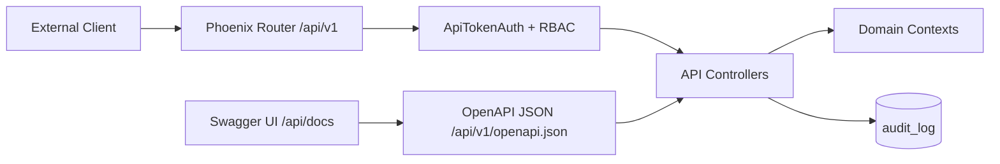

# Design Document: Public API Documentation

## Overview

This design adds a versioned, documented REST/JSON Public API for external automation. The API is served under `/api/v1`, authenticated by bearer API tokens from `auth-rbac-audit`, and documented through an OpenAPI 3.0 JSON document plus a local Swagger UI page at `/api/docs`.

The feature does not make LiveView events public API. Public API controllers delegate to the same context modules as the UI, use the same RBAC permission strings, and return consistent JSON envelopes.

## Key Design Decisions

1. **Versioned from day one**: Every public automation endpoint lives under `/api/v1`.
2. **OpenAPI generated from code-adjacent definitions**: Endpoint specs live beside controllers to avoid stale hand-written API docs.
3. **Bearer token auth only**: Public API requests use API tokens, not browser sessions.
4. **Same permissions as UI**: API token scopes are the canonical permissions from `auth-rbac-audit`.
5. **Air-gap compatible docs**: Swagger UI assets are bundled locally and never loaded from a CDN.
6. **Document only implemented contexts**: The OpenAPI spec omits deferred endpoints until their backing context exists.

## Architecture



## Route Ownership

The `auth-rbac-audit` spec owns the canonical permission catalog and the initial route policy. This spec owns documentation generation, versioning behavior, response formats, and API documentation UI.

Public API examples and generated OpenAPI paths must use `/api/v1/...`. New unversioned `/api/...` public endpoints are not allowed.

## Module Layout

```text
lib/config_manager_web/controllers/api/
├── open_api_controller.ex
├── sensors_controller.ex
├── pools_controller.ex
├── deployments_controller.ex
├── rules_controller.ex
├── rulesets_controller.ex
├── repositories_controller.ex
└── audit_controller.ex

lib/config_manager_web/api/
├── spec.ex
├── schemas.ex
├── errors.ex
├── pagination.ex
└── rate_limiter.ex

assets/vendor/swagger-ui/
```

## Components

### `ConfigManagerWeb.Api.Spec`

Builds the OpenAPI 3.0 document from endpoint descriptors and reusable schema components.

```elixir
defmodule ConfigManagerWeb.Api.Spec do
  def openapi() :: map()
  def endpoint_specs() :: [map()]
  def schema_components() :: map()
end
```

Endpoint descriptors include:

- method and path.
- summary and description.
- request parameters and body schema.
- success and error responses.
- required permission.
- example request and response.

### `ConfigManagerWeb.Api.Schemas`

Defines reusable JSON schemas:

```text
Sensor_Pod
Sensor_Health
Sensor_Pool
Deployment
Deployment_Result
Suricata_Rule
Ruleset
Rule_Repository
BPF_Profile
Forwarding_Sink
PCAP_Carve_Request
PCAP_Custody_Manifest
Audit_Entry
Pagination_Meta
Error_Response
```

Forwarding and BPF schemas may exist as reusable components before endpoints exist, but the OpenAPI path list must omit non-functional routes.

### `ConfigManagerWeb.Api.Errors`

Normalizes JSON error responses:

```json
{
  "error": {
    "code": "validation_error",
    "message": "Request could not be validated",
    "details": {},
    "request_id": "req_..."
  }
}
```

The response never includes stack traces, internal module names, SQL errors, secrets, bearer tokens, or raw request bodies containing credentials.

### `ConfigManagerWeb.Api.RateLimiter`

Applies a per-token default of 100 requests per minute. The limiter key is the API token ID, not the raw token value. Rate-limit failures return `429 Too Many Requests` and include `Retry-After` when available.

## API Surface

Initial documented endpoints:

| Method | Path | Permission |
| --- | --- | --- |
| GET | `/api/v1/openapi.json` | public by default |
| GET | `/api/v1/sensors` | `sensors:view` |
| GET | `/api/v1/sensors/:id` | `sensors:view` |
| GET | `/api/v1/sensors/:id/health` | `sensors:view` |
| GET | `/api/v1/pools` | `sensors:view` |
| GET | `/api/v1/pools/:id` | `sensors:view` |
| GET | `/api/v1/pools/:id/sensors` | `sensors:view` |
| GET | `/api/v1/deployments` | `sensors:view` |
| GET | `/api/v1/deployments/:id` | `sensors:view` |
| POST | `/api/v1/deployments` | `deployments:manage` |
| POST | `/api/v1/deployments/:id/cancel` | `deployments:manage` |
| POST | `/api/v1/deployments/:id/rollback` | `deployments:manage` |
| GET | `/api/v1/pcap/requests` | `pcap:search` |
| POST | `/api/v1/pcap/carve` | `pcap:search` |
| GET | `/api/v1/pcap/requests/:id` | `pcap:search` |
| GET | `/api/v1/pcap/requests/:id/download` | `pcap:download` |
| GET | `/api/v1/pcap/requests/:id/manifest` | `pcap:search` |
| GET | `/api/v1/rules` | `sensors:view` |
| GET | `/api/v1/rules/:id` | `sensors:view` |
| GET | `/api/v1/rulesets` | `sensors:view` |
| GET | `/api/v1/rulesets/:id` | `sensors:view` |
| GET | `/api/v1/repositories` | `sensors:view` |
| GET | `/api/v1/audit` | `audit:view` |

Endpoint groups for forwarding and BPF are added only after their management contexts are implemented. Webhooks, GraphQL, gRPC, bulk operations, and API token rotation endpoints are deferred.

## Response Format

Success:

```json
{
  "data": {}
}
```

Paginated success:

```json
{
  "data": [],
  "meta": {
    "page": 1,
    "page_size": 50,
    "total_count": 100,
    "total_pages": 2
  }
}
```

No-content actions return `204` with an empty body where appropriate.

## Request ID Handling

Every Public API response includes:

```text
X-Request-ID: <stable request id>
X-API-Version: v1
```

Error responses also include `request_id` in the JSON body.

## Documentation UI

`/api/docs` serves a LiveView or controller-rendered page that loads local Swagger UI assets and points to `/api/v1/openapi.json`.

Behavior:

- Documentation browsing is public by default.
- Hardened deployments may require authentication for docs through configuration.
- "Try it out" sends real API requests and therefore requires a valid bearer token.
- The UI never persists the bearer token server-side.

## Audit Logging

Every authenticated API request records an audit entry with:

- API token name and token ID.
- actor type `api_token`.
- HTTP method.
- path template, not raw path when possible.
- result `success` or `failure`.
- status code.
- required permission.
- request ID.

Audit details must redact Authorization headers, secrets, and request bodies containing credentials.

## Correctness Properties

### Property 1: OpenAPI paths match router paths

For every documented endpoint path and method, the Phoenix router SHALL contain a matching `/api/v1` route. The OpenAPI spec SHALL NOT document non-functional routes.

**Validates: Requirements 1.1, 1.6, 5.7**

### Property 2: API permissions match canonical RBAC

For every documented protected endpoint, the required permission SHALL be present in `Policy.canonical_permissions/0`.

**Validates: Requirements 1.4, 4.2**

### Property 3: Error responses never expose internals

For any controller error path, the JSON response SHALL match the error envelope and SHALL NOT contain stack traces, module names, SQL details, bearer tokens, or secrets.

**Validates: Requirements 6.1-6.6**

### Property 4: Version headers are always present

For any Public API response under `/api/v1`, the response SHALL include `X-API-Version: v1`.

**Validates: Requirements 3.5**

## Testing Strategy

- Unit tests for reusable schemas and OpenAPI component generation.
- Router/OpenAPI consistency tests.
- Controller tests for success, validation, not found, unauthorized, forbidden, download streaming, and rate-limited responses.
- Property tests for permission coverage and error envelope safety.
- Tests proving Swagger UI assets are local and no CDN references exist.
- Tests proving `/api/v2/...` returns 404 until a v2 router exists.
