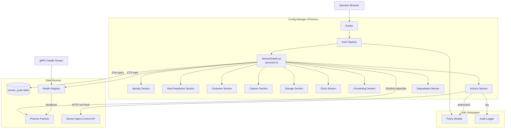
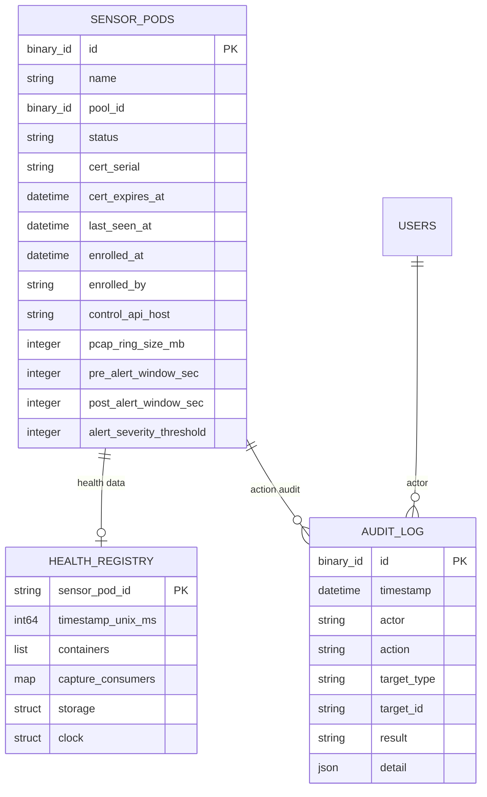

# Design Document: Sensor Detail Page

## Overview

This design adds a dedicated Sensor Pod detail page at `/sensors/:id` to the RavenWire Config Manager. The current dashboard provides a fleet-level view of all connected pods, but operators cannot drill into a single sensor to see its full identity, host readiness, per-container health, capture pipeline state, storage health, forwarding status, clock synchronization, or trigger operational actions.

The detail page combines two data sources:

1. **Persisted identity data** from the `sensor_pods` SQLite table via Ecto (name, UUID, pool, certificate, enrollment state, PCAP config)
2. **Real-time health data** from the in-memory ETS-backed Health Registry (containers, capture consumers, storage, clock, forwarding), fed by the gRPC `HealthReport` stream from Sensor Agents

The page is implemented as a Phoenix LiveView that subscribes to PubSub updates scoped to the displayed pod. It renders sections in a fixed order: degradation summary, identity, host readiness, containers, capture pipeline, storage, clock, forwarding, and actions. Each section handles missing/stale data gracefully with placeholder messages.

Most action buttons dispatch commands to the Sensor Agent control API via the existing `SensorAgentClient` module. The Revoke Sensor action is handled locally by Config Manager identity and certificate revocation logic. Actions are gated by RBAC permissions from the auth-rbac-audit spec, with server-side enforcement on every `handle_event` callback regardless of UI visibility.

### Key Design Decisions

1. **Single LiveView with section components**: The detail page is one LiveView module (`SensorDetailLive`) that delegates rendering to stateless function components for each section. This keeps the LiveView focused on data loading and PubSub handling while making each section independently testable.

2. **Pod-scoped PubSub topic using the health key**: The detail page route uses the database UUID, but the Health Registry is keyed by `HealthReport.sensor_pod_id` (currently the sensor pod name). After loading the database record, the detail page derives a `health_key` from `pod.name` and subscribes to `"sensor_pod:#{health_key}"` in addition to the existing `"sensor_pods"` broadcast topic. The Health Registry will broadcast to both the fleet-wide topic (for the dashboard) and the pod-specific topic (for the detail page). This avoids the detail page processing updates for every pod in the fleet.

3. **Formatting as a pure helper module**: All unit formatting (bytes, throughput, timestamps, relative age, certificate status) lives in a dedicated `ConfigManagerWeb.Formatters` module with pure functions. This makes formatting logic property-testable without LiveView dependencies.

4. **Supervised async action dispatch**: Operational actions are dispatched with Phoenix LiveView `start_async/3` or a named `Task.Supervisor`, with a configurable timeout (default 30 seconds). The LiveView tracks in-flight actions by name to show loading state and prevent double-clicks without linking long-running work directly to the LiveView process.

5. **Reuse existing `SensorAgentClient`**: New control API client functions for validate config, reload Zeek, reload Suricata, and restart Vector follow the same pattern as existing `switch_capture_mode/2` and `request_support_bundle/1`. Existing support bundle request/download behavior is reused; the client module is extended, not replaced.

6. **PropCheck for property-based testing**: The project already includes `propcheck ~> 1.4`. Property tests will validate formatting functions, permission enforcement, and data rendering invariants.

## Architecture

### System Context



### Request Flow

**Page load:**
1. Browser navigates to `/sensors/:id`
2. Auth pipeline validates session, assigns `current_user`
3. `SensorDetailLive.mount/3` loads the `SensorPod` from SQLite by ID
4. If not found → render 404 page
5. If found → derive `health_key = pod.name`, read health data from `Registry.get(health_key)`, and read degradation from `Registry.get_degraded_pods()[health_key]`
6. Subscribe to `"sensor_pod:#{health_key}"` PubSub topic only when the LiveView socket is connected
7. Render all sections with available data

**Real-time update:**
1. Sensor Agent streams `HealthReport` via gRPC
2. Health Registry updates ETS, broadcasts `{:pod_updated, health_key}` to `"sensor_pods"` and `"sensor_pod:#{health_key}"`
3. `SensorDetailLive.handle_info/2` receives the message, reads fresh data from Registry
4. LiveView re-renders only changed sections via diff tracking

**Action dispatch:**
1. Operator clicks action button (e.g., "Reload Zeek")
2. `handle_event("action", %{"action" => "reload_zeek"}, socket)` fires
3. Server-side RBAC check via `AuthHelpers.authorize(socket, required_permission_for(action_name))`
4. If denied → flash error, `permission_denied` audit log with `result: "failure"`, and no action dispatch
5. If permitted → mark action as in-flight, start supervised async work calling `SensorAgentClient` or local revocation logic
6. On completion or timeout → flash success/error, audit log, clear in-flight state

### Module Layout

```
lib/config_manager/
├── sensor_pod.ex                          # Existing Ecto schema (unchanged)
├── sensor_agent_client.ex                 # Extended with new action functions
├── health/
│   ├── registry.ex                        # Extended with pod-scoped PubSub
│   └── proto/health.pb.ex                 # Existing protobuf (unchanged)

lib/config_manager_web/
├── live/
│   ├── sensor_detail_live.ex              # Main LiveView for /sensors/:id
│   └── sensor_detail_live/
│       ├── identity_component.ex          # Identity section function component
│       ├── host_readiness_component.ex    # Host readiness section function component
│       ├── container_component.ex         # Container health section function component
│       ├── capture_component.ex           # Capture pipeline section function component
│       ├── storage_component.ex           # Storage section function component
│       ├── clock_component.ex             # Clock section function component
│       ├── forwarding_component.ex        # Forwarding section function component
│       ├── actions_component.ex           # Actions section function component
│       └── degradation_component.ex       # Degradation banner function component
├── formatters.ex                          # Pure formatting functions
├── router.ex                              # Extended with /sensors/:id route
```

## Components and Interfaces

### 1. `ConfigManagerWeb.SensorDetailLive` — Main LiveView

The primary LiveView module that orchestrates data loading, PubSub subscriptions, and action dispatch.

```elixir
defmodule ConfigManagerWeb.SensorDetailLive do
  use ConfigManagerWeb, :live_view

  alias ConfigManager.{Repo, SensorPod}
  alias ConfigManager.Health.Registry
  alias ConfigManager.SensorAgentClient
  alias ConfigManager.Audit

  # Mount: load pod from DB, health from Registry, subscribe to PubSub
  @impl true
  def mount(%{"id" => id}, _session, socket) :: {:ok, Socket.t()} | {:ok, Socket.t(), keyword()}

  # PubSub handlers
  @impl true
  def handle_info({:pod_updated, pod_id}, socket) :: {:noreply, Socket.t()}
  def handle_info({:pod_degraded, pod_id, reason, value}, socket) :: {:noreply, Socket.t()}
  def handle_info({:pod_recovered, pod_id, reason}, socket) :: {:noreply, Socket.t()}
  def handle_async(action_name, result, socket) :: {:noreply, Socket.t()}
  def handle_info({ref, result}, socket) :: {:noreply, Socket.t()}  # Task.Supervisor fallback
  def handle_info({:DOWN, ref, :process, _pid, _reason}, socket) :: {:noreply, Socket.t()}

  # Action events
  @impl true
  def handle_event("action", %{"action" => action_name}, socket) :: {:noreply, Socket.t()}
  def handle_event("confirm_revoke", _params, socket) :: {:noreply, Socket.t()}
end
```

**Socket assigns:**
- `pod` — `%SensorPod{}` from database
- `health_key` — string key used by Health_Registry, derived from `pod.name` / `HealthReport.sensor_pod_id`
- `health` — `%Health.HealthReport{}` or `nil` from Registry
- `degradation_reasons` — `[atom()]` list of active degradation reasons
- `current_user` — assigned by auth on_mount hook
- `in_flight_actions` — `MapSet.t(String.t())` of action names currently executing
- `action_results` — map of recent sanitized action results for flash/detail display
- `action_timeout_ms` — configurable timeout, default 30_000
- `stale_threshold_sec` — configurable freshness threshold, default 60

### 2. `ConfigManagerWeb.Formatters` — Pure Formatting Functions

A stateless module containing all display formatting logic. Extracted from the dashboard and extended for the detail page.

```elixir
defmodule ConfigManagerWeb.Formatters do
  @moduledoc "Pure formatting functions for display values. No side effects."

  # Byte formatting (KB, MB, GB, TB)
  def format_bytes(nil) :: String.t()
  def format_bytes(bytes :: non_neg_integer()) :: String.t()

  # Throughput formatting (bps, Kbps, Mbps, Gbps)
  def format_throughput(nil) :: String.t()
  def format_throughput(bps :: number()) :: String.t()

  # UTC timestamp with format "2024-01-15 14:30:45 UTC"
  def format_utc(nil) :: String.t()
  def format_utc(datetime :: DateTime.t()) :: String.t()
  def format_utc_from_unix_ms(nil) :: String.t()
  def format_utc_from_unix_ms(unix_ms :: integer()) :: String.t()

  # Relative age text: "42 seconds ago", "3 minutes ago", "2 hours ago"
  def format_relative_age(nil) :: String.t()
  def format_relative_age(datetime :: DateTime.t()) :: String.t()

  # Certificate expiration status
  def cert_status(nil) :: :unknown
  def cert_status(expires_at :: DateTime.t()) :: :valid | :expiring_soon | :expired

  # Uptime formatting: "2d 3h 15m"
  def format_uptime(nil) :: String.t()
  def format_uptime(seconds :: integer()) :: String.t()

  # Nil-safe display: returns value or "—"
  def display(nil) :: String.t()
  def display("") :: String.t()
  def display(value) :: String.t()
end
```

### 3. `ConfigManager.Health.Registry` — Extended with Pod-Scoped PubSub

The existing Registry is extended to broadcast to a pod-specific topic in addition to the fleet-wide `"sensor_pods"` topic.

```elixir
def pod_topic(health_key), do: "sensor_pod:#{health_key}"

# In handle_cast({:update, health_key, report}, state):
# Existing broadcast (unchanged):
Phoenix.PubSub.broadcast(ConfigManager.PubSub, "sensor_pods", {:pod_updated, health_key})
# New pod-scoped broadcast:
Phoenix.PubSub.broadcast(ConfigManager.PubSub, pod_topic(health_key), {:pod_updated, health_key})

# Similarly for :pod_degraded and :pod_recovered messages
```

The Registry must broadcast degradation and recovery events to both topics. The existing code currently broadcasts those events only to `"sensor_pods"`, so this feature includes updating `check_clock_drift/3`, `check_bpf_restart_pending/3`, and any future degradation checks to also publish to `pod_topic(health_key)`.

### 4. `ConfigManager.SensorAgentClient` — Extended with New Actions

New functions added to the existing client module for detail page actions:

```elixir
# Validate config — POST /control/config/validate
def validate_config(pod) :: {:ok, map()} | {:error, term()}

# Reload Zeek — POST /control/reload/zeek
def reload_zeek(pod) :: {:ok, map()} | {:error, term()}

# Reload Suricata — POST /control/reload/suricata
def reload_suricata(pod) :: {:ok, map()} | {:error, term()}

# Restart Vector — POST /control/restart/vector
def restart_vector(pod) :: {:ok, map()} | {:error, term()}
```

Each follows the same pattern as existing functions: check `control_api_host`, build Finch request with mTLS, handle response codes, decode JSON when present, and return sanitized error tuples to the LiveView.

### 5. Router Changes

The `/sensors/:id` route is added to the authenticated scope:

```elixir
# Inside the authenticated live_session block:
live "/sensors/:id", SensorDetailLive, :show, private: %{required_permission: "sensors:view"}
```

The dashboard template is updated to link each pod row to `/sensors/:id`:

```heex
<a href={"/sensors/#{pod_db_id}"} class="..." aria-label={"View details for #{pod.name}"}>
  <%= pod.sensor_pod_id %>
</a>
```

Note: The dashboard currently uses `pod.sensor_pod_id` (the string ID from the health report) as the display key. The detail page route uses the database UUID (`pod.id`). The dashboard link must map from the health report's `sensor_pod_id` to the database record's `id`. This is done by joining the health data with the `sensor_pods` table on mount, or by using `sensor_pod_id` as the route parameter and looking up by name.

**Decision**: Use the database `id` (UUID) as the route parameter. The dashboard will preload the mapping from `sensor_pod_id` → database `id` on mount and use it for link generation.

The detail page query must allow `pending`, `enrolled`, and `revoked` Sensor_Pod records. Only a missing database record returns 404. Revoked and pending sensors render identity information and status banners, with action availability restricted by status.

The Health Registry remains keyed by `HealthReport.sensor_pod_id`. For the current enrollment flow this value matches `SensorPod.name`; therefore the Detail_Page uses `pod.name` as its `health_key`. If a future schema adds a separate stable health-stream identifier, this mapping must be updated in one place.

### 6. Section Function Components

Each section is a stateless function component that receives assigns and renders HTML. This pattern keeps the main LiveView lean and makes sections independently testable.

```elixir
# Example: Identity component
defmodule ConfigManagerWeb.SensorDetailLive.IdentityComponent do
  use Phoenix.Component
  import ConfigManagerWeb.Formatters

  attr :pod, :map, required: true

  def identity_section(assigns) do
    ~H"""
    <section aria-label="Sensor Identity">
      ...
    </section>
    """
  end
end
```

All components follow this pattern:
- Accept the relevant data as attributes
- Handle nil/missing data with placeholder messages
- Use semantic HTML (`<section>`, `<table>`, `aria-label`)
- Apply visual highlighting via CSS classes and text indicators (not color alone)

### 7. Action Permission Map

The mapping from action names to required RBAC permissions:

| Action | Permission | Audit Action Name | Dispatched Via |
|--------|-----------|-------------------|----------------|
| Validate Config | `sensor:operate` | `sensor_validate_config` | Control API |
| Reload Zeek | `sensor:operate` | `sensor_reload_zeek` | Control API |
| Reload Suricata | `sensor:operate` | `sensor_reload_suricata` | Control API |
| Restart Vector | `sensor:operate` | `sensor_restart_vector` | Control API |
| Generate Support Bundle | `bundle:download` | `sensor_support_bundle_generate` | Control API |
| Revoke Sensor | `enrollment:manage` | `sensor_revoke` | Local DB (revocation changeset) |

The permission map is defined as a module attribute in `SensorDetailLive`:

```elixir
@action_permissions %{
  "validate_config" => "sensor:operate",
  "reload_zeek" => "sensor:operate",
  "reload_suricata" => "sensor:operate",
  "restart_vector" => "sensor:operate",
  "support_bundle" => "bundle:download",
  "revoke" => "enrollment:manage"
}

@action_audit_names %{
  "validate_config" => "sensor_validate_config",
  "reload_zeek" => "sensor_reload_zeek",
  "reload_suricata" => "sensor_reload_suricata",
  "restart_vector" => "sensor_restart_vector",
  "support_bundle" => "sensor_support_bundle_generate",
  "revoke" => "sensor_revoke"
}
```

Action availability also depends on sensor status:

| Sensor status | Action behavior |
|---------------|-----------------|
| `enrolled` | All permitted actions may be shown. Control API actions require `control_api_host`. |
| `pending` | Control API-backed actions are hidden or disabled. Identity-only viewing remains available. |
| `revoked` | The Actions section is hidden. Identity and historical/stale health data remain viewable. |

`revoke` is not dispatched to the Sensor Agent. It updates Config Manager identity state, certificate revocation state, and audit log in one transaction. Control API reachability must not block revocation.

## Data Models

### Existing: `sensor_pods` Table (No Schema Changes)

The detail page reads from the existing `sensor_pods` table. No new columns are needed. The relevant fields:

| Field | Type | Used In |
|-------|------|---------|
| `id` | `binary_id` (UUID) | Route parameter |
| `name` | `string` | Identity section |
| `pool_id` | `binary_id` | Identity section |
| `status` | `string` (pending/enrolled/revoked) | Identity section, status banners |
| `cert_serial` | `string` | Identity section |
| `cert_expires_at` | `utc_datetime` | Identity section (expiration highlighting) |
| `last_seen_at` | `utc_datetime` | Identity section (relative age) |
| `enrolled_at` | `utc_datetime` | Identity section |
| `enrolled_by` | `string` | Identity section |
| `control_api_host` | `string` | Actions section (reachability check) |
| `pcap_ring_size_mb` | `integer` | Storage section |
| `pre_alert_window_sec` | `integer` | Storage section |
| `post_alert_window_sec` | `integer` | Storage section |
| `alert_severity_threshold` | `integer` | Storage section |

### Existing: `Health.HealthReport` Protobuf (No Required Changes)

The health data structure from the gRPC stream:

```
HealthReport
├── sensor_pod_id: string
├── timestamp_unix_ms: int64
├── containers: [ContainerHealth]
│   ├── name: string
│   ├── state: string
│   ├── uptime_seconds: int64
│   ├── cpu_percent: double
│   └── memory_bytes: uint64
├── capture: CaptureStats
│   └── consumers: map<string, ConsumerStats>
│       ├── packets_received: uint64
│       ├── packets_dropped: uint64
│       ├── drop_percent: double
│       ├── throughput_bps: double
│       └── bpf_restart_pending: bool
├── storage: StorageStats
│   ├── path: string
│   ├── total_bytes: uint64
│   ├── used_bytes: uint64
│   ├── available_bytes: uint64
│   └── used_percent: double
└── clock: ClockStats
    ├── offset_ms: int64
    ├── synchronized: bool
    └── source: string
```

**Note on host readiness and forwarding data**: The current `HealthReport` protobuf may not include all host readiness fields (interface name, NIC driver, kernel version, AF_PACKET support, disk capacity, individual readiness checks) or forwarding fields (Vector sink status, buffer usage, destination health). The detail page must render "data not yet available" messages for missing fields. When future protobuf revisions add these fields, the section components should consume them without changing the route or page structure.

The LiveView must never infer missing telemetry as healthy. Missing health fields render as unavailable/unknown, while stale or explicitly failed fields render warning or critical states according to the requirements.

### Entity Relationship (Detail Page Data Flow)



## Correctness Properties

*A property is a characteristic or behavior that should hold true across all valid executions of a system — essentially, a formal statement about what the system should do. Properties serve as the bridge between human-readable specifications and machine-verifiable correctness guarantees.*

### Property 1: Byte formatting produces valid human-readable output

*For any* non-negative integer byte value, `format_bytes/1` SHALL return a string containing exactly one of the unit suffixes {"B", "KB", "MB", "GB", "TB"} and a numeric prefix that, when parsed back and multiplied by the unit's magnitude, is within 1% of the original value (accounting for rounding). For `nil` input, it SHALL return "—".

**Validates: Requirements 6.2**

### Property 2: Throughput formatting produces valid human-readable output

*For any* non-negative number representing bits per second, `format_throughput/1` SHALL return a string containing exactly one of the unit suffixes {"bps", "Kbps", "Mbps", "Gbps"} and a numeric prefix. The selected unit SHALL correspond to the magnitude of the input (bps < 1000, Kbps < 1_000_000, Mbps < 1_000_000_000, Gbps otherwise). For `nil` input, it SHALL return "—".

**Validates: Requirements 5.5**

### Property 3: Certificate status classification is correct and complete

*For any* `DateTime` value, `cert_status/1` SHALL return `:expired` when the timestamp is before `DateTime.utc_now()`, `:expiring_soon` when the timestamp is between now and 30 days from now (inclusive), and `:valid` when the timestamp is more than 30 days from now. For `nil` input, it SHALL return `:unknown`. The three non-nil return values SHALL be mutually exclusive and exhaustive for all non-nil inputs.

**Validates: Requirements 2.2, 2.3**

### Property 4: Nil-safe display returns dash for absent values

*For any* value, `display/1` SHALL return "—" when the input is `nil` or an empty string `""`, and SHALL return the string representation of the input for all other values. The function SHALL never return an empty string or `nil`.

**Validates: Requirements 2.4**

### Property 5: UTC timestamp formatting always includes timezone indicator

*For any* valid `DateTime` value, `format_utc/1` SHALL return a string containing the substring "UTC" and matching the pattern `YYYY-MM-DD HH:MM:SS UTC`. For `nil` input, it SHALL return "—". The formatted string SHALL never be empty.

**Validates: Requirements 2.6**

### Property 6: Relative age produces human-readable past-tense text

*For any* `DateTime` value that is in the past relative to `DateTime.utc_now()`, `format_relative_age/1` SHALL return a string ending with "ago" and containing a numeric quantity with a time unit (seconds, minutes, hours, days). For `nil` input, it SHALL return "—". The function SHALL never return negative quantities.

**Validates: Requirements 2.6**

### Property 7: Secret fields are never present in rendered detail page HTML

*For any* `SensorPod` record where `public_key_pem`, `cert_pem`, or `ca_chain_pem` fields contain non-nil, non-empty values, the rendered HTML of the detail page SHALL NOT contain any of those field values as substrings. The rendered HTML SHALL also not contain any string matching common secret patterns (PEM headers, bearer tokens, API key prefixes).

**Validates: Requirements 1.7, 8.4**

### Property 8: RBAC enforcement is consistent between UI visibility and server-side checks

*For any* (role, action) pair where `action` is one of the six detail page actions and `role` is a valid system role: (a) the action button SHALL be visible in the rendered HTML if and only if `Policy.has_permission?(role, required_permission)` returns `true`, and (b) sending the action event via `handle_event` SHALL succeed if and only if the same permission check passes. No action SHALL be executable by a user whose role lacks the mapped permission, regardless of UI state.

**Validates: Requirements 10.1, 10.5, 10.6**

### Property 9: Every authorized action dispatch produces a structurally complete audit entry

*For any* authorized action dispatched from the detail page (whether it succeeds or fails), the system SHALL create an audit entry containing: a non-nil `action` field matching the canonical audit name from the `action_audit_names` map, a `target_id` matching the Sensor_Pod database identifier, a non-empty `actor` field, and a `result` field that is either `"success"` or `"failure"`. If authorization fails before dispatch, the system SHALL instead create the auth-rbac-audit `permission_denied` Audit_Entry and SHALL NOT create the canonical action audit entry.

**Validates: Requirements 10.12**

### Property 9a: Revoke does not require Control API reachability

*For any* SensorPod record and any authorized user with `enrollment:manage`, dispatching the `revoke` action SHALL call only local Config Manager revocation logic and SHALL NOT call `SensorAgentClient` or require `control_api_host`. The action SHALL produce `sensor_revoke` audit output on success or failure.

**Validates: Requirements 10.14, 10.15**

### Property 10: Storage and buffer threshold highlighting is correct

*For any* `used_percent` value: when `used_percent > 95`, the rendered element SHALL include the critical CSS class; when `85 < used_percent <= 95`, it SHALL include the warning CSS class; when `used_percent <= 85`, it SHALL include neither warning nor critical classes. This property SHALL hold identically for storage used percentage and forwarding buffer usage percentage.

**Validates: Requirements 6.3, 6.4, 8.5**

### Property 11: Container section renders all expected containers and flags missing ones

*For any* list of `ContainerHealth` structs in a HealthReport, the rendered container section SHALL contain a row for each container in the list. Additionally, for each expected container name in {"zeek", "suricata", "vector", "pcap_ring_writer"} that is absent from the HealthReport container list, the rendered section SHALL display that container name with a "missing" indicator. The total number of rendered rows SHALL equal the number of reported containers plus the number of missing expected containers.

**Validates: Requirements 4.1, 4.6**

### Property 12: Capture consumer section renders all consumers with correct drop highlighting

*For any* map of capture consumers in a HealthReport, the rendered capture section SHALL contain a row for each consumer. For each consumer where `drop_percent > 5.0`, the rendered row SHALL include the critical CSS class on the drop percentage value. For consumers where `drop_percent <= 5.0`, the critical class SHALL NOT be present.

**Validates: Requirements 5.1, 5.2**

### Property 13: Degradation banner displays all active reasons

*For any* non-empty set of degradation reasons, the rendered degradation banner SHALL be present in the HTML and SHALL contain text corresponding to each reason in the set. When the set is empty, the banner SHALL NOT be present in the HTML.

**Validates: Requirements 11.1, 11.2**

### Property 14: Stale health data triggers a warning based on configurable threshold

*For any* HealthReport whose `timestamp_unix_ms`, when converted to a DateTime, is older than the configured stale threshold (default 60 seconds) relative to the current time, the rendered detail page SHALL include a stale data warning element. When the timestamp is within the threshold, the warning SHALL NOT be present.

**Validates: Requirements 12.2**

### Property 15: Pod-scoped PubSub ignores unrelated updates

*For any* mounted Detail_Page for pod A, receiving PubSub messages for pod B where B != A SHALL NOT change the rendered health, degradation reasons, action state, or freshness timestamp for pod A.

**Validates: Requirements 9.5, 14.3**

## Error Handling

### Page-Level Errors

| Scenario | Behavior |
|----------|----------|
| Non-existent pod ID in route | Render 404 page with "Sensor not found" message |
| Pending pod ID in route | Render identity data and pending banner; hide or disable Control API actions |
| Revoked pod ID in route | Render identity data and revoked banner; hide Actions section |
| Database query failure | Render 500 error page; log error |
| Health Registry ETS read failure | Render page with identity data only; show "health data unavailable" in each health section |

### Section-Level Empty States

Each section handles missing data independently:

| Section | Missing Data Behavior |
|---------|----------------------|
| Identity | Always rendered from DB; nil fields show "—" |
| Host Readiness | "Host readiness data is not yet available from the Sensor Agent" |
| Containers | "No container data is available" |
| Capture | "No capture data is available" |
| Storage | "No storage data is available" (health portion); DB PCAP config always shown |
| Clock | "Clock data is not available" |
| Forwarding | "Forwarding data is not yet available from the Sensor Agent" |
| Actions | Buttons shown based on permissions and status; Control API buttons disabled if no control_api_host; revoke does not require control_api_host |

### Action Dispatch Errors

| Scenario | Behavior |
|----------|----------|
| No control_api_host | Disable Control API buttons; show "Sensor agent is not reachable" |
| HTTP error from Sensor Agent | Flash error with sanitized message; audit log with failure |
| Network timeout (30s default) | Flash "Action timed out" message; audit log with failure |
| RBAC denial | Flash "Permission denied"; `permission_denied` audit log with failure; no HTTP call made |
| Sensor Agent returns validation error | Flash error with validation details; audit log with failure |
| Revoke action | Local DB/CRL update; no Control API call; audit log success/failure |
| Action result contains secrets | Redact known secret patterns before flash, assigns, or audit detail |

### PubSub and Real-Time Errors

| Scenario | Behavior |
|----------|----------|
| WebSocket disconnect | Phoenix LiveView shows reconnecting indicator; last rendered data preserved |
| PubSub message for wrong pod | Ignored (topic-scoped subscription) |
| Health Registry returns nil after update broadcast | Clear health assigns; show "not reporting" banner |

## Testing Strategy

### Property-Based Tests (PropCheck)

Property-based tests validate the correctness properties defined above. Each test runs a minimum of 100 iterations using PropCheck generators.

**Test file**: `test/config_manager_web/formatters_prop_test.exs`

| Test | Property | Iterations |
|------|----------|------------|
| Byte formatting round-trip | Property 1 | 100 |
| Throughput formatting units | Property 2 | 100 |
| Certificate status classification | Property 3 | 100 |
| Nil-safe display | Property 4 | 100 |
| UTC timestamp format | Property 5 | 100 |
| Relative age text | Property 6 | 100 |

**Test file**: `test/config_manager_web/live/sensor_detail_live_prop_test.exs`

| Test | Property | Iterations |
|------|----------|------------|
| Secret exclusion | Property 7 | 100 |
| RBAC button visibility | Property 8 | 100 |
| Audit entry completeness | Property 9 | 100 |
| Threshold highlighting | Property 10 | 100 |
| Container row completeness | Property 11 | 100 |
| Capture consumer rendering | Property 12 | 100 |
| Degradation banner reasons | Property 13 | 100 |
| Stale data warning | Property 14 | 100 |
| Pod-scoped PubSub isolation | Property 15 | 100 |

**Tag format**: Each property test includes a comment referencing the design property:
```elixir
# Feature: sensor-detail-page, Property 1: Byte formatting produces valid human-readable output
```

### Unit Tests (ExUnit)

Unit tests cover specific examples, edge cases, and integration points that are not suitable for property-based testing.

**Test file**: `test/config_manager_web/live/sensor_detail_live_test.exs`

| Category | Tests |
|----------|-------|
| Route tests | Existing pod returns 200; non-existent returns 404; pending/enrolled/revoked all render |
| Dashboard link | Dashboard contains link to `/sensors/:id` |
| Navigation | Detail page contains back link to dashboard |
| Empty states | Each section renders placeholder when data is nil |
| Status banners | Revoked banner shown; pending banner shown; offline banner shown |
| Action buttons | Correct buttons visible per role; disabled when no control_api_host |
| Action dispatch | Success flash; error flash; timeout handling |
| Revoke action | Does not require control_api_host; does not call SensorAgentClient; writes audit |
| Revoke confirmation | Confirmation dialog before revoke dispatch |
| PubSub subscription | Page subscribes on mount; updates on matching message; ignores non-matching |
| Degradation | Banner appears/disappears with PubSub events |
| Section order | Sections render in specified stable order |
| Semantic HTML | Tables use `<th>`/`<td>`; sections use `aria-label` |
| Accessibility | Buttons have accessible names; warning states include text indicators |

**Test file**: `test/config_manager_web/formatters_test.exs`

| Category | Tests |
|----------|-------|
| format_bytes | Specific values: 0, 1023, 1024, 1_048_576, 1_073_741_824, 1_099_511_627_776 |
| format_throughput | Specific values: 0, 999, 1000, 1_000_000, 1_000_000_000 |
| format_uptime | 0s, 59s, 3600s, 86400s, negative, nil |
| format_utc | Known DateTime, nil |
| format_relative_age | Just now, minutes ago, hours ago, days ago, nil |
| cert_status | Expired, expiring in 29 days, expiring in 31 days, nil |
| display | nil, "", "value" |

### Integration Tests

| Category | Tests |
|----------|-------|
| RBAC server-side | Each action event rejected when user lacks permission |
| Audit logging | Each authorized action creates audit entry with canonical name; denied actions create `permission_denied` |
| SensorAgentClient | New functions (validate_config, reload_zeek, reload_suricata, restart_vector) handle success, HTTP error, no_control_api_host |
| Health Registry PubSub | Pod-scoped topic broadcasts on update, degradation, recovery |

### Accessibility Tests

| Category | Tests |
|----------|-------|
| Button labels | All action buttons have `aria-label` or visible text |
| Color independence | Warning/critical states include text or icon indicators |
| Semantic structure | Tables have headers; sections have labels |

### Test Dependencies

- **PropCheck** (`~> 1.4`): Already in `mix.exs` for property-based testing
- **Floki** (`>= 0.30.0`): Already in `mix.exs` for HTML parsing in tests
- **Phoenix.LiveViewTest**: Built into `phoenix_live_view` for LiveView testing
