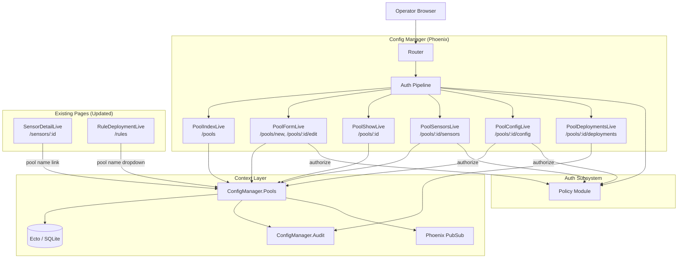
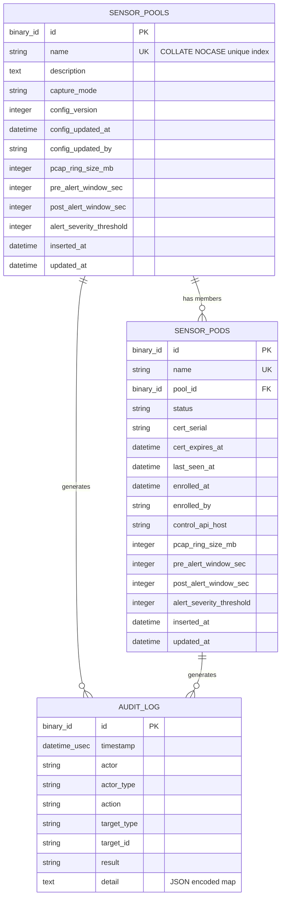

# Design Document: Sensor Pool Management

## Overview

This design adds a complete pool management workflow to the RavenWire Config Manager: CRUD operations on sensor pools, sensor-to-pool assignment and removal, pool-level configuration profiles (capture mode and PCAP settings), pool detail views with member sensor listings, pool-scoped deployment history, and navigation integration. The existing `sensor_pools` table and `SensorPool` schema provide the foundation; this feature extends them with PCAP configuration fields, a description column, case-insensitive name uniqueness, and a new `ConfigManager.Pools` context module that serves as the public API for all pool operations.

The implementation uses Phoenix LiveView for all pool pages, integrates with the RBAC system from the auth-rbac-audit spec (`pools:manage` for writes, `sensors:view` for reads), writes transactional audit entries via the existing `Audit.append_multi/2` pattern, and broadcasts PubSub messages so open LiveViews reflect membership changes without full page reloads. The sensor detail page from the sensor-detail-page spec gains a pool name link in its identity section.

### Key Design Decisions

1. **Dedicated `ConfigManager.Pools` context module**: All pool CRUD, sensor assignment/removal, and pool config update logic lives in a single context module. This follows the project's existing pattern (e.g., `ConfigManager.Enrollment`) and keeps the LiveView modules thin — they call context functions and handle UI concerns only.

2. **`Ecto.Multi` for transactional audit writes**: Every pool mutation (create, update, delete, assign, remove, config update) uses `Ecto.Multi` with `Audit.append_multi/2` so the audit entry and the data change succeed or fail atomically. Bulk sensor operations (assign/remove N sensors) produce one audit entry per affected sensor plus a summary entry for the pool, all within the same transaction.

3. **Case-insensitive name uniqueness via `COLLATE NOCASE`**: SQLite supports `COLLATE NOCASE` on unique indexes. The migration adds a new unique index with `COLLATE NOCASE` and drops the old case-sensitive one. This enforces uniqueness at the database layer without requiring a separate normalized column. The Ecto changeset uses the named unique constraint for race-safe error reporting.

4. **Config_Version increments only on config profile changes**: The `config_update_changeset` increments `config_version` and sets `config_updated_at`/`config_updated_by` only when PCAP or capture mode fields actually change. The separate `metadata_changeset` handles name/description edits without touching version metadata. This distinction is enforced by the changesets and verified by context tests.

5. **PubSub for real-time UI updates**: Pool mutations broadcast to `"pools"` (fleet-wide) and `"pool:#{pool_id}"` (pool-scoped) topics. Sensor assignment changes also broadcast to `"sensor_pod:#{health_key}"`, where `health_key` is currently `SensorPod.name`, matching the sensor-detail-page design. The existing `"sensor_pods"` topic is not used for pool events to avoid noise on the dashboard.

6. **PropCheck for property-based testing**: The project already includes `propcheck ~> 1.4`. Property tests will validate name normalization, Config_Version increment logic, RBAC enforcement, audit entry structure, and assignment/removal invariants.

7. **No automatic config push on assignment or config save**: Both sensor assignment and pool config updates change desired state only. Deploying configuration to sensors remains an explicit operator action through the existing rule deployment workflow. The UI displays clear messaging about this distinction.

## Architecture

### System Context



### Request Flow

**Pool list page load:**
1. Browser navigates to `/pools`
2. Auth pipeline validates session, checks `sensors:view` permission
3. `PoolIndexLive.mount/3` calls `Pools.list_pools/1` which returns pools with member counts
4. Subscribes to `"pools"` PubSub topic for real-time count updates
5. Renders sortable table with pool rows

**Pool creation:**
1. User navigates to `/pools/new` (requires `pools:manage`)
2. Fills form with name, description, capture mode
3. `handle_event("save", params, socket)` calls `Pools.create_pool/2`
4. Context trims name, validates uniqueness (case-insensitive), creates pool with defaults, writes audit entry — all in one `Ecto.Multi` transaction
5. On success: broadcasts `{:pool_created, pool}` to `"pools"`, redirects to `/pools/:id`
6. On failure: re-renders form with changeset errors

**Sensor assignment:**
1. User on `/pools/:id/sensors` clicks "Assign Sensors" (requires `pools:manage`)
2. Modal/panel shows unassigned enrolled sensors via `Pools.list_unassigned_sensors/0`; if the "Move from another pool" option is enabled, it separately shows `Pools.list_other_pool_sensors/1`
3. User selects sensors, confirms
4. `Pools.assign_sensors/4` validates that all selected sensors are enrolled and assignable, updates each sensor's `pool_id`, writes per-sensor audit entries + pool summary entry in one transaction
5. Broadcasts `{:sensors_assigned, pool_id, sensor_ids}` to `"pool:#{pool_id}"` and `{:pool_assignment_changed, sensor_id, pool_id}` to each `"sensor_pod:#{health_key}"` where `health_key` is currently the sensor's name
6. Open pool sensors page and sensor detail pages update via PubSub

**Pool config update:**
1. User on `/pools/:id/config` edits capture mode or PCAP settings (requires `pools:manage`)
2. `Pools.update_pool_config/3` applies config changeset, increments Config_Version only if config fields changed, sets metadata, writes audit entry with old/new values
3. Broadcasts `{:pool_config_updated, pool_id}` to `"pool:#{pool_id}"`
4. No automatic push to sensors — UI displays notice

### Module Layout

```
lib/config_manager/
├── pools.ex                               # Pool context (public API)
├── sensor_pool.ex                         # Extended Ecto schema
├── sensor_pod.ex                          # Existing (unchanged)

lib/config_manager_web/
├── live/
│   ├── pool_live/
│   │   ├── index_live.ex                  # /pools — sortable pool list
│   │   ├── form_live.ex                   # /pools/new, /pools/:id/edit
│   │   ├── show_live.ex                   # /pools/:id — detail overview
│   │   ├── sensors_live.ex                # /pools/:id/sensors — member list + assign/remove
│   │   ├── config_live.ex                 # /pools/:id/config — config profile editor
│   │   └── deployments_live.ex            # /pools/:id/deployments — filtered audit log
│   ├── sensor_detail_live.ex              # Updated: pool name link in identity section
│   └── rule_deployment_live.ex            # Updated: pool name in dropdown
├── router.ex                              # Extended with /pools routes

priv/repo/migrations/
├── YYYYMMDDHHMMSS_add_pool_config_fields.exs  # New migration
```

## Components and Interfaces

### 1. `ConfigManager.Pools` — Pool Context Module

The primary public API for all pool operations. All LiveView modules call through this context.

```elixir
defmodule ConfigManager.Pools do
  @moduledoc "Pool management context — CRUD, sensor assignment, config profiles."

  alias ConfigManager.{Repo, SensorPool, SensorPod, Audit}
  alias Ecto.Multi
  import Ecto.Query

  # ── Pool CRUD ──────────────────────────────────────────────────────────────

  @doc "Lists all pools with member counts, ordered by name."
  def list_pools(opts \\ [])
      :: [%{pool: SensorPool.t(), member_count: integer(), status_counts: map()}]

  @doc "Gets a single pool by ID. Returns nil if not found."
  def get_pool(id) :: SensorPool.t() | nil

  @doc "Gets a single pool by ID. Raises if not found."
  def get_pool!(id) :: SensorPool.t()

  @doc "Creates a pool with audit entry. Actor is the username or API token display name."
  def create_pool(attrs, actor)
      :: {:ok, SensorPool.t()} | {:error, Ecto.Changeset.t()}

  @doc "Updates pool metadata (name, description). Does NOT increment Config_Version."
  def update_pool(pool, attrs, actor)
      :: {:ok, SensorPool.t()} | {:error, Ecto.Changeset.t()}

  @doc "Deletes a pool, nilifies member sensor pool_ids, writes audit entry."
  def delete_pool(pool, actor)
      :: {:ok, SensorPool.t()} | {:error, :active_deployment | Ecto.Changeset.t()}

  # ── Sensor Assignment ──────────────────────────────────────────────────────

  @doc "Lists sensors currently assigned to a pool."
  def list_pool_sensors(pool_id) :: [SensorPod.t()]

  @doc "Lists enrolled sensors not assigned to any pool."
  def list_unassigned_sensors() :: [SensorPod.t()]

  @doc "Lists enrolled sensors assigned to other pools (for explicit move option)."
  def list_other_pool_sensors(pool_id) :: [SensorPod.t()]

  @doc """
  Assigns sensor_ids to pool. By default every sensor must be enrolled and unassigned.
  Pass allow_reassign?: true only after explicit operator confirmation.
  Writes per-sensor audit entries + pool summary.
  Returns {:ok, count} or {:error, reason}.
  """
  def assign_sensors(pool, sensor_ids, actor, opts \\ [])
      :: {:ok, integer()} | {:error, term()}

  @doc """
  Removes sensor_ids from pool (sets pool_id to nil).
  Writes per-sensor audit entries + pool summary.
  """
  def remove_sensors(pool, sensor_ids, actor)
      :: {:ok, integer()} | {:error, term()}

  # ── Pool Config Profile ────────────────────────────────────────────────────

  @doc """
  Updates pool config profile fields (capture_mode, PCAP settings).
  Increments Config_Version and sets config_updated_at/by only when a config
  field changes, then writes an audit entry.
  """
  def update_pool_config(pool, attrs, actor)
      :: {:ok, SensorPool.t()} | {:error, Ecto.Changeset.t()}

  # ── Queries ────────────────────────────────────────────────────────────────

  @doc "Returns the member count for a pool."
  def member_count(pool_id) :: integer()

  @doc "Returns pool name for a given pool_id, or nil."
  def pool_name(pool_id) :: String.t() | nil

  @doc "Returns a map of pool_id => pool_name for use in dropdowns."
  def pool_name_map() :: %{binary() => String.t()}

  @doc "Returns deployment audit entries for a pool, newest first."
  def list_pool_deployments(pool_id, opts \\ []) :: %{entries: [map()], page: integer(), total_pages: integer()}
end
```

### 2. `ConfigManager.SensorPool` — Extended Ecto Schema

The existing schema is extended with PCAP config fields, description, and new changesets.

```elixir
defmodule ConfigManager.SensorPool do
  use Ecto.Schema
  import Ecto.Changeset

  @primary_key {:id, :binary_id, autogenerate: true}
  @foreign_key_type :binary_id

  @valid_capture_modes ~w(alert_driven full_pcap)

  schema "sensor_pools" do
    field :name, :string
    field :description, :string
    field :capture_mode, :string, default: "alert_driven"
    field :config_version, :integer, default: 1
    field :config_updated_at, :utc_datetime
    field :config_updated_by, :string

    # PCAP config profile fields (new)
    field :pcap_ring_size_mb, :integer, default: 4096
    field :pre_alert_window_sec, :integer, default: 60
    field :post_alert_window_sec, :integer, default: 30
    field :alert_severity_threshold, :integer, default: 2

    timestamps()
  end

  @name_format ~r/^[a-zA-Z0-9._-]+$/

  @doc "Changeset for creating a new pool. Actor metadata is server supplied."
  def create_changeset(pool, attrs, actor) do
    pool
    |> cast(attrs, [
      :name, :description, :capture_mode,
      :pcap_ring_size_mb, :pre_alert_window_sec,
      :post_alert_window_sec, :alert_severity_threshold
    ])
    |> normalize_name()
    |> validate_required([:name, :capture_mode])
    |> validate_length(:name, min: 1, max: 255)
    |> validate_format(:name, @name_format,
         message: "must contain only alphanumeric characters, hyphens, underscores, and periods")
    |> validate_inclusion(:capture_mode, @valid_capture_modes)
    |> validate_pcap_fields()
    |> unique_constraint(:name, name: :sensor_pools_name_nocase_index,
         message: "has already been taken")
    |> put_change(:config_version, 1)
    |> put_change(:config_updated_at, now_utc())
    |> put_change(:config_updated_by, actor)
  end

  @doc "Changeset for updating pool metadata (name, description). Does NOT touch config_version."
  def metadata_changeset(pool, attrs) do
    pool
    |> cast(attrs, [:name, :description])
    |> normalize_name()
    |> validate_required([:name])
    |> validate_length(:name, min: 1, max: 255)
    |> validate_format(:name, @name_format,
         message: "must contain only alphanumeric characters, hyphens, underscores, and periods")
    |> unique_constraint(:name, name: :sensor_pools_name_nocase_index,
         message: "has already been taken")
  end

  @doc "Changeset for updating pool config profile. Actor metadata is server supplied."
  def config_update_changeset(pool, attrs, actor) do
    pool
    |> cast(attrs, [
      :capture_mode,
      :pcap_ring_size_mb, :pre_alert_window_sec,
      :post_alert_window_sec, :alert_severity_threshold
    ])
    |> validate_inclusion(:capture_mode, @valid_capture_modes)
    |> validate_pcap_fields()
    |> maybe_version_and_metadata(actor)
  end

  defp normalize_name(changeset) do
    case get_change(changeset, :name) do
      nil -> changeset
      name -> put_change(changeset, :name, String.trim(name))
    end
  end

  defp validate_pcap_fields(changeset) do
    changeset
    |> validate_number(:pcap_ring_size_mb, greater_than: 0)
    |> validate_number(:pre_alert_window_sec, greater_than_or_equal_to: 0)
    |> validate_number(:post_alert_window_sec, greater_than_or_equal_to: 0)
    |> validate_inclusion(:alert_severity_threshold, [1, 2, 3])
  end

  defp maybe_version_and_metadata(changeset, actor) do
    config_fields = [
      :capture_mode,
      :pcap_ring_size_mb,
      :pre_alert_window_sec,
      :post_alert_window_sec,
      :alert_severity_threshold
    ]

    if Enum.any?(config_fields, &Map.has_key?(changeset.changes, &1)) do
      current = get_field(changeset, :config_version) || 1
      changeset
      |> put_change(:config_version, current + 1)
      |> put_change(:config_updated_at, now_utc())
      |> put_change(:config_updated_by, actor)
    else
      changeset
    end
  end

  defp now_utc, do: DateTime.utc_now() |> DateTime.truncate(:second)
end
```

### 3. LiveView Modules

#### `PoolLive.IndexLive` — Pool List Page (`/pools`)

```elixir
defmodule ConfigManagerWeb.PoolLive.IndexLive do
  use ConfigManagerWeb, :live_view

  # Mount: load pools with counts, subscribe to "pools" topic
  # Assigns: pools, sort_field, sort_dir, current_user
  # Events: "sort" (column click), PubSub handlers for pool changes
  # RBAC: sensors:view for page access; pools:manage check for Create button visibility
end
```

#### `PoolLive.FormLive` — Pool Create/Edit (`/pools/new`, `/pools/:id/edit`)

```elixir
defmodule ConfigManagerWeb.PoolLive.FormLive do
  use ConfigManagerWeb, :live_view

  # Mount: for :new — empty changeset; for :edit — load pool
  # Assigns: pool (nil for new), changeset, live_action (:new | :edit)
  # Events: "validate" (live validation), "save" (submit)
  # RBAC: pools:manage required for both create and edit
  # On save: calls Pools.create_pool/2 or Pools.update_pool/3
  # Redirects to /pools/:id on success
end
```

#### `PoolLive.ShowLive` — Pool Detail Page (`/pools/:id`)

```elixir
defmodule ConfigManagerWeb.PoolLive.ShowLive do
  use ConfigManagerWeb, :live_view

  # Mount: load pool by ID, subscribe to "pool:#{id}" and "pools"
  # Assigns: pool, member_count, current_user
  # Renders: pool info, nav links to config/sensors/deployments
  # RBAC: sensors:view for page; pools:manage check for Edit/Delete button visibility
  # Events: "delete" (with confirmation), PubSub handlers
  # 404: renders not-found page if pool doesn't exist
end
```

#### `PoolLive.SensorsLive` — Pool Sensors Page (`/pools/:id/sensors`)

```elixir
defmodule ConfigManagerWeb.PoolLive.SensorsLive do
  use ConfigManagerWeb, :live_view

  # Mount: load pool, list pool sensors, subscribe to "pool:#{id}"
  # Assigns: pool, sensors, unassigned_sensors, other_pool_sensors,
  #          selected_ids, show_assign_modal, show_move_modal, current_user
  # Events: "assign" (open modal), "confirm_assign", "remove" (with confirmation),
  #         "confirm_remove", "toggle_select", "select_all"
  # RBAC: sensors:view for page; pools:manage for assign/remove actions
  # PubSub: updates sensor list on assignment/removal broadcasts
end
```

#### `PoolLive.ConfigLive` — Pool Config Page (`/pools/:id/config`)

```elixir
defmodule ConfigManagerWeb.PoolLive.ConfigLive do
  use ConfigManagerWeb, :live_view

  # Mount: load pool, build config form, subscribe to "pool:#{id}"
  # Assigns: pool, changeset, current_user
  # Events: "validate" (live validation), "save" (submit config changes)
  # RBAC: sensors:view for read-only viewing; pools:manage for save
  # On save: calls Pools.update_pool_config/3
  # Displays Config_Version, last updated metadata, no-auto-push notice
end
```

#### `PoolLive.DeploymentsLive` — Pool Deployment History (`/pools/:id/deployments`)

```elixir
defmodule ConfigManagerWeb.PoolLive.DeploymentsLive do
  use ConfigManagerWeb, :live_view

  # Mount: load pool, query audit_log for deployment entries
  # Assigns: pool, entries, page, per_page (default 25)
  # Queries: audit_log WHERE target_type = "pool" AND target_id = pool.id
  #          AND action IN ["rule_deployed", ...deployment actions]
  #          ORDER BY timestamp DESC, id DESC
  # Events: "page" (pagination)
  # RBAC: sensors:view for page access
  # Empty state: message when no deployment history exists
end
```

### 4. Router Changes

New pool routes are added to the authenticated scope. The auth-rbac-audit design already shows the pool routes in the router; this design confirms the exact structure:

```elixir
# Inside the authenticated live_session block:
live "/pools", PoolLive.IndexLive, :index, private: %{required_permission: "sensors:view"}
live "/pools/new", PoolLive.FormLive, :new, private: %{required_permission: "pools:manage"}
live "/pools/:id", PoolLive.ShowLive, :show, private: %{required_permission: "sensors:view"}
live "/pools/:id/edit", PoolLive.FormLive, :edit, private: %{required_permission: "pools:manage"}
live "/pools/:id/sensors", PoolLive.SensorsLive, :index, private: %{required_permission: "sensors:view"}
live "/pools/:id/config", PoolLive.ConfigLive, :index, private: %{required_permission: "sensors:view"}
live "/pools/:id/deployments", PoolLive.DeploymentsLive, :index, private: %{required_permission: "sensors:view"}
```

Permission mapping (enforced by RBAC pipeline and LiveView `on_mount`):

| Route | Permission |
|-------|-----------|
| `/pools` | `sensors:view` |
| `/pools/new` | `pools:manage` |
| `/pools/:id` | `sensors:view` |
| `/pools/:id/edit` | `pools:manage` |
| `/pools/:id/sensors` | `sensors:view` (write actions check `pools:manage` in `handle_event`) |
| `/pools/:id/config` | `sensors:view` (write actions check `pools:manage` in `handle_event`) |
| `/pools/:id/deployments` | `sensors:view` |

### 5. PubSub Topics and Messages

| Topic | Message | Triggered By |
|-------|---------|-------------|
| `"pools"` | `{:pool_created, pool}` | `Pools.create_pool/2` |
| `"pools"` | `{:pool_updated, pool}` | `Pools.update_pool/3` |
| `"pools"` | `{:pool_deleted, pool_id}` | `Pools.delete_pool/2` |
| `"pools"` | `{:pool_membership_changed, pool_id}` | `Pools.assign_sensors/4`, `Pools.remove_sensors/3` |
| `"pool:#{pool_id}"` | `{:sensors_assigned, pool_id, sensor_ids}` | `Pools.assign_sensors/4` |
| `"pool:#{pool_id}"` | `{:sensors_removed, pool_id, sensor_ids}` | `Pools.remove_sensors/3` |
| `"pool:#{pool_id}"` | `{:pool_config_updated, pool_id}` | `Pools.update_pool_config/3` |
| `"sensor_pod:#{health_key}"` | `{:pool_assignment_changed, sensor_id, pool_id}` | `Pools.assign_sensors/4`, `Pools.remove_sensors/3` |

### 6. Navigation Integration Updates

**Main nav bar**: Add "Pools" link visible to all authenticated users, linking to `/pools`.

**Sensor detail page** (`SensorDetailLive`): In the identity section, when `pod.pool_id` is non-nil, query `Pools.pool_name(pod.pool_id)` and render as a link to `/pools/:pool_id`. The detail page already derives `health_key` from `pod.name` and subscribes to `"sensor_pod:#{health_key}"`; it should handle `{:pool_assignment_changed, sensor_id, pool_id}` only when `sensor_id` matches the open Sensor_Pod and then reload the pool name from `Pools.pool_name/1`.

**Rule deployment page** (`RuleDeploymentLive`): Replace raw pool UUID display with human-readable pool names by calling `Pools.pool_name_map()` on mount. The dropdown option changes from `"All pods in pool #{pool_id}"` to `"All pods in pool #{pool_name}"`.

### 7. Audit Entry Patterns

| Action | target_type | target_id | Detail Fields |
|--------|------------|-----------|---------------|
| `pool_created` | `pool` | pool.id | `%{name, capture_mode, config_version}` |
| `pool_updated` | `pool` | pool.id | `%{changes: %{field => %{old, new}}}` |
| `pool_deleted` | `pool` | pool.id | `%{name, affected_sensor_count}` |
| `pool_config_updated` | `pool` | pool.id | `%{changes: %{field => %{old, new}}, config_version}` |
| `sensor_assigned_to_pool` | `sensor_pod` | sensor.id | `%{sensor_name, previous_pool_id, new_pool_id, pool_name}` |
| `sensor_removed_from_pool` | `sensor_pod` | sensor.id | `%{sensor_name, previous_pool_id, previous_pool_name}` |

Bulk operations also write a summary entry with `target_type: "pool"` containing the total count of affected sensors and the list of affected sensor IDs.

## Data Models

### Extended `sensor_pools` Table

The migration adds PCAP config fields, a description column, and a case-insensitive unique index:

```sql
-- New migration: add_pool_config_fields
ALTER TABLE sensor_pools ADD COLUMN description TEXT;
ALTER TABLE sensor_pools ADD COLUMN pcap_ring_size_mb INTEGER NOT NULL DEFAULT 4096;
ALTER TABLE sensor_pools ADD COLUMN pre_alert_window_sec INTEGER NOT NULL DEFAULT 60;
ALTER TABLE sensor_pools ADD COLUMN post_alert_window_sec INTEGER NOT NULL DEFAULT 30;
ALTER TABLE sensor_pools ADD COLUMN alert_severity_threshold INTEGER NOT NULL DEFAULT 2;

-- Replace case-sensitive unique index with case-insensitive one
DROP INDEX IF EXISTS sensor_pools_name_index;
CREATE UNIQUE INDEX sensor_pools_name_nocase_index ON sensor_pools (name COLLATE NOCASE);
```

**Ecto Migration:**

```elixir
defmodule ConfigManager.Repo.Migrations.AddPoolConfigFields do
  use Ecto.Migration

  def up do
    alter table(:sensor_pools) do
      add :description, :text
      add :pcap_ring_size_mb, :integer, null: false, default: 4096
      add :pre_alert_window_sec, :integer, null: false, default: 60
      add :post_alert_window_sec, :integer, null: false, default: 30
      add :alert_severity_threshold, :integer, null: false, default: 2
    end

    # Drop old case-sensitive index, create case-insensitive one
    drop_if_exists unique_index(:sensor_pools, [:name])
    execute "CREATE UNIQUE INDEX sensor_pools_name_nocase_index ON sensor_pools (name COLLATE NOCASE)"
  end

  def down do
    execute "DROP INDEX IF EXISTS sensor_pools_name_nocase_index"
    create unique_index(:sensor_pools, [:name])

    alter table(:sensor_pools) do
      remove :description
      remove :pcap_ring_size_mb
      remove :pre_alert_window_sec
      remove :post_alert_window_sec
      remove :alert_severity_threshold
    end
  end
end
```

Before this migration is deployed, existing pool names should be checked for case-insensitive duplicates. If duplicates exist, the migration must fail with an operator-facing error or require a pre-migration cleanup step rather than silently renaming pools.

### Entity Relationship Diagram



### Existing Tables (No Changes)

- **`sensor_pods`**: The `pool_id` foreign key with `on_delete: :nilify_all` already exists. No schema changes needed for sensor pods.
- **`audit_log`**: The existing table structure supports all pool audit entries. The `detail` column stores JSON text blobs.


## Correctness Properties

*A property is a characteristic or behavior that should hold true across all valid executions of a system — essentially, a formal statement about what the system should do. Properties serve as the bridge between human-readable specifications and machine-verifiable correctness guarantees.*

### Property 1: Name normalization is idempotent and preserves validity

*For any* string that passes pool name validation after trimming (1–255 characters, matching `^[a-zA-Z0-9._-]+$`), applying the normalization function (trim) a second time SHALL produce the identical string. Conversely, *for any* string composed entirely of whitespace, the normalized result SHALL fail the minimum-length validation.

**Validates: Requirements 2.3, 4.2**

### Property 2: Case-insensitive name uniqueness

*For any* existing pool name `N`, attempting to create or rename another pool to any case variant of `N` (e.g., `N.upcase`, `N.downcase`, mixed case) SHALL fail with a uniqueness validation error, and the total number of pools in the database SHALL remain unchanged.

**Validates: Requirements 2.3, 2.4, 4.2, 4.3, 13.4**

### Property 3: Pool creation initializes all defaults correctly

*For any* valid pool name and capture mode, creating a pool SHALL produce a record where `config_version` equals 1, `pcap_ring_size_mb` equals 4096, `pre_alert_window_sec` equals 60, `post_alert_window_sec` equals 30, `alert_severity_threshold` equals 2, `config_updated_at` is non-nil, and `config_updated_by` matches the actor who created the pool.

**Validates: Requirements 2.2, 13.6**

### Property 4: Config_Version increments only on config profile changes

*For any* pool, updating only metadata fields (name, description) SHALL leave `config_version`, `config_updated_at`, and `config_updated_by` unchanged. Updating any config profile field (capture_mode, pcap_ring_size_mb, pre_alert_window_sec, post_alert_window_sec, alert_severity_threshold) SHALL increment `config_version` by exactly 1 and update `config_updated_at` and `config_updated_by`.

**Validates: Requirements 8.3, 8.7**

### Property 5: Pool deletion nilifies all member sensors

*For any* pool with N member sensors (N ≥ 0), deleting the pool SHALL result in all N sensors having `pool_id = nil`. The total number of sensors in the database SHALL remain unchanged (no sensors are deleted). The audit entry SHALL contain `affected_sensor_count` equal to N.

**Validates: Requirements 5.2**

### Property 6: Sensor assignment round-trip

*For any* set of unassigned enrolled sensors assigned to a pool, each sensor's `pool_id` SHALL equal the pool's ID after assignment. Subsequently removing those same sensors SHALL set each sensor's `pool_id` back to `nil`. The pool's member count after assignment SHALL equal the previous count plus the number of newly assigned sensors, and after removal SHALL equal the previous count minus the number of removed sensors.

**Validates: Requirements 6.4, 7.1**

### Property 7: Assignable sensor list contains only unassigned enrolled sensors

*For any* set of sensors with mixed statuses (`pending`, `enrolled`, `revoked`) and mixed pool assignments (some assigned, some unassigned), `list_unassigned_sensors/0` SHALL return exactly those sensors where `status = "enrolled"` AND `pool_id IS NULL`. No sensor with a non-nil `pool_id` or a non-enrolled status SHALL appear in the result.

**Validates: Requirements 6.3**

### Property 8: RBAC enforcement is consistent for pool write operations

*For any* role and any pool write event (create, edit, delete, assign sensors, remove sensors, update config), the event SHALL succeed if and only if `Policy.has_permission?(role, "pools:manage")` returns true. When the permission check fails, the system SHALL not modify any pool or sensor data, and SHALL produce an audit entry with `action = "permission_denied"` and `result = "failure"`.

**Validates: Requirements 10.1, 10.4, 10.5, 10.6**

### Property 9: Every pool mutation produces a structurally complete audit entry

*For any* successful pool mutation (create, update, delete, config update, sensor assign, sensor remove), the system SHALL produce at least one audit entry containing: a non-nil UUID `id`, a non-nil `timestamp`, a non-empty `actor` string, `actor_type` of `"user"` or `"api_token"`, a non-empty `action` string matching the expected action name for the mutation type, `target_type` of `"pool"` or `"sensor_pod"`, a non-empty `target_id`, `result` of `"success"`, and a `detail` field that decodes to a valid JSON map.

**Validates: Requirements 11.1, 11.2**

### Property 10: Bulk operations produce per-sensor audit entries plus pool summary

*For any* bulk sensor assignment or removal affecting N sensors (N ≥ 1), the system SHALL produce exactly N audit entries with `target_type = "sensor_pod"` (one per sensor) plus exactly 1 audit entry with `target_type = "pool"` (the summary). The total audit entry count for the operation SHALL be N + 1.

**Validates: Requirements 11.3**

### Property 11: Audit writes are transactional with pool mutations

*For any* pool mutation, the audit entry and the data change SHALL be written in the same database transaction. If the audit write fails, the pool data change SHALL be rolled back — the pool or sensor records SHALL remain in their pre-mutation state.

**Validates: Requirements 11.4**

### Property 12: Pool config validation matches per-pod PCAP validation rules

*For any* set of PCAP configuration values, the pool config changeset SHALL accept the values if and only if: `pcap_ring_size_mb > 0`, `pre_alert_window_sec >= 0`, `post_alert_window_sec >= 0`, `alert_severity_threshold ∈ {1, 2, 3}`, and `capture_mode ∈ {"alert_driven", "full_pcap"}`. The acceptance/rejection behavior SHALL be identical to the existing `SensorPod.pcap_config_changeset/2`.

**Validates: Requirements 8.4**

### Property 13: Deployment history contains only deployment actions for the target pool

*For any* pool and any set of audit entries with mixed action names, target types, and target IDs, the deployment history query SHALL return only entries where `target_type = "pool"` AND `target_id` matches the pool's ID AND `action` is in the set of deployment action names. No CRUD or config-save-only entries SHALL appear in the results. Results SHALL be sorted in reverse chronological order.

**Validates: Requirements 9.2, 9.3, 9.6**

### Property 14: Default pool list sort order is alphabetical by name

*For any* set of pools, `list_pools/1` with default options SHALL return pools sorted alphabetically by name (case-insensitive). The order SHALL be stable — pools with identical names (impossible due to uniqueness, but for completeness) would maintain insertion order.

**Validates: Requirements 1.3**

## Error Handling

### Page-Level Errors

| Scenario | Behavior |
|----------|----------|
| Non-existent pool ID in route | Render 404 page with "Pool not found" message |
| Pool deleted while user is on detail page | PubSub `{:pool_deleted, pool_id}` triggers redirect to `/pools` with flash message |
| Database query failure | Render 500 error page; log error |
| Unauthorized pool write attempt | Flash error "You don't have permission to perform this action"; audit `permission_denied` entry |

### Form Validation Errors

| Scenario | Behavior |
|----------|----------|
| Empty pool name (after trim) | Changeset error: "can't be blank" |
| Name exceeds 255 characters | Changeset error: "should be at most 255 character(s)" |
| Name contains invalid characters | Changeset error: "must contain only alphanumeric characters, hyphens, underscores, and periods" |
| Duplicate name (case-insensitive) | Changeset error: "has already been taken" |
| PCAP ring size ≤ 0 | Changeset error: "must be greater than 0" |
| Alert severity not in {1, 2, 3} | Changeset error: "is invalid" |
| Capture mode not in valid set | Changeset error: "is invalid" |

### Deletion Guards

| Scenario | Behavior |
|----------|----------|
| Delete pool with active deployment | Reject with error: "Cannot delete pool while a deployment is in progress" |
| Delete pool with N assigned sensors | Show confirmation with warning: "N sensors will become unassigned" |
| Delete pool with 0 sensors | Show confirmation without sensor warning |

### Assignment/Removal Errors

| Scenario | Behavior |
|----------|----------|
| Assign sensor that is no longer assignable (race condition) | Reject and roll back the whole operation with a validation error unless `allow_reassign?: true` was explicitly requested |
| Remove sensor not in pool (race condition) | Reject and roll back the whole operation with a validation error |
| Empty sensor selection | Flash error: "No sensors selected" |
| Transaction failure during bulk operation | Roll back entire operation, flash error, audit failure entry when actor and target can be identified |

## Testing Strategy

### Property-Based Testing (PropCheck)

The project uses `propcheck ~> 1.4` (PropEr wrapper for Elixir). Each correctness property maps to one or more property-based tests with a minimum of 100 iterations.

**Property test modules:**

| Module | Properties Covered | Focus |
|--------|-------------------|-------|
| `PoolNamePropertyTest` | 1, 2 | Name normalization, trimming, case-insensitive uniqueness |
| `PoolCRUDPropertyTest` | 3, 4, 5 | Creation defaults, Config_Version invariant, deletion nilification |
| `SensorAssignmentPropertyTest` | 6, 7 | Assignment/removal round-trip, assignable sensor filtering |
| `PoolRBACPropertyTest` | 8 | Permission enforcement across all write events |
| `PoolAuditPropertyTest` | 9, 10, 11 | Audit entry structure, bulk entry counts, transactional integrity |
| `PoolConfigPropertyTest` | 12 | PCAP validation equivalence with per-pod validation |
| `PoolQueryPropertyTest` | 13, 14 | Deployment history filtering, default sort order |

**Test configuration:**
- Minimum 100 iterations per property (`numtests: 100`)
- Each test tagged with: `Feature: sensor-pool-management, Property {N}: {title}`
- Generators produce random pool names (valid charset), capture modes, PCAP config values, sensor sets with mixed statuses, and role assignments

### Unit Tests (ExUnit)

Unit tests cover specific examples, edge cases, and integration points not suited for property-based testing:

| Test Module | Coverage |
|-------------|----------|
| `PoolLive.IndexLiveTest` | Pool list rendering, empty state, sort toggle, Create button visibility |
| `PoolLive.FormLiveTest` | Create/edit form submission, validation errors, redirect on success |
| `PoolLive.ShowLiveTest` | Detail page rendering, 404 handling, Edit/Delete button visibility |
| `PoolLive.SensorsLiveTest` | Sensor list rendering, assign modal, remove confirmation, PubSub updates |
| `PoolLive.ConfigLiveTest` | Config form rendering, save behavior, no-auto-push notice |
| `PoolLive.DeploymentsLiveTest` | Deployment history rendering, pagination, empty state |
| `PoolMigrationTest` | Column existence, defaults, index presence, backward compatibility |
| `NavigationIntegrationTest` | Pools nav link, sensor detail pool link, rule deployment dropdown names |

### Integration Tests

| Test | Coverage |
|------|----------|
| PubSub broadcast verification | Pool mutations broadcast correct messages to correct topics |
| Cross-page update flow | Assign sensor → pool sensors page updates → sensor detail page updates |
| Transactional rollback | Simulate audit write failure → verify pool data unchanged |
| Concurrent assignment | Two users assign to same pool simultaneously → no data corruption |

### Test Data Generators (PropCheck)

```elixir
# Pool name generator: valid charset, 1-255 chars
def pool_name_gen do
  let len <- choose(1, 50) do
    let chars <- vector(len, oneof([range(?a, ?z), range(?A, ?Z), range(?0, ?9),
                                     elements([?., ?-, ?_])])) do
      to_string(chars)
    end
  end
end

# Capture mode generator
def capture_mode_gen, do: oneof(["alert_driven", "full_pcap"])

# PCAP config generator (valid values)
def pcap_config_gen do
  let {ring, pre, post, sev} <- {pos_integer(), non_neg_integer(),
                                   non_neg_integer(), oneof([1, 2, 3])} do
    %{pcap_ring_size_mb: ring, pre_alert_window_sec: pre,
      post_alert_window_sec: post, alert_severity_threshold: sev}
  end
end

# Role generator
def role_gen, do: oneof(["viewer", "analyst", "sensor-operator",
                          "rule-manager", "platform-admin", "auditor"])
```
