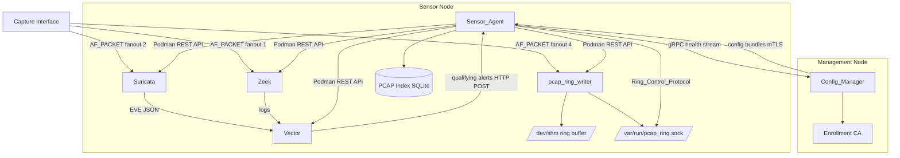
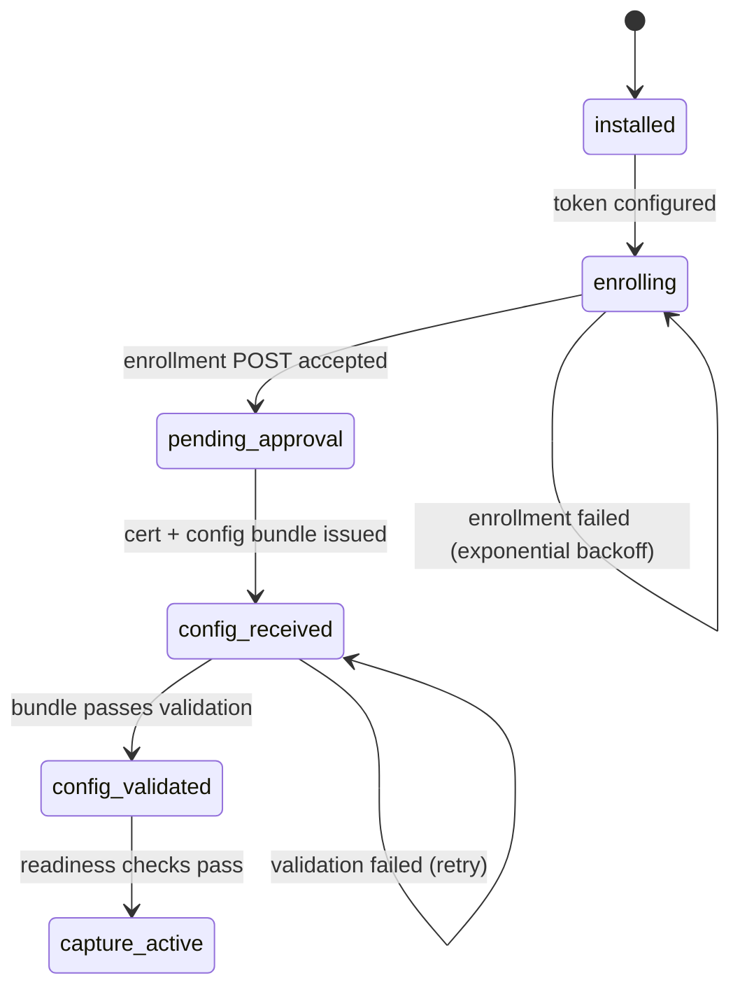

# Design Document: Sensor Stack Production Hardening

## Overview

This document describes the technical design for hardening the RavenWire sensor stack from a working spike to a production-grade distributed sensor. The work spans four phases: reliability (fixing the alert-to-PCAP path and protocol bugs), manageability (real container lifecycle control and config templating), throughput (TPACKET_V3 capture engine), and analyst utility (evidence-grade PCAP metadata).

The sensor stack runs as a set of Podman containers supervised by systemd via Quadlet on each sensor node. The central components are:

- **Sensor_Agent** — Go binary owning local control, health reporting, config application, and PCAP carving
- **pcap_ring_writer** — Go binary owning the AF_PACKET socket and rolling ring buffer
- **Zeek / Suricata / Vector** — third-party containers for protocol metadata, signature detection, and log routing
- **Config_Manager** — Elixir/Phoenix application on the management node providing centralized config, enrollment, and health visibility

The design addresses all 13 requirements across the four phases, with particular attention to correctness of the alert-to-PCAP path, security of the control plane, and accuracy of health metrics.

## Architecture



### Deployment Model

Each sensor node runs containers under Podman with Quadlet-generated systemd units. The Sensor_Agent prefers `systemctl restart <unit>` for container lifecycle operations, falling back to the Podman REST API when Quadlet unit names cannot be resolved. All pod-to-pod communication uses mTLS with certificates issued by the Config_Manager's enrollment CA.

### Bootstrap State Machine



## Components and Interfaces

### internal/ringctl — Shared Ring Control Protocol Package

A new shared package `internal/ringctl` defines all command and response structs for the JSON-over-Unix-socket protocol between PCAP_Manager and pcap_ring_writer. Both binaries import this package exclusively; neither defines protocol fields independently.

```go
// Command types
type MarkPreAlertCmd struct {
    Cmd         string `json:"cmd"`           // "mark_pre_alert"
    TimestampNs int64  `json:"timestamp_ns"`  // Unix nanoseconds
}

type CarveWindowCmd struct {
    Cmd         string `json:"cmd"`           // "carve_window"
    PreAlertNs  int64  `json:"pre_alert_ns"`  // Unix nanoseconds
    PostAlertNs int64  `json:"post_alert_ns"` // Unix nanoseconds
    OutputPath  string `json:"output_path"`
}

type ConfigureCmd struct {
    Cmd       string `json:"cmd"`        // "configure"
    BPFFilter string `json:"bpf_filter"`
}

type StatusCmd struct {
    Cmd string `json:"cmd"` // "status"
}

// Response
type RingResponse struct {
    Status                string                 `json:"status"` // "ok" | "error"
    Error                 string                 `json:"error,omitempty"`
    PacketCount           int                    `json:"packet_count,omitempty"`
    OutputPath            string                 `json:"output_path,omitempty"`
    PacketsWritten        uint64                 `json:"packets_written,omitempty"`
    BytesWritten          uint64                 `json:"bytes_written,omitempty"`
    WrapCount             uint64                 `json:"wrap_count,omitempty"`
    SocketDrops           uint64                 `json:"socket_drops,omitempty"`
    SocketFreezeQueueDrops uint64               `json:"socket_freeze_queue_drops,omitempty"`
}
```

The package also exports a `DialAndSend` helper that verifies socket ownership (UID 10000 or root) and permissions (0600) before connecting.

### internal/pcap — PCAP Manager

The PCAP Manager gains a fully implemented Alert_Listener HTTP server, alert deduplication, and evidence-grade index metadata.

**Alert_Listener** binds on a configurable address (default `:9092`) and exposes:
- `POST /alerts` — receives Suricata EVE JSON alert payloads from Vector; validates required fields, enqueues, returns 202
- `GET /alerts/health` — returns queue depth and deduplication cache size

**Deduplication** uses an in-memory map keyed on `(community_id, sid, sensor_id)` with TTL equal to the configured dedup window (default 30s). A background goroutine sweeps expired entries.

**SwitchMode** is extended to call the Podman REST API to start/stop the appropriate containers (netsniff-ng for full_pcap, pcap_ring_writer for alert_driven) and verify they reach their target state.

### internal/capture — Capture Manager

The BPF filter reload path is corrected: Zeek and Suricata changes are classified as restart-required. The new safe restart sequence:

1. Compile the new BPF filter to bytecode (reject if invalid)
2. Write the new filter config to a staging path
3. Request container restart via Podman REST API
4. Poll container state until running or timeout (default 30s)
5. On timeout: restore previous filter config, retry restart once
6. On second failure: log critical, report to Config_Manager health stream

For pcap_ring_writer, the `configure` command path is fully implemented with `SO_ATTACH_FILTER` reattachment.

### internal/config — Config Applier

The `applyPoolConfig` path is extended to generate the Vector configuration from the sensor config bundle using a template engine. The generated config:

- Enables only sinks present in the bundle
- Uses the same severity threshold as PCAP_Manager
- Includes a dead-letter file sink when configured
- Applies the selected schema transform (raw/ecs/ocsf/splunk_cim) per sink
- Is validated with `vector validate` before being written to disk

### internal/health — Health Collector

The health collector is extended to source per-consumer statistics from the actual capture processes:

- **pcap_ring_writer**: via `status` command on the Ring_Control_Protocol socket
- **Suricata**: via EVE stats event stream or `stats.log` parsing
- **Zeek**: via process uptime from `/proc/<pid>/stat` and log write lag from file mtime
- **Vector**: via Vector's internal metrics HTTP endpoint

The `HealthReport` struct gains `DropAlert` flags per consumer and a `ThroughputBps` field derived from successive byte count deltas.

### internal/readiness — Host Readiness Checker

Extended with new checks:

| Check | Hard/Soft | Source |
|---|---|---|
| GRO disabled | Hard | `ethtool -k <iface>` or `/sys/class/net/<iface>/features/` |
| LRO disabled | Hard | `ethtool -k <iface>` |
| RX ring buffer >= minimum | Soft | `ethtool -g <iface>` |
| Promiscuous mode enabled | Hard | `SIOCGIFFLAGS` ioctl |
| RSS queues >= worker count | Soft | `/sys/class/net/<iface>/queues/rx-*` |
| CPU isolation (if configured) | Soft | `/sys/devices/system/cpu/isolated` |
| NVMe write throughput >= minimum | Hard | write 1GB test file, measure elapsed |
| Clock sync within bounds | Hard | `adjtimex` |

Each check result includes `name`, `passed`, `observed_value`, `required_value`, and `severity` (hard/soft).

### internal/api — Control API Server

Security hardening:
- Startup fails with fatal error if certs are absent and `SENSOR_DEV_MODE` is not set
- Every response includes a `X-Request-ID` header
- CRL check is performed at TLS handshake via a custom `VerifyPeerCertificate` callback
- Enrollment listener runs on a separate port (default `:9090`) and accepts only `POST /enroll`

### cmd/pcap-ring-writer — TPACKET_V3 Capture Engine

The capture loop is rewritten to use TPACKET_V3 block-based AF_PACKET:

1. Create AF_PACKET socket
2. Set `TPACKET_V3` via `PACKET_VERSION` setsockopt
3. Configure block size (`TPACKET_BLOCK_SIZE_MB` env, default 4MB) and frame count (`TPACKET_FRAME_COUNT` env, default 2048)
4. `mmap` the ring
5. Spawn `RING_WORKERS` goroutines (default 1), each polling a TPACKET_V3 block via `poll()`
6. Use `tp_sec`/`tp_nsec` from the block header as the packet timestamp
7. Expose `socket_drops` and `socket_freeze_queue_drops` via `PACKET_STATISTICS` getsockopt in the `status` command response

### sensorctl — CLI Tool

The `sensorctl enroll` subcommand automates token configuration and displays the current bootstrap state machine state and any blocking errors.

## Data Models

### PcapFile (extended)

```go
type PcapFile struct {
    ID                       int64  `json:"id"`
    FilePath                 string `json:"file_path"`
    Sha256Hash               string `json:"sha256_hash"`
    FileSizeBytes            int64  `json:"file_size_bytes"`
    SensorID                 string `json:"sensor_id"`
    AlertSID                 string `json:"alert_sid"`
    AlertSignature           string `json:"alert_signature"`
    AlertUUID                string `json:"alert_uuid"`
    SrcIP                    string `json:"src_ip"`
    DstIP                    string `json:"dst_ip"`
    SrcPort                  int    `json:"src_port"`
    DstPort                  int    `json:"dst_port"`
    Proto                    string `json:"proto"`
    CommunityID              string `json:"community_id"`
    ZeekUID                  string `json:"zeek_uid"`
    CaptureInterface         string `json:"capture_interface"`
    CarveReason              string `json:"carve_reason"`
    RequestedBy              string `json:"requested_by"`
    CreatedAtMs              int64  `json:"created_at_ms"`
    RetentionExpiresAtMs     int64  `json:"retention_expires_at_ms"`
    ChainOfCustodyManifestPath string `json:"chain_of_custody_manifest_path"`
    StartTime                int64  `json:"start_time"`
    EndTime                  int64  `json:"end_time"`
    PacketCount              int64  `json:"packet_count"`
    AlertDriven              bool   `json:"alert_driven"`
}
```

The SQLite schema migration adds the new columns with `DEFAULT NULL` so existing rows remain readable.

### Chain_of_Custody_Manifest

A JSON Lines file (one event per line) stored alongside the PCAP file:

```json
{"event": "created", "timestamp_ms": 1700000000000, "actor": "system", "alert_sid": "2100498", "alert_uuid": "...", "file_hash": "sha256:..."}
{"event": "accessed", "timestamp_ms": 1700000001000, "actor": "analyst@mgmt", "purpose": "investigation"}
```

### AlertEvent (extended)

```go
type AlertEvent struct {
    CommunityID string `json:"community_id"`
    Severity    int    `json:"severity"`
    TimestampMs int64  `json:"timestamp_ms"`
    SID         string `json:"sid"`
    Signature   string `json:"signature,omitempty"`
    UUID        string `json:"uuid,omitempty"`
    SrcIP       string `json:"src_ip,omitempty"`
    DstIP       string `json:"dst_ip,omitempty"`
    SrcPort     int    `json:"src_port,omitempty"`
    DstPort     int    `json:"dst_port,omitempty"`
    Proto       string `json:"proto,omitempty"`
    ZeekUID     string `json:"zeek_uid,omitempty"`
}
```

### SensorConfig Bundle (extended)

```go
type SensorConfig struct {
    SeverityThreshold int           `json:"severity_threshold"` // 1=highest, 3=lowest; alerts with severity <= threshold are carved
    AlertListenerAddr string        `json:"alert_listener_addr"`
    Sinks             []SinkConfig  `json:"sinks"`
    DeadLetterPath    string        `json:"dead_letter_path,omitempty"`
    DeadLetterMaxMB   int           `json:"dead_letter_max_mb,omitempty"`
    CaptureWorkers    int           `json:"capture_workers"`
    TpacketBlockSizeMB int          `json:"tpacket_block_size_mb"`
    TpacketFrameCount  int          `json:"tpacket_frame_count"`
    DropAlertThreshPct float64      `json:"drop_alert_thresh_pct"` // default 1.0
}

type SinkConfig struct {
    Name       string `json:"name"`
    Type       string `json:"type"` // "splunk_hec", "cribl_http", "elasticsearch", etc.
    URI        string `json:"uri"`
    SchemaMode string `json:"schema_mode"` // "raw", "ecs", "ocsf", "splunk_cim"
    Token      string `json:"token,omitempty"`
}
```


## Correctness Properties

*A property is a characteristic or behavior that should hold true across all valid executions of a system — essentially, a formal statement about what the system should do. Properties serve as the bridge between human-readable specifications and machine-verifiable correctness guarantees.*

This feature is well-suited for property-based testing. The core logic — alert validation, severity filtering, deduplication, protocol serialization, BPF filter validation, PCAP index round-trips, health metric derivation, and readiness check classification — consists of pure or near-pure functions whose correctness holds universally across all valid inputs. The property-based testing library used is [`pgregory.net/rapid`](https://pkg.go.dev/pgregory.net/rapid), which is already a dependency in `sensor-agent/go.mod`.

### Property Reflection

Before listing properties, redundancies are eliminated:

- Requirements 3.1 and 3.2 both describe the severity filter decision. They are combined into one property (Property 3).
- Requirements 2.3 and 2.4 both describe the Ring_Control_Protocol round-trip. They are combined into one property (Property 2).
- Requirements 3.5 and 3.6 are specific examples of the severity filter property and are covered by Property 3.
- Requirements 9.1, 9.2, and 9.3 all describe fields that must be present on every carved PCAP index entry. They are combined into one comprehensive property (Property 8).
- Requirements 12.1, 12.2, 12.4, 12.6, and 12.7 all describe the readiness checker's classification and reporting behavior. They are combined into two properties (Properties 12 and 13).

---

### Property 1: Alert payload validation rejects any payload missing required fields

*For any* HTTP POST payload to the Alert_Listener that is missing one or more of the required fields (`community_id`, `severity`, `timestamp_ms`, `sid`), the listener SHALL return HTTP 400 and the alert SHALL NOT be enqueued.

**Validates: Requirements 1.3**

---

### Property 2: Ring_Control_Protocol serialization round-trip

*For any* valid Ring_Control_Protocol command struct (MarkPreAlertCmd, CarveWindowCmd, ConfigureCmd), encoding the struct using the PCAP_Manager serializer and decoding it using the pcap_ring_writer deserializer SHALL produce a struct with identical field values, with all timestamp fields preserved as nanoseconds without unit conversion error.

**Validates: Requirements 2.1, 2.3, 2.4**

---

### Property 3: Severity filter correctness

*For any* alert severity value (1, 2, or 3) and any configured `severity_threshold`, `HandleAlert` SHALL trigger a carve if and only if `alert.Severity <= severityThreshold`, and SHALL discard the alert (returning nil) if and only if `alert.Severity > severityThreshold`.

**Validates: Requirements 3.1, 3.2**

---

### Property 4: Alert deduplication within the time window

*For any* alert event, sending the same alert (identical `community_id`, `sid`, and sensor identity) twice within the configured deduplication window SHALL result in exactly one carve being triggered; the second alert SHALL be discarded without triggering a second carve.

**Validates: Requirements 1.6**

---

### Property 5: BPF filter validation before state mutation

*For any* BPF filter string that fails compilation, the Capture_Manager SHALL reject the change and leave the existing filter file contents and process state unchanged after the rejection attempt.

**Validates: Requirements 4.2, 4.3**

---

### Property 6: BPF filter change audit log completeness

*For any* BPF filter change (valid or invalid), the Sensor_Agent SHALL emit an audit log entry that contains the previous filter hash, the new filter hash, the affected consumers, and whether each consumer required a restart.

**Validates: Requirements 4.8**

---

### Property 7: Container restart allowlist enforcement

*For any* container name that is not in the configured allowlist, a restart request SHALL be rejected with a logged error and SHALL NOT result in any HTTP request to the Podman REST API.

**Validates: Requirements 5.2**

---

### Property 8: PCAP index entry completeness and round-trip fidelity

*For any* carved PCAP file, the index entry SHALL contain all required fields (`sha256_hash`, `file_size_bytes`, `sensor_id`, `alert_sid`, `alert_signature`, `alert_uuid`, `src_ip`, `dst_ip`, `src_port`, `dst_port`, `proto`, `community_id`, `zeek_uid`, `capture_interface`, `carve_reason`, `requested_by`, `created_at_ms`, `retention_expires_at_ms`, `chain_of_custody_manifest_path`), the stored `sha256_hash` SHALL match the SHA256 of the actual file contents, and querying the index by `community_id` SHALL return a record with field values identical to those that were inserted.

**Validates: Requirements 9.1, 9.2, 9.6**

---

### Property 9: Chain_of_Custody_Manifest access event append

*For any* PCAP file access via the carve API, an access event SHALL be appended to the Chain_of_Custody_Manifest for that file, and the manifest SHALL contain the accessor identity, timestamp, and purpose in the appended event.

**Validates: Requirements 9.4**

---

### Property 10: Retention pruning removes expired entries

*For any* PCAP index entry where `retention_expires_at_ms` is set and the current time exceeds it, the PCAP_Manager pruning cycle SHALL delete both the file from disk and the corresponding index entry.

**Validates: Requirements 9.5**

---

### Property 11: Vector config sink isolation

*For any* sensor config bundle specifying a subset of sinks, the generated Vector configuration SHALL contain exactly those sinks and no others; sinks not present in the bundle SHALL NOT appear in the generated config.

**Validates: Requirements 8.2**

---

### Property 12: Health report drop alert flag accuracy

*For any* capture consumer whose reported `drop_percent` exceeds the configured `drop_alert_thresh_pct`, the health report SHALL include `drop_alert: true` for that consumer; consumers below the threshold SHALL have `drop_alert: false`.

**Validates: Requirements 7.7**

---

### Property 13: Readiness checker failure report completeness

*For any* failing readiness check, the readiness report SHALL include the check name, the observed value, and the required value; hard failures SHALL have `severity: "hard"` and soft warnings SHALL have `severity: "soft"`.

**Validates: Requirements 12.6, 12.7**

---

### Property 14: Bootstrap state machine forward-only transitions

*For any* valid bootstrap sequence, state transitions SHALL only advance forward through the defined sequence (`installed` → `enrolling` → `pending_approval` → `config_received` → `config_validated` → `capture_active`); no transition SHALL skip a state or move backward except the retry loops defined for `enrolling` and `config_received`.

**Validates: Requirements 11.1**

---

### Property 15: Enrollment retry exponential backoff

*For any* sequence of consecutive enrollment failures, the retry intervals SHALL follow exponential backoff starting at 5 seconds, doubling each attempt, and capping at 60 seconds.

**Validates: Requirements 11.2**

---

### Property 16: Config validation before file write

*For any* config bundle received in `config_received` state, the Rule_Validator and Capture_Manager validation logic SHALL be invoked before any config file is written to disk; if validation fails, no files SHALL be written.

**Validates: Requirements 11.4**

