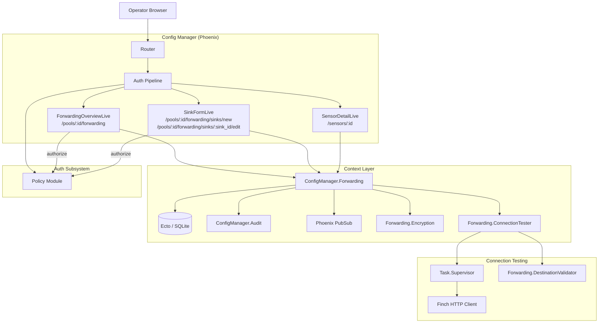
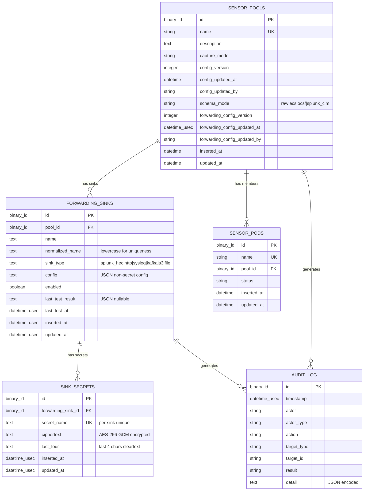

# Design Document: Vector Forwarding Sink Management

## Overview

This design adds pool-level Vector forwarding sink management to the RavenWire Config Manager. The feature provides CRUD operations on forwarding sinks with type-specific configuration forms, application-level secret encryption, schema mode selection, bounded connection testing, and placeholder telemetry display — all integrated with the existing RBAC, audit logging, and pool management systems.

Forwarding configuration is pool-scoped: all sensors in a pool share the same set of sinks and schema mode. Saving configuration does NOT deploy it to sensors; deployment remains an explicit operator action. Connection tests run from the Config Manager server with bounded timeouts and concurrency limits.

### Key Design Decisions

1. **Separate `sink_secrets` table with application-level encryption**: Secrets are stored in a dedicated table, encrypted with AES-256-GCM using a key from the `RAVENWIRE_SINK_ENCRYPTION_KEY` environment variable. This isolates secrets from the main `forwarding_sinks` table, supports per-field encryption, and stores the last 4 characters in cleartext for masked display. The encryption key is NOT derived from `secret_key_base` in production.

2. **`normalized_name` column for case-insensitive uniqueness**: Unlike the sensor-pool-management spec which uses SQLite `COLLATE NOCASE`, forwarding sinks use an explicit `normalized_name` column (lowercased) with a unique index on `(pool_id, normalized_name)`. This makes the uniqueness logic explicit in the Ecto changeset and portable across database engines.

3. **Dedicated `ConfigManager.Forwarding` context module**: All sink CRUD, secret management, connection testing, and schema mode operations live in a single context module. LiveView modules call through this context. This follows the project pattern established by `ConfigManager.Enrollment` and `ConfigManager.Pools`.

4. **`Ecto.Multi` for transactional audit writes**: Every forwarding mutation uses `Ecto.Multi` with `Audit.append_multi/2` so the audit entry and data change succeed or fail atomically, consistent with the sensor-pool-management pattern.

5. **Bounded async connection testing via `Task.Supervisor`**: Connection tests run under a dedicated `Task.Supervisor` with a configurable concurrency limit (default 5). Each test has a configurable timeout (default 10 seconds). The LiveView receives results via `send/2` from the task, keeping the UI responsive.

6. **Private network destination validation**: Connection test destinations are validated against RFC 1918/RFC 4193 ranges, loopback, and link-local addresses. An `ALLOW_PRIVATE_DESTINATIONS` environment variable enables lab deployments to bypass this check.

7. **PropCheck for property-based testing**: The project already includes `propcheck ~> 1.4`. Property tests will validate sink name normalization, secret encryption round-trips, config version increment logic, cross-pool access denial, URL validation, and audit entry sanitization.

8. **PubSub for real-time UI updates**: Forwarding mutations broadcast to `"pool:#{pool_id}:forwarding"` for the overview page and `"pools"` for fleet-wide updates. This avoids noise on existing pool topics while keeping forwarding pages live.

9. **Forwarding_Config_Version separate from capture Config_Version**: The requirements specify a separate `forwarding_config_version` on the pool, distinct from the existing `config_version` used for capture/PCAP settings. This allows operators to track forwarding changes independently.

## Architecture

### System Context



### Request Flow

**Forwarding overview page load:**
1. Browser navigates to `/pools/:id/forwarding`
2. Auth pipeline validates session, checks `sensors:view` permission
3. `ForwardingOverviewLive.mount/3` loads pool via `Pools.get_pool!/1`, loads sinks via `Forwarding.list_sinks/1`
4. Subscribes to `"pool:#{pool_id}:forwarding"` PubSub topic
5. Renders sink summary cards, schema mode selector, telemetry placeholders, config version metadata

**Sink creation:**
1. User navigates to `/pools/:id/forwarding/sinks/new` (requires `forwarding:manage`)
2. Selects sink type, fills type-specific form fields
3. `handle_event("save", params, socket)` calls `Forwarding.create_sink/3`
4. Context validates fields, normalizes name, encrypts secrets, creates sink + secrets + audit entry in one `Ecto.Multi` transaction, increments `forwarding_config_version`
5. On success: broadcasts `{:sink_created, sink}` to `"pool:#{pool_id}:forwarding"`, redirects to overview
6. On failure: re-renders form with changeset errors

**Sink editing with secret preservation:**
1. User navigates to `/pools/:id/forwarding/sinks/:sink_id/edit` (requires `forwarding:manage`)
2. Context verifies sink belongs to pool (cross-pool check)
3. Form pre-populates non-secret fields; secret fields show masked placeholder
4. On submit: `Forwarding.update_sink/4` — unchanged secret fields (sentinel value or empty) preserve existing encrypted values; new secret values are re-encrypted
5. Audit entry records changed fields, noting "secret changed" without values

**Connection test:**
1. User clicks "Test Connection" on a sink (requires `forwarding:manage`)
2. `handle_event("test_connection", %{"sink_id" => id}, socket)` calls `Forwarding.test_connection/2`
3. Context validates destination (private network check), then dispatches async task via `Task.Supervisor`
4. Task performs HTTP/TCP/TLS probe with bounded timeout, sends result back to LiveView process
5. `handle_info({:connection_test_result, sink_id, result}, socket)` updates UI inline
6. Result stored on sink record; `forwarding_config_version` NOT incremented

### Module Layout

```
lib/config_manager/
├── forwarding.ex                          # Forwarding context (public API)
├── forwarding/
│   ├── forwarding_sink.ex                 # Ecto schema
│   ├── sink_secret.ex                     # Ecto schema
│   ├── encryption.ex                      # AES-256-GCM encrypt/decrypt
│   ├── connection_tester.ex               # Async connection test logic
│   ├── destination_validator.ex           # URL/host validation, private network check
│   └── sink_config_schema.ex              # Type-specific config validation
├── sensor_pool.ex                         # Extended with forwarding fields

lib/config_manager_web/
├── live/
│   ├── forwarding_live/
│   │   ├── overview_live.ex               # /pools/:id/forwarding
│   │   └── sink_form_live.ex              # /pools/:id/forwarding/sinks/new and :sink_id/edit
│   ├── sensor_detail_live.ex              # Updated: forwarding section
├── router.ex                              # Extended with forwarding routes

priv/repo/migrations/
├── YYYYMMDDHHMMSS_create_forwarding_sinks.exs
├── YYYYMMDDHHMMSS_create_sink_secrets.exs
├── YYYYMMDDHHMMSS_add_forwarding_fields_to_sensor_pools.exs
```

## Components and Interfaces

### 1. `ConfigManager.Forwarding` — Forwarding Context Module

The primary public API for all forwarding operations. All LiveView modules call through this context.

```elixir
defmodule ConfigManager.Forwarding do
  @moduledoc "Forwarding sink management context — CRUD, secrets, connection testing, schema mode."

  alias ConfigManager.{Repo, SensorPool, Audit}
  alias ConfigManager.Forwarding.{ForwardingSink, SinkSecret, Encryption, ConnectionTester}
  alias Ecto.Multi
  import Ecto.Query

  # ── Sink CRUD ──────────────────────────────────────────────────────────────

  @doc "Lists all sinks for a pool, ordered by name. Secrets are NOT loaded."
  def list_sinks(pool_id) :: [ForwardingSink.t()]

  @doc "Gets a single sink by ID. Returns nil if not found."
  def get_sink(sink_id) :: ForwardingSink.t() | nil

  @doc "Gets a single sink by ID, verifying it belongs to the given pool. Returns {:error, :not_found} on mismatch."
  def get_sink_for_pool(pool_id, sink_id) :: {:ok, ForwardingSink.t()} | {:error, :not_found}

  @doc """
  Creates a sink with encrypted secrets and audit entry.
  Increments forwarding_config_version on the pool.
  `attrs` contains both config fields and secret fields (keyed by secret_name).
  `actor` is the username or API token display name.
  """
  def create_sink(pool_id, attrs, actor)
      :: {:ok, ForwardingSink.t()} | {:error, Ecto.Changeset.t() | atom()}

  @doc """
  Updates a sink. Secret fields with sentinel/empty values are preserved unchanged.
  New secret values are re-encrypted. Increments forwarding_config_version.
  """
  def update_sink(pool_id, sink_id, attrs, actor)
      :: {:ok, ForwardingSink.t()} | {:error, Ecto.Changeset.t() | atom()}

  @doc """
  Deletes a sink and its secrets. Increments forwarding_config_version.
  Verifies sink belongs to pool before deletion.
  """
  def delete_sink(pool_id, sink_id, actor)
      :: {:ok, ForwardingSink.t()} | {:error, atom()}

  # ── Sink Toggle ────────────────────────────────────────────────────────────

  @doc "Toggles a sink's enabled state. Increments forwarding_config_version."
  def toggle_sink(pool_id, sink_id, actor)
      :: {:ok, ForwardingSink.t()} | {:error, atom()}

  # ── Schema Mode ────────────────────────────────────────────────────────────

  @doc "Updates the pool's schema_mode. Increments forwarding_config_version."
  def update_schema_mode(pool_id, schema_mode, actor)
      :: {:ok, SensorPool.t()} | {:error, Ecto.Changeset.t()}

  # ── Connection Testing ─────────────────────────────────────────────────────

  @doc """
  Initiates an async connection test for a sink. Returns :ok immediately.
  The result is sent to `caller_pid` as {:connection_test_result, sink_id, result}.
  Validates destination before testing. Does NOT increment forwarding_config_version.
  """
  def test_connection(pool_id, sink_id, caller_pid)
      :: :ok | {:error, :not_found | :file_sink | :destination_blocked | :concurrent_limit}

  # ── Secret Display ─────────────────────────────────────────────────────────

  @doc "Returns masked secret representations for a sink (last 4 chars only)."
  def masked_secrets(sink_id) :: [%{secret_name: String.t(), masked: String.t()}]

  # ── Queries ────────────────────────────────────────────────────────────────

  @doc "Returns the pool's current schema_mode."
  def get_schema_mode(pool_id) :: String.t()

  @doc "Returns a forwarding summary for a pool (sink count, enabled count, schema mode)."
  def forwarding_summary(pool_id) :: %{
    sink_count: integer(),
    enabled_count: integer(),
    schema_mode: String.t(),
    forwarding_config_version: integer(),
    forwarding_config_updated_at: DateTime.t() | nil,
    forwarding_config_updated_by: String.t() | nil
  }
end
```

### 2. `ConfigManager.Forwarding.ForwardingSink` — Ecto Schema

```elixir
defmodule ConfigManager.Forwarding.ForwardingSink do
  use Ecto.Schema
  import Ecto.Changeset

  @primary_key {:id, :binary_id, autogenerate: true}
  @foreign_key_type :binary_id

  @valid_sink_types ~w(splunk_hec http syslog kafka s3 file)
  @name_format ~r/^[a-zA-Z0-9._-]+$/

  schema "forwarding_sinks" do
    field :pool_id, :binary_id
    field :name, :string
    field :normalized_name, :string
    field :sink_type, :string
    field :config, :string          # JSON-encoded type-specific non-secret config
    field :enabled, :boolean, default: true
    field :last_test_result, :string  # JSON-encoded sanitized test result
    field :last_test_at, :utc_datetime_usec

    has_many :secrets, ConfigManager.Forwarding.SinkSecret, foreign_key: :forwarding_sink_id

    timestamps(type: :utc_datetime_usec)
  end

  def create_changeset(sink, attrs) do
    sink
    |> cast(attrs, [:pool_id, :name, :sink_type, :config, :enabled])
    |> validate_required([:pool_id, :name, :sink_type, :config])
    |> validate_length(:name, min: 1, max: 255)
    |> validate_format(:name, @name_format,
         message: "must contain only alphanumeric characters, hyphens, underscores, and periods")
    |> validate_inclusion(:sink_type, @valid_sink_types)
    |> put_normalized_name()
    |> unique_constraint([:pool_id, :normalized_name],
         name: :forwarding_sinks_pool_id_normalized_name_index,
         message: "a sink with this name already exists in the pool")
    |> validate_config_json()
  end

  def update_changeset(sink, attrs) do
    sink
    |> cast(attrs, [:name, :config, :enabled])
    |> validate_length(:name, min: 1, max: 255)
    |> validate_format(:name, @name_format,
         message: "must contain only alphanumeric characters, hyphens, underscores, and periods")
    |> put_normalized_name()
    |> unique_constraint([:pool_id, :normalized_name],
         name: :forwarding_sinks_pool_id_normalized_name_index,
         message: "a sink with this name already exists in the pool")
    |> validate_config_json()
  end

  def toggle_changeset(sink) do
    change(sink, enabled: !sink.enabled)
  end

  def test_result_changeset(sink, result, tested_at) do
    change(sink, last_test_result: result, last_test_at: tested_at)
  end

  defp put_normalized_name(changeset) do
    case get_change(changeset, :name) do
      nil -> changeset
      name -> put_change(changeset, :normalized_name, String.downcase(name))
    end
  end

  defp validate_config_json(changeset) do
    case get_change(changeset, :config) do
      nil -> changeset
      config_str ->
        case Jason.decode(config_str) do
          {:ok, _} -> changeset
          {:error, _} -> add_error(changeset, :config, "must be valid JSON")
        end
    end
  end
end
```

### 3. `ConfigManager.Forwarding.SinkSecret` — Ecto Schema

```elixir
defmodule ConfigManager.Forwarding.SinkSecret do
  use Ecto.Schema
  import Ecto.Changeset

  @primary_key {:id, :binary_id, autogenerate: true}
  @foreign_key_type :binary_id

  schema "sink_secrets" do
    field :forwarding_sink_id, :binary_id
    field :secret_name, :string
    field :ciphertext, :string
    field :last_four, :string

    timestamps(type: :utc_datetime_usec)
  end

  def changeset(secret, attrs) do
    secret
    |> cast(attrs, [:forwarding_sink_id, :secret_name, :ciphertext, :last_four])
    |> validate_required([:forwarding_sink_id, :secret_name, :ciphertext])
    |> unique_constraint([:forwarding_sink_id, :secret_name],
         name: :sink_secrets_forwarding_sink_id_secret_name_index,
         message: "duplicate secret name for this sink")
  end
end
```

### 4. `ConfigManager.Forwarding.Encryption` — Secret Encryption

```elixir
defmodule ConfigManager.Forwarding.Encryption do
  @moduledoc """
  AES-256-GCM encryption for sink secrets.
  Key is read from RAVENWIRE_SINK_ENCRYPTION_KEY environment variable.
  NOT derived from secret_key_base in production.
  """

  @aad "ravenwire_sink_secret_v1"

  @doc "Encrypts a plaintext secret. Returns Base64-encoded ciphertext (IV + tag + ciphertext)."
  def encrypt(plaintext) :: {:ok, String.t()} | {:error, :key_unavailable}

  @doc "Decrypts a Base64-encoded ciphertext. Returns plaintext."
  def decrypt(ciphertext_b64) :: {:ok, String.t()} | {:error, :decryption_failed | :key_unavailable}

  @doc "Extracts the last 4 characters of a plaintext value for masked display."
  def last_four(plaintext) :: String.t()

  @doc "Returns a masked representation: dots + last 4 chars."
  def mask(last_four_value) :: String.t()

  @doc "Returns true if the encryption key is configured and available."
  def key_available?() :: boolean()
end
```

**Implementation notes:**
- IV: 12 random bytes per encryption (never reused)
- Tag: 16 bytes (GCM authentication tag)
- Storage format: Base64(IV ++ tag ++ ciphertext)
- AAD: `"ravenwire_sink_secret_v1"` for domain separation
- Key source: `RAVENWIRE_SINK_ENCRYPTION_KEY` env var, decoded from Base64 (32 bytes)
- Dev/test fallback: derive from `secret_key_base` only when `RAVENWIRE_SINK_ENCRYPTION_KEY` is not set AND `Mix.env()` is not `:prod`

### 5. `ConfigManager.Forwarding.ConnectionTester` — Async Connection Testing

```elixir
defmodule ConfigManager.Forwarding.ConnectionTester do
  @moduledoc """
  Bounded async connection testing for forwarding sinks.
  Runs under a dedicated Task.Supervisor with concurrency limits.
  """

  @default_timeout_ms 10_000
  @max_concurrent_tests 5

  @doc """
  Starts an async connection test. Returns :ok if the test was dispatched,
  or {:error, reason} if the test was rejected (concurrent limit, file sink, etc.).
  Result is sent to caller_pid as {:connection_test_result, sink_id, result}.
  """
  def test_async(sink, caller_pid, opts \\ [])
      :: :ok | {:error, :concurrent_limit | :file_sink}

  @doc """
  Synchronous connection test (used internally by the async wrapper).
  Returns a sanitized result map.
  """
  def test_sync(sink, opts \\ [])
      :: %{success: boolean(), message: String.t(), error_category: String.t() | nil}

  @doc "Returns the current number of running connection tests."
  def active_test_count() :: non_neg_integer()
end
```

**Test logic per sink type:**
- **splunk_hec**: HTTP POST to `{endpoint}/services/collector/health` with HEC token header. Expect 200.
- **http**: HTTP request (configured method) to endpoint with auth headers. Expect 2xx.
- **syslog**: TCP connect (or UDP send) to host:port. If TLS, perform TLS handshake.
- **kafka**: TCP connect to first bootstrap server. If SASL, attempt SASL handshake.
- **s3**: `HEAD` request to bucket endpoint with SigV4 auth. Expect 200 or 404 (bucket exists).
- **file**: Not testable — return `{:error, :file_sink}`.

### 6. `ConfigManager.Forwarding.DestinationValidator` — URL and Host Validation

```elixir
defmodule ConfigManager.Forwarding.DestinationValidator do
  @moduledoc """
  Validates connection test destinations against security policies.
  Rejects loopback, link-local, and private network addresses unless
  ALLOW_PRIVATE_DESTINATIONS is enabled for lab deployments.
  """

  @doc "Validates a destination URL or host:port for the given sink type."
  def validate(destination, sink_type, opts \\ [])
      :: :ok | {:error, :malformed_url | :unsupported_scheme | :loopback | :link_local | :private_network}

  @doc "Returns true if private destinations are allowed (lab mode)."
  def allow_private?() :: boolean()

  @doc "Parses a URL and resolves the host to IP addresses for network range checks."
  def resolve_and_check(host) :: :ok | {:error, atom()}
end
```

**Validation rules:**
- `splunk_hec`, `http`: Must be `https://` or `http://` URL. Reject malformed URLs.
- `syslog`: Must be valid hostname or IP + port (1-65535).
- `kafka`: Each bootstrap server must be valid hostname or IP + port.
- `s3`: Endpoint URL (if provided) must be valid `https://` or `http://`.
- All types: Resolve hostname to IP, reject if IP falls in 127.0.0.0/8, ::1, 169.254.0.0/16, fe80::/10, 10.0.0.0/8, 172.16.0.0/12, 192.168.0.0/16, fc00::/7 — unless `ALLOW_PRIVATE_DESTINATIONS=true`.

### 7. `ConfigManager.Forwarding.SinkConfigSchema` — Type-Specific Validation

```elixir
defmodule ConfigManager.Forwarding.SinkConfigSchema do
  @moduledoc """
  Validates type-specific configuration fields for each sink type.
  Returns {:ok, validated_config_map} or {:error, field_errors}.
  """

  @doc "Validates config attrs for the given sink_type. Returns sanitized config (no secrets)."
  def validate(sink_type, attrs) :: {:ok, map()} | {:error, [{atom(), String.t()}]}

  @doc "Returns the list of secret field names for a sink type."
  def secret_fields(sink_type) :: [String.t()]

  @doc "Returns the list of required non-secret fields for a sink type."
  def required_fields(sink_type) :: [String.t()]

  @doc "Returns the list of sensitive header names that must be redacted."
  def sensitive_headers() :: [String.t()]
end
```

**Type-specific field definitions:**

| Sink Type | Required Config Fields | Optional Config Fields | Secret Fields |
|-----------|----------------------|----------------------|---------------|
| `splunk_hec` | `endpoint` | `index`, `source_type`, `tls_verify`, `acknowledgements` | `hec_token` |
| `http` | `endpoint`, `method` | `auth_type`, `custom_headers`, `tls_verify` | `bearer_token`, `basic_username`, `basic_password` |
| `syslog` | `host`, `port`, `protocol`, `format` | `tls_enabled`, `tls_verify` | — |
| `kafka` | `bootstrap_servers`, `topic` | `sasl_mechanism`, `tls_enabled`, `tls_verify`, `compression` | `sasl_username`, `sasl_password` |
| `s3` | `bucket`, `region` | `endpoint`, `prefix`, `compression`, `encoding` | `access_key_id`, `secret_access_key` |
| `file` | `path_template`, `encoding` | — | — |

### 8. Extended `ConfigManager.SensorPool` Schema

The existing `SensorPool` schema is extended with forwarding-specific fields:

```elixir
# Added fields to ConfigManager.SensorPool schema:
field :schema_mode, :string, default: "raw"
field :forwarding_config_version, :integer, default: 0
field :forwarding_config_updated_at, :utc_datetime_usec
field :forwarding_config_updated_by, :string

has_many :forwarding_sinks, ConfigManager.Forwarding.ForwardingSink, foreign_key: :pool_id
```

New changesets:

```elixir
@valid_schema_modes ~w(raw ecs ocsf splunk_cim)

def schema_mode_changeset(pool, attrs, actor) do
  pool
  |> cast(attrs, [:schema_mode])
  |> validate_required([:schema_mode])
  |> validate_inclusion(:schema_mode, @valid_schema_modes)
  |> increment_forwarding_version(actor)
end

def increment_forwarding_version_changeset(pool, actor) do
  current = pool.forwarding_config_version || 0
  change(pool,
    forwarding_config_version: current + 1,
    forwarding_config_updated_at: DateTime.utc_now() |> DateTime.truncate(:microsecond),
    forwarding_config_updated_by: actor
  )
end

defp increment_forwarding_version(changeset, actor) do
  current = get_field(changeset, :forwarding_config_version) || 0
  changeset
  |> put_change(:forwarding_config_version, current + 1)
  |> put_change(:forwarding_config_updated_at, DateTime.utc_now() |> DateTime.truncate(:microsecond))
  |> put_change(:forwarding_config_updated_by, actor)
end
```

### 9. LiveView Modules

#### `ForwardingLive.OverviewLive` — Forwarding Overview (`/pools/:id/forwarding`)

```elixir
defmodule ConfigManagerWeb.ForwardingLive.OverviewLive do
  use ConfigManagerWeb, :live_view

  # Mount: load pool, list sinks, get schema mode, subscribe to PubSub
  # Assigns: pool, sinks, schema_mode, forwarding_summary, current_user,
  #          testing_sink_ids (MapSet of sink IDs currently being tested),
  #          delete_confirm_sink (sink awaiting deletion confirmation)
  # Events:
  #   "toggle_sink" — toggle enabled/disabled (forwarding:manage)
  #   "delete_sink" — show confirmation dialog (forwarding:manage)
  #   "confirm_delete" — execute deletion (forwarding:manage)
  #   "cancel_delete" — dismiss confirmation
  #   "test_connection" — initiate async test (forwarding:manage)
  #   "update_schema_mode" — change schema mode (forwarding:manage)
  #   "reveal_secret" — show last 4 chars (forwarding:manage)
  # PubSub handlers:
  #   {:sink_created, sink} — prepend to list
  #   {:sink_updated, sink} — update in list
  #   {:sink_deleted, sink_id} — remove from list
  #   {:sink_toggled, sink} — update enabled state
  #   {:schema_mode_changed, mode} — update display
  #   {:connection_test_result, sink_id, result} — update test result inline
  # RBAC: sensors:view for page; forwarding:manage for write actions
end
```

#### `ForwardingLive.SinkFormLive` — Sink Create/Edit

```elixir
defmodule ConfigManagerWeb.ForwardingLive.SinkFormLive do
  use ConfigManagerWeb, :live_view

  # Mount:
  #   :new — empty form, sink_type selector
  #   :edit — load sink via Forwarding.get_sink_for_pool/2 (cross-pool check),
  #           pre-populate config fields, mask secret fields
  # Assigns: pool, sink (nil for new), changeset, live_action, sink_type,
  #          type_config (decoded config map), secret_changed (map of secret_name => bool),
  #          current_user
  # Events:
  #   "select_type" — switch sink type, reset type-specific fields
  #   "validate" — live validation of form fields
  #   "save" — submit form
  #   "test_connection" — test before saving (edit only, forwarding:manage)
  # RBAC: forwarding:manage required for both create and edit
  # On save: calls Forwarding.create_sink/3 or Forwarding.update_sink/4
  # Redirects to /pools/:id/forwarding on success
end
```

### 10. Router Changes

New forwarding routes added to the authenticated scope:

```elixir
# Inside the authenticated live_session block, after existing pool routes:
live "/pools/:id/forwarding", ForwardingLive.OverviewLive, :index,
  private: %{required_permission: "sensors:view"}
live "/pools/:id/forwarding/sinks/new", ForwardingLive.SinkFormLive, :new,
  private: %{required_permission: "forwarding:manage"}
live "/pools/:id/forwarding/sinks/:sink_id/edit", ForwardingLive.SinkFormLive, :edit,
  private: %{required_permission: "forwarding:manage"}
```

Permission mapping:

| Route | Permission |
|-------|-----------|
| `/pools/:id/forwarding` | `sensors:view` (write events check `forwarding:manage` in `handle_event`) |
| `/pools/:id/forwarding/sinks/new` | `forwarding:manage` |
| `/pools/:id/forwarding/sinks/:sink_id/edit` | `forwarding:manage` |

### 11. RBAC Policy Extension

The canonical `forwarding:manage` permission is defined in the auth-rbac-audit Policy module and is expected to appear in the role-permission mapping:

```elixir
# Added to ConfigManager.Auth.Policy @roles_permissions:
"sensor-operator" => [...existing..., "forwarding:manage"],
"rule-manager"    => [...existing..., "forwarding:manage"],
"platform-admin"  => :all,  # already includes all permissions
```

Roles without `forwarding:manage` (`viewer`, `analyst`, `auditor`) can view forwarding pages via `sensors:view` but cannot perform write actions.

### 12. PubSub Topics and Messages

| Topic | Message | Triggered By |
|-------|---------|-------------|
| `"pool:#{pool_id}:forwarding"` | `{:sink_created, sink}` | `Forwarding.create_sink/3` |
| `"pool:#{pool_id}:forwarding"` | `{:sink_updated, sink}` | `Forwarding.update_sink/4` |
| `"pool:#{pool_id}:forwarding"` | `{:sink_deleted, sink_id}` | `Forwarding.delete_sink/3` |
| `"pool:#{pool_id}:forwarding"` | `{:sink_toggled, sink}` | `Forwarding.toggle_sink/3` |
| `"pool:#{pool_id}:forwarding"` | `{:schema_mode_changed, schema_mode}` | `Forwarding.update_schema_mode/3` |
| `"pool:#{pool_id}:forwarding"` | `{:connection_test_complete, sink_id, result}` | `ConnectionTester` callback |

### 13. Audit Entry Patterns

| Action | target_type | target_id | Detail Fields |
|--------|------------|-----------|---------------|
| `sink_created` | `forwarding_sink` | sink.id | `%{name, sink_type, pool_id, pool_name}` |
| `sink_updated` | `forwarding_sink` | sink.id | `%{changes: %{field => %{old, new}}, secrets_changed: [secret_names]}` |
| `sink_deleted` | `forwarding_sink` | sink.id | `%{name, sink_type, pool_id}` |
| `sink_toggled` | `forwarding_sink` | sink.id | `%{name, enabled: new_state}` |
| `schema_mode_changed` | `pool` | pool.id | `%{old_mode, new_mode}` |
| `sink_connection_tested` | `forwarding_sink` | sink.id | `%{name, sink_type, result: success/failure, error_category, sanitized_endpoint}` |
| `permission_denied` | varies | varies | `%{required_permission, event_or_route}` |

**Sanitization rules for audit details:**
- Endpoint URLs: strip query parameters, credentials in userinfo
- Secret fields: record only `"secret_name changed"`, never the value
- Custom headers: redact `Authorization`, `Cookie`, `X-API-Key`, and any header marked sensitive
- Connection test errors: strip tokens, passwords, and full query strings from error messages

## Data Models

### `forwarding_sinks` Table

```sql
CREATE TABLE forwarding_sinks (
  id              BLOB PRIMARY KEY,       -- binary_id (UUID)
  pool_id         BLOB NOT NULL REFERENCES sensor_pools(id) ON DELETE CASCADE,
  name            TEXT NOT NULL,
  normalized_name TEXT NOT NULL,           -- lowercase(name) for case-insensitive uniqueness
  sink_type       TEXT NOT NULL,           -- splunk_hec | http | syslog | kafka | s3 | file
  config          TEXT NOT NULL,           -- JSON-encoded type-specific non-secret config
  enabled         BOOLEAN NOT NULL DEFAULT TRUE,
  last_test_result TEXT,                   -- JSON-encoded sanitized test result (nullable)
  last_test_at    TEXT,                    -- utc_datetime_usec (nullable)
  inserted_at     TEXT NOT NULL,           -- utc_datetime_usec
  updated_at      TEXT NOT NULL            -- utc_datetime_usec
);

CREATE UNIQUE INDEX forwarding_sinks_pool_id_normalized_name_index
  ON forwarding_sinks (pool_id, normalized_name);
CREATE INDEX forwarding_sinks_pool_id_index ON forwarding_sinks (pool_id);
```

**Ecto Migration:**

```elixir
defmodule ConfigManager.Repo.Migrations.CreateForwardingSinks do
  use Ecto.Migration

  def change do
    create table(:forwarding_sinks, primary_key: false) do
      add :id, :binary_id, primary_key: true
      add :pool_id, references(:sensor_pools, type: :binary_id, on_delete: :delete_all),
          null: false
      add :name, :text, null: false
      add :normalized_name, :text, null: false
      add :sink_type, :text, null: false
      add :config, :text, null: false
      add :enabled, :boolean, null: false, default: true
      add :last_test_result, :text
      add :last_test_at, :utc_datetime_usec

      timestamps(type: :utc_datetime_usec)
    end

    create unique_index(:forwarding_sinks, [:pool_id, :normalized_name])
    create index(:forwarding_sinks, [:pool_id])
  end
end
```

### `sink_secrets` Table

```sql
CREATE TABLE sink_secrets (
  id                  BLOB PRIMARY KEY,   -- binary_id (UUID)
  forwarding_sink_id  BLOB NOT NULL REFERENCES forwarding_sinks(id) ON DELETE CASCADE,
  secret_name         TEXT NOT NULL,       -- e.g. "hec_token", "bearer_token", "sasl_password"
  ciphertext          TEXT NOT NULL,       -- Base64(IV + tag + AES-256-GCM ciphertext)
  last_four           TEXT,                -- last 4 chars of plaintext for masked display
  inserted_at         TEXT NOT NULL,       -- utc_datetime_usec
  updated_at          TEXT NOT NULL        -- utc_datetime_usec
);

CREATE UNIQUE INDEX sink_secrets_forwarding_sink_id_secret_name_index
  ON sink_secrets (forwarding_sink_id, secret_name);
CREATE INDEX sink_secrets_forwarding_sink_id_index ON sink_secrets (forwarding_sink_id);
```

**Ecto Migration:**

```elixir
defmodule ConfigManager.Repo.Migrations.CreateSinkSecrets do
  use Ecto.Migration

  def change do
    create table(:sink_secrets, primary_key: false) do
      add :id, :binary_id, primary_key: true
      add :forwarding_sink_id,
          references(:forwarding_sinks, type: :binary_id, on_delete: :delete_all),
          null: false
      add :secret_name, :text, null: false
      add :ciphertext, :text, null: false
      add :last_four, :text

      timestamps(type: :utc_datetime_usec)
    end

    create unique_index(:sink_secrets, [:forwarding_sink_id, :secret_name])
    create index(:sink_secrets, [:forwarding_sink_id])
  end
end
```

### Extended `sensor_pools` Table

```sql
-- New migration: add forwarding fields to sensor_pools
ALTER TABLE sensor_pools ADD COLUMN schema_mode TEXT NOT NULL DEFAULT 'raw';
ALTER TABLE sensor_pools ADD COLUMN forwarding_config_version INTEGER NOT NULL DEFAULT 0;
ALTER TABLE sensor_pools ADD COLUMN forwarding_config_updated_at TEXT;  -- utc_datetime_usec
ALTER TABLE sensor_pools ADD COLUMN forwarding_config_updated_by TEXT;  -- actor reference
```

**Ecto Migration:**

```elixir
defmodule ConfigManager.Repo.Migrations.AddForwardingFieldsToSensorPools do
  use Ecto.Migration

  def change do
    alter table(:sensor_pools) do
      add :schema_mode, :text, null: false, default: "raw"
      add :forwarding_config_version, :integer, null: false, default: 0
      add :forwarding_config_updated_at, :utc_datetime_usec
      add :forwarding_config_updated_by, :text
    end
  end
end
```

### Entity Relationship Diagram



## Correctness Properties

*A property is a characteristic or behavior that should hold true across all valid executions of a system — essentially, a formal statement about what the system should do. Properties serve as the bridge between human-readable specifications and machine-verifiable correctness guarantees.*

### Property 1: RBAC enforcement for forwarding actions

*For any* user role and any forwarding write action (create sink, edit sink, delete sink, toggle sink, change schema mode, test connection), the action SHALL be permitted if and only if `Policy.has_permission?(role, "forwarding:manage")` returns true. Specifically, `sensor-operator`, `rule-manager`, and `platform-admin` SHALL be permitted, while `viewer`, `analyst`, and `auditor` SHALL be denied. Denied actions SHALL produce an audit entry with `action = "permission_denied"`. *For any* user role, read-only access to `/pools/:id/forwarding` SHALL be permitted if and only if `Policy.has_permission?(role, "sensors:view")` returns true.

**Validates: Requirements 1.1, 2.1, 3.1, 11.1, 11.2, 11.3, 11.4, 11.6**

### Property 2: Case-insensitive sink name uniqueness within a pool

*For any* existing sink name `N` in a pool, attempting to create another sink in the same pool with any case variant of `N` (e.g., `N` uppercased, lowercased, or mixed case) SHALL fail with a uniqueness validation error, and the total number of sinks in the pool SHALL remain unchanged. Creating a sink with the same name in a different pool SHALL succeed.

**Validates: Requirements 2.3, 13.2**

### Property 3: Secret encryption round-trip

*For any* plaintext string used as a sink secret value, encrypting it with `Encryption.encrypt/1` and then decrypting the result with `Encryption.decrypt/1` SHALL produce the original plaintext string. The ciphertext SHALL NOT equal the plaintext. Two encryptions of the same plaintext SHALL produce different ciphertexts (due to random IV).

**Validates: Requirements 6.1, 13.3**

### Property 4: Secrets never leak to responses, audit entries, or PubSub

*For any* forwarding sink with one or more encrypted secrets, the plaintext secret values SHALL NOT appear in: (a) the `config` JSON field stored in the `forwarding_sinks` table, (b) any `Audit_Entry` detail field for forwarding actions, (c) any PubSub broadcast payload for forwarding events, (d) the rendered HTML of the forwarding overview or sink edit pages. The audit detail for secret changes SHALL record only that the secret field was modified, not its value.

**Validates: Requirements 3.6, 6.2, 6.6, 12.3, 13.8**

### Property 5: Forwarding_Config_Version increments exactly on configuration changes

*For any* forwarding configuration mutation (sink create, sink update, sink delete, sink toggle, schema mode change), the pool's `forwarding_config_version` SHALL increase by exactly 1, and `forwarding_config_updated_at` and `forwarding_config_updated_by` SHALL be updated. *For any* connection test result write, the pool's `forwarding_config_version`, `forwarding_config_updated_at`, and `forwarding_config_updated_by` SHALL remain unchanged.

**Validates: Requirements 2.4, 3.5, 4.2, 5.2, 7.3, 8.10, 15.3, 15.4**

### Property 6: Cross-pool sink access denial

*For any* sink belonging to pool A and any different pool B, attempting to read, edit, delete, toggle, or test the sink through pool B's route SHALL return a not-found error. The response SHALL NOT reveal whether the sink exists in another pool. When an actor can be identified, a failure audit entry SHALL be recorded.

**Validates: Requirements 3.7, 4.4, 16.5**

### Property 7: Audit entry completeness and sanitization

*For any* forwarding mutation that succeeds, an audit entry SHALL be created containing: non-nil `actor`, `actor_type`, `action`, `target_type`, `target_id`, `result`, and `detail` fields. The `detail` JSON SHALL NOT contain any plaintext or encrypted secret values. For connection test audit entries, endpoint URLs in the detail SHALL have credentials, query parameters, and sensitive headers stripped. For `permission_denied` entries, the detail SHALL contain the `required_permission` and the `event_or_route` name.

**Validates: Requirements 8.4, 8.11, 12.1, 12.2, 12.6, 12.7**

### Property 8: Transactional audit integrity

*For any* forwarding mutation (sink create, update, delete, toggle, schema mode change), the data change and the audit entry SHALL be written within the same database transaction. If the audit entry insert fails, the forwarding mutation SHALL be rolled back and the database state SHALL remain unchanged.

**Validates: Requirements 12.4**

### Property 9: Destination validation rejects blocked network addresses

*For any* IP address in the loopback range (127.0.0.0/8, ::1), link-local range (169.254.0.0/16, fe80::/10), or private network ranges (10.0.0.0/8, 172.16.0.0/12, 192.168.0.0/16, fc00::/7), the destination validator SHALL reject the address when `ALLOW_PRIVATE_DESTINATIONS` is not enabled. When `ALLOW_PRIVATE_DESTINATIONS` is enabled, private and loopback addresses SHALL be accepted. *For any* valid public IP address, the validator SHALL accept it regardless of the private destinations setting.

**Validates: Requirements 8.9**

### Property 10: Pool cascade deletes all associated sinks and secrets

*For any* pool with N sinks (N ≥ 0) where each sink has M secrets (M ≥ 0), deleting the pool SHALL result in zero `forwarding_sinks` records and zero `sink_secrets` records referencing that pool's ID. The total number of sinks and secrets belonging to other pools SHALL remain unchanged.

**Validates: Requirements 13.6**

### Property 11: Secret preservation on unchanged edit

*For any* sink with encrypted secrets, submitting an edit that does not modify any secret field (secret fields contain the sentinel/empty value) SHALL preserve the exact ciphertext and `last_four` values in the `sink_secrets` table. The `updated_at` timestamp on unchanged secret records SHALL NOT change.

**Validates: Requirements 3.3**

### Property 12: Secret masking shows only last 4 characters

*For any* plaintext string of length ≥ 4, the `Encryption.mask/1` function SHALL return a string consisting of masking characters followed by exactly the last 4 characters of the original plaintext. *For any* plaintext string of length < 4, the masked output SHALL consist entirely of masking characters with no plaintext revealed. The `last_four/1` function SHALL return exactly the last `min(4, length)` characters.

**Validates: Requirements 6.3**

### Property 13: Schema mode validation against allowed set

*For any* string value, the schema mode changeset SHALL accept it if and only if it is one of `"raw"`, `"ecs"`, `"ocsf"`, or `"splunk_cim"`. All other values SHALL produce a validation error. The default schema mode for a new pool SHALL be `"raw"`.

**Validates: Requirements 7.1, 13.5**

### Property 14: Connection test concurrency limiting

*For any* number of concurrent connection test requests exceeding the configured maximum (default 5), the excess requests SHALL be rejected with `{:error, :concurrent_limit}`. Requests within the limit SHALL be accepted. After a test completes, a new request SHALL be accepted.

**Validates: Requirements 8.8**

## Error Handling

### Sink CRUD Errors

| Error Condition | Handling |
|----------------|----------|
| Duplicate sink name (case-insensitive) | Changeset error on `normalized_name` unique constraint; form displays "a sink with this name already exists in the pool" |
| Invalid sink type | Changeset validation error; form displays allowed types |
| Malformed endpoint URL | `SinkConfigSchema.validate/2` returns field-level error; form highlights the field |
| Missing required type-specific field | `SinkConfigSchema.validate/2` returns per-field errors; form highlights each missing field |
| Sink not found | `get_sink_for_pool/2` returns `{:error, :not_found}`; LiveView renders 404 |
| Cross-pool sink access | `get_sink_for_pool/2` returns `{:error, :not_found}` (same as not found — no information leak); audit entry logged when actor identified |
| Pool not found | LiveView mount returns 404 via `Pools.get_pool!/1` raising `Ecto.NoResultsError` |

### Secret Handling Errors

| Error Condition | Handling |
|----------------|----------|
| Encryption key unavailable | `Encryption.encrypt/1` returns `{:error, :key_unavailable}`; sink creation/edit fails with flash error "Encryption key not configured" |
| Decryption failure (key rotation, corruption) | `Encryption.decrypt/1` returns `{:error, :decryption_failed}`; sink card shows error indicator; warning logged (no ciphertext in log) |
| Secret field submitted empty on create | Validation error if the field is required for the sink type |

### Connection Test Errors

| Error Condition | Handling |
|----------------|----------|
| Network timeout | Result: `%{success: false, message: "Endpoint unreachable within timeout", error_category: "timeout"}` |
| TLS handshake failure | Result: `%{success: false, message: "TLS handshake failed: [sanitized reason]", error_category: "tls"}` |
| Authentication rejected (401/403) | Result: `%{success: false, message: "Authentication rejected: [status code]", error_category: "auth"}` |
| DNS resolution failure | Result: `%{success: false, message: "DNS resolution failed for host", error_category: "dns"}` |
| Connection refused | Result: `%{success: false, message: "Connection refused by endpoint", error_category: "connection"}` |
| Destination blocked (private network) | `{:error, :destination_blocked}` returned before test starts; flash error displayed |
| File sink type | `{:error, :file_sink}` returned; UI does not show Test Connection button for file sinks |
| Concurrent limit exceeded | `{:error, :concurrent_limit}` returned; flash error "Too many concurrent tests — please wait" |
| Malformed destination URL | `DestinationValidator.validate/3` returns error; flash error with specific issue |

### RBAC Errors

| Error Condition | Handling |
|----------------|----------|
| Missing `forwarding:manage` on write action | `handle_event` returns error flash "You don't have permission to perform this action"; audit entry with `permission_denied` |
| Missing `sensors:view` on overview page | Route-level RBAC redirect to 403 page |

### Transaction Errors

| Error Condition | Handling |
|----------------|----------|
| Audit entry insert failure | Entire `Ecto.Multi` transaction rolls back; forwarding mutation is NOT applied; error flash displayed |
| Database constraint violation | Transaction rolls back; changeset errors displayed on form |

## Testing Strategy

### Property-Based Testing

The project uses `propcheck ~> 1.4` (PropCheck, an Erlang PropEr wrapper) for property-based testing. Each property test runs a minimum of 100 iterations.

**Property test configuration:**
- Library: PropCheck (`propcheck ~> 1.4`, already in `mix.exs`)
- Minimum iterations: 100 per property
- Each test tagged with: `# Feature: vector-forwarding-mgmt, Property N: [property text]`

**Property tests to implement:**

| Property | Test Module | Key Generators |
|----------|------------|----------------|
| P1: RBAC enforcement | `ForwardingRBACPropertyTest` | Random role from valid set, random forwarding write event |
| P2: Name uniqueness | `ForwardingSinkPropertyTest` | Random sink names with case variants (upcase, downcase, mixed) |
| P3: Encryption round-trip | `EncryptionPropertyTest` | Random binary strings (1–1000 bytes) |
| P4: Secret leak prevention | `SecretSanitizationPropertyTest` | Random secret values, verify absence in config/audit/PubSub |
| P5: Config version increment | `ForwardingVersionPropertyTest` | Random sequence of forwarding mutations |
| P6: Cross-pool denial | `CrossPoolPropertyTest` | Random pool pairs, random sink in pool A, access via pool B |
| P7: Audit completeness | `ForwardingAuditPropertyTest` | Random forwarding mutations, verify audit entry fields |
| P8: Transactional integrity | `TransactionPropertyTest` | Forwarding mutations with simulated audit failure |
| P9: Destination validation | `DestinationValidatorPropertyTest` | Random IPs from loopback/link-local/private/public ranges |
| P10: Cascade delete | `CascadeDeletePropertyTest` | Random pool with random number of sinks and secrets |
| P11: Secret preservation | `SecretPreservationPropertyTest` | Random sinks with secrets, edit non-secret fields |
| P12: Secret masking | `MaskingPropertyTest` | Random strings of varying lengths |
| P13: Schema mode validation | `SchemaModePropertyTest` | Random strings, verify acceptance iff in allowed set |
| P14: Concurrency limiting | `ConcurrencyPropertyTest` | Concurrent test requests exceeding limit |

### Unit Tests (Example-Based)

Unit tests cover specific examples, edge cases, and integration points:

- **Sink CRUD happy paths**: Create each sink type with valid params, verify record created
- **Type-specific field validation**: Each sink type with missing required fields
- **URL validation edge cases**: URLs with credentials in userinfo, fragment-only URLs, unicode hostnames
- **Connection test per sink type**: Mock HTTP/TCP responses for splunk_hec and http types
- **Telemetry placeholder rendering**: Verify placeholder when telemetry data is nil
- **Empty state rendering**: No sinks configured, verify empty state message
- **Schema mode descriptions**: Verify each mode has a description in the UI
- **Navigation integration**: Forwarding link in pool nav, pool link on sensor detail
- **Accessibility**: ARIA labels on toggle, delete confirmation, form fields

### Integration Tests

- **Full sink lifecycle**: Create → edit → toggle → test connection → delete, verify all state transitions
- **RBAC end-to-end**: Login as each role, attempt forwarding actions, verify allow/deny
- **Cross-pool access**: Create sink in pool A, attempt access via pool B routes
- **PubSub updates**: Create/delete sink, verify overview page updates via PubSub
- **Concurrent connection tests**: Start multiple tests, verify concurrency limit enforced

### Migration Tests

- Verify `forwarding_sinks` table, columns, and indexes exist after migration
- Verify `sink_secrets` table, columns, and indexes exist after migration
- Verify `schema_mode`, `forwarding_config_version`, and metadata columns added to `sensor_pools`
- Verify cascade delete: delete pool, confirm sinks and secrets removed
- Verify unique constraint on `(pool_id, normalized_name)` rejects duplicates
- Verify unique constraint on `(forwarding_sink_id, secret_name)` rejects duplicates
