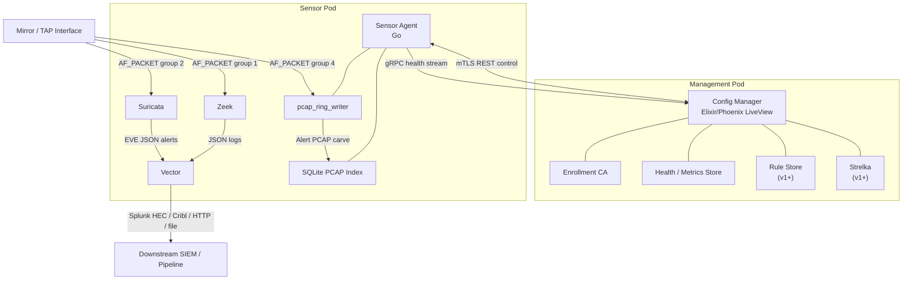

# RavenWire

**High-throughput network sensing with alert-driven packet evidence.**

RavenWire is a containerized network sensor stack designed to capture, analyze, enrich, and forward network security telemetry while preserving packet evidence around detections. It combines Zeek, Suricata, Vector, a Go-based Sensor Agent, an Elixir/Phoenix Config Manager, and an alert-driven PCAP ring so analysts can pivot from logs and alerts to the packet context that matters.

> **Project status:** RavenWire is in active MVP development. The current focus is validating the sensor architecture, secure enrollment, health reporting, Community ID correlation, alert-driven PCAP carving, and Splunk/Cribl forwarding. Full PCAP mode, Strelka integration, rule-store workflows, Arkime integration, and 25Gbps validation are staged roadmap items.

---

## Why RavenWire?

Traditional network sensors often force a tradeoff between full-packet capture cost and alert-only visibility. RavenWire is built around a middle path:

- Capture and analyze mirrored traffic using standard Linux networking primitives.
- Keep Zeek and Suricata independent so one tool does not own the packet path for the other.
- Preserve **pre-alert and post-alert PCAP evidence** only when detections justify it.
- Use **Community ID** as the correlation key across Zeek, Suricata, Vector, Strelka results, and PCAP metadata.
- Manage sensors through a secure control plane without giving the web UI direct host or Podman socket access.
- Keep the system portable with Podman Quadlet/systemd instead of requiring Kubernetes.

---

## Core Features

### MVP / current focus

- **Dual-pod architecture**
  - `Management_Pod` for Config Manager, enrollment, health visibility, and future shared services.
  - `Sensor_Pod` for Zeek, Suricata, Vector, Sensor Agent, and alert-driven PCAP capture.

- **Independent AF_PACKET capture**
  - Zeek, Suricata, `pcap_ring_writer`, and future full-PCAP tools each bind their own AF_PACKET socket.
  - `PACKET_FANOUT` is used for **intra-tool worker scaling**, not cross-tool stream duplication.
  - Distinct fanout group IDs are validated before capture starts.

- **Alert-driven PCAP**
  - A dedicated `pcap_ring_writer` maintains a rolling packet history in shared memory.
  - Qualifying alerts trigger preservation of a configurable pre/post-alert packet window.
  - Carved PCAPs are indexed locally and associated with alert metadata and Community ID.

- **Zeek + Suricata + Vector pipeline**
  - Zeek produces protocol and connection metadata.
  - Suricata produces signature-based alerts.
  - Vector normalizes and forwards logs to configurable sinks such as Splunk HEC or Cribl.

- **Secure Sensor Agent**
  - Go-based `sensor_agent` mediates local control actions.
  - Config Manager never gets direct Podman socket access.
  - Control operations are restricted to an explicit allowlist.
  - Local audit logging records accepted and rejected actions.

- **mTLS enrollment and identity**
  - Sensors enroll with one-time tokens.
  - Config Manager issues short-lived ECDSA certificates.
  - Revoked or expired identities are rejected.

- **Health and readiness**
  - Per-container status, CPU, memory, uptime, packet counters, drop counters, storage, and clock drift.
  - Host readiness checks validate interface state, disk, capabilities, time sync, and AF_PACKET support.

---

## Architecture



---

## Capture Model

RavenWire intentionally avoids a shared userspace packet broker for the MVP. Each capture consumer attaches independently to the monitored interface.

| Consumer | Default Fanout Group | Purpose |
|---|---:|---|
| Zeek | `1` | Protocol analysis and metadata |
| Suricata | `2` | Signature matching and alerts |
| netsniff-ng | `3` | Full PCAP mode, planned for v1.5 |
| pcap_ring_writer | `4` | Alert-driven rolling PCAP ring |

BPF filters are applied per consumer to shed high-volume, low-security-value traffic before packets reach userspace. Example exclusion classes include storage replication, trusted internal bulk transfers, and selected encrypted media flows.

---

## Operational Modes

### Alert-Driven PCAP Mode

Default MVP mode.

- `netsniff-ng` is not running.
- `pcap_ring_writer` maintains a rolling packet history.
- Alerts above a configured threshold trigger a PCAP carve.
- Carves include packets from before and after the alert timestamp.
- Designed to reduce storage cost while preserving investigation context.

### Full PCAP Mode

Planned for v1.5.

- `netsniff-ng` writes all traffic to a three-tier storage hierarchy.
- Tier 0: local NVMe ring buffer.
- Tier 1: indexed local PCAP storage.
- Tier 2: optional asynchronous replication to remote storage.
- Intended for environments where full-packet retention is required and hardware can sustain the write path.

---

## Repository Layout

```text
.
├── .kiro/specs/network-sensor-stack/
│   ├── requirements.md      # Product requirements and acceptance criteria
│   ├── design.md            # Architecture, interfaces, data models, roadmap
│   └── tasks.md             # MVP implementation plan and phase checklist
├── config-manager/          # Elixir/Phoenix management plane
├── sensor-agent/            # Go Sensor Agent and health/control interfaces
├── sensorctl/               # Development CLI for local testing and operations
├── config/sensor/           # Sensor config examples: BPF, capture, Zeek, Suricata, Vector
├── quadlet/                 # Podman Quadlet definitions for management and sensor pods
├── spike/                   # Phase 0.5 capture and PCAP carving validation
├── dev-env/                 # Vagrant/VirtualBox development environment
└── Vagrantfile              # Reproducible Linux dev VM entry point
```

---

## Quick Start: Development Environment

The recommended development path uses the Vagrant/VirtualBox environment under `dev-env/`. This is useful when developing from macOS or another system that cannot run AF_PACKET capture natively.

### Prerequisites

On macOS:

```bash
brew install --cask virtualbox vagrant
brew install go
```

### Install `sensorctl`

```bash
bash dev-env/install-sensorctl-mac.sh
export PATH="$PWD/bin:$PATH"
```

### Run the automated spike test

```bash
sensorctl test spike
```

This command boots the VM, starts the spike stack, generates traffic, verifies capture behavior, and halts the VM.

Useful variants:

```bash
sensorctl test spike --keep-running
sensorctl test spike --skip-boot
sensorctl test verify
sensorctl env ssh
sensorctl env down
```

---

## Quick Start: Run the Phase 0.5 Spike Manually

Use this path on a Linux host or inside the development VM.

```bash
cd spike

# Set the capture interface.
# This should be a mirror/TAP/test interface, not your management NIC.
export CAPTURE_IFACE=eth0

# Optional tuning
export RING_SIZE_MB=512
export ALERT_DELAY_SECONDS=10
export PRE_ALERT_WINDOW_SECONDS=5
export POST_ALERT_WINDOW_SECONDS=3

# Start the stack
docker-compose up
```

Verify output:

```bash
# Zeek logs
ls -la /var/lib/docker/volumes/spike_logs/_data/zeek/

# Suricata EVE JSON
ls -la /var/lib/docker/volumes/spike_logs/_data/suricata/eve.json

# Community ID preservation
grep community_id /var/lib/docker/volumes/spike_logs/_data/vector/output.json | head -5

# Ring writer status
echo '{"cmd":"status"}' | nc -U /var/run/pcap_ring.sock

# Carved PCAP
ls -lh /tmp/alert_carve_*.pcap
tcpdump -r /tmp/alert_carve_*.pcap -n | head -20
```

---

## Configuration

RavenWire should avoid hardcoded node-specific values. Interface names, storage paths, forwarding destinations, enrollment tokens, and manager addresses should be injected by environment variables or mounted config files.

Common configuration areas:

| Area | Examples |
|---|---|
| Capture | interface name, fanout groups, worker counts, BPF profile |
| Alert-driven PCAP | ring size, pre-alert window, post-alert window, alert threshold |
| Forwarding | Splunk HEC URL/token, Cribl HTTP endpoint, file/syslog sink |
| Identity | sensor name, enrollment token, certificate paths |
| Storage | alert PCAP path, SQLite index path, pruning thresholds |
| Health | scrape interval, clock drift threshold, metric buffer size |

Example environment values:

```bash
export SENSOR_NAME=sensor-lab-01
export CAPTURE_IFACE=mirror0
export CONFIG_MANAGER_URL=https://manager.example.local:8443
export SENSOR_ENROLLMENT_TOKEN=replace-me
export VECTOR_SINK_MODE=splunk_hec
export SPLUNK_HEC_URL=https://splunk.example.local:8088/services/collector/event
export SPLUNK_HEC_TOKEN=replace-me
export PCAP_ALERT_PATH=/sensor/pcap/alerts
export RING_SIZE_MB=4096
```

---

## Security Model

RavenWire is designed with the assumption that the management plane should not become a host-compromise path.

Security principles:

- All pod-to-pod communication uses mutual TLS.
- Containers run as a dedicated non-root user where possible.
- Zeek, Suricata, and packet capture components receive only the Linux capabilities needed for capture.
- The Config Manager never mounts the Podman socket.
- The Sensor Agent is the only component with local container lifecycle authority.
- Sensor Agent actions are restricted to an explicit allowlist.
- Control actions are audited locally.
- Sensor identity is certificate-based with revocation support.

Default control API action set:

| Action | Method | Path |
|---|---|---|
| Reload Zeek | `POST` | `/control/reload/zeek` |
| Reload Suricata | `POST` | `/control/reload/suricata` |
| Restart Vector | `POST` | `/control/restart/vector` |
| Switch capture mode | `POST` | `/control/capture-mode` |
| Apply config | `POST` | `/control/config` |
| Rotate cert | `POST` | `/control/cert/rotate` |
| Report health | `GET` | `/health` |
| Carve PCAP | `POST` | `/control/pcap/carve` |
| Validate config | `POST` | `/control/config/validate` |

---

## Current MVP Status

The MVP implementation plan is organized around Phase 0 and Phase 1.

### Completed or implemented in the current task plan

- Phase 0.5 spike validation.
- Sensor Pod and Management Pod base definitions.
- AF_PACKET fanout configuration validation.
- BPF filter compilation and reload handling.
- Sensor Agent module skeleton.
- mTLS REST control API.
- Local audit logger.
- Host readiness checks.
- gRPC health streaming.
- Config application and offline behavior.
- Certificate enrollment and rotation.
- Alert-driven `pcap_ring_writer`.
- PCAP Manager and local SQLite PCAP index.
- Community ID enablement and Vector preservation.
- Splunk/Cribl forwarding configuration.
- Config Manager Phoenix/LiveView skeleton.
- Enrollment UI and health dashboard.
- Basic Suricata rule bundle deployment.
- Support bundle generation.
- Internal development CLI.

### Known remaining MVP test gaps

- Community ID preservation property test.
- Enrollment token single-use property test.
- Certificate rejection property test.

---

## Roadmap

| Phase | Release | Scope |
|---|---|---|
| Phase 0 | MVP | Proof of capture: Zeek + Suricata with distinct AF_PACKET fanout groups, BPF validation, Vector forwarding, packet/drop metrics |
| Phase 1 | MVP | Sensor Agent, Config Manager basic UI, enrollment, mTLS, Community ID, alert-driven PCAP, Splunk/Cribl output, support bundle, internal `sensorctl` |
| Phase 2 | v1 | Sensor pools, rule store, config versioning, rollback, RBAC, PCAP carve API, chain of custody |
| Phase 3 | v1 | Strelka sightings, schema normalization, Splunk workflow action, health history, benchmark tooling |
| Phase 4 | v1.5 | Full PCAP mode, GitOps detection workflow, SSO, canary rollout, detection testing, Management Pod HA |
| Phase 5 | v2 | Optional Arkime integration, air-gapped bundles, signed releases, SBOM, public CLI/API docs, 25Gbps benchmark profile |
| Phase 6+ | Future | AF_XDP, DPDK, PF_RING, advanced benchmark automation |

---

## Known Constraints and Design Notes

- `PACKET_FANOUT` is used within each tool’s worker set; it is not the mechanism used to duplicate traffic between tools.
- Zeek and Suricata each own their AF_PACKET sockets.
- BPF changes for Zeek and Suricata may require controlled process restarts rather than live reloads.
- `pcap_ring_writer` should support live BPF update through its control interface.
- Accurate alert-window carving should use kernel timestamps such as `SO_TIMESTAMPNS` or `TPACKET_V3` timestamps instead of userspace receive time.
- Ring sizing must account for both packet data and packet index history.
- Full 25Gbps operation depends on validated hardware, NIC tuning, NVMe write capacity, CPU capacity, and benchmark profiles.

---

## Non-Goals

RavenWire is not intended to be:

- A SIEM replacement.
- An endpoint telemetry or EDR platform.
- A full SOC-in-a-box.
- A Kubernetes-first platform.
- A threat intelligence enrichment platform.
- A guaranteed 25Gbps capture solution on commodity hardware.

It is a secure, portable network sensor fabric designed to feed downstream platforms such as Splunk, Elastic, OpenSearch, Cribl, Kafka, object storage, or data lakes.

---

## Development Notes

### Go components

Primary Go components:

- `sensor-agent/`
- `sensorctl/`
- `spike/pcap_ring_writer/`
- `spike/pcap_manager/`

Typical workflow:

```bash
cd sensor-agent
go test ./...

cd ../sensorctl
go test ./...
go build -o ../bin/sensorctl .
```

### Elixir/Phoenix components

Primary Elixir component:

- `config-manager/`

Typical workflow:

```bash
cd config-manager
mix deps.get
mix ecto.setup
mix test
mix phx.server
```

### Development VM

```bash
sensorctl env up
sensorctl env ssh
sensorctl env down
```

---

## Troubleshooting

### Zeek is not producing logs

- Confirm `CAPTURE_IFACE` is set to an active mirror/TAP interface.
- Check container logs for AF_PACKET bind errors.
- Confirm required capabilities are granted.
- Confirm BPF filters are not excluding all traffic.

### Suricata is not producing alerts

- Check Suricata startup logs.
- Confirm `community-id` is enabled in EVE JSON output.
- Confirm rules are mounted and loaded.
- Confirm the configured fanout group does not conflict with another consumer.

### Vector output is empty

- Confirm Zeek and Suricata log files exist and are non-empty.
- Check Vector source paths and sink configuration.
- Confirm sink credentials and endpoint URLs are correct.
- Check local disk buffer permissions.

### Alert PCAP carve is empty

- Confirm the ring writer shows `packets_written > 0`.
- Generate traffic during the alert window.
- Confirm system time is synchronized.
- Increase the pre/post-alert windows for testing.

### PCAP file does not open

- Verify the file is larger than the global PCAP header.
- Check the PCAP magic number with `xxd`.
- Inspect with `tcpdump -r`.
- Confirm the ring was not overwritten before carving.

---

## Contributing

RavenWire is early, but contributions should preserve the core design principles:

1. Keep capture and analysis paths separated.
2. Do not give the Config Manager direct host or Podman control.
3. Preserve Community ID across every event and artifact.
4. Validate configuration before applying it.
5. Keep node-specific values out of container images.
6. Prefer secure defaults and explicit capability grants.
7. Document operational tradeoffs and benchmark assumptions.

Suggested contribution areas:

- Property tests for correctness guarantees.
- Better benchmark tooling.
- Vector schema mappings for ECS, OCSF, and Splunk CIM.
- PCAP carve API hardening.
- Rule validation and rollback workflows.
- Documentation and deployment guides.
- Hardware tuning profiles for 1Gbps, 10Gbps, and 25Gbps tiers.

---

## License

TBD. Add a license before accepting broad external contributions or publishing release artifacts.

---

## Acknowledgments

RavenWire builds on excellent open-source security and observability tools:

- [Zeek](https://zeek.org/)
- [Suricata](https://suricata.io/)
- [Vector](https://vector.dev/)
- [Strelka](https://github.com/target/strelka)
- [Podman](https://podman.io/)
- [Phoenix LiveView](https://hexdocs.pm/phoenix_live_view/)
